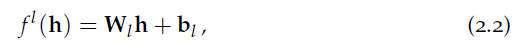
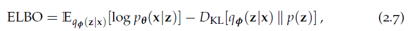
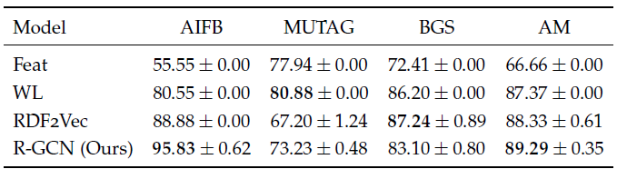
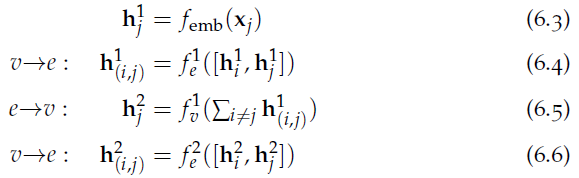
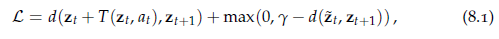
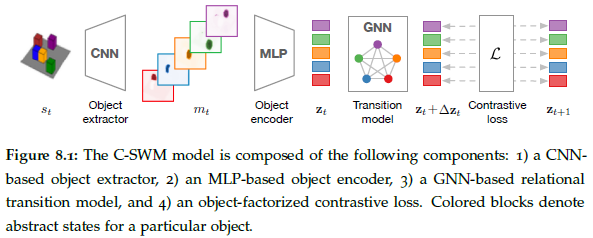
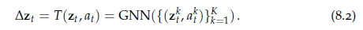
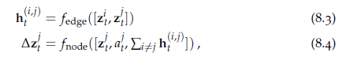
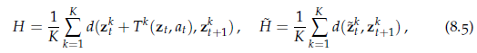

# 第一章 引言

## 1.1 结构与人类认知

我们的世界是是以结构的形式存在，而我们对世界的认知方式也是以结构的形式，而结构的一种自然的表示形式就是图。

### 1.2 人工智能与深度学习

机器学习一个主要的问题就是归纳偏差，即如何将从已有数据学到是知识泛华到未见过的环境上。CNN利用了图特征统计量是转换不变的性质，设计了跨图片局部的参数连接与共享机制，保证了CNN中的过滤器只需要学习局部特征，就可以跨局部泛化。相似的，RNN使用时间步上的参数共享，在序列数据上泛化效果很好，本文则集中于图神经网络。

### 1.3 领域和研究问题

本文分为两个部分，第一部分针对**显式地**图结构数据，介绍适用于不同任务的神经网络模型；第二部分，以结构和成分归纳偏差形式，基于**隐式地结构数据**进行学习，应用于诸如序列建模，模仿学习，场景理解，世界模型学习和直观物理学之类的任务。

本文的研究问题主要有五个：

* 研究问题一：我们是否可以为图结构化数据集中的大规模节点分类任务开发并有效执行基于深度神经网络的模型？
  
  本论文关于该问题的模型为GCN,R-GCN.

* 研究问题二：图神经网络是否可用于解决链路预测和无监督节点表示学习？
  
  本论文关于该问题的模型为：图自编码器GAE和变分图自编码器VGAE.

* 研究问题三：深度神经网络能否推断出实体之间的隐藏关系和相互作用，例如物理系统中的力？
  
  本论文关于该问题的模型为：神经关系推断模型NRI,NRI是基于具有多个交互功能的图神经网络的潜变量模型。

* 研究问题四：我们如何改进基于神经网络的模型，使这些模型可以在序列数据中推断事件结构和潜在程序描述？
  
  本论文关于该问题的模型为：复合模仿学习与执行(compositional imitation learning and execution,CompILE),它是在程序执行数据中发现任务分割和隐藏任务表示的无监督模型

* 研究问题五：深度神经网络能否通过与环境交互来学习发现并建立对象，对象之间的关系以及动作效果的有效表示？
  
  这个问题的核心是通过与世界互动来学习结构化世界的意义，本论文关于该问题的模型为：C-SWM(contrastively-trained structured world model),它是一个使用图神经网络组件的深层神经网络，它能够以无监督的方式发现对象表示并了解对象之间的物理交互。训练算法基于对比学习，它与我们训练GAE模型进行无监督节点表示学习的方式有关，但适用于从环境交互的经验数据集中学习的情况。

# 第二章 背景

## 2.1 记号表示

主要是各种符号代表的含义，与一般表示方法完全一致；

## 2.2 深度神经网络

深度神经网络可表示如下：

其中$f^l(·)，\sigma$分别代表参数化的（仿射，affine）线性函数和元素级的非线性函数。

本文多使用MLP，即$f^l(\cdot)$为：

## 2.3 图神经网络

令$\mathbf{h}_i,\mathbf{x}_i,\mathbf{h}_{i,j},\mathbf{x}_{i,j}$分别代表节点的隐表示、节点的特征向量、边的隐表示、边的特征向量，则边和节点的隐表示的迭代公式为：

其中$\mathcal{N}_i$为节点$i$的邻居节点集合。其中$f_{edge},f_{node}$通常为两到三层的MLP，其以函数条件的级联(concatenation)为输入（当然其他的函数也可以），不同层的$f_{edge},f_{node}$参数需要共享。

上述的GNN称为信息传递神经网络，是早期GCN和互动网络(interaction network)的统一。

 最早的GNN是Gori et al.(2005)的graph neural network,该模型包含很多GNN的基础思想，但是以GNN的形式，以BPTT训练，因此要求GNN模型的信息传递更新是压缩映射(contraction mapping)，且这种GNN不能学习清晰的边表示，节点$i$的更新函数仅建立在邻居状态$\mathbf{h}_j$($j\in\mathcal{N}_i$条件上(再加上初始节点特征向量$\mathbf{x}_i$),Scarsell et al.(2009)将之进行了扩展，但也仅仅是加入了初始边特征$\mathbf{x}_{i,j}$.

式(2.3),(2.4)包含了大部分图神经网络模型的形式，但不包括近期的一些模型，如graph networks(Battaglia et al.,2018),该模型包括一个全局状态和更新函数；graph G-invariant networks(Maron et al.,2019;Chen et al.,2019).

其他的模型则可视为式(2.3),(2.4)的特殊变体，如transformer结构(Vaswani et al.,2018),graph attention network(Velickovic et al.,2018b),其他还有一些谱方法，如(Bruna et al., 2014; Henaff et al., 2015; Defferrard et al.,2016)。

一些关于**GNN的综述**有：

*geometric deep learning by Bronstein et al. (2017)* 

 *graph representation learning by Hamilton et al. (2017b),*

*relational inductive biases and graph networks by Battaglia et al. (2018).*

## 2.4 隐变量模型(latent variable models)

所谓隐变量模型就是一个概率模型，其以隐变量集合$\mathbf{z}$来解释观测变量$\mathbf{x}$,即：

其中$p_{\theta}(\mathbf{x})$为观测数据分布的模型。我们的目标是估计条件分布$p_{\theta}(\mathbf{x|z})$（即生成模型）的参数，使得$p_{\theta}(\mathbf{x})$针对观测数据$\mathbf{x}\in\mathcal{D}$的似然最大。

通常我们会假设$p_{\theta}(\mathbf{x|z})$为一个高斯分布，即，其中$f_{\theta}(·)$为一个神经网络，但这种形式会使得式(2.5)的积分难以处理。而变分推断，特别是变分自编码器通过寻找式(2.5)的一个下界（或等价地，式（2.5）对数的下界），从而将求积分问题变为一个优化问题。

我们可以通过引入近似后验分布$q_{\phi}(\mathbf{z|x})$并应用Jensen不等式来得到置信下界(ELBO):

式(2.6)的RHS中的项可以重写为：

其中$KL$代表Kullback-Leibler散度。

类似于$p_{\theta}(\mathbf{x|z})$,VAE模型使用的是基于神经网络的推断模型$q_{\phi}(\mathbf{z|x})$，其参数为$\phi$,先验$p(\mathbf{z})$常选用标准高斯分布。生成模型和推断模型可以根据ELBO目标函数根据mini-batch随机梯度上升方法进行联合优化。$\mathbb{E}_{q_{\phi}(\mathbf{z|x})}$对推断模型参数$\phi$的梯度可以通过MC近似方法计算期望获得，主要思路是针对支持分布$q_{\phi}(\mathbf{z|x})$使用重参数化技巧（reparameterization trick)，即采样$\mathbf{z}\sim \mathcal{\mathcal{N};f_{\phi}(\mathbf{x}),\sigma^2*\mathbf{I}})$并重参数化如下：

完成训练后， 推断模型$q_{\phi}(\mathbf{z|x})$可用于在未见过的测试数据$\mathbf{x}$上推断隐变量$\mathbf{z}$,训练好的的生成模型$p_{\theta}(\mathbf{x|z})$在给定隐变量$\mathbf{z}$条件下生成数据。

## 2.5 对比学习

对比学习就是通过对比相关样本对和无关样本对进行表示学习的方法，这种方法天然适合图结构数据，因为图中的边给出了两个节点相关与否。这个问题也可以归类为基于能量的学习(energy-based leanring)，即将目标函数表示为样本对$(\mathbf{x,y})\in\mathcal{D\times D}$的能量函数$E(f_{\theta}(\mathbf{x}),f_{\theta}(\mathbf{y}))$,其中$f_{\theta}(·)$为为一个编码函数将样本编码为隐表示，通常我们会使用神经网络。
该方法的变体包括：噪音对比估计(noise contrastive estimation，NCE),负采样(negative sampling),深度度量学习(deep metric learning)。在NCE和负采样中，目标函数采用二元交叉熵损失，其中负采样的损失函数为：

其中样本对的得分即$s(\mathbf{x,y})=-E(f_{\theta}(\mathbf{x}),f_{\theta}(\mathbf{x}))$,其中$\mathcal{T}$是包含全部正样本对或部分负样本对的集合，通常每个正样本对对应$k$个负样本对，$l(·)$为logistic函数，$c$为示性函数，正样本对为$1$，负样本对为$0$。一种获取负样本的方法是打散(corrupting)正样本对，用一个其他随机样本替代其中一个样本。本文中常用的能量函数为:$E(\mathbf{h_x,h_y})=-\mathbf{h_x}^T\mathbf{h_y}$，当然也可以有其他选择。

深度度量学习的目标是学习样本的隐表示使得正样本对的距离尽量小而负样本对的距离尽量大，而$d(\mathbf{h_x,h_y})$为参数化的距离函数，其目标函数常常使用hinge损失：

即使用了欧式距离的能量函数$E(\mathbf{h_x,h_y})=d^2(\mathbf{h_x,h_y})$,其中$\mathbf{h_x}=f_{\theta}(\mathbf{x})$,$\mathbf{h_y}=f_{\theta}(\mathbf{y})$。

# 第三章 用于半监督学习的GCN

## 3.1 引言

本章的两个贡献：1，通过一阶近似简化了之前的谱图卷积；2，证明图神经网络可用于半监督节点或图分类问题。

## 3.2 背景

### 3.2.1 基于图的半监督

在基于图的半监督学习中 ，在有监督和无监督数据中都要使用图结构，一种典型的方法是在训练中加入正则损失$\mathcal{L}_{reg}$来考虑图结构，而监督损失则只考虑$\mathcal{L}_{sup}$:
$\mathcal{L}=\mathcal{L}_{sup}+\lambda\mathcal{L}_{reg}$  （3.1）

常用的正则损失基于软相似度约束，其鼓励邻居节点的相似表示或预测：

其中$\mathbf{\Delta=D-A}$为无向图$\mathcal{G=(V,E)}$的非标准化Laplacian矩阵，$\mathbf{X}$为特征矩阵，$f(·)$为分类器，作用于特征矩阵的行，式(3.2)依赖于如下假设：相连的节点倾向于拥有相同的标签。

本章，我们致力于不依赖显式的正则项训练有效的半监督分类器，而是仅依赖特征和结构信息，即$f(\mathbf{X,A})$,如此神经网络会执行信息传递，以结构信息分配节点间的编码的特征信息。与此同时，它也允许模型分配监督损失的梯度信息，从而学习有标签和无标签节点的信息。

### 3.2.2 谱图卷积

谱图卷积可以视为考虑节点特征（信号）和结构信息的参数化滤波操作，亦即傅里叶领域的信号$\mathbf{x}\in\mathbb{R}^N$与滤波器$g_{\mathbf{\theta}}=diag(\mathbf{\theta})$的矩阵乘法：

其中$\mathbf{U}$为标准化Laplacian矩阵$\mathbf{L}=\mathbf{I}_N-\mathbf{D}^{-\frac{1}{2}}\mathbf{A}\mathbf{D}^{\frac{1}{2}}=\mathbf{U\Lambda U}^T$的特征向量矩阵，而$\mathbf{U}^T\mathbf{x}$即$\mathbf{x}$的傅里叶变换，我们可以将$g_{\mathbf{\theta}}$视为$\mathbf{L}$特征值的函数，即$g_{\mathbf{\theta}}(\mathbf{\Lambda})$，由于特征向量矩阵$\mathbf{U}$的矩阵乘法复杂度为$\mathcal{O}(N^2)$,计算$\mathbf{L}$的特征分解也非常复杂，因此上式直接计算过于复杂。
为缓解这个问题，我们使用截断的多项式对$g_{\mathbf{\theta}}(\mathbf{\Lambda})$进行近似，使用单项式基或K阶Chebyshev多项式：

其中$\tilde{\mathbf{\Lambda}}=\frac{2}{\lambda_{max}}\mathbf{\Lambda}-\mathbf{I}_N$,其中$\lambda_{max}$为$\mathbf{L}$的最大特征值，Chebyshev多项式递归地定义为：$T_k(x)=2xT_{k-1}(x)-T_{k-2}(x),T(0)=1,T_1(x)=x$。
则对信号$\mathbf{x}$的卷积操作定义为：

$\tilde{\mathbf{L}}=\frac{2}{\lambda_{max}}\mathbf{L}-\mathbf{I}_N$,而注意到$(\mathbf{U\Lambda U})^k=\mathbf{U\Lambda}^k\mathbf{U}^T,$其中Laplacian矩阵的K阶多项式意味着每个节点只依赖于它的K跳内邻居节点（K-localized)，因此可以视为**空域图滤波器**，其复杂度线性于边的数量。

## 3.3 方法

### 3.3.1 GCN

GCN是一个基于信息传递操作的图神经网络模型$f(\mathbf{X,A})$，它的出发点是作为谱图卷积的一阶近似，再加一个非线性激活函数,令$\mathbf{h}_i^{(l)}\in\mathbb{R}^{d_l}$为节点$i\in\mathcal{V}$的隐表示，其维度为$d_l$，则其迭代公式可表示为：

其中$\sigma$为点级非线性函数如ReLU，$\mathbf{W}$为可学习的参数，$c_{i,j}=1/\sqrt{D_{i,i}D_{j,j}}$为标准化常数，其中$D_{i,i}$为节点的度，稍后我们将看到此常数源自式(3.3)频谱图卷积定义中使用的邻接矩阵的对称归一化。有时我们也会在式(3.6)的基础上加入偏置向量$\mathbf{b}$。

* **一阶模型**

GCN信息传递的矩阵形式为：

其中相邻节点上的标准化和由与标准化邻接矩阵$\mathbf{D}^{-\frac{1}{2}}\mathbf{AD}^{\frac{1}{2}}$的乘法代替。

如果我们令式(3.5)的$K=1$，则可以很清楚的看到GCN信息传递与谱图卷积近似的联系，即我们使用谱卷积的一阶近似，同时令$\lambda_{max}\approx2$:

以这种方式限定一阶邻域的（线性）滤波操作可以减少过拟合风险，因为这样每个滤波操作的参数更少，在只有少数标签的情况下或者需要模型泛化致归纳学习场景时会比较有效。

如上的定义可以扩展到$\mathbf{X}\in\mathbb{R}^{N\times d_{in}}$信号（其中$d_{in}$为输入的通道数，亦即输入特征向量的维度）和$d_{out}$个滤波器或特征映射：

其中$\mathbf{\Theta}_0,\mathbf{\Theta}_1$为滤波器参数矩阵，$\mathbf{Z}\in\mathbb{R}^{N\times d_{out}}$为卷积后的信号矩阵，即得到式（3.7）的GCN信息传递迭代公式。

* **单参数模型**

在半监督中，针对小部分有标签样本的过拟合会带来很大问题，这可以通过每层只使用一个单参数矩阵来缓解：

算子$\mathbf{I}_N+\mathbf{D}^{-\frac{1}{2}}\mathbf{AD}^{-\frac{1}{2}}$的特征值范围为[0,2]，可能会导致在深度神经网络中训练不稳定，我们发现加入自连接重标准化邻接矩阵可以增加模型表现：

$\mathbf{I}_N+\mathbf{D}^{-\frac{1}{2}}\mathbf{AD}^{-\frac{1}{2}}\to \tilde{\mathbf{D}}^{-\frac{1}{2}}\tilde{\mathbf{A}}\tilde{\mathbf{D}}^{-\frac{1}{2}}$,

其中$\tilde{\mathbf{A}}=\mathbf{A+I}_N,\tilde{D}_{i,i}=\sum_j\tilde{A}_{i,j}$.

单参数版的GCN模型可表示为：

### 3.3.2 半监督节点分类

本章考虑使用两层的GCN在对称二项邻接矩阵上进行半监督节点分类，模型如式（3.11），重标准化的邻接矩阵$\hat{\mathbf{A}}=\tilde{\mathbf{D}}^{-\frac{1}{2}}\tilde{\mathbf{A}}\tilde{\mathbf{D}}^{-\frac{1}{2}}$需要预先计算，则前向模型可简化为：

我们以如下的所有有标签节点的交叉熵损失来优化GCN半监督节点分类：

其中$\mathcal{Y}_L$为有标签节点索引集合，$Y_{l,f}$为是否拥有标签的指示变量。

文章使用每次训练迭代的完整数据集执行批量梯度下降，这是一个可行的选择，只要数据集适合内存，当然也可以使用mini-batchGD,留待以后研究。由于使用稀疏度$\mathbf{A}$，因此空间复杂度为$\mathcal{O}(|\mathcal{E}|)$，正则化手段为dropout。实证代码见https://github.com/tkipf/gcn

## 3.4 文献综述

基于谱图理论（Shuman et al,2011;Ekambaram et al.,2013): 标签传播（Zhu et al.,2003),流形正则化(Belkin et al.,2006),深度半监督嵌入(Weston et al,2012)。

基于路径的方法:DeepWalk,node2vec,LINE,这些方法的缺点是嵌入学习、半监督训练是分开优化的，Planetoid(Yang et al.,2016)则通过在嵌入学习中加入标签信息缓解了这个问题，但该方法仍基于随机游走。

基于RNN的方法：Gori et al.(2005),Scarselli et al.(2009),Li et al.(2016)。

Duvenaud et al.(2015)基于卷积方法，但需预先学习节点度权重矩阵。

Atwood and Towsley(2016)将局部图信息（最大为预先选择的邻域大小）集成在单个图卷积状层中，然后接一个全连接神经网络层。

Niepert et al.(2016)基于卷积神经网络，但需要预定义一个规范的节点顺序。

谱图卷积的工作有Bruna et al.(2014),Defferrard et al.(2016)，后者可解释为一个在局部邻域进行信息传递的空间方法。

## 3.5 实证

其中Random split指从数据集随机划分出与Planetoid同样大小的子集。

## 3.7 讨论

### 3.7.2 局限与未来的工作

* 使用的full-batchGD而不是Mini-batchSGD。

* GCN传播模型类似于中心环绕滤波器，即，所有相邻节点特征均使用相同的权重矩阵进行转换，使用固定权重$c_{i,j}$进行加权聚合。

* 不天然支持边特征，且局限于无向图。

## 3.8 结论

其他比较有效的GCN变体：NoNet(Monti et al.,2017),GAN(Velikovic et al.,2018b),使用节点采样和mini-batch训练的变体有：Hamilton et al.,2017a;Chen et al.,2018。Wu et al.(2019)发现GCN使用线性激活函数效果也很好。

# 第四章 基于图自编码器的链路预测

## 4.1 引言

本章介绍GAE(Graph Auto-Encoder),使用的是encoder-decoder框架，encoder使用GCN，decoder用于重建邻接矩阵，使用成对的得分函数(scoring function),如内积。

本章还进一步提供两个解释GAE的视角：1),隐变量模型的概率版本，称为变分GAE(VGAE);2),基于负采样的对比学习，以提高效率和可扩展性。

本章的模型天然地融合了节点特征，因此能够显著地超过基准模型(Grover and Leskovec,2016等)。

## 4.2 方法

### 4.2.1 GAE

我们使用得分函数$s(\mathbf{z}_i,\mathbf{z}_j)$表示节点$i,j$存在连接的可能性，其中$\mathbf{z}_i,\mathbf{z}_j$为节点的嵌入向量或隐表示，得分函数即解码器。

* **编码器**

在GAE中，我们使用节点GNNs作为编码器的主要原因在于，GNNs编码器能够既捕捉特征信息也捕捉结构信息，从而是一种可用于未见过的样本的归纳学习。而DeepWalk,node2vec等只使用得分函数而不使用编码器器，从而不是归纳学习。GAE算法使用的编码器即GCN：

其中$\hat{\mathbf{A}}$为对称标准化的邻接矩阵(带自连接的)，当然也可以使用$\mathbf{D}^{-1}\mathbf{A}$的标准化邻接矩阵。

* **解码器**

GAE使用的解码器如下：

$\mathbf{A}'=l(\mathbf{ZZ}^T)$（4.2）

其中$l(·)$为logistic sigmoid函数。式(4.2)表明GAE使用的解码函数为内积函数$s(\mathbf{z}_i,\mathbf{z}_j)=\mathbf{z}_i^T\mathbf{z}_j$.

* **目标函数**

我们使用交叉熵损失函数作为目标函数：

对于非常稀疏的图，使用加权交叉熵损失可能效果更好：

其中类权重$w_{pos},w_{neg}$为了防止类别不平衡，我们发现如下的启发式权重效果最好：

$w_{pos}=N^2/(2N_{pos}),w_{neg}=N^2/(2N_{neg})$

其中$N_{pos}=|\mathcal{E}|,N_{neg}=N^2-N_{pos}$

### 4.2.2 Variational GAE

本节我们从隐变量模型介绍GAE框架的概率视角，并导出VGAE。

条件概率$p_{\theta}(\mathbf{A|X})$的隐变量模型表示为：

该模型对隐变量使用固定且独立的先验：$p(\mathbf{Z|X})=\prod_{i=1}^Np(\mathbf{z}_i)$,通常我们使用标准正态分布即：$p(\mathbf{z}_i)=\mathcal{N}(\mathbf{z}_i;\mathbf{0,1})$，我们的目标即求条件概率$p_{\theta}(\mathbf{A|X})$最大似然的参数。

* **推断模型**

遵循(Kingma and Welling,2013;Rezende et al.,2014)的VAE框架，本小节介绍如下的推断模型$q_{\phi}(\mathbf{Z|X,A})$,并假设可作如下的分解（平均场近似）：

该推断模型一个两层的GCN参数化：$\mathbf{\mu}_i=[GCN^{(1)}(\mathbf{X,A})]_i$,$log\sigma_i=[GCN^{(2)}(\mathbf{X,A})]_i$,这两个GCN的定义如式(4.1)，其第一层的$\mathbf{W}_0$,第二层的$\mathbf{W}_1^{(1)},\mathbf{W}_1^{(2)}$是共享的，而$[\mathbf{M}]_i$为$\mathbf{M}$的第$i$行。

* **生成模型**

我们假设如下的生成模型可根据边分解并独立于初始的特征矩阵$\mathbf{X}$：

 本文中将$p_{\theta}(A_{i,j}|\mathbf{z}_i,\mathbf{z}_j)$建模为伯努利分布，且其概率为：

其中$l(·)$为logistic sigmoid函数，$s(·)$为内积，此外，如果我们也可以参数化得分函数，如使用参数$\mathbf{W}$变为双线性内积$\mathbf{z}_i^T\mathbf{Wz}_j$。

* **学习**

我们针对推断模型的参数$\phi$和(使用参数化打分函数的)生成模型的参数$\theta$优化变分下界ELBO。

其中$KL[q(·)||p(·)]$为$p,q$的散度，本文使用full-batchGD和重参数化技巧进行训练。

### 4.2.3 对比训练

我们使用负采样技术解决类别不平衡问题，负采样是作为式(4.4)重调整权重方法的替代方法，还可以避免每次迭代中针对负样本的高计算复杂度($\mathcal{O}(N^2)$)，使用负采样技术的重建目标为：

其中$\mathcal{T}=\{(i,j,c)\}$为节点$i,j$及正样本指示变量$c$的集合。该负采样技术在node2vec（无向图）和DistMult（有向关系图）都有使用，通常会选择相同数量的正样本和负样本。

在这个视角下，我们可以将模型归类为基于能量的框架，根据不同的解码器，GAE可以有不同的变体。

## 4.3 文献综述

* **图嵌入**

Liben-Nowell and Kleinberg(2007)的关于特征工程的嵌入方法的综述；

Tang and Liu(2011)基于类似Laplacian特征映射（LLE,Belkin and Niyogi,2003）方法进行嵌入，

DeepWalk,node2vec都是基于随机游走的方法，LINE使用了一阶邻居和二阶邻居的负采样技术，但没有使用解码器； Cao et al.(2016),Wang et al.(2016)使用了类似GAE的思想进行嵌入。

* **图生成模型**

Erdos and Renyi(1959), stochasitic block model(Holland et al.,1983), preferential attachment model(Barabasi and Albert,1999), small-world model(Watts and Strogatz,1998)是早期的概率图生成模型，没有使用神经网络。

与GAE类似的基于GNN的模型有：Johnson(2017)的递归图生成过程模型，Gomez-Bombarelli et al.(2016)基于循环神经网络的基于序列的分子图表示。

## 4.4 实证

其中*代表使用了节点特征。

## 4.5 局限

* **特征依赖与解码**

我们进行GAE建模的出发点是$p_{\theta}(\mathbf{A|X,Z})$,即$\mathbf{A}$依赖于$\mathbf{X}$,但在实际中为简化模型我们又假设$\mathbf{A}$不依赖于$\mathbf{X}$,但这通常这不会影响链路预测表现，因为解码器提供的隐表示$\mathbf{Z}$会包含$\mathbf{X}$的信息，而如果GAE的使用场景是没有编码器纯生成场景，则建立明确的特征依赖关系则效果更好。最后，我们也可以建立无条件的生成模型$p_{\theta}(\mathbf{A,X|Z})$，而建立这样的模型只需改动输出短，使用独立的MLP分别进行$\mathbf{A,X}$的输出。

* **图生成**

GAE学习的并不是图的全局隐表示，而是每个节点的隐变量。它也不会对节点的数量建模，而是假设邻接矩阵的大小提供。因此，GAE模型不太适合建模许多不同大小的小图的分布，例如在药物发现。只有能为每个图指定全局隐变量并允许生成不同大小的图模型才能适应此类任务，如**GraphRNN(You et al.,2018),GraphVAE(Simonovsky and Komodakis,2018),MolGAN(De Cao and Kipf,2018)**

* **编码器可扩展性**

GAE的可扩展性受限于它的编码器：使用GNN不仅需要处理mini-batch本身中的节点，还需要处理它们各自的邻居和可能的高阶邻居（使用多个消息传递步骤时）。因此， 即使使用负采样和信息传递操作稀疏执行技术，使复杂度从$\mathcal{O}(N^2)$降到$\mathcal{O}(|\mathcal{E}|)$，在大型图上训练GAE模型也是非常有调战的。为此，我们可以使用邻域采样技术如**Hamilton et al.(2017),Ying et al.(2018)**

## 4.6 结论

Bojchevski and Gunnemann(2017)使用GAE进行节点分类，Graphite(Grover et al.,2018)基于迭代解码模式扩展了GAE进行半监督节点分类，Davidson et al.(2018)使用超隐空间的VGAE模型进行链路预测。

GAE进行链路预测的主要挑战是可扩展性，一个可能的改进方法是使用邻域子采样如PinSAGE（Yin et al,2018)。

本章提出的GAE仅适用于无向图，有向图见后续的R-GCN。

# 第五章 使用GCN建模关系数据

## 5.1 引言

本章主要介绍用于多关系数据的R(relation)-GCN,多关系最典型的例子就是知识图谱，包括问答、信息抽取、关系补全等任务。本章主要关注实体分类任务，详见**Schlichtkrull and Kipf et al.,2018.**，实证表明，R-GCN在6M的三元组上能够表现稳定。

## 5.2 方法

本章中图表示为$\mathcal{G=(V,E,R)}$，其中$r\in \mathcal{R}$表示关系类型，$(i,j,r)\in\mathcal{E}$表示有标签的边。

### 5.2.1 R-GCN

R-GCN为多关系网络上的GCN，而基于信息传递的GCN表示为：

其中$c_{i,j}$表示标准化常数,$\sigma$为元素级非线性激活函数。

我们可以使用一个关系权重矩阵$\mathbf{W}_r^{(l)}$集合来扩展如上的更新规则，即：
                                

其中$\mathcal{N}_i^r$表示与节点$i$相连的入边为关系类型$r\in\mathcal{R}$的节点的集合，$c_{i,r}$为标准化常数。

如(5.2)的规则可以覆盖两个有趣的特例，首先是，R-GCN更新规则与带网格结构滤波器的CNN是一致的，其中节点位于一个2维的网格中，关系类型变为空间关系（如右上角的邻居节点），且当设置标准化常数$c_{i,r}$为1且$|\mathcal{N}^r_i|$,即每个关系类型只有一个邻居。第二种是，通常设置$c_{i,r}=1$,并舍去自连接$\mathbf{W}_0^{(l)}\mathbf{h}_i^{(l)}$,并联结多层的权重矩阵，我的得到没有门更新的Gated Graph Neural Network(Li et al.,2016)，而Gated Graph Neural Network也使用了基于关系的更新函数。

式（5.2）的更新规则涉及针对每个节点并行估计信息传递更新式，多个网络层可以堆叠（stack）在一起从而允许跨多个关系步的依赖。我们称该图编码器为R-GCN,每个节点的计算图更新如图5.2：

图中每种关系的出边和入边都独立地进行聚合  

### 5.2.2 正则化

随着图中关系的增多，式（5.2）更新规则的参数也将呈指数级上升，从而易导致过拟合，解决该问题一个直接的方法就是设定权重矩阵间的参数共享。基于这种思路，我们引入基分解技术（basis decomposition),即我们将$\mathbf{W}_r^{(l)}$分解如下：

即将每个参数矩阵视为一组基矩阵$\mathbf{V}_b^{(l)}\in\mathbb{R}^{d^{(l+1)}\times d^{(l)}}$的线性组合 ,$a_{r,b}^{(l)}$为可学习的参数，从而只有 $a_{r,b}^{(l)}$依赖于$r$。

式（5.3）的基分解可视为一种有效的、不同类型关系的权重共享形式，其减少了大规模多关系数据要学习的参数。

R-GCN模型的形式如下：我们堆叠$L$层形如式（5.2）的神经网络，其中第一层的输入为one-hot编码向量(如果没有其他编码特征)，我们在本文中只考虑没有特征的数据，但注意GCN天然是允许有特征的数据的。

### 5.2.3 实体分类

对于（半）监督节点（实体）分类，我们针对有标签数据最小化如下的交叉熵损失：

其中$\mathcal{Y}$为有标签节点的集合，$h_{i,k}^{(L)}$为针对第$i$个有标签节点的第$k$个网络输出条目（entry),$t_{i,k}$为对应的真实标签。我们使用full-batch GN训练。

## 5.3 文献综述

在统计学习中，很多方法都是基于优化得分函数进行实体和关系的表示学习，它们多数都可以归类为类张量分解方法（class tensor decomposition),综述性文献可参见Kolda and Bader(2009),基于统计学习的知识图谱补全参见Nickel et al.(2015)。

结合实体路径的方法近年来非常流行，其大致可分为三类:1）先生成辅助性三元组，然后将其加入模型学习一个分解模型(Guu et al.,2015;Garcia-Duran et al.,2015);2),使用路径作为特征的方法（Lin et al,2015);3)二者的结合（Neelakantan et al.,2015;Toutanova et al.,2016);第一个方向与我们的方向大体上正交，因为我们也期望通过向图形中添加辅助边或三元组来改善；第二种方向与我们类似，只是我们使用的是邻域信息，而他们使用的是路径采样。

Li et al.(2016)提出了基于RNN的类似的多关系GNN框架。他们的模型在聚合后不对消息进行归一化，并且在存在大量关系类型的情况下不对消息权重进行正则化或分解，我们发现这两种方法都在知识图谱建模中非常有效。

## 5.4 实证

feature-based baseline (see main text for details), WL (Shervashidze et al., 2011; Vries and Rooij, 2015),**RDF2Vec (Ristoski and Paulheim, 2016)**

详见原文。

## 5.5 结论

R-GCN最近的变体：

1)推荐系统中的Berg et al.(2017)，其编码器为R-GCN，解码器为双线性得分函数（类似于**Schlichtkrull and Kipf et al,2018**)

2)机器翻译中的Bastings et al.(2017)，其中图由句法网络定义。

3）分子合成领域的**De Cao and Kipf(2018);You et al(2018)**

# 第六章 交互系统的神经关系推断

## 6.1 引言

交互系统（interacting system）如物理中的动力学，生物中的动态系统，城市交通，复杂社交动态网络等，类似系统的动力学由单个成分和他们的交互决定，因此整个系统的行为可能非常复杂，而由于我们常常只能接触到个体的轨迹，因此很难完成整个系统建模。

为此，本章引入神经关系推断（neural relational inference,NRI),详见Kipf and Fetaya et al.(2018),该模型致力于推断隐含互动结构，同时以无监督的方式学习互动系统的动态模型。

NRI使用图神经网络对拥有多种边类型的离散隐图（latent graph）进行建模，学习该交互系统的动力学。NRI学习的目标是对这些离散的潜在变量进行推断，同时学习系统动态演化的预测模型。使用概率隐变量模型允许我们结合关于图结构的先验信念，如稀疏度等。

## 6.2 方法

NRI模型分为两部分：编码器根据给定的轨迹预测交互行为，解码器根据给定的交互行为图学习动力学模型。模型的输入由$N$个对象的轨迹组成，记$\mathbf{x}_i^t$为对象$i$在时刻$t$的特征向量，如位置和速度，$N$个对象在时刻$t$的特征则可记为$\mathbf{x}^t=(\mathbf{x}_i^t,...,\mathbf{x}_N^t)$,对象$i$在所有时刻的特征可记为$\mathbf{x}=(\mathbf{x}_i^1,..,\mathbf{x}_i^T)$,整个轨迹则可记为$\mathbf{x}=(\mathbf{x}^1,...,\mathbf{X}^T)$, 我们假设给定未知图$\mathbf{z}$（ 其中$\mathbf{z}_{i,j}$表示$i,j$实体间的离散边类型）的条件下，动力学可建模为一个GNN模型，则我们的目标是以无监督的方式同时学习边的类型和系统动力学。

NRI模型是一种VAE模型，其目标是优化如下的ELBO：

其中编码器$q_{\phi}(\mathbf{z|x})$返回分解后的$\mathbf{z}_{i,j}$的分布，其中$\mathbf{z}_{i,j}$为离散分类变量，表示对象$i,j$之间的边类型。我们使用one-hot编码表示$K$个边类型$\mathbf{z}_{i,j}$。

而解码器为：

其中我们在给定的隐图结构$\mathbf{z}$下以一个GNN建模$p_{\theta}(\mathbf{x}^{t+1}|\mathbf{x}^t,..,\mathbf{x}^1,\mathbf{z})$。

**先验$p_{\theta}(\mathbf{z})=\prod_{i\neq j}p_{\theta}(\mathbf{z}_{i,j})$是分解的边类型均匀分布**，如果边类型是“hard coded"，其代表”non-edge"(没有信息沿着这种边类型传播)，我们可以使用另一种先验，该先验为“non-edge"标签分配较高的概率，这种设置会鼓励更稀疏的图。

本文中的VAE和原始的VAE(Kingma and Welling,2013)有几处比较明显的区别：第一 ，为避免VAE（经常出现的）解码器忽视隐编码$\mathbf{z}$的情况，我们训练解码器预测多个时间步而非一个时间步，这非常必要 ，因为交互系统对单时间步的时间范围内影响非常小。第二，隐分布是离散的，所以我们用**连续松弛(continuous relaxation, Jang et al.,2017,Maddison et al.,2917)以利用重参数化技术（Kingma and Welling,2013**）；最后，我们并不学习$p(\mathbf{x}^1|\mathbf{z})$,因为我们关心的是动力学和交互系统，而$p(\mathbf{x}^1|\mathbf{z})$与二者都没有关系。模型的整体框架如图6.2。

### 6.2.1 编码器

编码器的目标是在给定观测轨迹$\mathbf{x}=(\mathbf{x}^1,..,\mathbf{x}^T)$学习节点对之间的互动类型$\mathbf{z}_{i,j}$,因为我们并不知道潜在的图，我们可以使用全连接图上的GNN来预测隐图结构。我们将编码器建模为$q_{\phi}(\mathbf{z}_{i,j}|\mathbf{x})=softmax(f_{enc},\phi(\mathbf{x}_{i,j,1:K}))$,其中$f_{enc,\phi(x)}$为作用在全连接图上的GNN，给定输入轨迹$\mathbf{x}_1,..,\mathbf{x}_N$,我们的编码器计算如下的信息传递操作：

其中$f(·)$为神经网络，在本文中为MLP或带注意力池化的1维CNN，类似于Lin et al.(2017)

最后我们建模边类型后验分布为$q_{\phi}(\mathbf{z}_{i,j}|\mathbf{x})=softmax(\mathbf{h}_{i,j}^2)$,其中$\phi$代表式(6.3-6.6)的所有参数。注意，在单步传播中，式（6.3-6.4）的嵌入$\mathbf{h}_{i,j}^1$只依赖于$\mathbf{x}_i,\mathbf{x}_j$,忽略了与其他节点的互动，而$\mathbf{h}^2_j$使用了整个图的信息。

### 6.2.2 采样

从$q_{\phi}(\mathbf{z}_{i,j}|\mathbf{x})$抽样非常符合直觉，**但这种抽样方式由于隐变量分布是离散的，会导致我们在反向传播中无法使用重参数技巧。**一种流行的近似策略是：从一个近似的连续分布中抽样（Jang et al.,2017;Maddison et al.,2017），使用重参数化技术从该近似分布计算(有偏的）梯度。我们使用concrete分布(Maddison et al.,2017),样本抽样为：

其中$\mathbf{g}\in\mathbb{R}^K$是一个独立同分布的样本向量，其分布为Gumbel(0,1),$\tau$为温度参数控制抽样的平滑程度，当$\tau\to 0$,该分布收敛于分类分布抽样的one-hot样本。

### 6.2.3 解码器

解码器的任务是预测交互系统动态$p_{\theta}(\mathbf{x}^{t+1}|\mathbf{x}^t,...,\mathbf{x}^1,\mathbf{z})$的未来行为,由于解码器依赖于图$\mathbf{z}$,我们可以用GNN作为解码器。

对于物理模拟，我们将动力学建模为Markovian过程：$p_{\theta}(\mathbf{x}^{t+1}|\mathbf{x}^t,...,\mathbf{x}^1,\mathbf{z})=p_{\theta}(\mathbf{x}^{t+1}|\mathbf{x}^t,\mathbf{z})$，如果状态是位置和状态，$\mathbf{z}$为真实图。因此我们使用类似于interaction networks(Battaglia et al.,2016)的GNN，不同于interaction networks的是，我们对每个边类型使用独立的神经网络，即：

其中$z_{i,j,k}$表示向量$\mathbf{z}_{i,j}$的第$k$个元素，$\sigma^2$为固定的方差。当$z_{i,j,k}$为离散的one-hot样本，信息$\mathbf{\tilde{h}}_{i,j}^t$即$\tilde{f}_e^k[\mathbf{x}_i^t,\mathbf{x}_t^i]$,而对于连续松弛$\mathbf{\tilde{h}}_{i,j}^t$为加权和。注意，式（6.9）中，由于我们加入了当前状态$\mathbf{x}_j^t$，所以我们的模型学习的是状态的改变量$\Delta\mathbf{x}_j^t$.

### 6.2.4 避免退化的解码器

如果我们观察式(6.1)的ELBO，重建损失的形式为$\sum_{t=1}^Tlog[p_{\theta}(\mathbf{x}^t|\mathbf{x}^{t-1},\mathbf{z})]$,其只涉及一步预测，优化该目标的带来的一个问题是交互系统对短期动力学的影响非常小（如物理模拟中，短时间内的速度常设为常数）。这种损失函数会导致次优的解码器，从而完全忽略了隐边(latent edges)，只能取得较差的重建损失。

我们使用两种方法来解决这个问题：第一，我们不是只预测一步而是预测多步，这种情况下退化的解码器（即忽略隐边的解码器）会表现更差。第二，我们针对每种类型的边使用使用独立的MLP，而不是如Battaglia et al.(2016)使用一个神经网络计算给定$[\mathbf{x}_i^t,\mathbf{x}_j^t,\mathbf{z}_{i,j}]$的信息。这种设定使得不同类型的边之间的依赖关系更加复杂而难以忽略。

执行多步预测是通过将正确输入$\mathbf{x}^t$替换为M步的预测均值$\mathbf{\mu}^t$,然后再输入进正确的上一步输入进行再迭代(reiterate)。记解码器为$\mathbf{\mu}_j^{t+1}=f_{dec}(\mathbf{x}_j^t)$,则有：

我们对整个过程进行反向传播，由于误差会积累M步，因此退化的解码器会表现更差。

### 6.2.5 循环解码器

在很多应用中，Markovian假设常常不成立，为应对这种情况，我们使用循环解码器来建模$p_{\theta}(\mathbf{x}^{t+1}|\mathbf{x}^t,..,\mathbf{x}^1,\mathbf{z})$,我们使用的循环编码器为GRU，直到进入神经信息操作。使用GRU的循环解码器形式如下：

神经信息操作的输入是上一步的循环隐状态，$f_{out}$为输出的变形，以一个小的MLP建模。对于每个节点$i$，GRU更新的输入为级联(concatenate)的**聚合信息**$MSG_{j}^{t+1}$和上一步的隐状态$\mathbf{\tilde{h}}_j^t$。

如果我们想要在循环解码器中进行多步预测，6.4.2节的方法可能会产生问题。**输入预测的（可能不正确的）路径，然后定期跳回真实路径，将在学习的轨迹中生成伪像**，为避免这种情况，我们在前$T-M$步提供正确的输入$\mathbf{x}_j^t$,并且只在最后$M$步使用预测均值$\mathbf{\mu}_j^t$作为输入。

### 6.2.6 训练

训练的整个流程为：给定训练样本$\mathbf{x}$,我们首先运行编码器并计算$q_{\phi}(\mathbf{z}_{i,j}|\mathbf{x})$,然后我们从$q_{\phi}(\mathbf{z}_{i,j}|\mathbf{x})$重参数化后近似concrete分布抽样$\mathbf{z}_{i,j}$,然后运行解码器$\mathbf{\mu}^2,...,\mathbf{\mu}^T$,ELBO的目标函数分为两部分重建误差$\mathbb{E}_{q_{\phi}(\mathbf{z}|\mathbf{x})}[logp_{\theta}(\mathbf{x|z})]$,和KL散度$D_{KL}[]q_{\phi}(\mathbf{z}|\mathbf{x})||p_{\theta}(\mathbf{z})$,重建误差估计为：

KL散度使用均匀分布先验，从而为熵的和（加一个常量）：

由于使用了重参数近似，因此我们可以使用反向传播梯度来优化。

## 6.3 文献综述

近期使用参数化GNN进行动力学建模的文献多数是基于软注意力机制的，如(Monti et al., 2017; Duan et al., 2017; Hoshen,2017; Veliˇckovi´c et al., 2018b; Garcia and Bruna, 2018; Steenkiste et al., 2018)，这要求这些模型在信息传递中有能力集中于与邻居的交互，而我们的研究则有别于这些研究，主要在于我们显式地执行在隐图结构上的推断，这允许我们能够结合先验信念，并允许多种类型关系的可解释离散结构。

其他方向的交互推断，如Linderman et al.(2016)，Linderman and Adam(2014)的计算神经科学。

## 6.4 实证

此处略，详见原文及第六章附录。

## 6.5 总结

本文的主要缺陷在于在训练中只使用了静态图，未来的方向是扩展NRI模型，以便即使在训练时也可以显式考虑动态潜在交互作用。

# 第七章 复合模仿学习和执行

动态系统或顺序数据中的结构通常也可以以事件或特殊时间段的形式出现，本章对此进行研究。

以无监督方式发现数据中的复合结构，是人类和机器学习的重要能力，一个复杂行为数据可以分解为一系列分层的子序列，从而进行复用。人类很擅长通过分层分解连续感知经验推断事件结构，这可能支持在情景记忆中建立有效的事件表示和构造抽象计划。

复合子序列表示一个重要的优势在于组合泛华到没有见过的连接，行为的子成分还可以用作分层决策中的高层级动作，从而提供改进的信用分派（credit assignment）和高效规划。为获得这些优势，事件结构和可组合的表示必须以无监督的方式学习，因为子序列标签通常是难以获得的。

本章中，我们致力于通过无监督自编码器的方式进行分割、解释、模仿程序化智能体行为的联合学习，编码器在每个事件分割中学习联合推断事件（或任务）边界和行为高层抽象（隐编码），而解码器的任务是通过执行推断出的隐编码序列重建或模仿原始行为。隐编码构建为一个隐变量序列，其作为原始输入序列的紧凑分层抽象。

本章我们提出一种完全可微的、无监督分割模型**CompILE(Compositional Imitation Learning and Execution)**,该方法主要通过预测软分割掩码（soft segment masks）来解决分割问题。训练时，该模型对输入序列进行了多次遍历，一次解释了一段活动。较早遍历所解释的分割被软掩码，因此会被模型忽略。我们的掩码方法与自注意力机制很相关，其中我们的模型预测的每个掩码都及时本地化（localized in time)。在测试时，这些软掩码可以由分割标记了开始和结束的、离散、序惯的掩码替换。这允许我们可以处理任意长度的序列，通过：1）识别下个分割；2）根据隐变量解释分割；3）将该分割从序列中分段或移除并继续对剩余输入进行该流程。

我们的模型以条件变分自编码的形式呈现，我们引入了一种将分割边界建模为**软松弛离散潜变量**的方法（Jang et al.，2017; Maddison et al.，2017），该方法可进行有效的低训练方差。

## 7.1 方法

我们通过两个流程考虑自编码序列数据任务：1）将输入序列分段为不相连的变长分割。2）将每个分割独立地映射入高层编码，从而可以基于此进行输入重建。

更具体地说，我们致力于建模具有如下形式的状态-动作轨迹：$\rho=((s_1,a_1),(s_2,a_2),...,(s_T,a_T))$,其中$s_t\in\mathcal{S}$,$a_t\in\mathcal{A}$,$t=1,...,T$,而轨迹来自于$N$个专家的变长行为示例数据集$\mathcal{D}=\{\rho_1,\rho_2,...,\rho_N\}$。

### 7.1.1 行为复制

行为复制(behavioral cloning,BC),即找到模仿策略$\pi_{\boldsymbol{\theta}}$,其参数$\mathbf{\theta}$满足:

其中$p_{\boldsymbol{\theta}}(a_{1:T}|s_{1:T})=\prod_{t=1:T}\pi_{\boldsymbol{\theta}}(a_t|s_t)$,$\pi_{\boldsymbol{\theta}}(a|s)$表示在给定模仿策略$\pi_{\boldsymbol{\theta}}$状态$s$下采取动作$a$的概率。

### 7.1.2 子任务识别与模仿

不同于默认的BC设定，我们的模型将轨迹$\rho$分段为$M$个不相交的分割$(c_1,..c_M)$:

其中$M$为一个超参数，$i'=i-1$,$b_i\in[1,T+1]$为离散（隐）边界指示变量，且$b_0=1$,$b_M=T+1$,且$b_i\ge b_{i'}$,当$b_i=b_{i'}$时$c_i$为空。我们将每个分割独立建模为一个子任务策略$\pi_{\boldsymbol{\theta}}(a|s,z)$,其中$z$为整个分割的隐变量。将BC框架化为联合分段和自动编码问题可以使我们获得针对特定推断子任务的模仿策略，并重新组合以适应新问题。每个子任务策略都负责解释示例轨迹的一个变长分割。

以下我们将视分割（子任务）编码$z$为离散的，当然其他选择也是可以的而且改动很少。给定状态序列下的动作序列概率表示为：

其中$\sum_{\stackrel{b_{1:M}}{z_{1:M}}}$表示针对$b,z$所有可能值的求和，此处忽略了$p(b_0)$,因为$p(b_0)=1$,该框架针对离散和连续的$z_{1:M}$都适用，对于连续的情况将对应求和号替换为积分即可。如果我们选择非循环策略略$\pi_{\boldsymbol{\theta}}(a|s,z)$,则（条件）生成模型$p_{\boldsymbol{\theta}}(a_{1:M}|s_{1:M},b_{1:M},z_{1:M})$会跨时间步分解。使用循环策略有时是非常有必要的，如对部分可观测环境。

为简化起见，$b$和$z$的独立先验具有如下形式:$p(b_i,z_i|b_{1:i'},z_{1:i'}):=p(b_i|b_{i'})p(z_i)$,对$z$我们选择均匀分类先验，对边界隐变量选择如下的经验分类先验：

即服从等比于参数为$\lambda$、$[b_{l'},T+1]$上的截断、再标准化的Poisson分布，如上的先验会鼓励分割的长度尽量接近$\lambda$，从而避免两种失败的模式：1)分割的长度为单位长度；2）单个分割的长度等于整个序列的长度。

### 7.1.3 认知模型

遵循标准的VAE框架，以下介绍认知模型(recognition model)$q_{\phi}(b_{1:M},z_{1:M}|a_{1:T},s_{1:T})$,允许我们在给定轨迹$\rho$的条件下通过边界变量$b_{1:M}$和任务编码$z_{1:M}$推断任务分解。我们希望我们的识别模型能够泛化到新的潜在编码组合，我们可以通过舍弃$q_{\phi}$对前序边界位置的时间步依赖达到。这意味着一旦一个分割（子任务）被一个潜变量$z$识别或解释，对应的输入轨迹片段将会被掩码，认知模型会处理剩余的轨迹，直到结束。这种机会有助于模型泛化到更长的、未见过的序列。

认知模型可表示如下：

即，我们对每个分割重复使用具有共享参数的相同识别模型，同时掩盖已经说明的分割。其核心模块为编码网络$q_{\phi}(z|a,s)$和边界预测网络$q_{\phi}(b|a,s)$,两个模块都建模为分类分布。为此我们使用参数共享的、多头单向LSTM进行建模及：其中，一个输出头用于预测非标准化的、边界隐变量$b_i$在每个时间步的对数概率$h_{b_i,t}$，一个输出头用于预测非标准化的、子任务编码$z_i$在当前分割$\mathcal{C}_i$最后一个时间步的对数概率$\mathbf{h}_{z_i}$。

我们使用MLP作为输出头：

其中MLP含有针对$b$或$z$的特殊参数（但不同输出头间不共享）。$LSTM_t$的下标$t$输出被读取的时间步。注意$\mathbf{h}_{z_i}$是一个$K$维向量，其中$K$为隐分类的数目。$\mathbf{h}_{enc,t}=ENC(a_t,s_t)$指针编码器$ENC$对输入$(a_t,s_t)$的编码，实践中，我们使用带层标准化的CNN对状态进行编码（以2维图像的形式）并学习离散动作$a_t$的编码，状态编码和动作嵌入拼接为$\mathbf{h}_{enc,t}$,同时我们将$h_{b_i,t}$按时间步$t=[1,T]$拼接为$\mathbf{h}_{b_i}$,然后我们得到$q_{\phi_z}(z_i=k|a,s)=[softmax(\mathbf{h}_{z_i})]_k$,$q_{\phi_b}(b_i=t|a,s)=[softmax(\mathbf{h}_{b)i})]_t$, 其中$[.]_k$表示选择向量的第$k$个元素。

### 7.1.4 连续松弛

我们以ELBO为目标联合优化子任务策略$\pi_{\theta}(a|s,z)$和认知模型$q_{\phi}(b,z|a,s)$:

此处，我们为记号方便省略了时间步和子任务索引下表。给定状态序列和推断的潜在变量，第一项可以理解为动作序列的（负）重构误差，最后两项的期望为先验$p(b,z)$和后验$q_{\phi}(b,z|a,s)$的KL散度。则ELBO可以由原始的BC目标使用Jensen不等式得到：

为了获得学习的低方差梯度估计，我们可以对VAE使用重参数化技巧，但由于$b,z$是离散的，不允许重参数化，为解决这个问题，我们使用(有偏)连续松弛方法，即将对应的分类分布替换为concrete分布。尽管这对于子任务隐变量$z$这种变形是非常简单的，但对于约束$b_i>b_{i'}$，和依赖形式为$s_{b_{i'}:b_i-1}$和$a_{b_{i'}:b_{i}-1}$的轨迹分割的条件，将其转换为连续情形仍需要一些额外的手段。持续松弛仅在训练时才需要，在测试过程中，我们可以退回到上一节中介绍的离散版本。

* **软分割掩码**

在松弛/连续情形中，我们不能保证$b_i\ge b_{i'}$严格成立，因为我们处理的是软分布且在训练中不能接触到离散样本，但我们仍然可以以$P(t\in\mathcal{C}_i)$的形式估计分割概率，即轨迹$\rho$中的时间步$t$属于第$i$个分割$\mathcal{C}_i=[max_{0\leq j<\ge i-1},b_j,b_i]$.分割的下界由前序边界变量的极大值给出，因为$b_i\ge b_{i'}$不再严格成立。如果$b_j\ge b_i,j<i$,我们假设$\mathcal{C}_i$，我们可以由下式估计分割概率：

其中为后验分布$q_{\phi_b}(b_j|a,s)$在时间步$t$的包含(inclusive)累加和，且$cumsum(q_{\phi_b}(b_0|a,s),t)=1,cumsum(q_{\phi_b}(b_M|a,s),t)=0$,可以证明$\sum_{i=1:M}P(t\in\mathcal{C}_i)=1$。这些分割概率可视为软分割掩码。如图7.2：

* **RNN状态掩码**

模型中，我们需要把被前序分割解释的输入序列进行软掩码，使用软掩码机制允许我们通过反向传播找到合适的分割边界，而无需执行显式地、代价高昂的隐变量边际化计算。具体来说我们对编码器RNN的隐状态进行掩码，因此，属于前序分割的输入被有效地隐藏而又能允许梯度通过。第$i$个分割的隐状态掩码为：

其中$mask_1=1$,它由给定时间步内不属于之前分割的概率给出,掩码操作由$mask_i$乘以RNN的隐状态执行。对于每个分割$i\in[1,M]$，我们需要对整个输入序列执行RNN，同时将隐状态与分割对应掩码相乘，此外，RNN的参数针对所有分割是共享的。

* **软RNN读出函数**

除了$q_{\phi_b}(b_i|a,s)$,$q_{\phi_z}(z_i|a,s)$中的RNN隐状态进行软掩码，我们还对非法的边界位置进行掩码，方法是对对应的logit分配一个大的负值。具体来说，当训练的mini-batch具有不同长度的序列，我们会屏蔽掉第一个时间步（因为置于第一时间步长上的任何边界都会导致空白分割）和任何与填充值相对应的时间步，但允许置于时间步$T+1$的边界（因为他们是排他性的）。为从针对$z$的输出头$\mathbf{h}_{z_i,t}$计算$q_{\phi_z}(z_i|a,s)$（其中$t$表示我们从RNN读取的时间步），我们执行如下的加权平均：

上式可理解为：软等价于读取在对应分割内最后一个时间步的输出头$\mathbf{h}_{z_i,t}$。$concrete_{\tau}$为温度为$\tau$的concrete分布。需要注意的是边界分布必须平移一个时间步，因为$q_{\phi}(b_i|a,s)$指向的是后续分割的第一个时间步。

* **损失掩码**

ELBO的重建损失部分即：，根据式(7.3)的生成模型，可针对每个分割分解为独立的损失项，即$\mathcal{L}=\sum_{i=1:M}\mathcal{L}_{i}$,为能在松弛/连续情形保留这个性质，在估计单个分割的损失项时，我们需要软掩码动作轨迹的无关部分：

其中针对时间步$t$的分割掩码为$seg_i(t)=P(t\in\mathcal{C}_i)$,$·$表示元素级相乘操作。实践中，我们使用（重参数化）后验的单个样本来估计式（7.13）。

* **分割数**

在训练时，当自编码一个长度为$T$的特定序列，我们需要指定模型允许的最大分割数$M$，为了执行高效的mini-batch训练，我们针对所有训练样本使用了一个固定的$M$。

* **复杂度**

$q_{\phi_b}(b_i|a,s)$,$q_{\phi_z}(z_i|a,s)$，$p_{\theta}(a|s,z)$针对每个$i\in[1,T]$的复杂度为$\mathcal{O}(T)$，因此针对一个长度为$T$分割数为$M$的示例轨迹，CompILE的整体复杂度为$\mathcal{O}(TM)$。

## 7.2 文献综述

本章的工作主要与选择发现(option discovery)问题有关，与已有文献的不同在于在于：我们的推断算法并不知道要用到何种类型的编码方法，且允许连续、离散、连续离散混合的隐变量。Fox et al(2017)与我们的框架非常相似，但只限于离散的潜在变量和与任务边界的位置无关的推理网络：他们的方法不允许重复，并且仅取决于当前状态/动作对，Kirshnan et al.(2017)将其扩展到连续情形，Fox et al.(2018)扩展到神经规划模型上。

选择发现也在逆向强化学习（IRL)的背景下使用生成式对抗网络进行解决，主要是发现与示例序列接近的结构策略。(Hausman et al.,2017;Sharma et al.,2018),这种方法要求能够与环境交互以进行模仿学习，而我们的模型基于BC，并且可以处理离线演示数据。

监督序列分割或任务分解也有一些文献，如Kirshna et al.(2017)假设事件边界和事件标准在训练时是完全标注的，而TACO(Shiarlis et al.,2018)则需要任务框架信息(task sketches)(即需要关于子任务编码的监督信息而不需要任务边界的监督信息)，并以解决对齐的方式找到合适的分割。最近的一种相关方法是基于seq2seq模型在完全监督的情况下将示例序列分解为隐含程序(underlying program)（Sun et al，2018），而没有明确建模分段。

除了从示例学习，分层强化学习和选择发现框架在处理学习分割和行为表示中是相似的，但分层强化学习是纯生成式的。Andreas et al.(2017)通过任务框架进行学习，Lee et al.(2019)通过学习转移概率建模。

在NLP中，无监督分割和序列数据编码在NLP任务中非常常见，在同期的工作中，Pertsch et al.（2019）引入了序列数据中关键帧发现的可微模型，这与我们的模型非常相关。(Neitz et al.2018;Jayaraman et al.2018)提出了自适应步长的序列预测模型也可以提供分割边界，但并不直接学习策略或隐编码。

## 7.3实证

实证略，详见原文。

## 7.4&7.3 结论

未来的改进方向：

1，本文完全是无监督的，未来可以考虑弱监督、半监督等方式；

2，使用CompILE作为片段记忆模块，扩展到部分可观测环境；

3，使用多个层级的抽象扩展到分层规划领域。

# 第八章 结构世界的对比学习

本章要解决的问题是：如何在不经过明确监督或指示的情况下建立基于对象，抽象和关系来推理输入的模型，该问题的核心是无监督地学习世界的结构化模型，如通过于世界的交互。（https://arxiv.org/abs/1911.12247）

对对象、关系、行为的复合推理是人类的核心认知能力，近期的很多文献都围绕着该能力的建模(Chang et al., 2017; Battaglia et al., 2016; Watters et al., 2017; Steenkiste et al., 2018; Kipf et al., 2018; Sun et al., 2018a; Sun et al., 2019b; Xu et al., 2019).。结构化神经模型有助于预测物理动力学和行为序列，并为新型环境情况的泛化提供了强大的归纳偏差，使模型能够回答反事实问题，例如“如果我推而不是拉一个物体，会发生什么？”。

然而，要通过对象和关系来对世界进行结构化描述首先就是一个具有挑战性的问题，尽管该领域的大多数方法都需要某种形式的人工注释来提取对象或关系，但最近的一些工作以完全无监督或自监督的方式研究了从视觉数据中发现对象的问题(Eslami et al., 2016; Greff et al., 2017; Nash et al., 2017; Steenkiste et al., 2018; Kosiorek et al., 2018; Janner et al., 2019; Xu et al., 2019; Burgess et al., 2019; Greff et al., 2019; Engelcke et al., 2019).。这些方法遵循一种生成方法，即，它们通过执行视觉预测或重建以及通过优化像素空间中的对象来学习发现基于对象的表示。在像素空间中置入损失需要仔细权衡潜变量的结构约束与基于像素的重建的准确性，典型的故障模式包括忽略视觉上很小但可预测未来的相关功能，例如Atari游戏中的子弹，或将模型注意力浪费在视觉丰富但可能是不相干特征的东西上，例如静态背景。

为避免此类失败模式，我们提出采用对比学习的判别方法，该方法通过经验缓冲以状态-动作-状态三元组的形式对假经验进行真实评分，以与典型的图嵌入方法类似的方式，以实体-关系-实体三元组的形式，对真实的事实进行评分，以不真实的三元组或伪造的事实为对抗样本。

为此，我们提出对比训练结构化世界模型（C-SWMs),**一类用于从环境中的观察中学习抽象状态表示的模型。**C-SWM学习一组抽象状态变量，在特定观测值中每个对象对应一个状态变量，使用图神经网络根据抽象的隐表示对环境转移进行建模(Scarselli et al., 2009; Li et al., 2016; Kipf and Welling, 2017; Gilmer et al., 2017; Battaglia et al., 2018)。

我们进一步提出了一种新的对象级对比损失，用于基于对象的无监督表示学习。我们通过合适的翻译图嵌入方法推导出该损失，通过建立状态抽象对比学习和关系图嵌入之间的联系，我们希望为这两个领域的未来模型改进提供灵感和指导。

在一系列实验中，我们使用一种新颖的基于排名的评估策略，我们证明了C-SWM可以学习可解释的对象级状态抽象，可以准确地学习预测状态转换到未来的许多步骤，证明将组合概括化为新的环境配置，并学会在无监督的情况下从场景中识别对象。

## 8.2 方法

我们的目标是学习特定观察或环境状态的对象导向抽象，此外，我们想学习一个环境的条件动作转换模型，该模型考虑了对象表示及其关系和交互。

我们将在第8.2.1–8.2.2节中介绍用于不使用对象分解的状态抽象和转移模型的对比学习的一般框架,然后将描述一种利用对象分解状态表示的变体，我们称其为结构化世界模型。

### 8.2.1 状态抽象

本文采取off-policy的方法，即只在缓冲池(buffer)里抽取样本，缓冲池定义为$\mathcal{B}=\{(s_t,a_t,s_{t+1})\}$,其中$a_t\in\mathcal{A},s_t,s_{t+1}\in\mathcal{S}$我们的目标是学习环境状态的抽象或隐表示$\mathbf{z}_t\in\mathcal{Z}$,该隐表示剥离了采取动作$a_t$后所有与预测$\mathbf{z}_{t+1}\in\mathcal{Z}$无关的信息，则我们的编码器可表示为$E:\mathcal{S\to Z}$,转移模型$T:\mathcal{Z\times A \to Z}$.

### 8.2.2 对比学习

我们图嵌入模型的出发点为TransE模型，其输入为三元组$(e_t,r_t,o_t)$依次表示为源实体、关系、目标实体，TransE建模为一个基于能量的函数$H=d(F(e_t)+G(r_t),F(o_t))$,其中$F,G$为嵌入函数，$d$为距离测度。由于动作的效果通常不是独立于源状态的，因此我们需要将$G(r_t)$替换为$T(\mathbf{z}_t,a_t)$,故最终的能量函数记为：$H=d(\mathbf{z}_t+T(\mathbf{z}_t,a_t),\mathbf{z}_{t+1})$.这种转移模型为建模抽象状态空间中的环境中的动作效果提供了强大的归纳偏差。 当然，我们也可以建模为抽象状态空间中的线性变换或旋转，如RESCAL，CompleX,HoleE。

遵循能量函数的训练目标函数，我们的模型也建模为如下的hinge损失：

其中$\tilde{\mathbf{z}_t}=E(\tilde{s_t})$为负样本的嵌入表示，$\tilde{s_t}$为从经验缓冲池中的随机抽样。$\gamma$为超参数实验中为1。与标准TransE不同的是，我们仅将铰链置于负样本项上，而不是整个损失，并且我们不限制抽象状态zt的范数，实验中这种设置的效果更好。总损失为以上对经验缓冲区$\mathcal{B}$中所有样本的期望。

### 8.2.3 对象导向的状态分解

我们的目标是学习视觉常见的复合特性，因此我们希望学习的是一个环境关系和对象导向的模型，该模型作用于分解后的抽象状态空间$\mathcal{Z=Z_1\times...\times  Z_K}$其中$K$为对象位置(slot)的数目，此外我们假设对象分解后的动作空间表示为$\mathcal{A=A_1\times...\times A_k}$,**这种分解能够保证每个对象都是独立表示的，允许在转移模型中进行对象间高效的参数共享**，从而具有较高的归纳偏置，C-SWM的整体框架如图8.1:

* **编码器和目标抽取器**

本模型将编码器分为两个模块：1）基于CNN的对象抽取器$E_{ext}$；2）基于MLP的对象编码器$E_{enc}$。$E_{ext}$直接从环境中基于图像的状态观测使用CNN抽取特征，其最后一层为$K$个特征映射，每个特征映射$m_t^k=[E_{ext}(s_t)]_k$可被解释为对应每个对象位置的对象掩码，为简化起见，我们只针对每个对象位置指定一个特征映射，这种设定在实验中已经足够了。为允许编码更复杂的对象特征，对象抽取器应具有针对每个对象位置产生多个特征映射的能力。完成对象抽取后，我们将特征映射$m_t$展开，并使用$E_{enc}$进行编码。对象编码针对对象进行参数共享，并返回抽样状态表示$\mathbf{z}_t^k=E_{enc}(m_t^k)$，其中$\mathbf{z}_t^k\in\mathcal{Z}_k=\mathbb{R}^D$,其中$D$为一个超参数。

* **关系转移模型**

我们将转移模型建模为一个GNN，从而允许我们建模成对对象状态间的交互，同时不影响对象表示的顺序。完成编码阶段后，我们获得了场景中每个对象的抽象状态表示$\mathbf{z}_t^k\in\mathcal{Z}_k,a_t^k\in\mathcal{A}_t$,我们将动作表示为one-hot向量（如果没有将动作应用于特定对象则为零向量），但请注意其他选择也是可能的，例如对于连续动作空间。转移函数以对象表示$\mathbf{z}_t=(\mathbf{z}_t^1,...,\mathbf{z}_t^K)$和$a_t=(a_t^1,...,a_T^K)$为输入，得到：

其中$\Delta\mathbf{z}_t=(\Delta\mathbf{z}_t^1,...,\Delta\mathbf{z}_t^K)$,$\mathbf{z}_{t+1}=(\mathbf{z}_t^1+\Delta\mathbf{z}_{t},...,\mathbf{z}_t^K+\Delta\mathbf{z}_t^K)$,GNN由节点更新函数$f_{node}$和边更新函数$f_{edge}$更新函数构成，且二者的参数是共享的，函数选择为MLP，信息传递更新形式如下：

其中$\mathbf{h}_{t}^{i,j}$为边的中间表示或者节点的交互。以上代表了一个节点到边和边到节点的循环，当然我们也可以使用多次循环，但我们发现多次循环在实验中对模型效果并无帮助。如上的信息传递更新对应了一个完全连接的场景图的信息传递，其复杂度为$\mathcal{O}(K^2)$，**而通过减少抽象状态空间中最近邻间的连接，可以减少复杂度至线性**，这些工作可留待以后研究。以下我们记转移函数对第$k$个对象的输出表示为$\Delta\mathbf{z}_t^k=T^k(\mathbf{z}_t,a_t)$。

* **多目标对比损失**

我们对能量函数的修改只需要考虑抽象状态空间的分解，记$H$为正三元组的能量函数，$\tilde{H}$为负三元组的能量函数，则：

其中$\tilde{\mathbf{z}}_t^k$为负状态样本表示$\tilde{\mathbf{z}}_t=E(\tilde{s}_t)$的第$k$个元素，则对一个经验缓冲池中样本，总的对比损失表示为：

$\mathcal{L}=H+max(0,\gamma-\tilde{H})$ (8.6)

## 8.3 文献综述

对象发现见引言，关系图嵌入见8.2.2节。

* **环境的结构化模型**

近期关于结构化环境建模的工作（如交互的多目标或多智能体系统）通过显式地考虑系统的结构化特征大大提高了模型的预测精度(Sukhbaatar et al., 2016; Chang et al., 2017; Battaglia et al., 2016; Watters
et al., 2017; Hoshen, 2017; Wang et al., 2018; Steenkiste et al., 2018; Kipf et al., 2018; Sanchez-Gonzalez et al., 2018; Xu et al., 2019)。**这些模型都一定程度地使用了GNN，其中节点更新函数对单个对象、部分(part)、智能体的动力学建模，而边更新函数建模它们之间的关系和交互。**一些近期的工作直接从像素中学习结构模型(Watters et al., 2017; Steenkiste et al., 2018; Xu et al., 2019; Watters et al., 2019),但使用的是基于像素的损失函数。该方向最新的成果是COBRA模型(Watters et al.,2019)，该模型在对象表示上学习基于动作条件的转移策略，而对象表示由无监督对象发现模型获得(Burgess et al.,2019)，不同于C-SWM,COBRA使用基于像素的损失进行训练并不对对象位置的交互进行建模。**我们的对象编码是非常受限的，使用迭代对象编码过程（如MONet Burgess et al.,2019)将极大地改善这种状况**，这些工作也将留待未来的工作。

* **对比学习**

在图表示和词向量表示中，对比学习非常常用(Bordes et al., 2013; Perozzi et al., 2014; Grover and Leskovec, 2016; Bordes et al., 2013; Schlichtkrull et al., 2018; Veliˇckovi´c et al., 2018a),多数文献都使用了基于能量的损失，一些最近的工作(Oord et al., 2018; Hjelm et al., 2018; Hénaff et al., 2019; Sun et al., 2019a; Anand et al., 2019)通过最大化数据和学习的表示之间的互信息，将类似目标与学习表示的原理联系起来，并将这些方法成功地应用于图像，语音和视频数据。

* **状态表示学习**

环境中的状态表示学习通常建模为自编码器(Corneil et al., 2018; Watter et al., 2015; Ha and
Schmidhuber, 2018; Hafner et al., 2018; Laversanne-Finot et al., 2018) or via adversarial learning (Kurutach et al., 2018; Wang et al., 2019)。最近的一些工作开始尝试不再使用返回像素空间的解码器。如选择性目标(selectivity objective)(Thomas et al.,2018),对比目标(contrastive objective)(Francois-Lavet et al.,2018),互信息目标(Anand et al.,2019),分布匹配目标（Gelada et al,2019),基于因果的（causality-based)损失和隐空间的物理先验(Jonschkowski and Brock, 2015; Ehrhardt et al., 2018)。其中最著名的是Ehrhardt et al.(2018),他们提出了一种方法从原始视频数据联合学习目标检查模块和物理模块，而无需基于像素的损失。但该方法只能依次追踪一个目标且要求多损失函数是均衡的。

## 8.4 实证

https://github.com/tkipf/c-swm

## 8.5&8.6 不足和总结

* **实例消歧**

我们的实证中使用了简单的前馈CNN结构来构造目标抽取模块，但这种结构对同一场景同一目标的多个实例是不敏感的，因此很依赖外部特征或标签。为解决这个问题，我们需要某种形式的迭代消歧过程来打破对称性，并动态绑定单个目标和位置或目标文件(object files),如使用动态路由(dynamic routing)、迭代推断或者序列掩码.

* **随机性和Markov假设**

我们的模型没有考虑环境转移或观测的随机性，因此**只能适用于完全确定是世界**，未来的工作可以围绕此展开，一个简单思路是Markov假设：当前的状态和动作已包含了预测未来状态的全部信息，从而允许我们将每个三元组视为孤立的。为克服这个缺点，我们需要某种程度的记忆力机制，如RNN等。

结构化的世界模型通过允许更强的归纳偏差进行泛化，而不必限制模型的通用性，从而提供了优于纯连接主义方法的显着优势。例如，在3-body物理环境中，对比训练模型可以不必存储每个对象位置的相同表示，并忽略成对交互，即非结构世界模型依然作为一种特殊情况存在。实验中，C-SWM模型可以有效利用额外的结构，可能因为它有一个低复杂度的转移模型，并且学习的是目标导向的模型从而可以泛化到未见过的数据。对象导向的表示可以为环境中的动作和新型互动的影响提供更准确的反事实推理，我们希望在未来的工作，以超越基于自动编码器的方法来进行基于对象的结构化表示学习，并解决本章概述的某些局限性。
