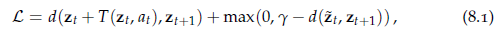
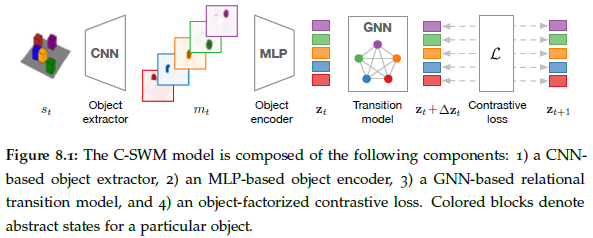
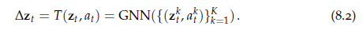
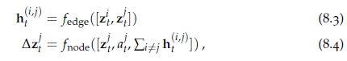
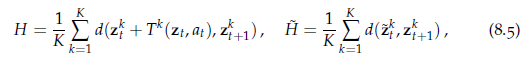

# 第八章 结构世界的对比学习

本章要解决的问题是：如何在不经过明确监督或指示的情况下建立基于对象，抽象和关系来推理输入的模型，该问题的核心是无监督地学习世界的结构化模型，如通过于世界的交互。（https://arxiv.org/abs/1911.12247）

对对象、关系、行为的复合推理是人类的核心认知能力，近期的很多文献都围绕着该能力的建模(Chang et al., 2017; Battaglia et al., 2016; Watters et al., 2017; Steenkiste et al., 2018; Kipf et al., 2018; Sun et al., 2018a; Sun et al., 2019b; Xu et al., 2019).。结构化神经模型有助于预测物理动力学和行为序列，并为新型环境情况的泛化提供了强大的归纳偏差，使模型能够回答反事实问题，例如“如果我推而不是拉一个物体，会发生什么？”。

然而，要通过对象和关系来对世界进行结构化描述首先就是一个具有挑战性的问题，尽管该领域的大多数方法都需要某种形式的人工注释来提取对象或关系，但最近的一些工作以完全无监督或自监督的方式研究了从视觉数据中发现对象的问题(Eslami et al., 2016; Greff et al., 2017; Nash et al., 2017; Steenkiste et al., 2018; Kosiorek et al., 2018; Janner et al., 2019; Xu et al., 2019; Burgess et al., 2019; Greff et al., 2019; Engelcke et al., 2019).。这些方法遵循一种生成方法，即，它们通过执行视觉预测或重建以及通过优化像素空间中的对象来学习发现基于对象的表示。在像素空间中置入损失需要仔细权衡潜变量的结构约束与基于像素的重建的准确性，典型的故障模式包括忽略视觉上很小但可预测未来的相关功能，例如Atari游戏中的子弹，或将模型注意力浪费在视觉丰富但可能是不相干特征的东西上，例如静态背景。

为避免此类失败模式，我们提出采用对比学习的判别方法，该方法通过经验缓冲以状态-动作-状态三元组的形式对假经验进行真实评分，以与典型的图嵌入方法类似的方式，以实体-关系-实体三元组的形式，对真实的事实进行评分，以不真实的三元组或伪造的事实为对抗样本。

为此，我们提出对比训练结构化世界模型（C-SWMs),**一类用于从环境中的观察中学习抽象状态表示的模型。**C-SWM学习一组抽象状态变量，在特定观测值中每个对象对应一个状态变量，使用图神经网络根据抽象的隐表示对环境转移进行建模(Scarselli et al., 2009; Li et al., 2016; Kipf and Welling, 2017; Gilmer et al., 2017; Battaglia et al., 2018)。

我们进一步提出了一种新的对象级对比损失，用于基于对象的无监督表示学习。我们通过合适的翻译图嵌入方法推导出该损失，通过建立状态抽象对比学习和关系图嵌入之间的联系，我们希望为这两个领域的未来模型改进提供灵感和指导。

在一系列实验中，我们使用一种新颖的基于排名的评估策略，我们证明了C-SWM可以学习可解释的对象级状态抽象，可以准确地学习预测状态转换到未来的许多步骤，证明将组合概括化为新的环境配置，并学会在无监督的情况下从场景中识别对象。

## 8.2 方法

我们的目标是学习特定观察或环境状态的对象导向抽象，此外，我们想学习一个环境的条件动作转换模型，该模型考虑了对象表示及其关系和交互。

我们将在第8.2.1–8.2.2节中介绍用于不使用对象分解的状态抽象和转移模型的对比学习的一般框架,然后将描述一种利用对象分解状态表示的变体，我们称其为结构化世界模型。

### 8.2.1 状态抽象

本文采取off-policy的方法，即只在缓冲池(buffer)里抽取样本，缓冲池定义为$\mathcal{B}=\{(s_t,a_t,s_{t+1})\}$,其中$a_t\in\mathcal{A},s_t,s_{t+1}\in\mathcal{S}$我们的目标是学习环境状态的抽象或隐表示$\mathbf{z}_t\in\mathcal{Z}$,该隐表示剥离了采取动作$a_t$后所有与预测$\mathbf{z}_{t+1}\in\mathcal{Z}$无关的信息，则我们的编码器可表示为$E:\mathcal{S\to Z}$,转移模型$T:\mathcal{Z\times A \to Z}$.

### 8.2.2 对比学习

我们图嵌入模型的出发点为TransE模型，其输入为三元组$(e_t,r_t,o_t)$依次表示为源实体、关系、目标实体，TransE建模为一个基于能量的函数$H=d(F(e_t)+G(r_t),F(o_t))$,其中$F,G$为嵌入函数，$d$为距离测度。由于动作的效果通常不是独立于源状态的，因此我们需要将$G(r_t)$替换为$T(\mathbf{z}_t,a_t)$,故最终的能量函数记为：$H=d(\mathbf{z}_t+T(\mathbf{z}_t,a_t),\mathbf{z}_{t+1})$.这种转移模型为建模抽象状态空间中的环境中的动作效果提供了强大的归纳偏差。 当然，我们也可以建模为抽象状态空间中的线性变换或旋转，如RESCAL，CompleX,HoleE。

遵循能量函数的训练目标函数，我们的模型也建模为如下的hinge损失：

其中$\tilde{\mathbf{z}_t}=E(\tilde{s_t})$为负样本的嵌入表示，$\tilde{s_t}$为从经验缓冲池中的随机抽样。$\gamma$为超参数实验中为1。与标准TransE不同的是，我们仅将铰链置于负样本项上，而不是整个损失，并且我们不限制抽象状态zt的范数，实验中这种设置的效果更好。总损失为以上对经验缓冲区$\mathcal{B}$中所有样本的期望。

### 8.2.3 对象导向的状态分解

我们的目标是学习视觉常见的复合特性，因此我们希望学习的是一个环境关系和对象导向的模型，该模型作用于分解后的抽象状态空间$\mathcal{Z=Z_1\times...\times  Z_K}$其中$K$为对象位置(slot)的数目，此外我们假设对象分解后的动作空间表示为$\mathcal{A=A_1\times...\times A_k}$,**这种分解能够保证每个对象都是独立表示的，允许在转移模型中进行对象间高效的参数共享**，从而具有较高的归纳偏置，C-SWM的整体框架如图8.1:

* **编码器和目标抽取器**

本模型将编码器分为两个模块：1）基于CNN的对象抽取器$E_{ext}$；2）基于MLP的对象编码器$E_{enc}$。$E_{ext}$直接从环境中基于图像的状态观测使用CNN抽取特征，其最后一层为$K$个特征映射，每个特征映射$m_t^k=[E_{ext}(s_t)]_k$可被解释为对应每个对象位置的对象掩码，为简化起见，我们只针对每个对象位置指定一个特征映射，这种设定在实验中已经足够了。为允许编码更复杂的对象特征，对象抽取器应具有针对每个对象位置产生多个特征映射的能力。完成对象抽取后，我们将特征映射$m_t$展开，并使用$E_{enc}$进行编码。对象编码针对对象进行参数共享，并返回抽样状态表示$\mathbf{z}_t^k=E_{enc}(m_t^k)$，其中$\mathbf{z}_t^k\in\mathcal{Z}_k=\mathbb{R}^D$,其中$D$为一个超参数。

* **关系转移模型**

我们将转移模型建模为一个GNN，从而允许我们建模成对对象状态间的交互，同时不影响对象表示的顺序。完成编码阶段后，我们获得了场景中每个对象的抽象状态表示$\mathbf{z}_t^k\in\mathcal{Z}_k,a_t^k\in\mathcal{A}_t$,我们将动作表示为one-hot向量（如果没有将动作应用于特定对象则为零向量），但请注意其他选择也是可能的，例如对于连续动作空间。转移函数以对象表示$\mathbf{z}_t=(\mathbf{z}_t^1,...,\mathbf{z}_t^K)$和$a_t=(a_t^1,...,a_T^K)$为输入，得到：

其中$\Delta\mathbf{z}_t=(\Delta\mathbf{z}_t^1,...,\Delta\mathbf{z}_t^K)$,$\mathbf{z}_{t+1}=(\mathbf{z}_t^1+\Delta\mathbf{z}_{t},...,\mathbf{z}_t^K+\Delta\mathbf{z}_t^K)$,GNN由节点更新函数$f_{node}$和边更新函数$f_{edge}$更新函数构成，且二者的参数是共享的，函数选择为MLP，信息传递更新形式如下：

其中$\mathbf{h}_{t}^{i,j}$为边的中间表示或者节点的交互。以上代表了一个节点到边和边到节点的循环，当然我们也可以使用多次循环，但我们发现多次循环在实验中对模型效果并无帮助。如上的信息传递更新对应了一个完全连接的场景图的信息传递，其复杂度为$\mathcal{O}(K^2)$，**而通过减少抽象状态空间中最近邻间的连接，可以减少复杂度至线性**，这些工作可留待以后研究。以下我们记转移函数对第$k$个对象的输出表示为$\Delta\mathbf{z}_t^k=T^k(\mathbf{z}_t,a_t)$。

* **多目标对比损失**

我们对能量函数的修改只需要考虑抽象状态空间的分解，记$H$为正三元组的能量函数，$\tilde{H}$为负三元组的能量函数，则：

其中$\tilde{\mathbf{z}}_t^k$为负状态样本表示$\tilde{\mathbf{z}}_t=E(\tilde{s}_t)$的第$k$个元素，则对一个经验缓冲池中样本，总的对比损失表示为：

$\mathcal{L}=H+max(0,\gamma-\tilde{H})$ (8.6)

## 8.3 文献综述

对象发现见引言，关系图嵌入见8.2.2节。

* **环境的结构化模型**

近期关于结构化环境建模的工作（如交互的多目标或多智能体系统）通过显式地考虑系统的结构化特征大大提高了模型的预测精度(Sukhbaatar et al., 2016; Chang et al., 2017; Battaglia et al., 2016; Watters
et al., 2017; Hoshen, 2017; Wang et al., 2018; Steenkiste et al., 2018; Kipf et al., 2018; Sanchez-Gonzalez et al., 2018; Xu et al., 2019)。**这些模型都一定程度地使用了GNN，其中节点更新函数对单个对象、部分(part)、智能体的动力学建模，而边更新函数建模它们之间的关系和交互。**一些近期的工作直接从像素中学习结构模型(Watters et al., 2017; Steenkiste et al., 2018; Xu et al., 2019; Watters et al., 2019),但使用的是基于像素的损失函数。该方向最新的成果是COBRA模型(Watters et al.,2019)，该模型在对象表示上学习基于动作条件的转移策略，而对象表示由无监督对象发现模型获得(Burgess et al.,2019)，不同于C-SWM,COBRA使用基于像素的损失进行训练并不对对象位置的交互进行建模。**我们的对象编码是非常受限的，使用迭代对象编码过程（如MONet Burgess et al.,2019)将极大地改善这种状况**，这些工作也将留待未来的工作。

* **对比学习**

在图表示和词向量表示中，对比学习非常常用(Bordes et al., 2013; Perozzi et al., 2014; Grover and Leskovec, 2016; Bordes et al., 2013; Schlichtkrull et al., 2018; Veliˇckovi´c et al., 2018a),多数文献都使用了基于能量的损失，一些最近的工作(Oord et al., 2018; Hjelm et al., 2018; Hénaff et al., 2019; Sun et al., 2019a; Anand et al., 2019)通过最大化数据和学习的表示之间的互信息，将类似目标与学习表示的原理联系起来，并将这些方法成功地应用于图像，语音和视频数据。

* **状态表示学习**

环境中的状态表示学习通常建模为自编码器(Corneil et al., 2018; Watter et al., 2015; Ha and
Schmidhuber, 2018; Hafner et al., 2018; Laversanne-Finot et al., 2018) or via adversarial learning (Kurutach et al., 2018; Wang et al., 2019)。最近的一些工作开始尝试不再使用返回像素空间的解码器。如选择性目标(selectivity objective)(Thomas et al.,2018),对比目标(contrastive objective)(Francois-Lavet et al.,2018),互信息目标(Anand et al.,2019),分布匹配目标（Gelada et al,2019),基于因果的（causality-based)损失和隐空间的物理先验(Jonschkowski and Brock, 2015; Ehrhardt et al., 2018)。其中最著名的是Ehrhardt et al.(2018),他们提出了一种方法从原始视频数据联合学习目标检查模块和物理模块，而无需基于像素的损失。但该方法只能依次追踪一个目标且要求多损失函数是均衡的。

## 8.4 实证

https://github.com/tkipf/c-swm

## 8.5&8.6 不足和总结

* **实例消歧**

我们的实证中使用了简单的前馈CNN结构来构造目标抽取模块，但这种结构对同一场景同一目标的多个实例是不敏感的，因此很依赖外部特征或标签。为解决这个问题，我们需要某种形式的迭代消歧过程来打破对称性，并动态绑定单个目标和位置或目标文件(object files),如使用动态路由(dynamic routing)、迭代推断或者序列掩码.

* **随机性和Markov假设**

我们的模型没有考虑环境转移或观测的随机性，因此**只能适用于完全确定是世界**，未来的工作可以围绕此展开，一个简单思路是Markov假设：当前的状态和动作已包含了预测未来状态的全部信息，从而允许我们将每个三元组视为孤立的。为克服这个缺点，我们需要某种程度的记忆力机制，如RNN等。

结构化的世界模型通过允许更强的归纳偏差进行泛化，而不必限制模型的通用性，从而提供了优于纯连接主义方法的显着优势。例如，在3-body物理环境中，对比训练模型可以不必存储每个对象位置的相同表示，并忽略成对交互，即非结构世界模型依然作为一种特殊情况存在。实验中，C-SWM模型可以有效利用额外的结构，可能因为它有一个低复杂度的转移模型，并且学习的是目标导向的模型从而可以泛化到未见过的数据。对象导向的表示可以为环境中的动作和新型互动的影响提供更准确的反事实推理，我们希望在未来的工作，以超越基于自动编码器的方法来进行基于对象的结构化表示学习，并解决本章概述的某些局限性。

