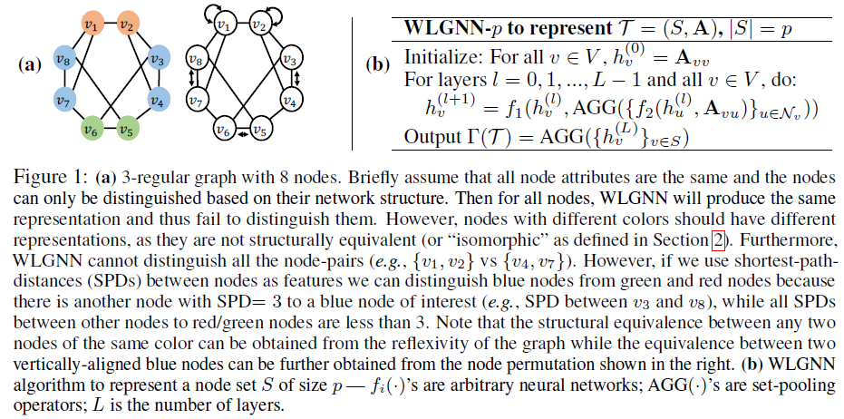

# 距离编码：为图表示学习设计更强大的神经网络

## 摘要

学习节点集的表示对于很多任务（如节点角色发现，链路预测和分子分类）都十分重要，GNN在此方面表现出了强大的潜力，但其表示能力囿于一阶WL测试，最近的一些工作基于模仿高阶WL测试提出了更强大的GNN，但是这些GNN仅关注整个图的表示学习，并且不能利用潜在图的稀疏性，因此计算效率也较低。

因此本文提出了一类结构相关特征，距离编码(distance encoding, DE)，其可以帮助GNN学习**节点集的表示**，同时表示能力高于一阶WL测试。DE捕捉（待学习）节点集和每个节点的距离，为捕捉距离，DE可应用各种图距离测度（如最短路径，和广义PageRank得分）。我们提出两种使用DE的GNN：**1，作为额外的节点特征（DE-GNN）；2，作为GNN信息聚合的控制器（DEA-GNN）**。两种方式都可以利用潜在图的稀疏结构，从而提高计算效率和拓展性(scalability)。

同时我们证明，DE可以区分传统GNN识别失败的几种正则图，我们在六种网络上的三种任务上进行实证：结构角色预测、链路预测、三角预测。结果表明DE-GNN\DEA-GNN显著优于不使用DE的GNN。

## 1 引言

已经证明，现有的信息传递框架下的GNN表示能力上限为一阶WL测试，我们统一称这些GNN为WLGNNs。WLGNN的这种特性在节点集任务（如节点对的链路预测）上尤为明显。近期一些工作关注提高WLGNN的表示能力，但这些工作常常关注的是整个图的表示，或者只在启发式方法下的实证检验而没有很强理论刻画。

基于以上原因，我们提出了一种兼具理论保证和实证效率的方法--DE。**给定节点集$S$,对于图中的每个节点$u$,DE定义为：从$S$的每个节点出发的随机游走到达节点$u$的概率集合的映射。**DE可应用各种图距离测度（如最短路径，和广义PageRank得分），由于DE只依赖于图结构且独立于节点识别器，因此具有归纳性(inductive)和泛化性。

我们还对DE-GNN和DEA-GNN的理论表示能力进行了分析，证明了这两个模型可以区分两个非同构但节点数量相同的集合（包括节点、节点对、整个图），这些节点集是嵌入在几乎所有稀疏常规（regular）图中的，但WLGNN常常难以识别(除非加入索引性的特征)。我们还证明，DE-GNN和DEA-GNN在处理距离正则图中，其表示能力不高于WLGNN，这是DE的一个缺陷，但DE在学习距离正则图的节点对表示中（相比WLGNN）具有额外的能力。

## 2 预备知识

### 2.1 图表示学习

`定义2.1`:给定无向图$G=(V,E,\mathbf{A})$，其中$\mathbf{A}$包含空间$\mathcal{A}\subset\mathbb{R}^{n\times n\times k}$的全部特征，其对角线元素$\mathbf{A}_{vv}$代表节点$v\in V$的特征，而$\mathbf{A}_{uv}$表示节点对$(u,v)$的属性，如果$(u,v)\notin E$,则$\mathbf{A}_{uv}$全为0。此外，我们引入邻接矩阵$A$，如果没有节点特征则$\mathbf{A}=A$,否则$A$可视为$\mathbf{A}$的一个切片。

`定义2.2`:节点顺序记为$\pi$，其为一个$V$到$V$的双射函数，所有可能$\pi$的集合记为$\Pi_n$,作用于$V$子集$S$上的$\pi$记为$\pi(S)=\{\pi(i)|i\in S\}$,定义$\pi(\mathbf{A})_{uv\cdot}=\mathbf{A}_{\pi^{-1}(u)\pi^{-1}(v)\cdot}$

`定义2.3`:**记$V$所有含$p$个节点的子集$S$的集合为$\mathcal{P}_p(V)$,记空间$\Omega_p=\mathcal{P}_p(V)\times \mathcal{A}$,对于空间中的元组$\mathcal{T}_1=(S^{(1)},\mathbf{A}^{(1)}),\mathcal{T}_2=(S^{(2)},\mathbf{A}^{(2)})$,如果$\exist \pi\in\Pi_n$,使得$S^{(1)}=\pi(S^{(2)}),\mathbf{A}^{(1)}=\pi(\mathbf{A}^{(2)})$,则称$\mathcal{T_1,T_2}$为同构的，否则为非同构。**

`定义2.4`:对于定义在$\Omega_n$上的函数$f$，如果$\forall \pi\in\Pi_n$,$f(S,\mathbf{A})=f(\pi(S),\pi(\mathbf{A}))$,则称$f$为(乱序）不变的(invariant)。

`定义2.5`:元组$(S,\mathbf{A})$的结构表示是一个不变函数$\Gamma(\cdot):\Omega_p\to\mathbb{R}^d$,其中$d$为表示维度。因此，如果两个元组是同构的，则它们必然有相同的结构表示。

不变性对模型的归纳和泛化能力至关重要，因为它使得结构表示不需要节点索引，**通过融合参数空间的对称性有效减少了问题的维度**(如，GCN的卷积层)。不变性同时暗示，**结构表示不允许编码$S$在图中的绝对位置**。

结构表示的定义是非常宽泛的，如我们将$S^{(1)},S^{(2)}$视为两个单节点，图结构$\mathbf{A}^{(1)},\mathbf{A}^{(2)}$为两个节点的自中心网络(ego-networks)，则结构表示的定义可视为节点**结构角色**的数学刻画，即两个很远的节点也可以有相同的结构角色，只要它们的自中心网络具有相同的结构。

注意根据具体应用，我们可以选择不同的$p$，如对于节点分类$p=1$,对于链路预测$p=2$,对于图任务$S=V$。本文关注$p$较小的任务，图级任务留待将来讨论。

虽然结构表示比较宽泛，其也用于传统图表示的一些特征，如万能逼近定理：

`定理2.6`:如果结构表示$\Gamma$针对任意两个非同构元组$\mathcal{T_1,T_2}$都不同，则针对任意不变函数$f:\Omega_p\to\mathbb{R}$,则我们可以通过将$\Gamma$喂入一个3层的前馈神经网络加一个ReLU激活函数来万能逼近$f$，只要:1,特征空间是致密的(compact);2,针对任意$S\in\mathcal{P}_p(V)$,$f(S,\cdot)$在$\mathcal{A}$上是连续的。

定理2.6建立了学习结构表示和识别非同构结构的关系，即iff$\mathcal{T_1,T_2}$非同构，$\Gamma(\mathcal{T}_1)\neq \Gamma(\mathcal{T}_2)$,但在每个节点/边特征的条件下(即$\mathbf{A}=A$)，即使针对整个图($S=V$),也没有多项式算法来识别其同构与否，这就是图同构问题，本文将通过一系列非同构结构来说明图表示学习的表示能力。

### 2.2 Weisfeiler-Lehman测试和结构表示学习的WLGNN

1-WL测试：根据节点的度对节点着色，然后迭代地聚合节点和邻域的颜色，然后将聚合的颜色哈希到一个唯一的颜色集，这个着色过程最终会收敛到一个静态的节点-颜色布局(configuration)，其是一个颜色和次数的复集合(multiset)，不同的节点-颜色布局意味着两个图是非同构的，但反之不一定成立。

WLGNN可视为1-WL的模仿，很多GNN可归为WLGNN，其结构如图1(b)所示：

记$WLGNN-p$为学习节点数量为$p$的节点集$S$的结构表示的WLGNN，理论上$WLGNN-p$的表示能力上限为1-WL，该结论也适用于结构表示情形。

`定理2.7`:考虑$\Omega_p$上的两个元组$\mathcal{T_1}=(S^{(1)},\mathbf{A}^{(1)}),\mathcal{T}_2=(S^{(2)},\mathbf{A}^{(2)})$,如果$\mathcal{T_1,T_2}$不能为1-WL识别，则$WLGNN-p$的结果必然满足$\Gamma(\mathcal{T_1})=\Gamma(\mathcal{T_2})$.另一方面，如果它们被1-WL识别，且我们假设聚合函数和神经网络$f_1,f_2$都是单射的，则在足够多的层数$L$下，$WLGNN-p$的输出满足$\Gamma(\mathcal{T_1})\neq\Gamma(\mathcal{T_2})$。

## 3 距离编码与其表示能力

### 3.1 距离编码DE

假设我们的目标是学习节点集$S$的结构表示，则DE会编码$S$到任意节点$u$的距离：

`定义3.1`:给定图$G$、其邻接矩阵$A$及目标节点集$S\in 2^{V}\setminus\emptyset$,我们定义距离编码为函数$\zeta(\cdot|S,A):V\to\mathbb{R}^k$,$\zeta$也为乱序不变的，即$\zeta(u|S,A)=\zeta(\pi(u)|\pi(S),\pi(A)),\forall u\in V,\pi\in\Pi_n$,对于$|S|=p$,记对应距离编码为$DE-p$。

当$A$可由上下文推断时，我们简记距离编码为$\zeta(u|S)$,为简化起见，对于$u,v,v\in S$的DE,我们选择集合聚合函数(如sum-pooling)代表DE：

$\zeta(u|S)=AGG(\{\zeta(u|v)|v\in S\})$ （1）

我们可以使用更复杂的DE，但如上的设计已经足够高效。

则问题转换为选择合适的$\zeta(u|v)$,为简化起见，我们使用如下一类函数，其基于一组随机游走从$v$到$u$的到达概率的映射，即：

其中$W=AD^{-1}$为随机游走矩阵，$f_3$可简单地设计某个启发式函数或参数化的前馈神经网络。在实际中，有限长度的$l_{vu}$(如3，4)就足够了。注意式（2）包括了很多重要的距离测度，例如，若$f_3(l_{uv})$为$l_{uv}$中第一个非零元组的位置，则其代表最短路径距离(shortest-path-distance)，记为$\zeta_{spd}(u|v)$;又如，我们可以使用广义PageRank得分：

注意DE的乱序不变性对归纳学习是非常友好的，这与基于位置节点嵌入的方法（如node2vec，one-hot识别器)有本质区别。

### 3.2 DE-GNN:以DE为节点特征

即令$h_v(0)=\mathbf{A}_{vv}\oplus\zeta(v|S)$,其中$\oplus$表示拼接操作。

`定义3.2`:如果WLGNN中的$f_1,f_2,AGG$，式(1)中的AGG，式(2)中的$f_3$在输入特征**可数(countable,即离散)**的条件下是单射的，则我们称合适的(proper)。

基于前馈网络(用于构造$f_i,i\in\{1,2,3\}$)的万能逼近定理和Deep Sets[38] (用于构造AGG),我们知道合适的(proper)的DE-GNN是存在的。

#### 3.2.1 DE-GNN的表示能力

一类1-WL不能识别的图是正则图，假设不存在节点或边特征，我们以下定理表明，DE-GNN可以识别几乎所有嵌入于$r-$正则图的两个数量相同的节点集，一个基于SPD距离的DE-GNN的例子见图1(a)。

`定理3.3`:给定两个数量相同的节点集$S^{(1)},S^{(2)}\subset V,|S^{(1)}|=|S^{(2)}|=p$,考虑两个元组$\mathcal{T}^{(1)}=(S^{(1)},\mathbf{A}^{(1)}),\mathcal{T}^{(2)}=(S^{(2)},\mathbf{A}^{(2)})$,其中$\mathbf{A}^{(1)}=A^{(1)},\mathbf{A}^{(2)}=A^{(2)}$为邻接矩阵。假设$A^{(1)},A^{(2)}$是均匀、独立地从$V$上的所有$r-$正则图中抽取的，其中$3<r<(2log n)^{1/2}$,则对于较小的常数$\epsilon>0$,在滤波层数$L\leq \lceil (\frac{1}{2}+\epsilon)\frac{log n}{log(r-1)}\rceil$时，存在一个合适的$DE-GNN-p$,其DEs为$\zeta(u|S^{(1)}),\zeta(u|S^{(2)}),\forall u\in V$，使得以$1-o(n^{-1})$的概率，$\Gamma(\mathcal{T}^{(1)})\neq \Gamma(\mathcal{T}^{(2)})$,其中$f_3$可简单地选择SPD,即$\zeta(u|v)=\zeta_{spd}(u|v)$。

`评论3.1`:在一些情况下，我们是在一个大图中学习结构表示，即$A^{(1)}=A^{(2)}$,事实上，我们可以无障碍地将定理3.3的结论扩展到这种情况，只要$A^{(1)},A^{(2)}$是从所有$r-$正则图中采样得到，且$S^{(1)}\cap S^{(2)}=\empty$.其背后的直觉是，对于较大的$n$,环绕两个非重叠的固定集合$S^{(1)},S^{(2)}$的局部子图(在$L$跳邻居之内)几乎是独立的，图2(a)对$p=1$进行了模型，关于WLGNN不可识别的非正则图上的节点集，见附录D。

而较小的节点集上结构表示的能力可以进一步刻画整个图表示的能力，考虑我们通过集合池化直接聚合图中所有节点由$DE-GNN-1$生成的表示作为整个图的表示，则DE-GNN-1的表示能力如何？为回答这个问题，假设两个两个包含$n$个节点的$r-$正则图$\mathbf{A}^{(1)},\mathbf{A}^{(2)}$满足定理3.3，则通过使用交集界(union bound)，	定理3.3表明，对于节点$v\in V$,其表示$\Gamma((v,\mathbf{A}^{(1)}))\neq \{\Gamma((u,\mathbf{A}^{(2)}|u\in V\}$,其概率为$1-no(n^{-1})=1-o(1)$,因此这两个图可以很高的概率为$DE-GNN-1$识别，其正式表达如推论3.4：

`推论3.4`:假设两个图均匀且独立地从所有节点数为$n$的节点集$V$构成$r-$正则图中采样得到，其中$3\leq r<(2log n)^{1/2}$,则当滤波层数$L\leq \lceil(\frac{1}{2}+\epsilon)\frac{log n}{log(r-1)}\rceil$时，$DE-GNN-1$可以概率$1-o(1)$的概率区分这两个图，只要通过对所有节点的表示应用单射集合池化并拼接。

对此问题的一个视角是：较小的集合$S$上的表示学习比整个图更容易学习，因为关于$S$的知识可以视为一种额外信息，模型可以利用这种信息。但当计算整个图($S=V$)表示时,模型则缺少这种信息,因此学习较小集合结构表示成功的概率高于整个图，尽管我们的概率推导并不是束紧的。DE提供了捕捉这种额外信息的简单手段，一种利用该$S$的额外信息的方法是将在$S$内的节点标为1，而在$S$外的节点标为0，这可以视为一种特殊的DE，但表示能力低于通用DE。考虑将目标节点集设为整个图，则节点的标注将不能提供额外信息因为所有节点都标注为1，但DE仍有额外的表示能力：例如，我们想识别一个具有两个不相连的3-环图及一个具有6-环的图，这两个图会生成不同的SPD。

#### 3.2.2 DE-GNN的缺陷

我们证明在正则图的子类，距离正则图(DRG)上，DE-1对结构表示是无效的。

`定义3.5`:距离正则图是一类正则图，图上的任意两个节点$u,v\in V$,满足$SPD(w,v)=i,SPD(w,u)=j$的顶点$w$的数量，只取决于$i,j$和$SPD(v,u)$。

如图2(b)，Shrikhande图和$4\times 4$的Rook图[http://www.matrix67.com/blog/archives/6877#more-6877, 都满足强正则图的条件srg(n^2,2n-2,n-2,2),其中依次代表顶点、度、相邻点的公共邻居节点数、不相邻节点的公共节点数]是两个非同构的图，为简化起见，我们只考虑联通DRG，其可以通过称为交集数组的整数数组来表示。

`定义3.6`:直径为$\Delta$的DRG的交集数组是一个整数数组$\{b_0,b_1,...,b_{\Delta-1};c_1,c_2,...,c_{\Delta}\}$,对于满足$SPD(u,v)=j$的节点对$(u,v)$,$b_j$为满足$SPD(w,u)=j+1$且为$v$节点邻居的节点$w$的数目，而$c_j$为满足$SPD(w,u)=j-1$且为$v$邻居节点的数量。

可以看出图2两个图的交集数组都为$\{6,3;1,2\}$,如下的定理表明，在DRG上，DE-GNN-1需要唯一的节点/边属性才能识别两个结构，这即是DE-1的缺陷。

`定理3.7`:给定两个节点$(u,v)\in V$，考虑两个元组$\mathcal{T_1}=(v,\mathbf{A}^{(1)}),\mathcal{T_2}=(u,\mathbf{A}^{(2)})$,图结构$A^{(1)},A^{(2)}$对应两个相同交集数组的联通DRG，则DE-GNN-1需要唯一的节点/边属性才能识别两个结构。

注意定理3.7只对使用DE-1的节点表示成立，因此DE-GNN-1可能不会为图2(b)两个DRG关联独特的节点表示。

但如果我们以$DE-p,p\ge2$学习高阶结构表示($|S|\ge 2$),则$DE-GNN-p$会有更强大的表示能力，我们以两个DRG中构造边的节点对的结构表示进行说明，如图2(b)。存在一个使用SPD作为DE-2的、合适的$DE-GNN-2$，为这两个节点对关联不同的表示。此外，通过使用集合池化聚合所有节点对的表示为图表示，我们甚至可以区分这两个图。

值得一提的是，识别两个DRG中的节点对是非常困难的，即使2-WL测试也会不能识别具有相同交集数组和直径为2的DRG中的边（2-WL不能识别强正则图，**强正则图为直径为2的距离正则图**），这表明近期基于高阶WL测试的RingGNN,PPGN也不能处理这种状况。

将定理3.3扩展到DRG上来证明DE-GNN-p,$p\ge 2$的表示能力，但缺少针对DRG解析友好的随机模型使这种扩展非常困难。

### 3.3 DEA-GNN：DE-1作为信息聚合的控制器

DE聚合-GNN对GNN的修改可表示为：

注意，DEA-GNN的表示能力至少不会弱于DE-GNN，因为DE-GNN是DEA-GNN以$\zeta_{spd}(u|v)=1$聚合节点的特殊情况，因此定理3.3和推论3.4仍然成立，但其表示能力仍然受限于定理3.7。

`推论3.8`:定理3.3和推论3.4和定理3.7对DEA-GNN仍然成立。

式(4)针对所有节点的聚合只具有理论意义，实际中出于拓展性考虑不会这样操作，而会进行一定的简化，如我们通常会选择$\zeta(u|v)=\zeta_{spd}(u|v)$,并且只聚合$K$跳内的邻居。多跳聚合可以避免深度结构的训练问题，如梯度退化。特别地，我们可以证明$K$跳聚合可以减少定理3.3和推论3.4所有要求的滤波层数$\lceil(\frac{1}{2}+\epsilon)\frac{log n}{log(r-1)}\rceil$,证明见附录F。我们还可以选择$\zeta(u|v)=\zeta_{gpr}(u|v)$,并选择非负的$\gamma_k$，如式(3)所示，并只聚合$\zeta(u|v)$在$top-K$内的节点$u$。这种方式可以控制固定大小的聚合集合。由于DEA-GNN并未显示出比DE-GNN更高的表示能力，因此以上所有方法有共同的理论表示能力和缺陷，但在实际中可能会因任务和数据集而表现不同。

## 4 相关文献

近期多数关注结构表示的WLGNN方法都只关注整个图[25，27-30，43，44]，Srinivasan & Ribeiro[45]率先从联合概率分布的角度研究了节点集的结构表示，一些文献将GNN视为不变函数的近似，但它们通常都依赖于高阶张量，因此拓展性很差[28，46，47]。Ring-GNN[29]和PPGN[30]等的拓展性稍好，其依赖于3阶张量，用以近似2-WL，但它们由于不能利用图结构的稀疏性，因而拓展性有限。

一些文献对本文的DE具有一定的启发性，如SEAL[9]通过读出节点对自中心网络的表示来进行链路预测，其可以视为DE-2的一种特殊情形，但其自中心网络的表示是通过SortPooling抽取的。PGNN[10]使用节点和锚节点的SPD来编码节点间的距离，但由于这种编码并非乱序不变的，因此PGNN劣于本文的模型。

一些文献关注如何修改WLGNN的邻域聚合过程，但这些工作没有明确与DE的关系或进行理论刻画。MixHop[48],PAGTN[31],MAT[17]使用$\zeta_{spd}(u|v)$来改变聚合过程，如式(4)。GDC[32],PowerGNN[49]使用的是$\zeta_{gpr}(u|v)$的变体。GDC声称基于$\zeta_{gpr}(u|v)$的聚合无益于链路预测，但我们的研究表明这是由于其没有将其作为额外的特征所致，见附件G.3。此外，以上所有模型都可归类为DEA-GNN-1，其表示能力受限于定理3.7和推论3.8。

## 5 实证

三种任务：节点角色分类、链路预测和三角预测。三角预测任务为：对于三节点集合$\{u,v,w\}$,预测$uv,uw,vw$是否全部存在。该任务属于更宽泛的高阶网络motif预测任务，近年来广受关注[50,51,52-56]。实证细节见附件G。

数据集为Brazil-Airports (Task 1), Europe-Airports (1), USA-Airports (1), NS (2 & 3), PB (2), C.ele (2 &
3).

结果见表1：

