# 第一章 引言

## 1.1&1.2 引言

图上的节点通常是相互关联的，因此不服从独立同分布，传统的方法因为不适用。目前有两个方向：1，专门构建针对图的机制，如集合分类(collective classification)。2，通过构造特征集合来将图展开(flatten)作为节点的表示，然后适用传统方法，因此更受欢迎，该方法的最重要是如何构造节点的特征集或节点表示，而构造特征集最好的方式是深度学习，但深度学习应用于图数据存在如下挑战：1，图数据不规则，节点是无序的，且拥有不同的邻域。2，不同复杂图(complex graph)的结构是非常复杂的,图中的节点和边往往也具有不同的额外信息。

## 1.5 图特征学习简明史

历史上，节点向量表示有两个方向：特征工程和特征学习。特征工程依赖手工设计的特征如度统计量，而特征学习则是自动进行的。一方面，我们通常没有特征的先验知识，尤其是针对特定的下游任务，因此，特征工程可能是次优的选择；另一方面，特征学习自动学习特征表示，而下游任务可以指导这个过程，因此通常特征学习的效果更好。对于特征学习，我们又将其大致分为特征选择和表示学习，特征选择致力于将删除无关和多余的节点特征只保留有用的特征，而表示学习则是致力于生成新的节点特征集。

### 1.5.1 图上的特征选择

特征选择致力于选择一个节点特征的子集，该子集与任务目标有最小的冗余度和最大的相关度，如监督学习中的类标签。在很多应用中，原始特征对知识抽取和模型解释性至关重要。给定图$\mathcal{G=\{V,E\}}$,每个节点具有$d$个原始特征$\mathcal{F}=\{f_1,..,f_d\}$,我们的目标是抽取$K\ll d$个特征的子集表示节点。(Tang and Liu, 2012a; Gu and Han, 2011)在监督框架下，使用线性分类器和正则化项对该问题进行了研究，(Wei et al., 2016, 2015; Tang and Liu, 2012b). In (Tang and Liu, 2012b)在无监督框架下进行了研究，在(Tang and Liu,2012b)中，作者使用从结构信息抽取的伪标签作为监督信号指导特征选择。Wei et al.(2016)则假定节点内容和结构信息都是从一组高质量的特征中生成的，这些特征可以通过使生成过程的极大似然估计得到。之后，该问题从简单图扩展到动态图(Li et al.,2016),多维图(Tang et al.,2013),符号图(Chen et al.,2017;Huang et al.,2020)和属性图(Li et al.,2019b)。

### 1.5.2 图上的表示学习

早期的图表示学习大致可分为三类：谱聚类、基于图的降维、矩阵分解。谱聚类以聚类为出发点，其核心为谱嵌入。基于图的降维通常需要根据原始特征上预定义的距离函数定义亲密图(affinity graph),其目标为学习亲密图上保持结构信息的节点表示，主要方法有：IsoMap(Tenenbaum et al., 2000),LLE,eigenmap，以上方法都需要执行亲密矩阵（或邻接矩阵、Laplacian矩阵）上的特征分解，因此计算复杂度较高。属于矩阵分解的方法有：LSI，其根据截断SVD学习文档和文字的节点表示。矩阵方法非常直观，因此可应用于节点分类、推荐等多种任务上，详见Qiu et al.(2018)。

随着word2vec技术的发展，一些图表示学习也开始借鉴该方法。如DeepWalk通过保持随机游走中的共现频率进行节点嵌入，目前该方向主要的流派有：1,更高级的节点共现频率保持方法；2，保持其他类型的信息，如节点结构角色、社区信息、节点状态；3，为复杂图（有向图、异质图、二部图、多维图、符号图、超图、动态图）设计新的框架。

随着DNN的发展，基于DNN的图表示学习开始兴起。其大致可分为两个方向：空域方法和谱域方法。目前GNN的发展有如下几个方向：

* 谱域GNN和空域GNN模型。
* 作用于整个图的任务，为此，从节点表示到图表示的池化方法非常必要。(Li et al., 2015; Ying et al., 2018c; Gao and Ji, 2019; Ma et al., 2019b).
* 图对抗攻击和防御模型。
* 拓展性(scalability)
* 复杂图。
* 基于其他深度框架的方法，如AE,VAE,RNN,GAN。
* 与NLP、CV、数据挖掘、健康等领域的结合。

其他资源有:scikit-feature,Li et al.(2017)是一本关于特征选择算法非常流行的书籍。

# 第二章 图的基本概念

* 度：即与节点相连的边的个数。
* 邻接矩阵：表示节点间相连状况的矩阵，0代表节点间没有边，1代表存在边。

## 2.3 图的性质和测度

### 2.3.2 连通性

* 游走（walk)：从一个节点开始、另一个节点结束的节点和边的序列。
* 迹（trail):具有不同边的游走。
* 路径(path)：具有不同节点的游走。

`定理2.14`:给定图$\mathcal{G=\{E,V\}}$及对应邻接矩阵$\mathbf{A}$,记$\mathbf{A}^n$为邻接矩阵的$n$次幂，则$\mathbf{A}^n$的元素$\mathbf{A}^n[i,j]$等于节点$i,j$间长度为$n$的游走数。

证明：我们可以通过归纳法进行证明。

当n=1时，如果$v_i,v_j$间存在边，则其长度必然为1,个数必然为1；如果$v_i,v_j$间不存在边，则个数为0；

假设当n=k时结论也成立，即$v_i,v_h$间长度为$k$的游走数为$\mathbf{A}[i,h]$,则对于$\mathbf{A}^{k+1}$有：

已知$v_i,v_h$间长度为$k$的游走数为$\mathbf{A}[i,h]$,$\mathbf{A}_{h,j}$为$h,j$长度为1的游走数，故$\mathbf{A}_{i,j}^{k+1}$必然代表了$v_i,v_j$间长度为$k+1$的游走数。

* 子图：给定图$\mathcal{V=\{V,E\}}$，其子图$\mathcal{G'=\{V',E'\}}$满足：$\mathcal{V'\subset V,E'\subset E}$,其中$\mathcal{V'}$必须包含$\mathcal{E'}$所涉及的所有节点。

* 连通成分(connected component):对于子图$\mathcal{G'=\{V',E'\}}$,如果子图内任意节点对之间至少有一条路径，且$\mathcal{V'}$内的节点不与$\mathcal{V/V'}$相连。

* 连通图：如果图中只有一个连通成分则称图为连通图。

* 最短路径：给定图中的节点对$v_s, v_t\in\mathcal{V}$,记其路径为$\mathcal{P}_{st}$,则最短路径记为：

  $p_{st}^{sp}=arg\underset{p\in\mathcal{P}_{st}}{min}|p|$

  一对节点间可能存在多个最短路径。

* 直径：给定连通图$\mathcal{G=\{V,E\}}$,其直径定义为：

  $diameter(\mathcal{G})=\underset{v_s,v_t\in\mathcal{V}}{max}\underset{p\in\mathcal{p}_{st}}{min}|p|$

### 2.3.3 中心度(centality)

中心度即衡量节点在图中重要性的测度。

* **度中心度**：即节点的度。

* **特征向量中心度**：度中心度将所有邻居节点视为等权，但邻居节点也有自身的重要性，而邻居节点的重要性也会影响节点的重要性，为此特征向量中心度对给定节点$v_i$的中心度得分需要考虑其邻居节点的中心度得分，即：

  $c_e(v_i)=\frac{1}{\lambda}\sum_{j=1}^N\mathbf{A}_{i,j}·c_e(v_j)$

  上式的矩阵形式可表示为：$\mathbf{c}_e=\frac{1}{\lambda}\mathbf{A·c}_e$，即：$\lambda·\mathbf{c}_e=\mathbf{A·c}_e$

  即所有节点特征向量中心度构成的向量$\mathbf{c}_e$是$\mathbf{A}$对应特征值$\lambda$的特征向量。因此，一个邻接矩阵可能对应多个特征向量，通常我们希望特征向量中心度是正的，而根据$Perron-Frobenius$定理，元素值为正值的实方阵拥有唯一的最大特征值，且最大特征值对应的特征向量为正向量。因此我们选择最大特征值对应的特征向量作为特征向量中心度得分向量。

* **Katz中心度**：是特征向量中心度的一个变体，不仅考虑了邻居节点的重要性而且对节点自身也增加了一个小的常数，即：

  $c_k(v_i)=\alpha\sum_{j=1}^N\mathbf{A}_{i,j}c_k(v_j)+\beta$

  其矩阵表示为：$\mathbf{c}_k=\alpha\mathbf{Ac}_k+\boldsymbol{\beta}$,即：$\mathbf{(I-\alpha·A)c}_k=\boldsymbol{\beta}$

  令$\alpha=\frac{1}{\lambda_{max}},\beta=0$,则Katz中心度等价于特征值中心度。

  Katz中心度中$\alpha$的选择非常重要，过大的$\alpha$则会使矩阵$\mathbf{I-\alpha·A}$变为病态矩阵，过小的$\alpha$又会使中心度得分不可用，因为每个节点的中心度得分都会与$\beta$非常接近。通常我们会选择$\alpha<\frac{1}{\lambda_{max}}$.

* **中间(betweenness)中心度**:以上的中心度概念都是基于连接性，而中间中心度则测度的是节点在图中的位置是否重要，即如果如果有很多路径穿过该节点，则该节点在图中的位置会十分重要。节点的中间中心度得分定义为：

  

  其中$\sigma_{st}$节点$v_s,v_t$之间的最短路径的总数，$\sigma_{st}(v_i)$为$v_s,v_t$的路径中穿过节点$v_i$的路径总数。可以看出在节点数较高时，图中的路径总数也会急剧上升，从而式(2.6）的得分会变得较小。因此为使不同规模的图的中间中心度具有可比性，我们需要对其进行标准化，一种有效的方法是使用最大可能中间中心度得分，最大可能中间中心度得分在所有节点对间的最短路径都穿过$v_i$时取得，即$\frac{\sigma_{st}(v_i)}{\sigma_{st}}=1$,故针对无向图的最大中间中心度等于最大可能节点对数$\frac{(N-1)(N-2)}{2}$,从而标准化中间中心度定义为：

  

## 2.4 谱图理论

即研究图的Laplacian矩阵特征值和特征向量的性质的理论。

### 2.4.1 Laplacian矩阵

* **Laplacian矩阵**：$\mathbf{L=D-A}$

  当且仅当$\mathbf{D,A}$均为对称阵时，Laplacian矩阵是对称的。

* **标准化Laplacian矩阵**：$\mathbf{L=D^{-\frac{1}{2}}(D-A)D^{-\frac{1}{2}}=I-D^{-\frac{1}{2}}(A)D^{-\frac{1}{2}}}$

令$\mathbf{f}$代表节点信号的向量，则

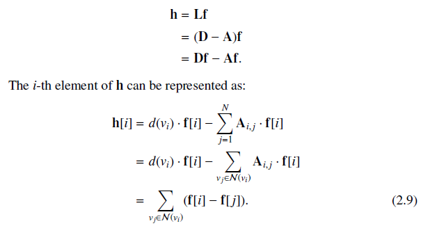

即$\mathbf{h}[i]$为节点$v_i$与其邻居节点$\mathcal{N}(v_i)$的差的和。

同时：

因此$\mathbf{f}^T\mathbf{Lf}$为所有邻接节点差的平方和。

### 2.4.2 Laplacian矩阵的特征值和特征向量

* **定理2.30**：图Laplacian矩阵的特征值是非负的。

  **证明**：设$\lambda,\mathbf{u}$分别为$\mathbf{L}$的特征值和标准化特征向量，则必然有$\lambda=\lambda\mathbf{u}^T\mathbf{u}=\mathbf{u}^T\lambda\mathbf{u}=\mathbf{u}^T\mathbf{Lu}\ge 0$.

  根据定理2.30，图Laplacian矩阵必然存在值为0的特征值，根据式(2.9)，我们可以验证$\mathbf{u}_1=\frac{1}{\sqrt{N}}(1,...,1)$为0对应的特征值。

* **定理2.31**：给定图$\mathcal{G}$,其Laplacian矩阵特征值中0 的个数代表了图中连通成分的个数。

  **证明**：假定图中存在$K$个连通成分。因此我们可以将节点集$\mathcal{V}$划分为$K$个不相连的子集$\mathcal{V_1,...,V}_K$,我们首先可以证明对应特征值0，至少存在$K$个正交的特征向量。

  构造向量$\mathbf{u}_1,...,\mathbf{u}_K$,其中$\mathbf{u}_i[j]=\frac{1}{\sqrt{|\mathcal{V}_i|}}\forall v_j\in \mathcal{V}_i$,否则为0。则$\mathbf{Lu}_i=0,i=1,...,K$,且$\mathbf{u}_i\mathbf{u}_j=0$,故$0$特征值的乘数至少为K。

  然后我们可以证明对应特征值0，至多存在$K$个正交的特征向量。

  假设存在另一个对应0的特征向量$\mathbf{u}^*$,则必然有$\mathbf{u}^*\mathbf{u}_i=0,i=1,...,K$,由于$\mathbf{u}^*$为非零向量，即至少存在对应节点$v_d\in\mathcal{V}_i$的元素非零，且元素对应同一连通成分的元素必然全部相等，则属于节点$\mathcal{V}_i$的所有节点对应元素相同，故$\mathbf{u}^*\mathbf{u}_i>0$，与题设矛盾，故证明。

## 2.5 图信号处理

在实际应用中，节点常包含属性或特征。这种图结构的数据可以视为一种图数据，其能够捕捉结构信息（或节点间的连接性）和数据（或节点的属性）。图信号由图$\mathcal{G=\{V,E\}}$和定义在图域上的映射函数$f$构成，$f$表示为：$f:\mathcal{V}\to\mathbb{R}^{1\times d}$,其中$d$对应每个节点的维度，不失一般性，我们令$d=1$。令所有节点的映射向量为$\mathbf{f}\in\mathbb{R}^N$。图信号示例如图2.3：

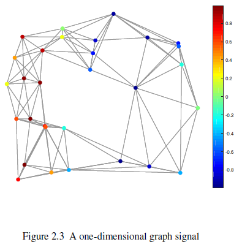

如果连通节点的值非常相似，则图是平滑的。平滑的图信号其频率也非常低，因为值在边上的变化非常缓慢。式(2.10)的Laplacian矩阵二项式可以用来测度图信号$\mathbf{f}$的平滑性（或频率），因为**它是所有连通节点对差的平方和**。具体来说，如果图信号$\mathbf{f}$是平滑的，则$\mathbf{f}^T\mathbf{Lf}$将很小，我们称其为信号$\mathbf{f}$的平滑度（或频率）。

在经典的图信号处理中，信号可以由时域和频域两种域表示，相似地，图信号也可以由两种域表示：空域和谱域（或频域），而图信号的谱域基于图傅里叶变换。

### 2.5.1 图傅里叶变换

经典的傅里叶变换表示为：

傅里叶变换将信号$f(t)$分解为对于任意实数$\xi$的复指数$exp(-2\pi it\xi)$的级数，其中$\xi$可视为对应指数的频率。而这些复指数则是一维Laplacian算子（或2阶微分算子）的特征函数，因为：

类似地，图信号$\mathbf{f}$在图$\mathcal{G}$上的图傅里叶变换可表示为：

其中$\mathbf{u}_l$为图Laplacian矩阵的第$l$个特征向量，其对应的特征值$\lambda_l$代表了特征向量的频率（或平滑度）。

该特征向量是图的傅里叶基，而$\hat{\mathbf{f}}$为信号$\mathbf{f}$对应傅里叶基的傅里叶系数，则图傅里叶变换的矩阵表示为：

​												$\hat{\mathbf{f}}=\mathbf{U}^T\mathbf{f}$ 														 (2.12)			

其中$\mathbf{u}_l^T\mathbf{Lu}_l=\lambda_l·\mathbf{u}_l^T\mathbf{u}_l=\lambda_l$,即特征值$\lambda_l$代表了特征向量$\mathbf{u}_l$的频率（或平滑度）。较小特征值对应的特征向量在图中的变化非常缓慢。换句话说，这样的特征向量在连接节点处的值是相似的，***因此，这些特征向量是平滑的，在图中的变化是非常缓慢的。而对应较大特征值的特征向量代表的两个节点的值差异很大，即使节点是相连的。***最极端的情况就是与特征值0对应的第一特征向量$\mathbf{u}_1$,它对于所有节点都是相同的，即它的值在图中没有变化。这些特征向量即图的图傅里叶基，对应特征值代表它们的频率。式(2.12)的傅里叶变换可视为将输入信号$\mathbf{f}$分解为不同频率傅里叶变换基的过程。得到的系数$\hat{\mathbf{f}}$代表了对应傅里叶变换基对输入信号的贡献。图2.4表示了不同图傅里叶基的频率。

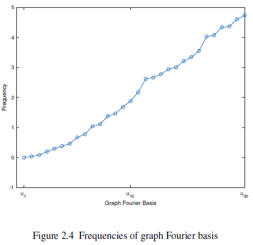

图傅里叶系数$\hat{\mathbf{f}}$是信号$\mathbf{f}$在谱域的表示。类似地，存在逆图傅里叶变换，将谱域表示$\hat{\mathbf{f}}$转换为空域表示$\mathbf{f}$:

$\mathbf{f}[i]=\sum_{i=1}^N\hat{f}[l]\mathbf{u}_l[i]$

其矩阵表示为：

$\mathbf{f=U\hat{f}}$

空域和谱域的图信号表示见图2.5：

## 2.6 复杂图

* **异质图**：具有不同类型节点或边的图。
* **二部图**：一种特殊的异质图，节点有两种类型，只有不同类型的节点间才可能存在边，同类节点间没有边相连。
* **多维图**：节点间存在多种类型的边的图。公式化的表示为：$\mathcal{G=\{V,E\}}$,存在$D$种类型的边：$\mathcal{\{E_1,...,E_D\}}$,而$D$种类型的边可以表示为$D$个邻接矩阵$\mathbf{A}^{(1)},...,\mathbf{A}^{(D)}$。
* **符号(signed)图**:图中存在正、负两种类型的边，负边类似于社交关系中的黑名单或取消关注等，形式化地表示为：$\mathcal{G=\{V,E^+,E^-\}}$,若节点$i,j$间存在正边则$\mathbf{A}_{i,j}=1$,存在负边则$\mathbf{A}_{i,j}=-1$，否则为0.
* **超图(hypergraph)**:节点并非以成对关系出现的图，形式化地表示为：$\mathcal{G=\{V,E},\mathbf{W}\}$,其中$\mathcal{E}$为超边(hyperedge)，$\mathbf{W}\in\mathbb{R}^{\mathcal{|E|\times{E|}}}$为权重对角矩阵，元素$\mathbf{W}[i,j]$代表超边$e_j$的权重。该超图可由触发(incidence)矩阵$\mathbf{H}\in\mathbb{R}^{\mathcal{|V|\times|E|}}$表示，当节点$v_j$由边$e_j$触发时，$\mathbf{H}_{i,j}=1$,对于节点$v_i$，其度为$d(v_i)=\sum_{j=1}^{|\mathcal{E}|}\mathbf{H}_{i,j}$，对于超边$e_j$，其度为$d(e_j)=\sum_{i=1}^{|\mathcal{V}|}\mathbf{H}_{i,j·}$,此外，我们使用$\mathbf{D}_e,\mathbf{D}_e$表示边和节点的对角矩阵。
* **动态图**：动态图亦表示为$\mathcal{G=\{V,E\}}$，其中每个节点或边与一个时间戳相关联，表示其出现的时间点。具体来说，存在两个映射函数$\phi_v,\phi_e$将每个节点和边映射为它们出现的时间戳。
* **离散动态图**：离散动态图由$T$个图快照构成，每个图快照都是动态图演化的观测值，我们记$T$个图快照记为$\{\mathcal{G}_0,..,\mathcal{G}_T\}$。

## 2.7 图上的计算任务

* **节点级任务**：包括节点分类、链路预测等。
* **图级任务**：包括图分类等。

## 2.9 其他参考资料

图的其他性质和概念还有：流量和分割(flow and cut)，图上的其他任务还包括：图着色、路由问题、网络流量问题、覆盖（coering)问题，这些概念和问题可参考(Bondy et al., n.d;Newman,2018)。

Bondy, John Adrian, et al. Graph theory with applications. Vol. 290.

Newman, Mark. 2018. Networks: An Introduction. Oxford university press.

图上的谱性质和理论见(Chung and Graham,1997)

Chung, Fan RK, and Graham, Fan Chung. 1997. Spectral graph theory. American
Mathematical Soc.

图数据集有：Stanford Large Network Dataset Collection(Leskovec and Krevl,2014), Network Data Repository(Rossi and Ahmed, 2015)。

Leskovec, Jure, and Krevl, Andrej. 2014. SNAP Datasets: Stanford Large Network
Dataset Collection.

Rossi, Ryan A., and Ahmed, Nesreen K. 2015. The Network Data Repository with
Interactive Graph Analytics and Visualization. In: Proceedings of the Twenty-
Ninth AAAI Conference on Artificial Intelligence.

工具箱和包：networkx,graph-tool,SNAP,Graph Signal Processing。

# 第四章 图嵌入

## 4.1 引言

本文把图嵌入分为四部分：

* 映射函数，将节点从图域映射到嵌入域；
* 信息抽取器，用于抽取我们希望从图域保持的关键信息$\mathcal{I}$.
* 重建器，使用嵌入域的嵌入(向量)重构抽取的图关键信息$\mathcal{I}$.
* 目标函数，即由抽取的信息$\mathcal{I}$和重建的信息$\mathcal{I'}$的差异构造的函数。

## 4.2 简单图上的图嵌入

即作用于无向、无符号、同质图上的图嵌入。

### 4.2.1 保持节点共现

保持节点共现的方法都是基于随机游走的，代表性的方法有：DeepWalk(Perozzi et al., 2014),node2vec(Grover and Leskovec, 2016)和LINE (Tang et al., 2015)。

#### （1） **映射函数**

$f(v_i)=\mathbf{u}_i=\mathbf{e}_i^T\mathbf{W}$ 			(4.1)

其中$\mathbf{e}_i\in\{0,1\}^{N}$为one-hot向量代表节点$v_i$，$\mathbf{W}\in\mathbb{R}^{N\times d}$为查找表(look-up table)。

#### （2） **基于随机游走的共现抽取器**

形式化表示为：

$p(v^{(t+1)}|v^{(t)})=\begin{cases}\frac{1}{d(v^{(n)})}, & \text { if } v^{(t+1)} \in \mathcal{N}(v^{(t)}) \\ 0, & \text { otherwise }\end{cases}$

其中$d(·)$表示对应节点的度，上式表示下一个节点是根据均匀分布选择的。

则由如上随机游走方法在图$\mathcal{G}$生成的长度为$T$的所有随机游走可表示为：

$\mathcal{W}=RW(\mathcal{G},v^{(0)},T)$

每个节点会生成$\gamma$个随机游走，故整个图随机游走的总数为$N\gamma$。

完成随机游走后，我们视每条随机游走为一个句子，使用skip-gram进行处理，即给定一个中心节点$v^{(i)}$，我们选择半径$w$内的节点作为其背景节点,即将$(v^{(i-j)},v^{(i)}),(v^{(i+j)},v^(i)),j=1,...,w$添加入共现信息$\mathcal{I}$的列表，此处我们视不同距离的背景节点为等权的，当然可以选择按距离加权。

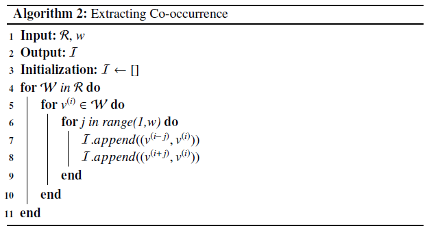

#### （3） **重建器和目标**

针对共现信息$\mathcal{I}$列表的每个元组，其存在中心节点和背景节点两种节点，因此也要使用两种映射函数：

其中$cen,con$分别代表center,context节点。

则对于元组$(v_{con},v_{cen})$共现关系可以表示为在中心节点$v_{cen}$的背景下观测到$v_{con}$的概率，即：

​										

​	如上的条件概率可作为重建器：

​							$p(v_{con}|v_{cen})=Rec((v_{con},v_{cen}))$

以上是一个元组$(v_{con},v_{cen})$的重建器，则对于整个图信息$\mathcal{I}$,其重建器可表示为：

$\mathcal{I}$中可能存在重复元组，考虑这种情况，则式(4.3)可表示为：

其中$\#(v_{con},v_{cen})$表示$(v_{con},v_{cen})$元组在信息$\mathcal{I}$出现的次数，代表了真实的共现信息。对式(4.4)取对数，即构成极大似然估计的目标函数：

其中$\mathbf{W}_{con},\mathbf{W}_{cen}$为节点嵌入矩阵（或两个映射函数的参数矩阵）。

#### （4） **加速学习过程**

式(4.2)式的计算涉及所有节点，因此复杂度较高。需要一些加速策略，实际中有两种方法：分层softmax和负采样。

1. **分层softmax**

在分层softmax中，每个节点 都被指定为二叉树上的一个节点，如图4.2：

则概率$p(v_{con}|v_{cen})$可建模为在二叉树上通过路径到达节点$v_{con}$。给定到达节点$v_{con}$的路径节点序列$(p^{(0)},...,p^{(H)})$,其中$p^{(0)}=b_0,p^{(H)}=v_{con}$，则我们有：

$p(v_{con}|v_{cen})=\prod_{h=1}^HP_{path}(p^{(h)}|v_{cen})$

其中$P_{path}(p^{(h)}|v_{cen})$可被建模为一个以中心节点为输入的二项分类器。具体来说，二项分类器用来确定路径需要处理的下一个节点。

2. **负采样**

负采样是噪音对比学习（Noise Contrasitive Estiamtion,NCE)的一个简化版，其针对每个$\mathcal{I}$中的元组$(v_{con},v_{cen})$,我们采样$k$与$V_{cen}$不共线的节点组成负样本对，从而每个元组$(v_{con},v_{cen})$的目标函数为：

从而整个$\mathcal{I}$的目标函数变为：

3. **实际训练过程**

实际中训练是按batch进行的，即每当生成一个随机游走$\mathcal{W}$,我们抽取其对应的共现信息$\mathcal{I}_{\mathcal{W}}$,并根据此进行训练。

#### （5） 其他共现保持方法

1. **node2vec**

node2vec使用了一种更灵活的通过有偏随机游走进行邻域探索的方法，即node2vec使用的是基于二阶随机游走的方法，该方法有两个参数$p,q$控制随机游走的广度和深度，进行随机游走时不仅考虑当且节点还考虑上一步的节点，形式化表示为：

其中$d(·,·)$表示两个节点间的最短路径，式(4.8)非标准化概率之后会进行标准化以采样下一个节点$v^{(t+1)}$。$p$控制回访概率，较小的$p$鼓励随机游走回访而较大的$p$鼓励随机进行新的探索。$q$控制内向或外向回访的概率，$q<1$会鼓励随机游走访问临近$v^{(t-1)}$的节点而$q>1$会鼓励随机游走访问远离$v^{(t-1)}$的节点。

2. **LINE**

LINE基于的二阶近似可表示为：

可以看出LINE的主要区别在于：它使用的不是$\mathcal{I}$而是$\mathcal{E}$，而事实上，$\mathcal{E}$可视为$\mathcal{I}$的长度为1的特殊形式。

#### (6) 矩阵分解视角

负采样的DeepWalk相当于对如下矩阵进行矩阵分解：

其中$\mathbf{P=D}^{-1}\mathbf{A}$,$T$为游走长度，$vol(\mathcal{G})=\sum_{i=1}^{|\mathcal{V}|}\sum_{j=1}^{|\mathcal{V}|}\mathbf{A}_{i,j}$,$k$为负采样个数。

实际上，DeepWalk的矩阵结构也可以纳入之前介绍的框架，具体来说，信息抽取器为：

重建器为$\mathbf{W}_{con}\mathbf{W}_{cen}^T$，其中对应矩阵为背景节点与中心节点映射函数的参数，则目标函数表示为：

类似地，LINE、node2vec也可以进行如此的矩阵表示(Qiu et al.,2018)

### 4.2.2 保持结构角色

在图域中，两个相近的节点常常会在多个随机游走中共现，基于共现保持的方法倾向于为这些节点分配相似的嵌入。但在很多实际应用中我们希望能为相似地结构角色分配相似的嵌入，如图4.3的$u,v$:

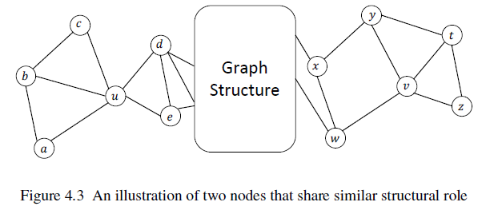

为此，Ribeiro et al.（2017)提出了struc2vec方法，其主要特点是使用了基于度的结构角色相似度度量，并基于此构建新的图，struc2vec方法的映射函数和重建函数与DeepWalk相同，只是信息抽取器不同。

<!--Ribeiro, Leonardo FR, Saverese, Pedro HP, and Figueiredo, Daniel R. 2017. struc2vec: Learning node representations from structural identity. Pages 385--394 of: Proceedings of the 23rd ACM SIGKDD International Conference on Knowledge Discovery and Data Mining. ACM.-->

#### (1) 度量结构角色相似度

struc2vec的基本思想是度相似的两个节点相似度较高，而如果它们的邻居也具有相似的度，则这两个节点的相似度会更高。记$R_k(v)$为节点$v$的$k$跳邻居节点集合，我们根据度对$R_k(v)$进行排序得到$s(R_k(v))$,则两个节点$v_1,v_2$间考虑$k$跳邻域的结构距离$g_k(v_1,v_2)$可迭代地表示为：

$g_k(v_1,v_2)=g_{k-1}(v_1,v_2)+dis \Big( s\big( R_k(v_1))\big),s\left ( R_k(v_2) \right) \Big)$

其中$dis \Big( s\big( R_k(v_1))\big),s\left ( R_k(v_2) \right) \Big)\ge 0$度量了两个有序度序列的距离。$s\big( R_k(v_1))\big),s\left ( R_k(v_2) \right)$可能具有不同的长度。struc2vec使用动态时间扭曲算法(Dynamic Time Warping,DTW)作为度量函数，该算法核心思想是找到最优的对齐使得对齐元素距离之和最小，元素间元素距离的具体表示为：

$dis(a,b)=\frac{max(a,b)}{min{(a,b)}}-1$

#### (2)基于结构相似性构造图

记$k^*$为原始图的直径，则我们可以构造一个新的$k^*$层的图，其中第$k$层建立如下的权重上：

$w_k(u,v)=exp(-g_k(u,v))$

其表示在第$k$层中节点$u,v$间的边的权重。

然后，我们需要在不同层建立有向边。第$k$层的每个节点$v$都与$k-1,k+1$层对应节点相连，我们记第$k$层的节点$v$为$v^{(k)}$,则不同层的边权重定义为：

其中$\Gamma_k(v)=\sum_{v_j\in\mathcal{V}}\mathbb{1}(w_k(v,v_j)>\bar{w}_k)$

其中$\bar{w}_k=\sum_{(u,v)\in\mathcal{E}_k}w_k(u,v)/\binom{N}{2}$,表示完全图第$k$层的平均边权重。从而$\Gamma_k(v)$表示第$k$层中节点$v$与其他所有节点的相似度。这种设计保证了如果节点与当前层所有其他节点都相似度，则它与其下一层强相连，从而指导随机游走向下一层探索以获得更多信息。

#### (3) 在新建图上的有偏随机游走

假设随机游走位于第$k$层的节点$u$，下一步，随机游走以概率$q$留着当前层，以概率$1-q$跳到下一层，$q$为超参数。

如果随机游走留在当前层，则随机游走从节点$u$跳到节点$v$的概率为：

如果随机游走不留在当前层，则跳到$k+1,k-1$层对应节点的概率分别为：

我们可以使用此有偏随机游走来生成随机游走集合。需要注意的是，随机游走只抽取不同节点的共现关系，而不会抽取不同层相同节点的共现关系，即只在随意游走在同一层时才会生成共现关系，这些生成的共现关系可以作为DeepWalk中的重建信息。

### 4.2.3 保持节点状态

节点的全局状态，如中心度也是非常重要的图信息，Ma et al.(2017)提出了一种同时保持节点共现信息和全局状态的嵌入方法。保持节点共现信息的组件与DeepWalk相同，而保持节点全局状态的方法则并非基于全局状态得分而是基于全局状态***排序***。信息抽取器对全局状态得分进行计算然后根据得分对节点进行排序，重建器对排序信息进行恢复。

<!--Ma, Yao, Wang, Suhang, Ren, ZhaoChun, Yin, Dawei, and Tang, Jiliang. 2017. Preserving local and global information for network embedding. arXiv preprint arXiv:1710.07266.-->

#### (1)抽取器

抽取器首先计算一种中心度标准，然后根据计算出的中心度对节点进行排序，记录排序结果。

#### (2) 重建器

Ma et al.(2017)假设任意一对节点的排序与其他节点对独立，则保持的全局排序概率可表示为：

$p_{global}=\prod_{1\le i<j\le N}p(v_{(i)},v_{(j)})$

其中$p(v_{(i)},v_{(j)})$表示节点$v_i$顺序在节点$v_j$之前的概率：

$p(v_{(i)},v_{(j)})=\sigma\Big(\mathbf{w}^T(\mathbf{u}_{(i)}-\mathbf{u}_{(j)})\Big)$

其中$\mathbf{u}$表示对应节点的嵌入表示，$\mathbf{w}$为要学习的参数。我们使用极大似然估计进行，即目标函数为最小化：

$\mathcal{L}_{global}=-log p_{global}$

以上目标与共现信息的目标函数相加作为最终的目标函数。

### 4.2.4 保持社区结构

(Wang et al., 2017c; Li et al., 2018d)基于保持社区结构进行嵌入学习，Wang et al.(2017c)提出了一种基于矩阵分解的方法以保持点导向的结构（如连接性，共现信息）和社区结构。以下首先讨论保持节点导向的社区结构信息的组件，然后介绍以模块度(modularity)最大化保持社区结构的方法，然后讨论总体目标函数。

<!--Wang, Xiao, Cui, Peng,Wang, Jing, Pei, Jian, Zhu,Wenwu, and Yang, Shiqiang. 2017c. Community preserving network embedding. In: Thirty-first AAAI conference on artificial intelligence.-->

<!--Li, Ye, Sha, Chaofeng, Huang, Xin, and Zhang, Yanchun. 2018d. Community detection in attributed graphs: An embedding approach. In: Thirty-Second AAAI Conference on Artificial Intelligence.-->

#### (1)保持节点导向结构

节点导向结构信息包括两部分：节点对之间的连接性和邻居节点的相似性。

* **抽取器**

节点对之间的连接性可由邻接矩阵代表。而节点$v_i,v_j$邻居节点集相似性表示如下：

$s_{i,j}=\frac{\mathbf{A}_i\mathbf{A}_j^T}{||\mathbf{A}_i||·||\mathbf{A}_j||}$

其中$\mathbf{A}_i$表示邻接矩阵的第$i$行。$s_{i,j}$与DeepWalk中的共现信息有非常直接的联系，即其矩阵表示为$\mathbf{S}$,则节点导向结构信息可由$\mathbf{A,S}$表示。

* **重建器和目标函数**

我们记重建器表示如下：

$\mathbf{P=A}+\eta·\mathbf{S}$

记$\mathbf{P}$的重建表示如下$\mathbf{W}_{con}\mathbf{W}_{cen}^T$,则节点导向的结构信息目标函数为：

#### (2)保持社区结构

一种非常流行社区结构发现方法为模块度最大化方法(Newman,2006)，如对于两个社区结构的图，模块度表示为：

其中$d(·)$表示度，如果节点$v_i$属于社区结构1，则$h_i=1$，否则为$-1$。$vol\mathcal{(G)}=\sum_{v_i\in\mathcal{V}}d(v_i)$,$\frac{d(v_i)d(v_j)}{vol(\mathcal{G})}$表示在随即图上节点$v_i,v_j$间边数的期望，随即图与原图边的数量相同但是随机放置的，故$Q$度量的是给定图的社区内的边数与具有相同边数的随机生成图之间的差异，好的社区划分其$Q$也较大，因此可以根据最大化模块度进行社区检测，$Q$的矩阵表示为:

$Q=\frac{1}{2·vol(\mathcal{G})}\mathbf{h}^T\mathbf{Bh}$

其中$\mathbf{h}\in\{-1,1\}^N$为社区成员关系指示向量，而：

$\mathbf{B}_{i,j}=\mathbf{A}_{i,j}-\frac{d(v_i)d(v_j)}{vol(\mathcal{G})}$

我们可以轻松将模块度的概念推广到社区结构数$m>2$的情况。记$\mathbf{H}\in\{0,1\}^{N\times m}$,其每列代表一个社区结构，每行为一个one-hot向量，表示节点所属的社区，则$tr(\mathbf{H}^T\mathbf{H})=N$，$tr$表示矩阵的迹。忽略一些常数，$m$个社区结构的模块度可表示为$Q=tr(\mathbf{H}^T\mathbf{BH})$,$\mathbf{H}$可通过优化$Q$学习：

注意，虽然$\mathbf{H}$是离散的，但在优化中常常放松为连续矩阵。

* **总体目标函数**

其中$\mathbf{C}$与$\mathbf{W}_{cen}$一起作为$\mathbf{H}$的重建器，从而将节点的结构信息与社区结构信息联系在一起。

## 4.3 复杂图上的图嵌入

### 4.3.1 异质图嵌入

HNE(Chang et al.,2015)对每种类型的节点都使用不同的映射函数（如针对图像特征使用CNN映射），以将不同的类型的节点映射入通用的嵌入空间，每个节点都允许有不同类型和维度的特征。HNE的目标是保持成对节点的连接性，因此重建器的目标是恢复$\mathbf{A}$,记$\mathbf{u}_i,\mathbf{u}_j$为节点$v_i,v_j$的嵌入向量，$\tilde{\mathbf{A}}$为重建邻接矩阵，则：

其中$\sigma$为sigmoid函数。我们使用交叉熵作为损失函数，故：

<!--Chang, Shiyu, Han, Wei, Tang, Jiliang, Qi, Guo-Jun, Aggarwal, Charu C, and Huang, Thomas S. 2015. Heterogeneous network embedding via deep architectures. Pages 119--128 of: Proceedings of the 21th ACM SIGKDD International Conference on Knowledge Discovery and Data Mining.-->

在异质图中，不同的节点和边具有不同的语义，因此我们不仅要考虑节点间的结构关系还要考虑对应的语义关联。为此我们要使用metapath2vec（Dong et al.,2017)。以下就metapath2vec的抽取器、重建器和目标函数进行介绍，其映射函数与DeepWalk一致。

<!--Dong, Yuxiao, Chawla, Nitesh V, and Swami, Ananthram. 2017. metapath2vec: Scalable representation learning for heterogeneous networks. Pages 135--144 of: Proceedings of the 23rd ACM SIGKDD international conference on knowledge discovery and data mining. ACM.-->

#### (1)基于metapath的信息抽取器

为捕捉结构和语义关系，metapath2vec使用了**基于元路径的随机游走抽取共现信息**，其中元路径用来约束随机游走的选择。

`定义4.5元路径模式(schema)`:元路径模式$\psi$即图上的元模板，其形式为$A_1\stackrel{R_1}{\to}A_2\stackrel{R_2}{\to}...\stackrel{R_l}{\to}A_{l+1}$，其中$A_i\in\mathcal{T}_n$,$R_i\in\mathcal{T}_e$为特定的节点和边类型。元路径模型定义了节点类型$A_1$到节点类型$A_{l+1}$的复合关系$R=R_1\circ R_2\circ ...R_{l-1}\circ R_l$。

元路径模型可以用于指导随机游走，称为元路径随机游走，其转移概率定义为：

其中$v^{(t)}$表示类型为$A_t$的节点，$\mathcal{N}^{R_t}_{t+1}(v^{(t)})$为节点$v^{(t)}$通过关系$R_t$相连的属于类型$A_{t+1}$的邻居节点的集合，即：

$\phi_n,\phi_e$分别为节点和边类型的映射函数。

基于以上设置，我们可以进行随机游走抽取共现节点对。

#### (2)重建器

metapath2vec提出两种重建器，一种是与DeepWalk相同的重建器，另一种是为每一种节点构建一个分布，并将重建器构建为多项分布，对于类型$nt$的节点$v_j$，给定节点$v_i$条件下$v_j$的观测概率为：

其中$\mathcal{V}_{nt}$为所有属于类型$nt$的节点集合。

### 4.3.2 二部图嵌入

二部图嵌入的代表方法是BiNE(Gao et al.,2018b)，它抽取两种信息：一种是边集合$\mathcal{E}$,另一种是每种节点在各自类型集合$\mathcal{U,V}$内的共现信息。

<!--Gao, Ming, Chen, Leihui, He, Xiangnan, and Zhou, Aoying. 2018b. Bine: Bipartite network embedding. Pages 715--724 of: The 41st International ACM SIGIR Conference on Research & Development in Information Retrieval.-->

#### (1)信息抽取器  

信息抽取器抽取的第一部分信息即边集合$\mathcal{E}$，而关于共现信息，其抽取思路是：根据两种类型节点集合$\mathcal{U,V}$生成两个诱导子图$\mathcal{G_U,G_V}$,生成策略是，如果两个节点在原图上是2跳邻居则两个图在诱导子图上是相连的。然后适用DeepWalk在两个诱导子图上进行随机游走，生成共现信息$\mathcal{I_U,I_V}$。

#### (2)重建器和目标函数

BiNE使用如下的概率作为边重建器，即：

$p(u_i,u_j)=\sigma(\mathbf{u}_i^T\mathbf{v}_j)$

则整个边集合的重建损失的极大似然表示为：

$\mathcal{L_E}=-\sum_{(u_i,u_j)\in\mathcal{E}}log p(u_i,u_j)$

即$\mathcal{I_U,I_V}$的重建损失为$\mathcal{L_U,L_V}$,则最终的BiNE损失为：

$\mathcal{L=L_E+\eta_1 L_U+\eta_2 L_V}$

其中$\eta_1,\eta_2$为两个超参数。

### 4.3.3 多维图嵌入

对于多关系图嵌入，我们的目标为：一，捕捉所有维度信息的通用节点表示；二，针对每个维度的特有表示。通用表示可用于节点分类等特殊任务，而特有表示特定维度的任务如链路预测。（Ma et al.,2018d)。

<!--Ma, Yao, Ren, Zhaochun, Jiang, Ziheng, Tang, Jiliang, and Yin, Dawei. 2018d. Multidimensional network embedding with hierarchical structure. Pages 387--395 of: Proceedings of the Eleventh ACM International Conference on Web Search and Data Mining.-->

直觉上，通用表示与特有表示并不是独立的，因此建模二者的相关性非常重要，对每个维度$d$，我们记节点$v_i$的特有表示$\mathbf{u}_{d,i}$,则有：

$\mathbf{u}_{d,i}=\mathbf{u}_i+\mathbf{r}_{d,i}$

其中$\mathbf{u}_i$为通用图表示，而$\mathbf{r}_{d,i}$为只捕捉第$d$维信息但不考虑相关性的表示。（**边的表示方法是什么？为什么不考虑建立边的向量表示，类似于TransE**？？？）。为学习这些表示，Ma et al.（2018d)的目标重建每个维度下的共现信息。具体来说就是通过重建从不同维度抽取的共现信息来优化$\mathbf{u}_i$和$\mathbf{r}_{d,i}$。

#### (1)映射函数

记通用表示的映射函数为$f$,针对第$d$维度的映射函数为$f_d$，则我们有：

其中$D$为维度总数。

#### (2)信息抽取器

记第$d$维抽取的共现关系信息集合为$\mathcal{I}_d$，所有维度的共现信息集合为：

$\mathcal{I}=\cup_{d=1}^D\mathcal{I}_d$。

#### (3)重建器和目标

每个维度的重建器都类似于DeepWalk，故目标函数可写为：

其中$\mathbf{W},\mathbf{W}_1,...,\mathbf{W}_D$为待学习的参数。在原文中，对中心和背景表示使用的都是相同的表示。

### 4.3.4 符号图嵌入

Wang et al.(2017b)根据结构平衡理论提出的SiNE是符号图抽取的代表性文献，根据结构平衡理论，节点与正边相连邻居节点的距离应更近，而与负边相连邻居节点的距离应更远。SiNE的映射函数与DeepWalk相同。（**是否可将符号图也视为一种异质图，并用符号图来检验异质图嵌入的效果，如正边比负边的关系更近，或者为每个关系指定关系重要性，如正边、负边就是一种先验重要性信息。。。社交中只有一种主关系，其余都是附属关系？？？**)

<!--Wang, Suhang, Tang, Jiliang, Aggarwal, Charu, Chang, Yi, and Liu, Huan. 2017b. Signed network embedding in social media. Pages 327--335 of: Proceedings of the 2017 SIAM international conference on data mining. SIAM.-->

#### (1)信息抽取器

符号网络需要保持的信息可表示为一个三元组$(v_i,v_j,v_k)$,其中节点$v_i,v_j$存在正边相连，而$v_i,v_k$存在负边相连。记该三元组集合为$\mathcal{I}_1$,则：

对于给定节点$v$，我们定义其2跳子图，即由该节点和其他2跳内的节点和边构造的子图，但如上的集合不包括2跳内只包含正边或负边的节点，因此会存在遗漏，我们需对此进行特殊处理。如图4.5：

(Tang et al.,2014b)认为构成正边的损失会大于构成负边的损失，如社交网络中在2跳子图内，只有朋友的节点数量会远多于只有敌人的节点数量。因此我们此处只考虑在2跳子图内只存在正边的情况，对只有负边的情况可做类似处理。为有效处理这些节点的信息，我们创建一个虚拟节点$v_0$，并针对所有这种节点创建一条负边，如此类似图4.5(a)的三元组可分解为两个三元组$(v_i,v_j,v_0),(v_i,v_k,v_0)$,

记$\mathcal{I}_0$为这种节点的信息集合，则总的抽取信息集合为$\mathcal{I=I}_1\cup\mathcal{I}_0$

#### (2) 重建器

对三元组$(v_i,v_j,v_k)$，其相对关系可以重建为：

其中$f(·)$如式(4.1)，$s(·,·)$为相似度函数，由一个前馈神经网络建模。式(4.13)大于0表示$v_i,v_j$之间的相似度高于$v_j,v_k$，其中$\sigma$为一个边际超参数。

#### (3)目标函数

总的目标函数可表示为：

其中$\boldsymbol{W,\Theta}$分别为映射函数和相似度神经网络的参数。$R(\boldsymbol{\Theta})$为相似度神经网络的正则项。此外，我们对不同的抽取信息集合使用不同的边际参数。

### 4.3.5 超图嵌入

Tu et al.(2018)提出了DHNE，其通过使用超边编码的关系进行超图嵌入，该方法抽取两种信息：一种是由超边直接描述的相似性，另一种是超边的共现信息。

<!--Tu, Ke, Cui, Peng, Wang, Xiao, Wang, Fei, and Zhu, Wenwu. 2018. Structural deep embedding for hyper-networks. In: Thirty-Second AAAI Conference on Artificial Intelligence.-->

#### (1)信息抽取器

对于节点对$(v_i,v_j)$它们在超边中出现的频率代表它们关系的强度，因此，任意节点对的超边共现信息可以由指示矩阵$\mathbf{H}$抽取：

$\mathbf{A=HH}^T-\mathbf{D}_v$

其中$\mathbf{D}_v$为度矩阵。

而由超边直接描述的相似性可以由超边集合$\mathcal{E}$直接表示，因此，信息集合即$\mathcal{E},\mathbf{A}$。

#### (2)映射函数

映射函数建模为一个MLP，其以全局共现信息为输入，即：

$\mathbf{u}_i=f(\mathbf{A}_i;\boldsymbol{\Theta})$

#### (3)重建器和目标函数

我们对任意给定节点集$\{v_{(1)},...,v_{(k)}\}$存在超边的概率进行建模，然后通过最大化这个概率进行学习：

其中$g()$为为一个前馈神经网络，其以拼接的节点向量为输入，$\sigma()$为sigmoid函数。记$R^i$为在节点集$\mathcal{V}^i$存在超边的指示变量，则整个边集合的目标函数为：

其中$\mathcal{E}'$为负“超边”集合，它是随机生成的作为负样本训练，每个负“超边”由$k$个随机样本节点构成。

为重建共现信息$\mathbf{A}_i$我们使用前馈网络作为重建器：

$\tilde{\mathbf{A}}_i=f_{re}(\mathbf{u}_i;\mathbf{\Theta}_{re})$

因此共现信息的目标函数为：

$\mathcal{L=L_1+\eta L_2}$即整体目标函数。

### 4.3.6 动态图嵌入

对于动态图嵌入，最重要的是在学习节点表示时捕捉时序信息，为此(Nguyen et al.,2018)使用了时序随机游走方法，抽取共现信息。

<!--Nguyen, Giang Hoang, Lee, John Boaz, Rossi, Ryan A, Ahmed, Nesreen K, Koh, Eunyee, and Kim, Sungchul. 2018. Continuous-time dynamic network embeddings. Pages 969--976 of: Companion Proceedings of the The Web Conference 2018.-->

#### (1)信息抽取器

有效的时间随机游走由一系列节点组成，这些节点由带有不递减时间戳的边连接。

`定义4.7 时序邻居`:对于动态图$\mathcal{G}$的节点$v_i\in\mathcal{V}$,在时间点$t$的时序邻居定义为在时间$t$之后与$v_i$相连的节点，形式化的表示为：

其中$\phi_e((v_i,v_j))$为一个时序映射函数，将给定边映射为时间点。

`定义4.8(时序随机游走)`令$\mathcal{G=\{V,G,\phi_e\}}$为一个动态图，其中$phi_e$为边的时序映射函数，考虑始于节点$v^{(0)}$和边$(v^{(0)},v^{(1)})$的时序随机游走，假设在第$k$步，它上一步从节点$v^{^(k-1)}$到节点$v^{(k)}$,它以如下概率选择下一步的节点：

其中$\mathcal{N}(·)$为$v^{(k)}$的时序邻居。而$pre(·)$保证与当前时间的时间间隔较小的节点以较高的概率选择：

当没有时序邻居时，时序随机游走会自动停止。因此我们生成的不是固定长度的随机游走，而是在窗口大小$z$和预定义的长度$T$之间的随机游走。生成的随机游走可以使用DeepWalk相同的流程继续建模。

# 第五章 GNN

## 5.1 引言

节点特征的表示学习框架可表示为：

$\mathbf{F}^{(of)}=h(\mathbf{A,F}^{(if)})$ (5.1)

其中$h(·)$称为图滤波器，$if$表示滤波器的输入特征，$of$表示滤波器的输出特征。，$\mathbf{A}$表示邻接矩阵，$\mathbf{F}$为特征向量。**滤波操作并不改变图的结构，但会定义新的特征。**

图特征的表示学习需要在节点特征的基础上加上图池化操作。图池化操作以整个图为输入，并生成一个只有少数节点的粗化(coarsened)图。图池化操作的核心就是生成图结构以及粗化图的节点表示。图池化过程可表示为：

$\mathbf{A}^{(op)},\mathbf{F}^{(op)}=pool(\mathbf{A}^{(ip)},\mathbf{F}^{(ip)})$ (5.2)

其中$ip,op$表示池化的输入和输出，$\mathbf{A,F}$表示每次图池化操作的邻接矩阵和特征矩阵。

## 5.2 GNN的通用框架

以下分为节点任务和图任务分开介绍。

### 5.2.1 节点任务的通用框架

节点任务的GNN通常由若干图滤波层和激活层构成，节点任务通用框架的GNN第$i$层可表示为：

$\mathbf{F}^{(i)}=h_i(\mathbf{A},\alpha_{i-1}(\mathbf{F}^{(i-1)}))$

其中$h$为图滤波器，$\alpha$为激活函数。

### 5.2.2 图任务的通用框架

图任务的GNN通常由若干图滤波层、激活层和图池化层构成。通常一个池化层会对应多个滤波层和激活层，图池化操作后会生成一个具有更抽象和高层次的节点特征的粗化图。计算过程可表示为：

其中$h$为图滤波器，$\alpha$为激活函数,$p$为池化操作。$ib，ob$表示*input of the block,output of the block*。

整个GNN可能由多个式(5.3)的模块构成，即：

## 5.3 图滤波器

目前的图滤波器可大致分为空域图滤波器和谱域图滤波器。空域滤波器显式地根据图结构进行特征更新，而谱域滤波器则利用谱图理论在谱域定义滤波操作。

### 5.3.1 谱域滤波器

#### 1 图的谱滤波器

图的谱滤波操作是解调图信号的频率，使得它的某些频率成分得到保留/放大而其他成分被筛除。给定图信号$\mathbf{f}\in\mathbb{R}^N$,我们需要首先对其使用图傅里叶变换以得到它的图傅里叶系数，然后解调这些系数，最后在空域重建信号。

 图上的傅里叶变换可表示为：

$\hat{\mathbf{f}}=\mathbf{U}^T\mathbf{f}$

其中$\mathbf{U}$为图的Laplacian矩阵的特征向量构成的矩阵，$\hat{\mathbf{f}}$即信号$\mathbf{f}$的图傅里叶系数，这些傅里叶级数描述了每个傅里叶成分对图信号$\mathbf{f}$的作用，即傅里叶系数$\hat{\mathbf{f}}$的第$i$个元素对应的是频率为$\lambda_i$的第$i$个傅里叶成分$\mathbf{u}_i$。为解调$\mathbf{f}$的频率，我们对傅里叶系数进行滤波:

$\hat{\mathbf{f}}'[i]=\hat{\mathbf{f}}[i]·\gamma(\lambda_i),\ \ \ i=1,...,N$

其中$\gamma(\lambda_i)$用来决定如何对频率成分进行解调。这个过程的矩阵表示为：

$\hat{\mathbf{f}}'=\gamma(\boldsymbol{\Lambda})·\hat{\mathbf{f}}=\gamma(\Lambda)·\mathbf{U}^T\mathbf{f}$

其中$\boldsymbol{\Lambda}$为图Laplacian矩阵的特征值。

最后我们使用逆傅里叶变换将信号进行重建：

$\mathbf{f}'=\mathbf{U}·\hat{\mathbf{f}}'=\mathbf{U}·\gamma(\Lambda)·\mathbf{U}^T\mathbf{f}$

即整个滤波操作可以视为对图信号进行$\mathbf{U}·\gamma(\Lambda)·\mathbf{U}^T$运算。为方便起见，我们称$\boldsymbol{\Lambda}$为滤波器，它控制了如何对图信号的频率成分进行滤波。如如果$\gamma(\lambda_i)=0$则对应的频率成分$\mathbf{u}_i$将会被筛除。

`例5.1`:给定图信号$\mathbf{y=f}_0+\eta$，其中$\eta$为高斯噪音，我们假设图信号$\mathbf{f}_0$针对潜在图$\mathcal{G}$是平滑的，为此，我们对目标函数施加正则约束$\mathbf{f}^T\mathbf{Lf}$即优化问题为：

其中$c>0$控制平滑度。则优化过程为：

即滤波器为$\gamma(\boldsymbol{\Gamma})=(\mathbf{I}+c\boldsymbol{\Lambda})^{-1}$,对于特定的频率$\lambda_l$,滤波器表示为：

这表明$\gamma(\lambda_l)$为一个低通滤波器，因为频率越高对应的值越小。

#### 2 基于谱的图滤波器

**如果我们想在滤波后得到平滑的信号，我们可以设计一个低通滤波器，使得频率越高对应的值越小，则滤波后的信息就会变得平滑，因为它主要保留输入信号的低频成分**。当然这是在假设我们已知我们希望解调的频率的情况下，但在使用谱方法作为滤波器时，我们常常不知道哪种频率是重要的。因此，我们在实际中也是使用数据驱动的方式对基于谱的滤波器进行学习。具体来说就是，我们将$\gamma(\boldsymbol{\Lambda})$建模为一个参数可学习的函数，使用监督学习进行训练。

一种最直接的方式是：

$\gamma(\lambda_l)=\theta_l$

但这种方式有如下缺点：首先，参数的数量等于节点数，复杂度过高。其次，滤波器$\mathbf{U}·\gamma(\boldsymbol{\Lambda})·\mathbf{U}^T$将可能是一个致密的矩阵，从而，计算$\mathbf{f}'$的第$i$个元素时，可能会涉及图中全部的节点，即计算并不是空间局部化的(spatially localized)。此外，由于要对Laplacian矩阵进行特征分解和矩阵相乘，因此计算复杂度过高。

而多项式滤波算子则相对简单很多，即：

$\gamma(\lambda_l)=\sum_{k=0}^K\theta_k\lambda_l^k$

其中$K\ll N$。

其矩阵表示为：

$\gamma(\boldsymbol{\Lambda})=\sum_{k=0}^K\theta_k\boldsymbol{\Lambda}^k$

而由于$\mathbf{U}·\gamma(\boldsymbol{\Lambda})·\mathbf{U}^T$可以转变为Laplacian矩阵的多项式，从而:一，无需进行矩阵分解；而多项式参数化的滤波操作也是变为空间局部化的，即计算输出信号$\mathbf{f'}$只涉及少数几个节点。

如上关于多项式滤波算子的结论可形式化地表示为：

所有的Laplacian矩阵都是稀疏的。同时对于$\mathbf{L}^k$的第$i,j(i\ne j)$个元素，只有当$v_i,v_j$节点间的最短路径长度小于等于$k$个时，才不为0。如引理5.2

`引理5.2`:令$\mathbf{L}$为$\mathcal{G}$的Laplacian矩阵，当节点间的最短路径长度$dis(v_i,v_j)>k$时，$\mathbf{L}_{i,j}^k=0$,其中$k$为幂数。

输出信号在节点$v_i$的值可表示为：

可以视为原始信号关于所有节点的加权平均。但根据引理5.2，对于$\mathbf{L}_{i,j}^k$，仅有在$v_i$的K跳内邻域的节点值不为0,因此式(5.13)可重写为：

其中$\mathcal{N}^K(v_i)$为节点在$K$内的邻居节点的集合，而

我们可以清楚地看出，多项式滤波器被局部化在空域，因为在计算输出信号时它只涉及$K$跳邻域。因此，多项式滤波器也可以被视为一个空域滤波器，因为它的滤波过程可以由空域图结构描述。

多项式滤波器的缺点在于多项式基（如$1,x,x^2..$)不是正交的，因此它们的系数也相互依赖，导致学习过程对扰动敏感，也因为此，学者提出了Chebyshev滤波器。

#### 3 切比雪夫多项式和切比雪夫滤波器

切比雪夫多项式是具有如下迭代关系的多项式：

$T_k(y)=2yT_{k-1}(y)-T_{k-2}(y)$ 	(5.15)

其中$T_0(y)=1,T_1(y)=y$。

对于$y\in[-1,1]$,切比雪夫多项式可表示为三角函数:

$T_k(y)=cos(karccos(y))$

即$T_k(y)\in[-1,1]$。此外切比雪夫多项式还满足如下关系：

当$l=m$时，$\delta_{l,m}=1$,否则为0。式(5.16)表明切比雪夫多项式相互正交，故可构造为一组关于测度$dy/\sqrt{1-y^2}$的平方可积函数的Hilbert空间的正交基，记为$L^2([-1,1],dy/\sqrt{1-y^2})$。

由于且比雪夫多项式的值域为$[-1,1]$,为使用其作为滤波器的近似，我们需要对Laplacian矩阵进行缩放和平移：

其中$\lambda_{max}=\lambda_N$为Laplacian矩阵的最大特征值。从而将所有特征值的域缩放到$[-1,1]$，对应的，修正的特征值矩阵可记为：

对应的Cheby-Filter滤波器可记为：

Cheby-Filter的图信号处理过程可定义为：

接下来我们证明$\mathbf{U}T_k(\tilde(\boldsymbol{\Lambda}))\mathbf{U}^T=T_k(\tilde(\mathbf{L}))$,其中$\tilde{\mathbf{L}}=\frac{2\mathbf{L}}{\lambda_{max}}-\mathbf{I}$。

`定理5.3`:对于图$\mathcal{G}$的Laplacian矩阵$\mathbf{L}$，对于$k\ge 0$,如下等式成立：

$\mathbf{U}T_k(\tilde(\boldsymbol{\Lambda}))\mathbf{U}^T=T_k(\tilde(\mathbf{L}))$,

其中$\tilde{\mathbf{L}}=\frac{2\mathbf{L}}{\lambda_{max}}-\mathbf{I}$。

`证明`:对于k=0,

对于k=1,则

假设对于$k=n-2,k=n-1,n\ge 2$上式也成立，则：

命题得证。

从而式(5.17)可进一步简化为：

#### 4 GCN-滤波器：使用1跳邻居的简化切比雪夫滤波器

切比雪夫滤波器在计算一个节点时同样涉及使用$K$跳邻域内的邻居节点，Kipf and Welling(2016)对此进行了简化，使用$K=1,\lambda_{max}\approx 2$，即GCN-滤波器。

在$K=1$时，切比雪夫滤波器可表示为：

从而使用GCN-滤波器进行图信号处理的过程可表示为：

式(5.17)对标准化Laplacian矩阵才成立，即$\mathbf{L=I-D}^{-\frac{1}{2}}\mathbf{AD}^{-\frac{1}{2}}$。令$\theta=\theta_0=-\theta_1$，式(5.18)可进一步简化为：

注意$\mathbf{I+D}^{-\frac{1}{2}}\mathbf{AD}^{-\frac{1}{2}}$的特征值域为$[0,2]$,在进行多次迭代中可能会导致不稳定。对此，我们使用再标准化策略即以$\tilde{\mathbf{D}}^{-\frac{1}{2}}\tilde{\mathbf{A}}\tilde{\mathbf{D}}^{-\frac{1}{2}}$来替代$\mathbf{I+D}^{-\frac{1}{2}}\mathbf{AD}^{-\frac{1}{2}}$，其中$\tilde{\mathbf{A}}=\mathbf{A+I},\tilde{\mathbf{D}}_{ii}=\sum_j\tilde{\mathbf{A}}_{i,j}$,从而最终的GCN-Filter可表示为：

仅当$v_i,v_j$相连时，$\tilde{\mathbf{D}}^{-\frac{1}{2}}\tilde{\mathbf{A}}\tilde{\mathbf{D}}^{-\frac{1}{2}}$的第$i,j$个元素是非零的。对于单个节点，滤波过程可以视为聚合其1跳邻居节点，且其自身也视为自己的1跳邻居。因此，GCN-Filter也可视为空域滤波器。

#### 5 用于多通道图信号的图滤波器

以上的滤波器都是用于单通道图信号的，即每个节点只有一个标量特征值。但在实际中，图信号是多通道的，即一个节点对应一个特征值向量。我们记维度为$d_{in}$的多通道图信号为$\mathbf{F}\in\mathbb{R}^{N\times d_{in}}$,为将图滤波器扩展到多通道信号，**我们使用来自所有输入通道的信号来生成输入信号**，即：

其中$\mathbf{f}_{out}\in\mathbb{R}^N$表示单通道输出信号,$\mathbf{F}_{:,d}\in\mathbb{R}^N$表示输入信号的第$d$个通道，***因此整个过程可以视为对每个通道使用图滤波器然后再计算它们的和。*****与经典的CNN类似，在大多数情况下，可以对输入通道使用多个滤波器，输出也是一个多通道信号。**假设我们使用了$d_{out}$个滤波器，则生成$d_{out}$个通道的输出信号可表示为：

特别地，如果我们使用的是GCN滤波器，多通道输入和输出的过程可简化表示为：

其矩阵形式为：

其中$\boldsymbol{\Theta}\in\mathbb{R}^{d_{in}\times d_{out}}$,其中$\boldsymbol{\Theta}[d,j]=\theta_{j,d}$,为对应第$j$个输出和第$d$个输入的参数。对于节点$v_i$,式(5.21)的滤波过程可表示为：

其中$\tilde{d}_i=\tilde{\mathbf{D}}_{i,i}$。

### 5.3.2 空域滤波器

#### 1 初始GNN的滤波器

初始的空域GNN是用来处理有标签图数据的，其中每个节点都有一个输入标签，对节点$v_i$，其对应标签记为$l_i$，图特征向量记为$\mathbf{F}_i$,滤波器输出的特征记为$\mathbf{F}_i'$,则：

$\mathbf{F}_i'=\sum_{v_j\in\mathcal{N}(v_i)}g(l_i,\mathbf{F}_j,l_j)$

其中$g()$为参数化函数，称为**局部转移函数（local transition function）**,是空间局部化的。对于节点$v_i$，滤波过程只涉及其1跳邻居，通常$g()$可建模为一个前馈神经网络，在整个滤波过程中，$g()$是参数共享的。注意，$l_i$可被视为初始输入信息，在滤波过程中是固定的。

#### 2 GraphSAGE滤波器

GraphSAGE的新特征生成过程可描述如下：

其中$SAMPLE()$为采样函数，以集合为输入，随机采样$S$个元素作为输出，$AGGREGATE()$为聚合函数，用于聚合邻居节点的信息，$\mathbf{f}'_{\mathcal{N}_S(v_i)}$为聚合函数的输出，$[·,·]$为拼接操作。

在Hamilton et al.(2017a)作者使用多种聚合函数：

* 均值聚合：即对$\{\mathbf{F}_j,\forall v_j\in\mathcal{N\_S(v_i)}$以其元素级均值为输出结果。可以看出，这种形式的滤波器与GCN非常相似，都以邻域的均值作为新的节点表示，其不同点在于节点$v_i$的特征$\mathbf{F}_i$的处理方式，在GraphSAGE中，$\mathbf{F}_i$是拼接到邻域信息上，而在GCN中，$\mathbf{F}_i$是等权地视为$v_i$的一个邻居节点。

* LSTM聚合：LSTM聚合以采样的邻域节点集合为一个序列，使用LSTM来处理该序列，LSTM的最后一个输出作为整个聚合器的输出。但在这个过程中邻居节点是无序的，因此需要指定一个随机顺序。

* 池化操作：池化操作采用最大池化来聚合邻域信息，但在最大池化之前，每个节点的特征先要使用一个神经网络层进行变换，即：

  

  其中$max$为节点级操作，$\alpha$为非线性函数，$\boldsymbol{\Theta}_{pooling}$为变换矩阵。

GraphSAGE也是空间局部化的，因为它只涉及1跳邻居，且聚合器在所有节点上是共享的。

#### 3 GAT滤波器

GAT (Veliˇckovi´c et al., 2017)在建立空域图滤波器中引入了基于自注意力机制，简便起见，我们称GAT中的图滤波器为GAT-Filter，GCN的机制是等权地对待所有邻居节点，但GAT滤波器则是为每个邻居节点分配不同的权重，其过程如下。

首先，节点$v_j\in\mathcal{N}(v_i)\cup\{v_i\}$对节点$v_i$的重要性为：

其中$\boldsymbol{\Theta}$为共享的参数矩阵。$a()$为一个共享的注意力函数，此处为一个单层前馈神经网络，即：

其中$[\cdot,\cdot]$为拼接操作，$\mathbf{a}$为参数向量。在作为权重进入聚合过程之前，式（5.26）的注意力得分还需要进行标准化，该标准化操作由一个softmax层执行：

根据标准化注意力得分，聚合过程可表示为：

$\mathbf{F}_i'=\sum_{v_j\in\mathcal{N}(v_i)\cup\{v_i\}}\alpha_{ij}\mathbf{F}_j\boldsymbol{\Theta}$ 		(5.27)

其中$\boldsymbol{\Theta}$为共享的参数矩阵,与式(5.26)一致。为使自注意力机制的学习过程更加稳定，作者使用了多头注意力机制，具体来说，使用$M$个独立的注意力机制，所有主力的结果通过拼接作为最终的输出:

其中$||$为拼接操作。GAT-Filter也是空间局部化的，因为每个节点的聚合只涉及1跳邻居，注意，在原文中，在M个注意力结果拼接之前，每个注意力头的输出还使用了一个激活函数，式(5.28)对此进行了省略。

#### 4 ECC滤波器

如果图中存在关于边的信息，则我们还可以利用边信息设计图滤波器。(Simonovsky and Komodakis,2017)基于此设计了边依赖图滤波器(edge-conditioned graph filter,ECC-Filter)，用于处理多种类型的边的情况。对于给定边$(v_i,v_j)$，我们记$tp(v_i,v_j)$为其类型，则ECC-Filter定义为：

其中$\boldsymbol{\Theta}_{tp(v_i,v_j)}$为针对边类型$tp(v_i,v_j)$共享的参数矩阵。

#### 5 GGNN滤波器

GGNN-Filter是原始GNN（Scarseli et al.,2008)与GRU(Gated Recurrent Unit)结合的滤波器，是用来解决边是离散的且有多种类型的图。注意，由于图是有向的，因此可能有$tp(v_i,v_j)\neq tp(v_j,v_i)$，GGNN-Filter信息传递过程如下：

其中所有$\boldsymbol{\Theta}$均为待学习的参数，式(5.29)用于聚合所有的出邻居合入邻居节点，$\boldsymbol{\Theta}_{tp(v_i,v_j)}^e$在所有通过边类型$tp(v_i,v_j)$与$v_i$相连的邻居节点间是共享的，而式(5.30-5.33)为GRU更新隐状态的步骤，其中$\mathbf{z}_i,\mathbf{r}_i$为更新门和重置门，$\sigma$为sigmoid函数，$\odot$为Hardmand操作。因此，GGNN-Filter可重写为：

#### 6 Mo滤波器

Monti et al.(2017)提出了一种通用框架MoNet(mixture model networks)来进行非欧数据（如图和流形）上的卷积操作，我们记其在图上的滤波操作为Mo-Filter。对于$v_i$节点的每个邻居节点$v_j\in\mathcal{N}(v_i)$,我们构造其与$v_i$的伪坐标$c(v_i ,v_j)$如下：

其中$d_i,d_j$为节点的度。然后使用高斯核来度量两个节点间的关系：

其中$\mu,\boldsymbol{\Sigma}$为均值向量和协方差矩阵。注意相比于使用原始的伪坐标，我们也可以使用一个前馈网络对$c(v_i,v_j)$进行第一次变换。

信息聚合过程可表示为：

$\mathbf{F}_i'=\sum_{v_j\in\mathcal{N}(v_i)}\alpha_{i,j}\mathbf{F}_j$  (5.38)

式(5.38)使用了一个高斯核。但实际上，我们可以使用$K$个高斯核，从而聚合过程变为：

其中$\alpha_{i,j}^{(k)}$为第$k$个高斯核。

#### 7 MPNN:空域图滤波器的通用框架

MPNN(Message Passing Neural Networks)是一个通用的GNN框架，很多空域图滤波器可归为MPNN的特殊情况，MPNN可表示为：

其中$M()$为信息函数，$U()$为更新函数，如果存在边特征，$\mathbf{e}_{(v_i,v_j)}$为边特征向量。如果我们将式(5.39)的求和函数替换为其他聚合函数，上述框架可以更加通用。

## 5.4 图池化

图池化是为了生成图级的特征，需要使用两种信息：节点特征和图结构。早期的图池化层通常是向量化的（如均值池化和最大值池化),即只使用一个网络层将节点特征转化为图特征。之后，出现了分层图池化，即通过一步步粗化(coarsening)原始图来抽取图信息，在分层图池化中，每个池化层都对应若干滤波器，如式(5.2)。

### 5.4.1 向量化(flat)图池化

向量化图池化直接从节点 表示生成图表示，池化过程表示为：

$\mathbf{f}_{\mathcal{G}}=pool(\mathbf{A}^{(ip)},\mathbf{F}^{(ip)})$

典型的池化函数有:max,average。对于max池化，我们有：

$\mathbf{f}_{\mathcal{G}}=max(\mathbf{F}^{(ip)})$

其中$\mathbf{f}_{\mathcal{G}}[i]=max(\mathbf{F}^{(ip)}_{:,i})$

其中$\mathbf{F}^{(ip)}_{:,i}$为$\mathbf{F}^{(ip)}$的第$i$个通道。对应地，对每个通道取均值即构成均值池化：

$\mathbf{f}_{\mathcal{G}}=ave(\mathbf{F}^{(ip)})$

Li et al.(2015)使用了基于注意力的向量池化操作，称为门全局池化(gated global pooling)，其为每个节点分配一个注意力得分，表示为：

其中$h$为一个前馈网络，根据注意力得分，整个图的表示为：

其中$\boldsymbol{\Theta}_{ip}$为待学习的参数，$tanh()$为激活函数，也可以用示性函数代替。

也存在一些嵌入到滤波层的池化操作，如Li et al.(2015)在图中增加了一个伪节点，该伪节点的表示由滤波过程学习(**类似于BERT的句子开始标志?**)。

### 5.4.2 分层图池化

向量化图池化通常会忽略分层的结构信息，而分层的图池化操作则可以保持这种分层结构信息。分层池化操作可以根据它们粗化图的方式分类。一种是根据子采样方法，即选择最重要的几个节点作为粗化图的节点；另一种根据超节点方法，即将输入图的节点集合组合为一个超节点。二者的主要区别在于子采样方法保留了原始图的节点，而超节点方法会生成新的节点。

#### 1 基于降采样的图池化

基于降采样的图池化层有三个重要的部分：1)提出降采样的测度；2）生成粗化图的图结构；3）生成粗化图的节点特征。以下几种代表性的降采样图池化方法。

**gPool**层(Gao and Ji, 2019)是第一种采用降采样策略执行图粗化的图池化方法，在$gPool$中，重要性测度是通过输入节点特征$\mathbf{F}^{(ip)}得到的，即：

$\mathbf{y}=\frac{\mathbf{F}^{(ip)}\mathbf{p}}{||\mathbf{p}||}$  (5.42)

其中$\mathbf{p}$为待学习的映射向量。完成重要性得分计算后，我们可以对节点进行排序，选择$k$个最重要的节点:

$idx=rank(y,N_{op})$

其中$N_{op}$为输出粗化图的节点数，$idx$为节点索引。

根据输出的节点索引，我们可以得到粗化图的图结构：

$\mathbf{A}^{(op)}=\mathbf{A}^{(ip)}(idx,idx)$

类似地，我们也可以按节点索引抽取粗化图的特征矩阵。在(Gao and Ji,2019)中，作者使用一个门系统来控制从输入特征到新特征的信息流，即具有较高重要性得分的节点具有更多的信息流进入粗化图，形式化表示为：

其中$\sigma()$为sigmoid函数用于得分映射，$\mathbf{1}_{d_{ip}}$为全1向量。gPool中，重要性的学习完全依赖于输入特征，没有使用图结构，为弥补这个特征(Lee et al.2019)使用了GCN-Filter来学习重要性得分：

其中$\alpha$为激活函数，注意$\mathbf{y}$为一个向量，即即GCN-Filter的输出通道为1，该池化操作称为**SAGPool**。

#### 2 基于超节点的分层图池化

降采样图池化过程中会将未选择的节点丢弃，这样做可能导致信息的丢失，而基于超节点的方法则无需如此，具体来说，基于超节点图池化首先对节点进行聚类，属于同一个类簇的节点作为一个超节点，利用超节点间的边和特征，然后生成粗化图。超节点粗化有三个关键的部分：1)生成粗化图的超节点; 2）生成粗化图的图结构; 3)生成粗化图的节点特征。以下就这三部分介绍几种代表性的基于超节点的图池化。

* **diffpool**

diffpool算法以可微的方式生成超节点，即使用一个GCN-Filter学习一个从输入图节点到超节点的软分配矩阵：

其中$\mathbf{S}\in\mathbb{N_{ip}\times N_{op}}$为待学习的分配矩阵。而通常$\mathbf{F}^{(ip)}$为图滤波层的最后一层的输出，但在Ying et al.(2018c)中，池化层的输入是上一次池化层的输出，即学习模块$\mathbf{F}^{(ib)}$。此外，我们可以将多个GCN-Filter堆叠在一起来学习分配矩阵，尽管式(5.44)中只使用了一个滤波器。**分配矩阵的每一列都可以视为一个超节点，softmax函数在行级别应用，因此每一行的和为1**.基于分配矩阵，我们可以得分输出的粗化图的结构：

$\mathbf{A}^{(op)}=\mathbf{S}^T\mathbf{A}^{(ip)}\mathbf{S}\in\mathbb{R}^{N_{op}\times N_{op}}$

类似地我们可以得到输出粗化图的节点特征：

$\mathbf{F}^{(op)}=\mathbf{S}^T\mathbf{F}^{(inter)}\in\mathbb{N_{op}\times d_{op}}$

其中$\mathbf{F}^{(inter)}\in\mathbb{R}^{N_{ip}\times d_{op}}$为GCN-Filter学习到的中间特征：

$\mathbf{F}^{(inter)}=GCN-Filter(\mathbf{A}^{(ip)},\mathbf{F}^{(ip)})$ 		(5.45)

我们可以堆叠多个GCN-Filter层，尽管式（5.45）只使用了一个。

则整个diffpool过程可表示为：

$\mathbf{A}^{(op)},\mathbf{F}^{(op)}=diffpool(\mathbf{A}^{(ip)},\mathbf{F}^{(ip)})$

* **EigenPooling**

EigenPooling(Ma et al.,2019)是一种基于谱聚类的分层图池化方法，待学习的分配矩阵为$\mathbf{S}\in\{0,1\}^{N_{ip}\times N_{op}}$,其每一行为一个one-hot向量，代表节点所属的类簇。对于第$k$个超节点，我们使用$\mathbf{A}^{(k)}\in\mathbb{R}^{N^{(k)}\times N^{(k)}}$来描述对应类簇的图结构，其中$N^{(k)}$为该类簇内的节点数。我们定义采样算子$\mathbf{C}^{(k)}\in\{0,1\}^{N_{ip}\times N^{(k)}}$如下：

$\mathbf{C}^{(k)}[i,j]=1\ \ \mbox{if and only if }\Gamma^{(k)}(j)=v_i$

其中$\Gamma^{(k)}$为第$k$个类簇中的节点列表，$\Gamma^{(k)}[j]=v_i$表示类簇中的第$j$个节点对应节点$v_i$。根据采样算子，第$k$个类簇的邻接矩阵正式定义为：

为生成超节点的图结构，我们需要首先生成类簇内邻接矩阵，其只包含每个类簇内的边：

而类簇间邻接矩阵则只包含类簇间的边，可表示为：

$\mathbf{A}_{ext}=\mathbf{A-A}_{int}$

则粗化图的邻接矩阵可表示为：

$\mathbf{A}^{op}=\mathbf{S}^T\mathbf{A}_{ext}\mathbf{S}$

然后我们使用图傅里叶变换来生成节点特征，即每个类簇的图结构和节点特征用以生成对应超节点的特征，记$\mathbf{L}^{(k)}$为子图的Laplacian矩阵，$\mathbf{u}_1^{(k)},...,\mathbf{u}^{(k)}_{n^{(k)}}$为对应特征向量，则该子图的特征可由采样算子$\mathbf{C}^{(k)}$从$\mathbf{F}^{(ip)}$抽取：

$\mathbf{F}^{(k)}_{ip}=(\mathbf{C}^{(k)})\mathbf{F}^{(ip)}$

其中$\mathbf{F}^{(k)}_{ip}\in\mathbb{R}^{N^{(k)}\times d_{ip}}$为第$k$个类簇内节点的输出特征。

然后，我们使用图傅里叶变换生成对$\mathbf{F}^{(k)}_{ip}$所有通道的傅里叶系数：

其中$\mathbf{f}_i^{(k)}\in\mathbb{R}^{1\times d_{ip}}$由第$i$个傅里叶系数的所有特征通道构成。

拼接所有这些系数，即得到第$k$个超节点的节点特征：

$\mathbf{f}^{k}=[\mathbf{f}_1^{(k)},...,\mathbf{f}_{N^{(k)}}^{(k)}]$

通常我们只使用少数几个系数来生成超节点特征，原因有二：一，不同子图的节点特征不同，导致节点特征的维度不同；二，少个几个关键系数已包含足够的重要信息。

## 5.5 GNN的参数学习

### 5.5.1 节点分类的参数学习

节点分类任务通常是半监督学习，使用全部节点的结构信息和特征为特征，以有标签节点的标签为监督信号。记$GNN_{node}()$为特征生成函数，则：

最后一层输出预测结果，即：

结合式(5.47,5.48)得到：

则训练过程的目标函数可记为：

其中$\mathcal{V}_l$为有标签节点集合。

### 5.5.2 图分类的参数学习

图任务的训练集可表示为：$\mathcal{D}=\{\mathcal{G_i,y_i\}}$，其中$y_i$为图$\mathcal{G}_i$的标签，图特征的生成过程可表示为：

预测过程可表示为：

则整个过程可表示为：

目标函数为：

# 第六章 稳健GNN

DNN易受对抗攻击的干扰，即经过设计的样本虽然改动很小，但会导致模型得出错误的结果，GNN也是如此，对图结构和节点特征微小的对抗扰动就可能使GNN预测出错，在金融系统和风险管理中，这种特点可能会带来灾难性后果。本章对该议题进行讨论。

## 6.2 图对抗攻击

在图数据中，对抗攻击通常是以不易察觉的方式修改图结构和/或节点特征，导致预测表现降低，记对抗攻击为$\mathcal{T}$,给定目标模型$f_{GNN}(;\boldsymbol{\Theta})$,对抗攻击试图修改图$\mathcal{G}$生成攻击图$\mathcal{G}'$:

其中$\mathcal{G}=\mathbf{\{A,F\}}$为输入图，$\mathcal{G'}=\{\mathbf{A}',\mathbf{F}'\}$,在本文中如无特别指定，图结构和特征都是离散的，即$\mathbf{A}\in\{0,1\}^{N\times N},\mathbf{F}\in\{0,1\}^{N\times d}$,攻击通常限定位不易察觉的改动，表示为：

$\mathcal{G}’=\Phi(\mathcal{G})$

其中$\Phi(\mathcal{G})$定义为与图$\mathcal{G}$相近的图构成的受限空间。构造该受限空间的方式有很多种，一种典型且常用的定义为：

其中$\Delta$为扰动大小的约束。

$\mathcal{T}$的目标是使得攻击图上的预测结果与原始图的结果不同，对于节点任务，我们关注的是受害节点的预测表现，对于图任务，我们关注测试图的预测表现。

### 6.2.1 图对抗攻击的分类学

我们按攻击者的能力、可得资源、目标和可达知识(accessible knowledge)对图对抗攻击进行分类。

#### 1 攻击者能力

按是在模型训练或测试阶段划分：

* 规避(evasion)攻击：仅在已训练好的GNN模型或测试阶段攻击，即攻击不改变模型的参数或结构。
* 毒害(poison)攻击:在模型训练完成之前的攻击，从而可能改变模型的参数或结构，使对该批训练数据失效。

#### 2 扰动类型

* 修改节点特征
* 增加或删除边
* 插入节点

#### 3 攻击者的目标

* 靶向(targeted)攻击：靶向攻击是试图攻击给定节点集的预测结果，可进一步分为：（1）直接攻击，即直接扰动靶向节点；（2）影响攻击，即攻击能够影响靶向节点的节点。
* 非靶向攻击：目标为降低模型的总体表现。

#### 4 攻击者的知识

* 白盒攻击：攻击者可以得到被攻击模型的全部信息，如结构、参数和训练数据。
* 灰盒攻击：攻击者可以得到训练数据，但不能得到结构和参数。
* 黑盒攻击：攻击者只允许查询模型的预测结果，而不能得到结构、参数和训练数据等信息。

### 6.2.2 白盒攻击

白盒攻击可以得到被攻击模型的全部信息，这在现实中是很少发生的，但白盒攻击仍能提供模型对攻击稳健性的一些信息，现存的一些方法都使用梯度信息来指导攻击。有两种使用梯度信息的方法：1，将攻击问题建模为一个优化问题，该优化问题以基于梯度的方式求解；2，用梯度来度量修改图结构和特征的有效性。

#### 1 PGD拓扑攻击

在Xu et al.(2019c)中，攻击者只允许修改图结构、不允许修改节点特征。攻击者的目标是降低在受攻击节点集$\mathcal{V}_t$的表现，以布尔矩阵$\mathbf{S}\in\{0,1\}^{N\times N}$来表示攻击$\mathcal{T}$对结构修改的编码，即当修改了$v_i,v_j$的边时，$\mathbf{S}_{i,j}=1$。给定图的邻接矩阵，其补集记为$\bar{\mathbf{A}}=\mathbf{11}^T-\mathbf{I-A}$,其中$\mathbf{1}$为全1向量。则在图上的攻击可表示为：

其中$\odot$表示Hadmand积。其中$\bar{\mathbf{A}}-\mathbf{A}$表示在原图中边是否存在，具体来说，当

$(\bar{\mathbf{A}}-\mathbf{A})_{i,j}=1$表示原图上$v_i,v_j$间没有边，攻击者可以再此加入边进行攻击。而如果$(\bar{\mathbf{A}}-\mathbf{A})_{ij}=-1$表明原图上存在边，攻击者可以移除边进行攻击。

攻击的目标是找到$\mathbf{S}$使得预测效果变差。对于特定节点$v_i$，其标签为$y_i$，预测表现可以由如下的CW型损失（来自图像领域的CW攻击）

其中$\mathcal{G}'=\{\mathbf{A}',\mathbf{F}\}$为攻击图，$\mathbf{Z}'=f_{GNN}(\mathcal{G}';\boldsymbol{\Theta})$即GNN对攻击图的预测输出，注意我们使用类标签$y_i,c$作为检索对应类预测概率的索引。具体来说$\mathbf{Z}'_{i,y_i}$为$\mathbf{Z}'$第$i$行第$y_i$个元素，即节点$v_i$被预测为$y_i$的概率。$\mathbf{Z}'_{i,y_i}-\underset{c\ne  y_i}{max}\mathbf{Z}'_{i,c}$度量了真实标签的预测概率与其他类最大logit预测概率之间的差异，如果其小于0，则表明预测错误，其中$\kappa>0$为置信水平边际。

则攻击$\mathcal{T}$的目标是找到满足如下式(6.4)的$\mathbf{S}$：

其中$\mathbf{s}$为为$\mathbf{S}$的向量化，其只有$N(N-1)/2$个元素的原因在于，$\mathbf{S}$为对称阵，其对角元素为0。

式(6.4)为一个组合优化问题，为简化问题，我们将约束$\mathbf{s}\in\{0,1\}^{N(N-1)/2}$放松到其凸包(convex hull)$\mathbf{s}\in[0,1]^{N(N-1)/2}$,从而将式（6.4）转化为连续优化问题，其可以通过投影梯度下降方法计算：

其中为投影算子，将$\mathbf{x}$投影至连续空间$\mathcal{S}$。得到连续的$\mathbf{s}$后，离散的$\mathbf{s}$可以通过随机抽样得到，注意抽样得到的每个元素都被视为抽样到1的概率。

#### 2 积分梯度指导攻击

在（Wu et al.,2019)中，梯度信息可以用作得分来指导攻击。攻击者允许修改图结构和特征进行攻击，其目标也是降低节点分类表现，节点特征假设为离散特征，故对图结构和节点特征的修改限定在从0到1或从1到0。

受FGSM(Fast Gradient Sign Method, Goodfellow et al., 2014b)的启发，一种发现对抗攻击的方法是最大化输入样本的损失函数，对于被攻击样本$v_i$，其标签为$y_i$，损失可记为：

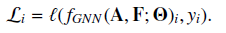

FSGM使用一步梯度上升方法来最大化损失来发现对抗样本。但在图数据中，图结构和节点都是离散的，因此我们只能使用$\mathbf{A,F}$每个元素的梯度信息来测度它们的变化对损失函数值的影响，从而帮助攻击者执行对抗扰动，但由于攻击者的修改只能是从0到1或从1到0，梯度信息的效果可能不大，原因有二：由于图神经网络是非线性的，则单个点的梯度不能反映较大变化的影响（如从0到1或从1到0），因此受积分梯度(Sundararajan et al.,2017)的启发，离散的积分梯度可以用作设计积分梯度得分IG-scores,IG-scores是从0到1或从1到0梯度信息的离散累加和：

其中$\mathbf{H}$可以是$\mathbf{A}$或$\mathbf{F}$,$m$为指示离散步数的超参数。我们记$\mathbf{A}$和$\mathbf{F}$的IG-score分别为$IG_{\mathbf{A}},IG_{\mathbf{F}}$,则攻击者$\mathcal{T}$可以选择最大$IG_{\mathbf{A}},IG_{\mathbf{F}}$的动作进行修改，直至$\mathcal{G}'\notin\Phi(\mathcal{G})$。

### 6.2.3 灰盒攻击

灰盒攻击常用的策略是根据训练数据训练一个代理模型，然后在给定图上攻击代理模型，其基本假设是通过代理模型对图的攻击也能够降低受攻击模型的表现。

#### 1 Nettack

Zugner et al.(2018)提出的Nettack致力于生成节点分类任务的对抗图，单节点$v_i$被选为攻击节点，算法的目标是修改结构和/或该节点的特征或其近邻节点的特征，以改变该节点的预测。记该节点的标签为$y_i$,该标签既可能是真实标签也可能是$f_{GNN}(\boldsymbol{A,F,\Theta})$在原始的干净图$\mathcal{G}$的预测，记生成的攻击图为$\mathcal{G}'=\{\mathbf{A}',\mathbf{F}'\}$，在攻击图上训练的分类器对$v_i$的预测结果为$c$,则攻击问题可描述为如下优化问题：

其中，除式(6.1)的约束外，还要其他两个约束：1，攻击图的度分布与原始图的度分布相近；2，攻击图的特征频数(对离散特征)与原始图相近。直接优化式(6.5)非常困难，因为它涉及两个相依的阶段，图数据的离散结构也会增加它的难度。

为解决这些问题，我们首先在原始图上训练一个代理模型，再通过攻击代理模型生成对抗图。对节点任务，我们使用GCN-Filter的GNN，如下的模型为一个带两个GCN-Filter、没有激活函数的模型：

为执行基于代理模型的对抗攻击，我们致力于找到最大化如下差异的攻击：

$max_{c\ne y_i}ln\mathbf{Z}_{i,c}^{sur}-ln\mathbf{Z}_{i,y_i}^{sur}$

为进一步简化问题，我们移除了样例独立的softmax标准化，从而代理模型的损失为：

对应的优化问题可表示为：

但式(6.7)依然难以直接优化，因此我们使用一种贪婪算法，计算所有可能操作的得分如下：

在每一步，贪婪算法选择具有最大得分的操作（边或特征）执行修改，直至修改超出限制。

#### 2 Metattack

Metattack(Zugner and Gunnemann, 2019) 试图在测试集上修改图以降低节点分类的表现，即被攻击节点为$\mathcal{V}_t=\mathcal{V}_u$,Metattack只允许修改图结构，其使用了与Nettack一样的约束，即修改限制外加度保持限制。Metattack是一种毒害攻击，即生成对抗攻击图后，我们需要在攻击图上重新训练模型。因此攻击问题可表示为一个双层(bi-level)优化问题：

其中$f_{GNN}$为被攻击模型，$\mathcal{L}_{tr}$为在训练集$\mathcal{V}_l$训练模型的损失函数如式(5.49),而$\mathcal{L}_{atk}$为待优化的生成对抗攻击的损失函数。低层优化是在给定$\mathcal{G}'$的条件下优化$\boldsymbol{\Theta}$，而高层的目标是生成攻击图$\mathcal{G}’$,由于我们的目标是降低对无标签节点的预测表现，因此，理想条件下，$\mathcal{L}_{atk}$应当定义在$\mathcal{V}_u$,但如果$\mathcal{V}_u$没有标签，我们不能计算损失。但基于训练误差较高的模型不可能泛化效果好的假设，我们可以定义$\mathcal{L}_{akt}=-\mathcal{L}_{tr}$.另一种方法是首先在原始图上训练一个代理模型，然后使用代理模型预测无标签节点的标签，使用预测的标签计算$\mathcal{L}_{atk}$,记$\mathcal{C}'_u$为预测标签，定义$\mathcal{L}_{self}=\mathcal{L}(f_{GNN}(\mathcal{G}';\boldsymbol{\Theta}^*),C_u')$,则可以定义$\mathcal{L}_{atk}=-\mathcal{L}_{self}$,从而最终的$\mathcal{L}_{atk}$可定义为两种损失的组合：

$\mathcal{L}_{atk}=-\mathcal{L}_{tr}-\beta·\mathcal{L}_{self}$

为解决式(6.8)的双层优化问题，我们使用原梯度概念，原梯度可视为超参数的梯度，在Metatack中，图结构可视为超参数，即：

通常式(6.8)是没有解析解的，因此我们使用普通梯度下降或随机梯度下降求解$\boldsymbol{\Theta^*}$，即：

普通梯度下降的$opt_{\Theta}$可表示为：

则元梯度可以进一步表示为：

注意，$\boldsymbol{\Theta}_t$是依赖于$\mathcal{G}$,因此其针对$\mathcal{G}$的导数可以回溯至$\boldsymbol{\Theta}_0$.

得到原梯度后，我们可以更新图结构如下：

由于梯度是致密的，因此式(6.11)会导致图也是致密的，这种性质不符合预期。而且，由于是灰盒攻击，因此我们也不能计算元梯度。为解决这两个问题，作者使用一种在代理模型上的贪婪算法计算原梯度来指导攻击。

代理模型如式(6.6)，其用以替代$f_{GNN}(\mathcal{G};\boldsymbol{\Theta})$,我们用$\mathbf{A}_{i,j}$的变化对$\mathcal{L}_{atk}$的影响定义一个得分如下：

其中$(-2·\mathbf{A}_{i,j}+1)$用于决定当$\mathbf{A}_{i,j}=1$时元梯度的符号，即仅当存在边时边才可能被移除。完成所有可能动作的元梯度得分后，攻击者采用最大得分对应的梯度进行图的修改。

### 6.2.4 黑盒攻击

多数此类方法都使用强化学习来学习攻击者的策略，将被攻击模型视为一个黑盒查询机，根据查询反馈设计强化学习的奖励。

#### 1 RL-S2V

（Dai et al.,2018）提出的RL-S2V将目标分类器$f_{GNN}(\mathcal{G};\boldsymbol{\Theta})$视为给定的，其参数是固定的。攻击者的任务是修改**图结构**使分类（**图分类和节点分类**）表现降低。

RL-S2V的约束空间为:

其中$\mathcal{E',E}$为原图和攻击图的边集合，$\Delta$为修改约束，而：

$dis^{(\mathcal{G})}(v_i,v_j)$为节点间的最短路径，则RL-S2V可建模为一个有限MDP：

* 动作：增加或删除边；
* 状态：状态$s_t$即$t$时刻的图$\mathcal{G}_t$;
* 奖励：奖励在MDP结束时给出，即仅当目标模型对攻击图的预测与原始图不同，$r(s_t,a_t)=1$,否则$r(s_t,a_t)=-1,中间步骤的奖励为0。
* 终止：当攻击者修改了 $\Delta$条边后，攻击终止。

此处我们使用DQN学习MDP，具体来说，Q-learning是用于拟合如下的Bellman最优公式：

其中$Q^*$为参数化的函数，用于近似未来的期望总奖励，一旦完成$Q^*$的学习，就可以设计贪婪策略如下：

$Q^*$可以用GNN模型参数化，以学习图水平的表示，状态$s_t$即图。

注意到动作$a_t$的选择涉及两个节点，因此搜索空间为$O(N^2)$,过于昂贵，因此作者提出使用如下的分解方法：

$a_t=(a^{(1)},a^{(2)})$

其中$a^{(1)},a^{(2)}$为选择第一个、第二节点的子动作，因此作者继而设计 了一个分层的$Q^*$函数。

#### 2 ReWatt

ReWatt(Ma et al.,2020a)认为对边的增删并非不易察觉的，而重连接才是不易察觉的（**不等于删除一条边，再同时增加一条边吗，多加了一个操作反而更不易察觉？？？**）。

ReWatt的修改约束为$\Delta=p·|\mathcal{E}|$,攻击过程也建模为一个MDP：

* 动作：动作空间为所有可重连操作。
* 状态：中间图$\mathcal{G}_t$
* 状态转移动态：给定动作$a_t=(v_{fir},v_{sec},v_{thi})$，其下一步状态即删除$v_{fir},v_{sec}$间的边，而增加$v_{fir},v_{thi}$的边。
* 奖励：，其中$n_r$为一个负奖励，其自适应地取决于图的大小$n_r=-\frac{1}{p·|\mathcal{E}|}$.
* 终止：当达到修改约束或预测标签改变终止。

原文使用了基于GNN的策略网络建模此MDP。

## 6.3 图对抗防御

图对抗防御大致可分为四类：1，图对抗训练，将对抗样本包含进来进行训练；2，图净化，检测对抗攻击并将其从图中移除以生成干净的图；3，图注意力，识别对抗攻击，并在训练中降低其注意力；4，图结构学习，在联合训练图神经网络中，从攻击图中学习干净图。

### 6.3.1 图对抗训练

图对抗训练分为两个阶段：1,生成对抗攻击；2，根据对抗攻击训练模型。在图域，对抗攻击允许修改图结构和/或节点特征，基于攻击对象，图对抗训练可以分为如下三种：1，只攻击图结构；2，只攻击节点特征；3，攻击图结构和节点特征。

#### 1 图结构上的图对抗训练

（Dai et al.,2018)提出了一个两阶段的对抗训练方法，在训练阶段，随机修改输入图以生成“对抗攻击图”，然后，使用基于PGD拓扑攻击的对抗训练技巧，整个对抗训练过程类似一个min-max优化问题：

最大化问题可以通过PGD算法优化，该算法会生成连续的$\mathbf{s}$,基于此可以生成非二项值的邻接矩阵，最小化问题可根据此邻接矩阵优化。

#### 2 节点特征上的图对抗训练

GraphAT(Feng et al.,2019a)将基于节点特征的对抗样本融入训练过程。生成的对抗样本以正则项的形式融入训练，整个过程也可以表示为一个min-max优化问题：

其中最大化问题生成节点的对抗节点特征，其会破坏相连节点的平滑性。而最小化问题学习参数$\boldsymbol{\Theta}$,其不仅强制要求一个小的训练误差，而且还会要求保持对抗样本和它们邻居节点的平滑性，该目标通过正则项达到。$\mathcal{L}_{train}$如式(5.49)，$\mathbf{F\star r}_i$表示将$\mathbf{r}_i$加入$\mathbf{F}$的第$i$行，即在$v_i$的特征上增加对抗噪音，$f_{GNN}(\mathbf{A,F\star r}_i^g;\boldsymbol{\Theta})_i$表示$f_{GNN}(\mathbf{A,F\star r}_i^g;\boldsymbol{\Theta})$的第$i$行,即$v_i$的预测logit，$d()$为KL散度。最大化和最小化过程交替进行。

#### 3 图结构和节点特征上的图对抗训练

由于$\mathbf{A,F}$的离散特性使得在其上攻击任务比较困难，(Jin and Zhang,n.d.)提出通过修改第一个滤波层$\mathbf{F}^{(1)}$的输出， 然后将其融入训练过程。其也可以表示为一个min-max问题：

其中最大化问题输出$\mathbf{F}^{(1)}$的对抗扰动，最小化问题将这些扰动融合进去来学习模型的参数。$\zeta$为对抗噪音，$D$为噪音的约束域：

其中$\zeta_i$为$\zeta$的第$i$行。

### 6.3.2 图净化

图净化(purification)是用来防御在图结构上的对抗攻击的，多数图净化方法可视为一种预处理策略。

#### 1 移除低特征相似度的边

实证表明，很多对抗攻击会倾向于在节点特征明显不同的节点间增加边，也倾向于在具有相似特征的节点间移除边，基于此(Wu et al.,2019)提出了一种图净化策略来移除特征非常不同的节点间的边，为此需要定义一个得分函数（Jaccard相似度）测度节点特征间的相似度，相似度小于预定义阈值的边会被移除。

#### 2 邻接矩阵的低秩近似

实证表明，Nettack倾向于扰动图结构以增加邻接矩阵的度，导致低值奇异值的数量增加，因此(Entezari et al.,2020)提出使用奇异值分解进行预处理的策略，具体来说，就是只保留SVD中$top-k$奇异值进行邻接矩阵重建。

### 6.3.3 图注意力

图图注意力对抗防御主要是学习将较少的注意力分配到图中的对抗攻击上，通常是端到端的，即将图注意力防御作为GNN的一个组件。

#### 1 RGCN:根据高斯分布建模隐表示

Zhu et al.(2019a)使用多元高斯分布（而非一个向量）来建模隐表示，对抗攻击对节点表示产生异常影响，其假设多元高斯分布可以吸收对抗攻击的影响。然后模型引入一个基于方差的注意力机制来防止对抗攻击的影响在图上传播。受对抗攻击影响的节点通常方差也较大，因为攻击通常倾向于将（可能是从不同社区的）特征差异很大的节点相连。因此在进行领域节点聚合时，需要对方差较大的节点指派更少的注意力。这就是RGCN-Filter的原理。
在式(5.22)中：

与(5.22)式不同的是，我们使用高斯分布建模节点表示，即：

$\mathbf{F}_i\sim \mathcal{N}(\boldsymbol{\mu}_i,diag(\boldsymbol{\sigma}_i))$

在更新节点表示节点，模型使用对均值和方差使用不同的聚合机制。然后使用基于表示方差的注意力机制来防止对抗攻击在图上传播。即较大的方差分配较小的注意力得分，即：

$\mathbf{a}_i=exp(-\gamma\boldsymbol{\sigma}_i)$

其中$\gamma$为超参数。则节点表示的更新过程可表示为：

其中$\alpha$为非线性激活函数，$\odot$为Hadmard积。

#### 2 PA-GNN:从干净图迁移稳健性

RGCN惩罚的是受影响的节点，而PA-GNN(Tang et al.,2019)惩罚的是对抗边，即学习为对抗边分配较低的注意力，从而阻止对抗影响通过图传播，但通常我们没有对抗边的知识，因此我们可以从干净图上迁移这种知识，在干净图上生成对抗攻击后，可以用作监督信号来学习注意力得分。
PA-GNN是建立在式(5.27)的图注意力网络的基础上，即：
$\mathbf{F}'_i=\sum_{v_j\in\mathcal{N}(v_i)\cup\{v_i\}}a_{ij}\mathbf{F}_j\boldsymbol{\Theta}$      (6.16)
其中$a_{ij}$为注意力得分。记对抗攻击边集合为$\mathcal{E}_{ad}$,则干净图的集合$\mathcal{E/E}_{ad}$,为保证对抗边的注意力得分足够低，我们加入如下的正则项：

$a^{(l)}_{ij}$为第$l$个滤波层对边$e_{ij}$分配的注意力，$\eta$为边际超参数。则注意力系数的期望可由如下的经验均值估计：

$\underset{\Theta}{min}\mathcal{L}=\underset{\Theta}{min}(\mathcal{L}_{train}+\lambda\mathcal{L}_{dist})$   （6.17）
其中$\lambda$为超参数。
式(6.17)是在我们已知对抗边集合的基础上得到的，因此不能直接优化，为此我们尝试从已知对抗边的图上迁移这种能力。首先我们搜集相似领域中的干净图，然后使用metattack等已有对抗技术生成对抗攻击图，然后在生成的对抗攻击图上训练模型，再将这种能力迁移到给定的图上。PA-GNN的框架如下图6.1：

对于每个图$\mathcal{G}_i$的节点集合$\mathcal{V}^i$,我们将其分为训练集和测试集$\mathcal{V}_l^i,\mathcal{V}_u^i$,我们记图的损失函数为$\mathcal{L}_i$，基于元优化算法MAML(Finn et al.,2017)，所有图共享初始化参数$\boldsymbol{\Theta}$，而目标为（通过元优化）学习这些参数可以容易地适应每个图的学习。最后我们根据共享参数$\boldsymbol{\Theta}$为初值，基于给定图$\mathcal{G}$进行精调，得到$\boldsymbol{\Theta}_{\mathcal{G}}$。
优化过程首先使用梯度下降法将参数调整（精调）到每个图$\mathcal{G}_i$:

其中$\boldsymbol{\Theta}_i'$为针对图$\mathcal{G}_i$的参数，$\mathcal{L}_i^{tr}$为式(6.17)对应训练集$\mathcal{V}_l^i$的损失。测试集$\{\mathcal{V}^1_u,...,\mathcal{V}_u^K\}$用于更新共享参数$\boldsymbol{\Theta}$使得每个学习后的分类器可以很好地适应每个图，元优化的目标函数可表示为：

其中$\mathcal{L}^{te}_i(\boldsymbol{\Theta}_i')$为式(6.17)对应$\mathcal{V}_u^i$的损失函数，共享参数通过SGD优化：

基于学习的共享参数，我们可以继续在给定图上精调。

### 6.3.4 图结构学习

图净化对抗防御的净化和训练是分开进行的，对于某些下游任务可能是次优的，为此Jin et al.(2020b)提出了一种端到端方法Pro-GNN对净化图结构和学习模型参数联合起来，如前所述，对抗攻击常导致特征不同的节点相连且生成高秩邻接矩阵。因此Pro-GNN的目标是生成净化的低秩邻接矩阵$\mathbf{S}$，其与$\mathbf{A}$非常接近，同时保证特征平滑度，即：

其中$||\mathbf{S}||$保证矩阵是稀疏的，$||\mathbf{S}||_*$为核(nuclear)正则以保证矩阵是低秩的。$tr(\mathbf{F}^T\mathbf{LF})$可保证特征是平滑的。该目标函数的优化是交替进行的：

* **更新$\boldsymbol{\Theta}$**:固定矩阵$\mathbf{S}$，根据下式优化：
  

* **更新$\mathbf{S}$**:固定参数$\boldsymbol{\Theta}$，根据下式优化：

  

# 第七章 可拓展GNN

## 7.1 引言

我们以GCN-Filter模型为例，说明模型的可拓展性问题，通常我们以梯度方法优化如下损失函数：

其中$f()$为损失函数，$f_{GCN}()$为$L$个GCN-Filter层构成：

其中$\hat{\mathbf{A}}=\tilde{\mathbf{D}}^{-\frac{1}{2}}\tilde{\mathbf{A}}\tilde{\mathbf{D}}^{-\frac{1}{2}}$,$\mathbf{F}^{(0)}=\mathbf{F}$,为方便起见，我们假设所有节点的维度都为$d$，并省略激活层的表示，以$\boldsymbol{\Theta}$表示所有滤波层的参数，$\boldsymbol{\Theta}_2$为执行预测的参数，则一步梯度下降算法可表示为：

$\boldsymbol{\Theta}\leftarrow \boldsymbol{\Theta}-\eta·\nabla_{\Theta}\mathcal{L}_{train}$

其中$\nabla_{\Theta}\mathcal{L}_{train}$需要在整个训练集$\mathcal{V}_l$上估计,如式(7.2)所示，在前向传递中估计$\mathcal{L}_{train}$时,$\mathcal{V}$的节点都要被估计，在每层都要重新计算，因此在每个训练时期(epoch)的前向传递中，每个滤波层的节点表示和滤波层的参数都要被存储起来，对于大型图是非常昂贵的，具体来说，$\hat{\mathbf{A}},\mathbf{F}^{(l)},\boldsymbol{\Theta}^{(l)}$需要的复杂度分别为$O(|\mathcal{E}|),O(L·|\mathcal{V}|·d),O(L·d^2)$。此外，式(7.2)的计算也是非常低效率的，因为对无标签集合$\mathcal{V}_u$中的节点的最终表示同样要被计算，但在式（7.1）中却并不需要。在一个完整的训练时期中，共需要$O(L\cdot|\mathcal{E}|\cdot d+|\mathcal{V}|\cdot d^2))=O(L\cdot |\mathcal{V}|\cdot d^2)$个操作。一个简单而直觉的加速方法是使用SGD，但在图数据中每个节点都是与其他节点相连，因此针对每个有标签节点的损失时，需要式(7.2)的结果，而这步操作涉及其他节点甚至是所有其他节点。我们可以将式（7.2）拆解来说明：

其中$\hat{\mathcal{N}}(v_i)=\mathcal{N}(v_i)\cup \{v_i\}$.从自上而下的角度看，即从第$L$层到输入层，为计算$L$层(即输出层)中节点$v_i$的表示，我们只需要$(L-1)$中其邻居节点的表示。而为计算$(L-1)$层中其邻居节点的表示，我们需要$\mathcal{N}(v_i)$所有邻居节点。依次类推，我们需要是输入层中所有$L$跳邻居，从而节点$v_i$的损失为：

其中$\mathcal{N}^L(v_i)$，$\mathbf{A}\{\mathcal{N}^L(v_i)\}$为$\mathcal{N}^L(v_i)$的诱导结构，$\mathbf{F}\{\mathcal{N}^L(v_i)\}$为$\mathcal{N}^L(v_i)$的节点特征。

通常，可以使用mini-batchSGD方法从$\mathcal{V}_l$中采样一批训练样本$\mathcal{B}$来估计梯度，其损失函数可表示为：

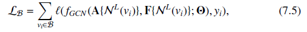

其中$\mathcal{B}\subset \mathcal{V}_l$为采样的mini-batch。但尽管使用了SGD，内存要求可能仍然会很高，因为$\mathcal{N}^L(v_i)$会随着$L$的增加呈指数级上升，具体来说，$\mathcal{N}^L(v_i)$与$deg^L$同阶，$deg$表示图中节点的平均度。此外，在实践中，我们需要为最坏的batch（需要最多内存的batch）准备足够的内存，因此，如果batch中一个节点的度很高，则也会需要很大的内存。因此为执行SGD优化，我们需要$O(deg^L\cdot d)$大小的内存来存储节点表示，这种指数级增长的邻域常称为"邻域扩张"或"邻域爆炸"。当$L$大于图的直径，则$\mathcal{N}^L(v_i)=\mathcal{V}$。

邻域爆炸也会影响SGD的时间效率，如计算$\mathbf{F}_i^{(L)}$的时间复杂度为$O(deg^L\cdot (deg\cdot d+d^2))=O(deg^L\cdot d^2)$,

上式成立，因为通常$deg$远小于$d$。

则整个训练集上运行一个epoch的时间复杂度为$O(|\mathcal{V}_l\cdot deg^L\cdot d^2)$,假设每个batch内只有一个样本。**当$|\mathcal{B}|>1$，一个epoch的时间复杂度会降低，因为在每个batch$\mathcal{B}$中，一些相关节点可能存在于$\mathcal{N}^L{(v_i)}$而它们的表示在计算中可以共享。**与完整梯度算法相比，当$L$很大时，SGD的时间复杂度可能会更高，尽管SGD方法并不额外计算无标签节点的表示。

所有基于邻域聚合的方法都会有邻域爆炸问题，为此，学者提出了很多邻域采样方法，主要分为三类：

* 节点级采样：在式(7.3)每一层节点表示计算中，只采样一个邻域节点子集。
* 层级采样：采样一个节点子集，并对整个层的节点表示计算中，都使用同一个节点子集。
* 子图级采样：从原始图中采样一个子图，并基于子图学习节点表示。

## 7.2 节点级采样方法

式(7.3)的节点级聚合过程可重写为：

可视为如下的期望形式：

其中$\mathscr{F}_{v_i}$为如下的离散随机变量：

一种加速式(7.7)的方法是使用MC抽样估计，即：

其中$n^l(v_i)\subset\tilde{\mathcal{N}}(v_i)$是一个针对$l$层从$\mathcal{V}$抽样的子集，抽样的概率分布为：

式(7.8)的估计是无偏的，推导如下：

根据式(7.8)， 节点级的聚合过程可表示为：

式(7.10)称为节点级抽样，因为$n^l(v_i)$仅为节点$v_i$抽取且不与其他节点共享。GraphSAGE-Filter可以视为节点级抽样方法。针对某个特定的图滤波层，抽样大小可以针对所有节点一致，即$|n^l(v_i)|=m$,但针对不同的层，可以有不同的抽样大小。

需要注意的是，当$m$较大时，模型将仍然存在邻域爆炸问题。节点$v_i$的最终表示$\mathbf{F}_i^{(l)}$与$m^L$同阶，空间与时间复杂度为$O(m^L\cdot d^2), O(|\mathcal{V}_l|\cdot m^L\cdot d^2)$,设置较小的$m$虽然可以缓解这个问题，但会带来较高的方差。

**Chen et al.(2018a)**提出了一种使用非常小的$m$（m=2）但方差在合理范围内的抽样方法，其思想为对每个$\mathbf{F}_i^{(l-1)}$保留其历史表示$\bar{\mathbf{F}}_i^{(l-1)}$,计算式(7.3)时使用历史表示，完成计算后再更新历史表示，如果模型参数在训练中变化不十分剧烈，则历史表示与真实表示相似。我们依然使用MC方法估计式(7.3)，但对于没有被抽样到$n^l(v_i)$的节点，我们将它们的历史表示包含到计算中，式(7.3)可分解为两部分：

其中$\Delta\mathbf{F}_j^{(l-1)}=\mathbf{F}_j^{(l-1)}-\bar{\mathbf{F}}_j^{(l-1)}$,表示当前真实表示与历史表示的差异，模型并不是使用MC方法估计整个式(7.3)，而是只估计其差异：

根据式(7.12)，则式(7.11)的聚合过程可表示为：

该方法称为**控制元(control-variate,CV)估计**，并用来更新节点表示。由于式(7.13)的第二项是从历史存储的节点表示计算的，不需要重复计算，因此计算效率较高。CV估计是无偏的，因为式(7.12)是无偏的，且式(7.13)的方差小于式(7.10)的方差，因为$\Delta\mathbf{F}_j^{(l-1)}$远小于$\mathbf{F}_i^{(l-1)}$。该方法的时间复杂度可保持为$O(m^L\cdot d^2)$,但需要更多的存储空间，为存储所有节点的历史表示，需要的空间为$O(deg^L\cdot d)$，与$m$无关。其过程与SGD一致，而无需节点级抽样。

## 7.3 层级抽样方法

对于节点级抽样，记$N^l$为所有$l$层抽样的节点集合，则可迭代地定义：

当使用mini-batchSGD并计算$\mathcal{B}$中节点的最终最终表示时，$N^L$可表示为$N^L=\cup_{v_i\in\mathcal{B}}n^L(v_i)$。

式(7.14)的迭代过程使得$N^l$呈指数级上升，因此节点级抽样方法仍然存在邻域爆炸问题。一种缓解的方法是，**针对每个特定的层，对该层的所有节点使用相同的节点集合计算节点表示**。因此$N^{(l-1)}$随着$L$的增大而保持不变，然后我们对每一层只需抽样一次，该方法称为layer-wise sampling。但仅仅简单对所有节点保持同样的抽样集合是不现实的，因为按照式(7.9），它们是根据不同的节点分布抽样而来的。

基于此（Chen et al.,2018b;Huang et al.,2018)使用了**重要性抽样**来设计层级抽样。具体来说，针对第$l$层，我们使用另一个定义在整个节点集$\mathcal{V}$上的共享分布，用于抽样共享节点集，然后该层所有节点的输出表示只基于这些共享样本节点计算。

为与Huang et al.(2018)一致，我们首先重写式(7.6-7.9)，式(7.3)的节点聚合过程可重写为：

其中$D(v_i)=\sum_{v_j\in\hat{\mathcal{N}}(v_i)}\hat{\mathbf{A}}_{i,j}$,式(7.15)又可表示为：

其中对于$\mathscr{F}_{v_i}$:

假设$q^l(v_j)$是一个定义在整个节点集$\mathcal{V}$上的已知分布，且$q^l(v_j)>0,\forall v_j\in\mathcal{V}$，然后使用基于$q^l(v_j)$的重要性抽样计算$\mathbb{E}[\mathscr{F}_{v_i}]$:

其中$N^l$为根据分布$q^l(v_j)$抽样的节点集合，如果$v_j\in\hat{\mathcal{N}}(v_i)$,$p(v_j|v_i)=\frac{\hat{\mathbf{A}}_{i,j}}{D(v_i)}$,否则为0。针对不同的层需使用不同的$q^l(v_j)$。根据式(7.17),式(7.16)的聚合过程可表示为：

注意分布$q^l(v_j)$不依赖于中心节点$v_i$，且为所有节点共享。

以下介绍节点采样和构建计算图的过程，如图7.2：

为计算所有$v_i\in\mathcal{B}$的表示$\mathbf{F}^{(L)}_i$,节点集$N^L$由$q^L(v_j)$抽取，所有$v_j\in N^L$的表示$\mathbf{F}_j^{(L-1)}$用于计算$\mathbf{F}^{(L)}_i$，为计算$\mathbf{F}_j^{(L-1)},\forall v_j\in N^L$,我们需要抽样$N^{(L-1)}$并从中聚合信息。该过程迭代至最底层，即抽取$N^1$并使用$\mathbf{F}_j^{(0)},\forall v_j\in N^1$进行计算。令$|N^l|=m$,则计算最终表示$\mathbf{F}^{(L)}_i,\forall v_i\in\mathcal{B}$的内存要求为$O(L\cdot m\cdot d)$。此外，每个epoch的时间效率也会上升，因为需要计算的节点表变少了。

式(7.17)的重要性抽样估计是无偏的，而我们希望找到可以最小化(7.17)式方差的$q(v_j)$,根据(Owen,2013)关于重要性的抽样，我们得分如下命题：

`命题7.1`:$\hat{\mathscr{F}}_{v_i}$的方差为：

对应的最优抽样分布$q(v_j)$为：

但式(7.19)的最优抽样分布并不可行，因为它依赖于$l-1$层所有节点的表示$\mathbf{F}^{(l-1)}$,但我们可以尝试使用抽样分布决定计算哪些节点。注意，Chen et al.(2018b)中，最小化方差是基于同层的所有节点而非命题7.1的单个节点，而最优分布的形式稍有不同但同样依赖于$\mathbf{F}^{(l-1)}$。

因此，Chen et al.(2018b)和（Huang et al.(2018)使用了不同的策略，前者直接无视了对$\mathbf{F}^{(l-1)}$的依赖，采用根据最佳概率分布设计的采样分布作为$q(v_j)$:

注意对于所有层，我们使用了相同的$q(v_j)$如式（7.20）。

而在(Huang et al.,2018)中，我们使用$\mathbf{F}^{(0)}_j\boldsymbol{\Theta}_{in}$替代$\mathbf{F}_j^{(l-1)}\boldsymbol{\Theta}^{(l-1)}$,其中$\mathbf{F}^{(0)}$表示输入特征，而$\boldsymbol{\Theta}_{in}$表示待学习的线性投影。此外，式（7.19）的抽样分布针对特定节点$v_i$是最优的，但对层级抽样则不一定。为使对层级抽样也适用，适用了如下的分布：

其中$N^{l+1}$为第$l+1$层的节点，因此$q^l(v_j)$依赖于其上一层节点。此外，在训练中分布是自适应调整的，因为$\boldsymbol{\Theta}_{in}$需要持续更新。基于式(7.21)的修改可能不会导出最小方差，因此作者将方差作为损失函数的一部分来直接优化。

## 7.4 子图级抽样方法

层级抽样虽然可以减少计算最终表示的节点数并解决邻域爆炸问题，但它可能会带来其他方面的问题，即式(7.18)的聚合过程中，对每个抽样得到的、待聚合的节点，生成$\mathbf{F}_i^{(l)}$依赖于$\hat{\mathbf{A}}_{i,j}$。这说明，生成$\mathbf{F}_i^{(l)}$过程中，并非所有节点都会被使用，而只有与$v_i$相连的节点才会被使用。因此，如果与$v_i$相连的节点及$N^l$抽样的节点过于稀疏，则$\mathbf{F}_i^{(l)}$的学习可能不充分。在最极端的情形，如果$N^l$中没有节点与$v_i$相连，则其在该层的表示为0。因此，为保持学习的稳定性，我们抽样$N^l$时，需要合理数量的节点与$v_i$相连。换句话说，我们需要保证$N^l,N^{(l-1)}$中抽样的节点间的连接是致密的，从而每个节点都有节点可供聚合信息。

为保证后续层抽样节点的连接性，后续层的抽样分布必须设计为相依的形式。一种方法是对所有层都使用相同的抽样节点集，这样只需要一个抽样分布就可以保证抽样节点间的连接性。记抽样节点集为$\mathcal{V}_s$,则式(7.18)的层级聚合可以在诱导图$\mathcal{G}_s=\{\mathcal{V}_s,\mathcal{E}_s\}$上运行完整的邻域聚合，从而可以直接抽样子图$\mathcal{G}_s$而非节点集$\mathcal{V}_s$,并在子图上训练模型(Chiang et al., 2019; Zeng et al., 2019)。

(Chiang et al., 2019）使用了METIS(Karypis and Kumar,1998)、Graclus(Dhillon et al.,2007)等方法进行子图划分（聚类），构成子图集合$\{\mathcal{G}_s\}$这些划分可以使各子图内的连接足够多但子图间的连接很稀疏。为执行SGD，我们每次从$\{\mathcal{G}_s\}$抽样一个子图，并基于如下的损失函数估计梯度：

每个子图一步梯度更新的空间复杂度为,其中$\mathcal{V}_l$为标签节点集合。

而在( Zeng et al., 2019)中，作者设计多种节点抽样器，来抽取节点子集$\mathcal{V}_s$,并根据节点子集生成诱导子图。抽样器主要有两种，基于边的抽样器用于抽取相互影响里较高的节点对，而随机游走抽样器用于提高抽样节点的连通性。

* 基于边的抽样器：给定预算$m$,基于如下分布抽取$m$条边：

  

  其中$d()$表示节点的度。

* RW抽样器：从$\mathcal{V}$中抽取$r$个根节点，从这些节点开始进行随机游走，这些随机游走中的点构成抽样节点集$\mathcal{V}_s$.并在聚合过程中使用如下的标准化技巧来减少偏差：

  

  其中$\alpha_{i,j}$可由抽样子图估计。具体来说，假设我们已抽样了$M$个子图，记$C_i,C_{i,j}$分别是节点和边在$M$个子图中出现的频率，则$\alpha_{i,j}=\frac{C_{i,j}}{C_i}$。一个mini-batch在抽样子图的损失函数可标准化如下：

  

  其中$\lambda_i$估计为$C_i/M$。

# 第八章 复杂图上的GNN

## 8.2 异质图神经网络

异质神经网络常使用元路径将异质网络分割为同质网络，即元路径可视为节点间的边，而服从相同元路径模式的边可视为同类型的边。每个元路径都定义了一个服从该元路径模式的同质图，然后在这些同质图上进行滤波操作生成节点表示，以捕捉不同的局部节点表示，然后将这些局部节点表示组合起来生成最终的全局节点表示。类似地，元路径用来定义基于元路径的邻居，这些元路径邻居在滤波中的处置方式是不同的(Wang et al.,2019i)。具体来说，就是通过不同类型元路径邻居聚合信息，然后通过注意力机制更新节点表示。

`定义8.1`：给定节点$v_i$和元路径模式$\psi$,$v_i$的$\psi$邻居定义为$\mathcal{N}_{\psi}(v_i)$，表示通过所有遵循模式$\psi$的元路径与$v_i$相连的节点构成的集合。

异质图上的滤波分为如下两步：1）对每个元路径模型$\psi\in\Psi$聚合其元路径模式的信息，2）组合所有不同类型邻居节点聚合的信息生成节点表示。具体来说，对于节点$v_i$,图滤波操作更新表示为：

$\mathbf{z}_{\psi,i}^{(l)}$为节点$v_i$的$\psi$邻居的聚合信息，$\boldsymbol{\Theta}_{\psi}^{(l-1)}$为针对$\psi$的参数，$\alpha^{(l-1)}_{\psi,ij}$，$\beta_{\psi}^{(l)}$为注意力得分：

其中$\mathbf{a}_{\psi}$为待学习的参数向量。

其中$\mathbf{q},\boldsymbol{\Theta}_{\beta}^l,\mathbf{b}$为待学习的参数向量。

## 8.3 二部图神经网络

对于二部图内的两类节点$\mathcal{U,V}$,对于节点$u_i\in\mathcal{U}$,有$\mathcal{N}(u_i)\subset\mathcal{V}$,对于$v_j\in\mathcal{V}$,有$v_j\subset\mathcal{U}$,则两类节点的滤波操作可表示为：

## 8.4 多维图神经网络

在多维网络中，网络中的节点为所有维度所共享，每个维度都有自己的结构，因此我们在构造多维图神经网络中需要考虑维度内核维度间的交互。Ma et al.(2019c)设计的图滤波器在滤波过程中，对于每个节点$v_i$，对每个维度都学习一个表示，然后这些表示组合起来构成节点$v_i$的全局表示。对于特定维度的节点更新，我们需要聚合其维度内的邻居和维度间的邻居。节点$v_i$维度$d$内的邻居指通过维度$d$与$v_i$相连的节点，**而维度间邻居指其他维度上节点$v_i$的拷贝。**示例见图8.1：

根据如上设定，多维图神经网络的图滤波器可表示为：

其中式(8.1)为节点$v_i$在维度$d$内邻居节点的表示，式(8.2)表示将上一层节点$v_i$的表示投影到不同维度，其中$D$为维度数。式(8.3)为维度内邻居节点聚合，式(8.4)为维度间信息聚合，$\beta_{g,d}^{(l-1)}$为维度$g$在维度$d$的注意力得分：

其中$\mathbf{W}^{(l-1)}$为待学习的参数矩阵。

## 8.5 符号图神经网络

直接将符号网络分为两个子网络的方法不符合社交平衡理论，破坏了负边的语义信息。因此学者提出了基于平衡理论的平衡和非平衡路径，用于指导信息聚合过程。然后维持一个节点的两种表示，一种捕捉平衡路径的聚合信息，另一种捕捉非平衡路径的聚合信息。

社交平衡理论大体上指：朋友的朋友是朋友，朋友的敌人是敌人，而所谓平衡环是指具有偶数负边的环，而非平衡环即具有奇数负边的环。实证表明，现实世界的大多数环都是平衡环(Tang et al.,2016b)，我们根据平衡环和非平衡环的定义，定义了类似的平衡路径和非平衡路径。如果两个节点$v_i,v_j$间具有平衡路径，则表示二者间存在正的关系，否则为存在负关系。据此，我们可以定义平衡和非平衡多跳邻居。$v_i$可通过长度为$l-1$的平衡路径到达的节点称为$l-1$跳平衡邻居，记为$B^{(l-1)}(v_i)$,类似可定义$l-1$跳非平衡邻居$U^{(l-1)}(v_i)$,图8.2示例为$l-1$的平衡或非平衡路径可转化为长度$l$的平衡路径。

对于$l>2$，平衡邻居和非平衡邻居可迭代第定义为：

其中$\mathcal{N}^+(v_i),\mathcal{N}^-(v_i)$为节点$v_i$的一跳正、负邻居，即$B^1(v_i)=\mathcal{N}^+(v_i),U^1(v_i)=\mathcal{N}^-(v_i)$。

设计滤波器时，平衡邻居可视为潜在的邻居，而非平衡邻居可视为潜在的敌人，因此我们需要维持两种表示以保留从平衡邻居和非平衡邻居聚合的信息，分别记为$\mathbf{F}^{(B,l)}_i,\mathbf{F}^{(U,l)}_i$,则第$l$层的滤波过程可表示为：

其中$\boldsymbol{\Theta}$为待学习的参数。

而最终的节点表示为：

$\mathbf{z}_i=[\mathbf{F}_i^{(B,L)},\mathbf{F}_i^{(U,L)}]$

在(2020b)中，作者还对式（8.6，8.7）使用了注意力机制。

## 8.6 超图神经网络

超图神经网络需要利用超边的高阶关系抽取成对的关系，将超图转化为简单图，然后使用简单图的滤波操作。在(Feng et al.,2019b)中，如果两个节点在至少一条超边中共存，则认为二者是相连的，它们在多个超边中共存，这些超边的影响会组合起来。描述成对节点关系的“邻接矩阵”可表示为：

其中$\mathbf{D}_v,\mathbf{H,W,D}_e$定义为：节点度矩阵、节点和超边关系指示矩阵、超边权重的对角矩阵、超边的度矩阵。则我们可以对该“邻接矩阵”使用简单图的滤波器,以下为GCN-Filter（Feng et al.,2019b）：

其中$\sigma$为非线性激活函数。

在Yadati et al.(2019)中，作者使用了Chang et al.(2018)的将超边转换为成对关系的方法，对于每个边$e$,其包含多个节点，选择两个节点生成简单边：

其中$\mathbf{h}(v_i)$可视为节点$v_i$的属性，在图神经网络中，在第$l$层， 前一层学习到的隐表示可作为度量关系的特征。将这些成对的关系加入图中，就可以构造一个加权图，边的权重由超边决定。记$\mathbf{A}^{(l-1)}$表示这些关系的邻接矩阵，第$l$层的图滤波器可表示为：

其中$\tilde{\mathbf{A}}^{(l-1)}$为$\mathbf{A}^{(l-1)}$的标准化，如GCN-Filter。注意，$\mathbf{A}^{(l-1)}$并不是固定的，而是自适应于前一层的隐表示。

该定义一个主要的缺点是每个超边只有两个节点是相连的，从而造成其他节点的信息损失，也可能导致生成非常稀疏的图。（Chan and Liang,2019)提出了一种改进邻接矩阵的方法，该方法中，选择的节点与其余的节点也是相连的，因此每个超边会导出$O(2|e|-3)$个边，其中$|e|$为超边包含的节点数，然后基于这些边可 建立新的邻接矩阵表示$\mathbf{A}^{(l-1)}$。

## 8.7 动态图神经网络

Pareja et al.(2019)提出了一种图神经网络EvolveGCN,其对于不同时间的快照有动态的权重，对于一个由$T$个离散图构成的动态图，学习$T$个具有相同结构的GNN(数个堆叠的GNN-Filter)，第一个GNN模型是随机初始化并通过训练学习，而第$t$个GNN模型由第$t-1$个GNN参数进化而来。如图8.3所示，使用RNN结构来进行模型参数的更新。

以GRU为例，对第$t$个图快照第$l$个图滤波层可表示为：

其中$\boldsymbol{\Theta}^{(l-1,t)}$，$\mathbf{F}^{(l,t)}$可表示为第$l$个GNN模型第$l$层的参数和输出，$\mathbf{A}^{(t)}$为第$t$个图快照的邻接矩阵。

异质网络：

Zhang, Yizhou, Xiong, Yun, Kong, Xiangnan, Li, Shanshan, Mi, Jinhong, and Zhu,
Yangyong. 2018b. Deep collective classification in heterogeneous information
networks. Pages 399–408 of: Proceedings of the 2018 World Wide Web Conference.

Wang, Xiao, Ji, Houye, Shi, Chuan, Wang, Bai, Ye, Yanfang, Cui, Peng, and Yu,
Philip S. 2019i. Heterogeneous graph attention network. Pages 2022–2032 of:
The World Wide Web Conference.

Chen, Xia, Yu, Guoxian, Wang, Jun, Domeniconi, Carlotta, Li, Zhao, and Zhang, Xiangliang.
2019b. ActiveHNE: Active Heterogeneous Network Embedding. arXiv
preprint arXiv:1905.05659.

Zhang, Chuxu, Song, Dongjin, Huang, Chao, Swami, Ananthram, and Chawla,
Nitesh V. 2019a. Heterogeneous graph neural network. Pages 793–803 of: Proceedings
of the 25th ACM SIGKDD International Conference on Knowledge Discovery
& Data Mining.

多维图网络：

Ma, Yao, Wang, Suhang, Aggarwal, Chara C, Yin, Dawei, and Tang, Jiliang. 2019c.
Multi-dimensional Graph Convolutional Networks. Pages 657–665 of: Proceedings
of the 2019 SIAM International Conference on Data Mining. SIAM.

符号图网络：

Derr, Tyler, Ma, Yao, and Tang, Jiliang. 2018. Signed graph convolutional networks.
Pages 929–934 of: 2018 IEEE International Conference on Data Mining (ICDM).
IEEE.

Li, Yu, Tian, Yuan, Zhang, Jiawei, and Chang, Yi. 2020b. Learning Signed Network
Embedding via Graph Attention. In: Proceedings of the Thirty-Fourth AAAI Conference
on Artificial Intelligence

超图网络：

Feng, Yifan, You, Haoxuan, Zhang, Zizhao, Ji, Rongrong, and Gao, Yue. 2019b. Hypergraph
neural networks. Pages 3558–3565 of: Proceedings of the AAAI Conference
on Artificial Intelligence, vol. 33.

Yadati, Naganand, Nimishakavi, Madhav, Yadav, Prateek, Nitin, Vikram, Louis, Anand,
and Talukdar, Partha. 2019. HyperGCN: A New Method For Training Graph Convolutional
Networks on Hypergraphs. Pages 1509–1520 of: Advances in Neural
Information Processing Systems.

动态图网络：

Pareja, Aldo, Domeniconi, Giacomo, Chen, Jie, Ma, Tengfei, Suzumura, Toyotaro,
Kanezashi, Hiroki, Kaler, Tim, and Leisersen, Charles E. 2019. Evolvegcn:
Evolving graph convolutional networks for dynamic graphs. arXiv preprint
arXiv:1902.10191.

Sankar, Aravind, Wu, Yanhong, Gou, Liang, Zhang, Wei, and Yang, Hao. 2018. Dynamic
graph representation learning via self-attention networks. arXiv preprint
arXiv:1812.09430.

Jiang, Jianwen, Wei, Yuxuan, Feng, Yifan, Cao, Jingxuan, and Gao, Yue. 2019. Dynamic
Hypergraph Neural Networks. Pages 2635–2641 of: IJCAI.

Ma, Yao, Guo, Ziyi, Ren, Zhaocun, Tang, Jiliang, and Yin, Dawei. 2020b. Streaming
graph neural networks. Pages 719–728 of: Proceedings of the 43rd International
ACM SIGIR Conference on Research and Development in Information Retrieval

# 第九章 其他图深度模型

前序章节介绍的GNN都是适用于节点分类、图分类任务，常常需要标签数据。本章主要介绍应用于图数据的其他深度学习框架，如用于无监督节点特征学习的自编码模型，基于变分自编码/生成式对抗网络的、用于节点表示学习和图生成的深度生成模型。

## 9.2 图上的自编码模型

目前大致有两类自编码模型，一种是(Wang et al.,2016)仅基于邻居信息并使用前馈网络作为编码器和解码器的模式，另一种是(Kipf and Welling,2016b;Pan et al.,2018)使用图结构和节点特征并基于GNN作为解码器和编码器的模式。

在Wang et  al.(2016)中，对于节点$v_i$，我们记$\mathbf{a}_i=\mathbf{A}[i,:]$为邻接矩阵的行向量，以其作为编码器的输入：

$\mathbf{z}_i=f_{enc}(\mathbf{a}_i;\boldsymbol{\Theta})$

其中$f_{enc}$为编码器，一个前馈神经网络。学习得到的节点表示作为解码器的输入，即：

$\tilde{\mathbf{a}}_i=f_{dec}(\mathbf{z}_i;\boldsymbol{\Theta}_{dec})$

则重建损失可表示为：

$\mathcal{L}_{enc}=\sum_{v_i\in\mathcal{V}}||\mathbf{a}_i-\tilde{\mathbf{a}}_i||^2_2$

该方法并不显式地捕捉节点邻域之间的成对相似性（即输入间的相似性）。但由于自编码器的参数对所有节点是共享的，所以编码器应当会将相似输入映射为相似表示，从而隐式地保持相似性。

但上式的损失函数对于稀疏的图可能会对重建$0$元素时存在过拟合，因此需要对非零元素的重建损失增加额外惩罚：

$\mathcal{L}_{enc}=\sum_{v_i\in\mathcal{V}}||(\mathbf{a}_i-\tilde{\mathbf{a}}_i)\odot \mathbf{b}_i||^2_2$

其中$\odot$为Hadmand积，如果$A[i,j]=0$,则$b_{i,j}=1$，如果$A[i,j]\neq 0$,则$b_{i,j}=\beta>1$,$\beta$为超参数。此外为进一步限制相连节点具有相似的表示，需要对连接性增加额外的正则项，即：

$\mathcal{L}_{enc}=\sum_{v_i\in\mathcal{V}}\mathbf{A}_{i,j}\cdot||\mathbf{a}_i-\tilde{\mathbf{a}}_i||^2_2$

此外还需要对参数规模进行惩罚：

$\mathcal{L}_{reg}=||\boldsymbol{\Theta}_{enc}||^2_2+||\boldsymbol{\Theta}||^2_2$

则最终的损失函数可表示为：

$\mathcal{L}=\mathcal{L}_{enc}+\lambda\cdot \mathcal{L}_{con}+\eta\cdot\mathcal{L}_{reg}$

以上的模型只利用了结构信息，而(Kipf and Welling,2016b)则增加了节点特征，使用GNN为编码器：

$\mathbf{Z}=f_{GNN}(\mathbf{A,X};\boldsymbol{\Theta}_{GNN})$

虽然编码器使用了结构信息和节点特征，但解码器只使用结构信息作为重建目标：

$\hat{\mathbf{A}}=\sigma(\mathbf{ZZ}^T)$

其中$\sigma$为sigmoid激活函数。

则重建损失可表示为：

## 9.3 图上的循环神经网络

Tai et al.(2015)提出的Tree-LSTM是针对树结构的数据，而Graph-LSTM(Liang et al.,2016)则将其拓展到一般图上。

如图9.1，序列数据可视为一种特殊的树状结构，即每个节点只有一个一个子节点即其前序节点，信息流从第一个节点流向最后一个节点：

但在树结构数据中，如图9.2，每个节点可能有任意个子节点：

因此在合成节点的隐状态中，我们需要使用其输入和子节点的隐状态。记$\mathbf{x}^{(k)},\mathbf{h}^{(k)},\mathbf{C}^{(k)},\mathcal{N}_c(v_k)$分别为节点$v_k$的输入、隐状态、单元记忆、子节点集合。给定树结构，Tree-LSTM模型构造隐状态表示的过程可表示为：

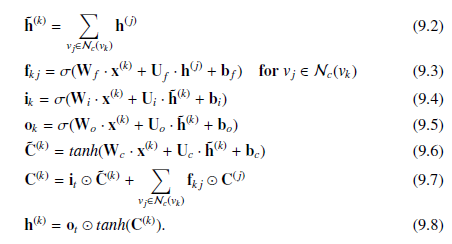

式(9.2)为子节点隐状态信息聚合，式(9.3)为生成控制信息流的遗忘门，式（9.4-9.6）为输入门、输出们和单元记忆的生成。式(9.7)为信息单元的更新，式(9.8)为节点的隐状态更新。

与树不同，基因图常常是具有环结构的，因此节点是无序的，Liang et al.(2016)提出使用DFS和BFS来定义节点顺序，当然也可以根据领域知识定义节点顺序，获得节点顺序后，我们根据式(9.2-9.8)的更新过程更新节点隐状态，其与Tree-LSTM主要的差别在于，在Graph-LSTM中，式(9.2)更新的是$v_k$的所有邻居节点，且部分邻居节点可能不会更新，在这种情况下，预更新的隐状态将用于聚合过程。

## 9.4 图上的变分自编码

VAE是一种生成模型，用于对给定数据的概率分布建模，它同时也是一种隐变量模型，可从隐变量模型生成样本。给定从标准正态分布$p(\mathbf{z})$抽样的隐变量$\mathbf{z}$，我们希望学习一个隐模型，以如下概率生成与给定数据相似的样本：

$p(\boldsymbol{x|z;\Theta})=\mathcal{N}(\boldsymbol{x}|f(\boldsymbol{z;\Theta}),\sigma^2\cdot \mathbf{I})$  （9.9）

其中$\boldsymbol{\Theta}$为待学习的参数，$\boldsymbol{x}$为生成的同领域的样本。$f(\boldsymbol{z;\Theta})$是判定函数，将隐变量$\boldsymbol{z}$映射到式(9.9)的生成模型的均值。注意生成样本的概率分布并不必须是高斯分布。

为保证式(9.9)的生成模型能够代表数据$\mathcal{X}$,我们需要极大化如下对数似然函数：

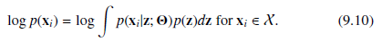

但式(9.10)是非常难以直接优化的，且真实后验分布$p(\boldsymbol{x|z;\Theta})$也是难以直接优化的（需要EM算法）。为解决这个问题，我们使用推断模型$q(\boldsymbol{z|x;\Theta})$来近似真实后验分布$p(\boldsymbol{x|z;\Theta})$。通常我们使用高斯分布来建模$q(\boldsymbol{z|x;\Theta})$，其均值和方差由一个参数为$\boldsymbol{\Theta}$的判定函数来学习，则式(9.10)可重写为：

其中$\mathcal{L}(\boldsymbol{\Theta,\Phi;x}_i)$为$\boldsymbol{x}_i$对数似然函数的变分下界，且KL散度和真实后验分布是非负的。变分下界可表示为：

在此设定下，我们不再需要极大化式(9.10对数似然函数，而将目标转换为对式(9.11)关于$\boldsymbol{\Theta,\Phi}$微分并最大化。注意到最小化负变分下界$-\mathcal{L}(·)$类似于典型的自编码过程，因此我们称整个模型为变分自编码。其中式(9.11)中，推断模型$q(\boldsymbol{z|x_i;\Theta})$可视为编码器，生成模型可视为解码器，不同的是，此处的编码器$q(\boldsymbol{z|x_i;\Theta})$不是将输入映射为节点表示，而是将其映射到隐高斯分布。式(9.11)的第一项可视为最小化输入$\boldsymbol{x}_i$与$p(\boldsymbol{x_i|z;\Theta})$的解码均值$f(\boldsymbol{z;\Theta})$的距离，而后一项为正则项，限制推断模型与真实后验分布近似。

### 9.4.1 用于节点表示学习的变分自编码器

在(Kipf,2016b)中，推断模型用于将每个节点编码到一个多元高斯分布，所有节点的联合后验分布可表示为：

其中$\boldsymbol{\mu}_i,\boldsymbol{\sigma}_i$为均值和方差，由两个判定式图神经网络（原文为GCN）学习：

其中$\boldsymbol{\mu}$为一个矩阵，$\boldsymbol{\mu}_i$为其行向量；$\boldsymbol{\sigma}$为一个向量。$\boldsymbol{\Phi}_{\mu},\boldsymbol{\Phi}_{\sigma}$即式(9.12)的$\boldsymbol{\Phi}$.

生成式模型用于生成图的邻接矩阵，以隐变量$\mathbf{Z}$的内积构成：

其中$\sigma(·)$为sigmoid激活函数。注意生成模型中没有参数。

推断模型的变分参数通过优化如下的变分下界得到：

其中为施加于隐变量$\mathbf{Z}$的高斯先验。

### 9.4.2 用于图生成的变分自编码器

在（Simonovsky and Komodakis,2018）的图生成任务的变分自编码器中，推断模型用于将图映射入隐分布，而解码器可以由一个生成模型表示。两个模型的参数，可以通过优化如下的变分下界得到：

其中$p(\mathbf{z})$为$\mathbf{z}$的高斯先验。

#### 1 编码器：推断模型

图生成任务的目标是根据少数节点生成一个小图，在分子图中，节点和边属性代表了节点和边的类型，由一个one-hot向量表示，其中图$\mathcal{G}=\{\mathbf{A,F,E}\}$,其中$F\in\{0,1\}^{N\times t_n}$为节点的属性（即类型），$\mathbf{E}\in\{0,1\}^{N\times N\times t_e}$为边属性（也是类型）,其中$t_n,t_e$分别为节点和边的类型数。

则编码器可表示为：

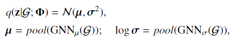

其中均值和方差为待学习的参数，原文中GNN的选择为ECC-Filter，池化函数为门全局池化。

#### 2 解码器：生成模型

解码器的目标是根据隐变量$\mathbf{z}$生成图$\mathcal{\tilde{G}}=\{\mathbf{\tilde{A},\tilde{F},\tilde{E} }\}$,图的大小限制为$k$，生成的是一个概率全连接图，其中节点和边的存在性建模为Bernoulli分布，节点和边的类型建模为多元正态变量。原文中采用了前馈网络来生成图的三个矩阵，并使用sigmoid函数来生成最终的$\mathbf{\tilde{A}}$,使用softmax来生成$\mathbf{\tilde{F},\tilde{E}}$,注意得到的概率图可视为一个生成模型：

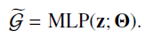

#### 3 重建损失

为优化式(9.13),我们需要优化，其代表输入图$\mathcal{G}$与重建概率图$\tilde{\mathcal{G}}$的相似度。由于图的节点没有特定的顺序，因此直接比较两个图是非常困难的。基于此，作者使用了(Cho et al.,2014b)最大池化匹配算法找到输入图与输出图的对应矩阵$\mathbf{P}\in\{0,1\}^{k\times N}$,该算法根据两个图中节点的相似性，若$\mathcal{\tilde{G}}$第$i$个节点与图$\mathcal{G}$第$j$个节点能够对齐，则$\mathbf{P}_{i,j}=1$，否则为0。根据对齐矩阵$\mathbf{P}$,图的三个矩阵可以进行对比：$\mathbf{A'=PAP}^T,\tilde{\mathbf{F}'}=\mathbf{P}^T\mathbf{\tilde{F}},\tilde{\mathbf{E'}}_{:,:,l}=\mathbf{P}^T\tilde{\mathbf{E}}_{:,:,l}\mathbf{P}$,可以通过从$q(\mathbf{z}|\mathcal{G})$抽样一个单隐变量$\mathbf{z}$来估计：

其中

其中$\lambda_A,\lambda_E,\lambda_F$为超参数。且：

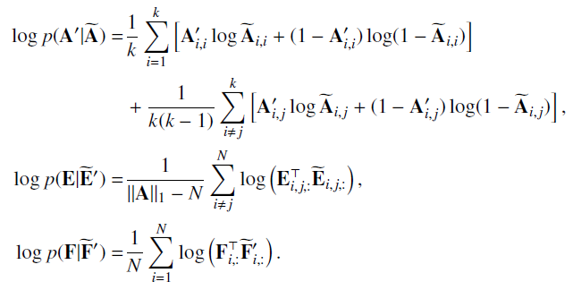

## 9.5 图上的生成式对抗网络

GAN是一种通过对抗过程学习复杂数据分布的框架，其中生成模型$G(\boldsymbol{z,\Theta})$将噪音变量映射入数据空间，判别模型$D(\boldsymbol{x;\Phi})$用于判别一个给定的数据是由生成模型生成的还是从原始数据抽取的。整个过程可建模为一个mini-max博弈：

### 9.5.1 用于节点表示学习的GAN

在Wang et al.(2018a)中，对于给定节点$v_i$,生成模型用于用于近似其邻居节点的分布。我们记给定节点邻居节点的分布为$p(v_j|v_i)$。其真实邻居节点集合$\mathcal{N}(v_i)$可以视为从$p(v_j|v_i)$抽取的观测样本，我们记生成模型为$G(v_j|v_i;\boldsymbol{\Theta})$,其目标是生成（准备地说是选择）最可能与节点$v_i$相邻的节点，其可视为$v_j$并非$v_i$邻居的概率。判别器$D(v_j,v_i;\boldsymbol{\Phi})$则用于判别给定的节点对$(v_j,v_i)$在图中是否相连，可视为$(v_j,v_i)$存在边的概率。我们记潜在的真实概率分布为$p_{true}(v_j|v_i)$,两个模型可建模为如下的min-max博弈：

#### 1 生成器

建模生成器最直接的方法就是softmax函数：

其中$\boldsymbol{\theta}_i\in\mathbb{R}^d$为针对生成器$v_i$的一个$d$维表示，$\boldsymbol{\Theta}$为所有节点的矩阵表示，同时也是生成器的参数。完成参数学习后，则生成器$G$可根据分布$G(v_j|v_i;\boldsymbol{\Theta})$进行采样，需要再次强调的是，整个过程并不是生成假的节点，而是选择节点。

此外，式(9.15)的计算复杂度很高，因此我们需要使用一些加速近似，如分层softmax。

#### 2 判别器

判别器可建模为一个二项分类器，原文选择的是sigmoid函数：

其中$\boldsymbol{\phi}_i$为针对判别器的节点$v_i$的低维表示。

### 9.5.2 用于图生成的GAN

De Cao and Kipf(2018)研究了使用GAN进行图生成的问题，与9.4.2节类似，图生成的目标有两个：1）节点类型矩阵$\mathbf{F}\in\{0,1\}^{N\times t_e}$,2)边类型矩阵$\mathbf{E}\in\{0,1\}^{N\times N\times t_e}$。生成器的目标不再局限于生成与给定图相似的图，而且还要满足特定的性质。因此，除了生成器和判别器，还需要一个评价网络，以测度生成的图满足特定性质的程度（指定一个奖励）。而评价网络是由外部真实图预先训练好的模型，只用于监督生成图的性质，在训练中固定且是一个黑盒。生成器和判别器构成如下的min-max问题：

其中$p_{data}(\mathcal{G})$为给定图的真实分布，$J()$为评价网络。

#### 1 生成器

生成器类似于9.4.2节，其目标是将隐变量$\mathbf{z}$映射为两个连续致密的目标,分别用于生成$\mathbf{\tilde{E},\tilde{F}}$。（**不需要$\mathbf{\tilde{A}}$吗？？？**）

#### 2 判别器和评价网络

判别器和评价网络都以图$\mathcal{G}=\{\mathbf{E,F}\}$的表示为输入，并输出一个标量。而图的表示可写为：

$\mathbf{h}_{\mathcal{G}}=pool(GNN(\mathbf{E,F}))$

其中$pool()$为门全局池化。如上的输出表示，作为MLP的输入，以输出输入图为真实图的概率和满足给定性质的奖励。

# 第十章 GNN in NLP

NLP中存在着多种图结构，如组合分析树(constituency-based parse tree)代表了句子的短语结构，句法依存树(syntactic dependency tree)编码了句法关系，摘要信息表示(abstract meaning representation,AMR)表示句子的语义，并可作为有根和有标签图，易于遍历。

除了以上的图，GNN还应用NLP任务中的：语义角色标注(semantic role labeling,SRL),(多跳)问答(QA),关系抽取，神经机器翻译，图到序列学习，还有适用于NLP的知识图谱等。

## 10.2 语义角色标注

SRL的目标是发现句子的隐含谓词主目结构(predicate argument structure)，即发现"who did what to whom at where"。SRL分为两步：1）找到谓语；2）识别其他语义角色并标注。该任务都是在encoder-decoder框架下来建模

在（Marcheggiani and Titov,2017)中，谓语是给定的，模型的目标是识别其他的语义角色。 模型使用的encoder为Bi-LSTM,我们记$[w_0,...,w_n]$,每个词$w_i$都与一个输入表示$\mathbf{x}_i$相关联，输入表示由四部分拼接组成：1)随机初始化的嵌入；2）预训练的词嵌入；3）其对应词性标签的随机初始化嵌入;4)随机初始化的词元(lemma)嵌入，仅当该词为谓词时才激活。训练中，预训练词嵌入是固定的，其他三个可更新。然后序列表示$[\mathbf{x}_1,...,\mathbf{x}_n]$作为Bi-LSTM的输入，记$LSTM^f,LSTM^b$分别为前向和后向LSTM，分别捕捉每个词左边、右边的上下文：

前向和后向LSTM的输出拼接起来作为整个Bi-LSTM的输出：

其中$\mathbf{x}^{bi}_i$为$\mathbf{x}_i^f,\mathbf{x}_{n-i}^b$的拼接。有了Bi-LSTM的输出之后，则SRL可视为在候选角色集+NULL上的回归任务。

在这个算法中，我们可以将句法结构信息视为一个句法依存树，并使用GNN来处理，其中GNN的聚合过程泛化到融合有向标注边上来处理句法依存树。为应用句子的句法信息，Bi-LSTM的输出可作为GNN的输入，然后GNN的输出再作为分类器的输入进行多分类。

一个句子的句法依存树是一个有向标注树，其中词即节点，而依存关系则为边的标签，如“主语”SUB,“直接宾语”DOBJ,句法依存树示例如图10.2：

原文使用的广义图滤波算子可表示为：

其中$\mathcal{N}(v_i)$由出邻居和入邻居构成，$dir(i,j)\in\{in-going,out-going\}$表示中心节点$v_i$的边$(v_i,v_j)$的方向。$\boldsymbol{\Theta}^{(l-1)}_{dir(i,j)}$对于所有方向与$dir(i,j)$相同的边是共享，$\mathbf{b}_{lab(i,j)}$为融合边标签的偏置项。

## 10.3 神经机器翻译

神经机器翻译NMT也使用的是encoder-decoder框架，其解码器与10.2相同，解码器为传统的基于注意力的RNN。即，使用Bi-LSTM编码句子，然后编码的表示作为GNN的输入，其中句子也建模为一个句法依存树。

## 10.4 关系抽取

关系抽取任务关注的是一个句子中的两个实体（即主语和宾语）是否存在给定的关系。对于给定的句子$\mathcal{W}=[w_1,...,w_n]$,实体可表示为由有序词组成的范围(span)，主语实体可表示为$\mathcal{W}_s=[w_{s1}:w_{s2}]$，宾语可表示为$\mathcal{W}_{o}=[w_{o1}:w_{o2}]$,（**？？？**），主语和实体都是给定的，而关系属于一个预定义的关系集合$\mathcal{R}$，其中也包含了“no relation"。从而关系抽取可视为一个多分类问题。分类器为一个前馈网络：

其中$\mathbf{F}_{sent},\mathbf{F}_s,\mathbf{F}_o$分别为句子、主语、宾语的嵌入表示，使用了类似10.2的编码器学习词表示，然后基于词表示学习句子、主语和宾语的表示。二者主要的差别在于在式(10.1)的表示更新，此处加入了自循环(self-loop)，即$\mathcal{N}(v_i)$还包含了$v_i$自身。则基于GNN，句子、主语和宾语的表示可写作：

其中$\mathbf{F}^{(L)},\mathbf{F}^{(L)}[s1:s2],\mathbf{F}^{(L)}[o1:o2]$为词表示的序列，max操作对每个维度取最大值，因此其长度与词向量一致。

## 10.5 问答

问答QA亦称阅读理解RC，其目标为通过理解文档生成给定问题的正确答案。

### 10.5.1 多跳问答

本节以WIKIHOP数据集为例说明多跳问答，WIKIHOP数据是一个问答样本集合，每个样本可表示为$(q,S_q,C_q,a^\star)$,其中$q$表示问题，$S_q$为支持文档，$C_q$为为候选答案集合(全部是支持文档的实体)，$a^\star$为正确答案。与自然语义不同的是，$q$表示为元组$(s,r,?)$，其中$s$为主语，$r$为关系，$?$为待推断的宾语。WIKIHOP数据示例如图10.3：

### 10.5.2 Entity-GCN

为捕捉实体在文档内和文档间的关系，并帮助跨文档推理，每个WIKIHOP样本都可以视为一个图，方式是在支持文档间和支持文档内将候选答案的论述(mention)连接在一起，然后使用Entity-GCN进行节点表示学习，其中GCN使用了多层滤波器，每个mention能聚合足够广泛的邻域信息。

#### 1 实体图

为构造实体图，$C_q\cup\{s\}$中的实体mention需从支持文档$S_t$中识别出来，每个mention都是图的一个节点。这些mention包括：1）$S_q$的实体,其与$C_q\cup\{s\}$完全匹配；2）与$C_q\cup\{s\}$中的元素处在同一个共指(co-reference)链的实体，为此我们还需要一个端到端的共指消解技术来发现共指链。我们还需要构造各种类型的边来连接这些mention:1)"Match",如果两个mention相同，则二者通过"Match"边相连；2）”DOC-BASED",在同一个文档中出现；3）：“COREF”，在同一个共指链中。此外，为防止图中出现不相连成分，我们还需增加第四条“COMPLETE”边。

#### 2 基于Entity-GCN在实体图上的多步推理

**Entity-GCN的滤波器可视为MPNN的一个实例**，即：

其中$\mathcal{R}=\{MATCH,DOC-BASED,COREF,COMPLETE\}$,$\mathcal{N}_r(v_i)$为通过边类型$r$与节点$v_i$相连的节点集合，参数$\boldsymbol{\Theta}_r^{(l-1)}$对关系$r$是共享的，$\boldsymbol{\Theta}_s^{(l-1)},\boldsymbol{\Theta}_a^{(l-1)}$对所有节点是共享的。每个节点的初始化表示为：

$\mathbf{F}^{(0)}_i=f_x(\mathbf{q,x}_i)$

其中$\mathbf{q}$为预训练模型对问题的表示，$\mathbf{x}_i$为预训练模型对节点$v_i$的表示，$f_x$为前馈网络。

则根据Entity-GCN的输出表示，每个候选答案的选择概率可表示为：

其中$f_o$为参数化变形，$\mathcal{M}_c$为为对应候选答案$c$的mention集合，即可根据最大预测概率选择答案。在原文中，作者并不是选择具有最大概率的mention,而是使用所有候选答案的mention来建模P(c|q,C_q,S_q)$：

其中：

## 10.6 图到序列学习graph2seq

graph2seq可以用于NMT、AMR-to-text等任务，其通常使用GNN为编码器，使用各种RNN变体为解码器(Xu et al.,2018b)。

#### 1 基于GNN的编码器

很多NLP应用中的图都是有向图，因此graph2seq中的编码器需设计为能在信息聚合中入邻居和出邻居，即将邻居节点集合划分为$\mathcal{N}_{in}(v_i),\mathcal{N}_{out}(v_i)$,原文使用的编码器为GraphSAGE，为每个节点学习两个节点表示：

两种表示的最后一层输出进行拼接作者最终的节点表示：

整个图的表示则可写为：

此处可选择flat方式池化，如average,max。

## 10.7 KG上的GNN

知识图谱上的任务包括：知识图谱补全、**节点重要性估计(Park et al.,2019)**,实体链接(entity linking),跨语言知识图谱对齐等。知识图谱与简单图的区别在于关系信息，而对关系边的处理，目前有两种策略：1）将图的关系信息融入图滤波器设计；2）通过捕捉关系信息，将关系型知识图谱转换为简单无向图。以下以知识图谱补全为例进行说明。

### 10.7.1 KG上的图滤波器

(Schlichtkrull et al., 2018)使用了式(5.22)的GGNN-Filter：

其中，$\boldsymbol{\Theta}_r$对于关系$r$共享。可以看出(10.6)与Entity-GCN非常相似，但式(10.6)并非对不同关系学习不同的转换参数，而是对每个关系学习一个重要性得分，即：

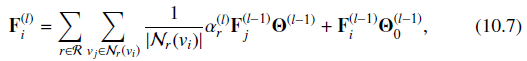

其中$\alpha_r^{l}$为待学习的重要性得分。

为减少式(10.6)的参数我们还要学习关系的嵌入，在第$l-1$层，所有节点的关系嵌入表示为$\mathbf{Z}^{(l-1)}$,而针对关系$r$的嵌入表示为$\mathbf{Z}^{(l-1)}_r$,则：

记$(v_j,r)$为为邻居节点集合$\mathcal{N}(v_i)$通过关系$r$相连的节点，在(Vashishth et al., 2019)中，边的逆边也视为图的一个边，记对应关系为$\hat{r}$,并记关系的方向为$dir(r)$，原始关系为1，逆关系为-1，则滤波操作可表示为：

其中$phi(,)$表示非参操作如减或乘。

### 10.7.2 将KG转换为简单图

在(Wang et al., 2018c)中，作者不是设计特殊的图滤波操作，而是建立简单图来捕捉有向关系信息。作者设计了两种得分来测度一个实体对另一个实体通过关系$r$的影响：

其中#Edges_with_r为关系$r$下对应的所有边数，#Source_with_r表示关系$r$中唯一源实体的数量，#Targe_with_r为关系$r$中唯一目标实体的数量，则实体$v_i$对实体$v_j$的影响可定义为：

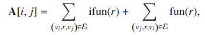

即以两个实体的影响作为邻接矩阵的元素。

### 10.7.3 KG补全

KG补全即预测两个不相连的实体间的关系，即预测$f(s,r,t)$是真实关系的概率得分，一种代表性的方案为DistMult分解,其可表示为：

$f(s,r,t)=\mathbf{F}_s{(L)}^T\mathbf{R}_r\mathbf{F}_t^{(L)}$

其中$\mathbf{F}_s{(L)},\mathbf{F}_t^{(L)}$为源实体和目标实体的表示，$\mathbf{R}_r$为为对应关系$r$的对角阵，模型可通过交叉熵损失根据负采样技术训练，即针对每个观测边样本$e\in\mathcal{E}$,抽样$k$个样本，并随机交换头尾实体的位置，则目标函数可表示为：

其中$\mathcal{T}$为训练样本集，对于正样本$y=1$，对于负样本$y=0$。

# 第十二章 GNN in Data Mining

## 12.2 网络数据挖掘

### 12.2.1 社交网络分析

社交网络分析包括：社交影响预测、政治观点检测、社交表示学习等。

#### 1 社交影响预测

社交影响预测可以用于优化广告策略和个性化推荐，其目标为：给定某用户邻居节点的行为，预测该用户是否会采取相同的行为。

给定网络$\mathcal{G=\{V,E\}}$,对于节点$v_i\in\mathcal{V}$,定义$\mathcal{G}_{v_i}^r$为$r$跳邻居构造的自网中心网络，即：

每个节点$v_i$的邻居节点都与一个二项行为状态相关$s_j\in\{0,1\}$,其集合定义为$\mathcal{S}^r_{v_i}=\Big\{s_j|v_j\in\mathcal{V}_{v_i}^r/\{v_i\} \Big\}$,则社交影响预测的目标就是在给定$\mathcal{G}^t_{v_i},\mathcal{S}^r_{v_i}$的条件下，预测节点$v_i$的行为状态。为此，我们对自中心网络使用GNN来学习中心节点$v_i$的表示，然后根据学习的表示进行分类。原文中使用的GNN为GCN-Filter,GAT-Filter。其初始输入为：

其中$\mathbf{x}_j$为使用LINE,DeepWalk等在$\mathcal{G}$学习的预训练嵌入,对于$\mathcal{V}^r_{v_i}$重点节点，我们使用样例标准化技术来标准化嵌入表示，$\mathbf{e}_j$表示其他节点特征如结构特征、内容特征、人口统计学特征等。对于节点$v_j$，$s_j$初始化为0，因为其行为状态是未知的。$ind_j\in\{0,1\}$指示该节点是否为自我中心用户，1为是，0为否。

#### 2 社交表示学习

社交网络中有很多用户，每个用户对特定行为有各自的偏好，为捕捉用户对不同行为偏好的相似性，我们使用多个向量来表示每个用户，其中每个向量都对应一个特定行为。对每个用户，这些不同行为的表示依赖于对该用户的总体表示。

给定网络$\mathcal{G=\{V,E\}}$,我们定义类别$c$(如书籍)所有条目的集合为$\mathcal{I}_ c$,用户与条目的交互定义为$\mathbf{R}^c$,元素为1代表有交互，否则为0。**条件表示学习就是对每个用户$v_j$学习一个表示集合，其中每个针对类别$c$的条件表示能够捕捉$\mathbf{A}$中的社交结构信息和$\mathbf{R}^c$中对$c$的偏好。**

表示学习的框架为5.3.2节的MPNN，为捕捉用户$v_j,v_i$对不同类别的相似度，节点的表示需映射到不同类别中去：

$\mathbf{F}^{(l-1)}_{j|c}=\mathbf{F}^{(l-1)}_{j}\odot\mathbf{b}_c^{(l-1)}$

其中$\mathbf{b}_c^{(l-1)}$为一个可学习的二项掩码，为所有节点共享，并将输入表示$\mathbf{F}^{(l-1)}_j$映射为针对类别$c$的条件表示。

其后，节点$v_j$到$v_i$的信息表示为：

其中$C$为类别数。而$\alpha$为注意力得分：

$\mathbf{h}^{(l-1)},\boldsymbol{\Theta}^{(l-1)}$为待学习的参数。注意力机制保证了具有较多相似偏好的用户间影响更大。信息生成后，节点$v_i$的表示更新如下：

其中$\boldsymbol{\Theta}_u^{(l-1)}$为更新函数的参数，$\alpha()$表示激活函数。在$L$层MPNN之后，我的得到用户$i$的的通用表示$\mathbf{F}^L_i$，利用通用表示可得到条件表示$\mathbf{F}^L_{i|c}$，利用条件表示，我们即可以恢复交互信息矩阵$\mathbf{R}^c$，即得到整个训练的目标函数。

### 12.2.2 推荐系统

推荐系统最重要的技术就是协同过滤(collaborative filtering)，协同过滤使用用户的历史行为数据来预测他们的偏好，其关键假设是具有相似历史行为的用户偏好也相同。协同过滤也是一种encoder-decoder框架，其重建目标为用户与条目(item)的交互信息，在学习表示中，交互信息并非直接使用，而是作为重建的监督信号。user-item推荐系统可建模为一个二部图$\mathcal{G=\{U\cup V,E\}}$,其中用户与条目的交互可表示为一个交互矩阵$\mathbf{M}\in\mathbb{R}^{N_u\times N_v}$,特别地，$\mathbf{M}_{i,j}$可表示为$u_i$对$v_j$的评分，也可以是二项值。此外，额外信息如用户间的社交网络和商品间的知识图谱也可以建模到图中，使用GNN学习。

#### 1 协同过滤

由于通常协同过滤中的解码器为典型的回归任务(针对评分矩阵)或二项分类任务（针对交互存在性矩阵），因此此处主要介绍encoder。一般学者使用空域滤波器如MPNN作为encoder：

其中$\mathbf{u,v,e}$分别为用户的嵌入表示、商品的嵌入表示、边信息，$AGGREGATE(),M(),U()$分别为聚合函数、信息函数和更新函数。

在(Berg et al.,2017)，聚合函数为sum等函数，信息函数为：

其中$r(u_i,v_j)$为离散的打分值（如1-5），参数在相同得分值上是共享的，而更新函数为：

而在(Wang et al.,2019h)，聚合函数也是sum，信息函数和更新函数则为：

#### 2 基于条目额外信息(side infomation)的协同过滤

条目间的知识图谱是除历史交互信息外的另一个源信息，商品集合$\mathcal{V}$的知识图谱可表示为$\mathcal{G}_k=\{\mathcal{V,E_k,R}\}$,（**k是什么？？？**）其中$\mathcal{R}$为关系集合，每个关系边$e\in\mathcal{E}_k$可表示为$e=(v_i,r,v_j)$,为聚合信息并区分**不同关系的重要性**，我们需要使用注意力机制。在(Wang et al.,2019a)中，使用了类似TransR的注意力得分：

$\mathbf{v}_i^{(0)},\mathbf{e}_r$分别为实体嵌入、关系嵌入，$\boldsymbol{\Theta}_r^{(l-1)}$为源自TransR的待学习的变形矩阵。则图滤波操作可表示为：

$\mathbf{v}_i^{(0)}$由TransR学习得到，作为滤波操作的初始输入。此外，从TransR学习到的关系嵌入和变形矩阵在(12.5)的传播中是固定的。因此，注意力得分在所有滤波层是共享的。此外，用户和条目之间的交互也被融入知识图谱中作为一个特殊的关系交互，即$e_i=(u(i),v(i))\in\mathcal{E}$被转换为$(u(i),r,v(i))$,其中$r=interaction$。从而式(12.5)可更新用户表示和条目表示。

但在(Wang et al.,2019c,b)中，注意力得分针对每个用户是不同的。如对用户推荐电影时，部分用户偏爱特定导演的作品，而部分用户偏爱部分演员的作品。因此，聚合的注意力得分可建模为：

$\pi(v_i,r,v_j|u_k)=\mathbf{u}_k^T\mathbf{e}_r$

这个过程也可以视为包含了一个针对每个用户的知识图谱。注意，在(Wang et al.,2019c,b)中，表示学习时只使用了知识图谱，而历史交互信息只作为重建的监督信号，因此，用户表示是随机初始化的，如同矩阵分解。

#### 3 基于用户额外信息的协同过滤

社交网络建模为图$\mathcal{G_s=\{U,E_s\}}$,在Fan et al.(2019)中，条目的表示更新是根据交互二部图$\mathcal{G}$中的邻居节点（即用户）的信息聚合，而用户的更新则是同时根据交互二部图$\mathcal{G}$和社交网络$\mathcal{G}_s$，即：

其中$\mathbf{u}_{i,\mathcal{I}}^{(l)}$为基于交互二部图的表示，$\mathbf{u}_{i,\mathcal{S}}^{(l)}$为基于社交网络的更新，其中：

其中$\mathbf{e}_{r(i,j)}$为评分信息，也是待学习的嵌入表示。

## 12.3 城市信息挖掘

### 12.3.1 交通预测

在交通学习中，交通流量数据（如速度、总量、密度）作为一个时间序列，而道路则可以视为一个空间相关的图，因此在交通预测中需要同时捕捉时间数据和空间数据。GNN用于用于建模空间关系，而使用CNN、RNN、transformer来建模序列建模。记$\mathcal{G=\{V,E\}}$为交通网络空间图，交通状态信息(如交通速度)在特定时刻$t$的表示为$\mathbf{x}_t\in\mathbb{R}^{N\times d}$,其第$i$行对应节点$v_i$。则交通预测的任务就是给定前$M$步的观测信息预测下$H$个时刻的交通状态，即：

其中$f()$为待学习的模型。

解决此类问题一种典型的框架是先学习精调的节点表示，该节点表示可以捕捉每一步的时间和空间信息，然后基于节点表示执行预测。第$l$层的学习模式如图12.1：

可以看出，该表示由两部分组成：1）捕捉空间关系的空间滤波操作；2）捕捉时序关系的序列模型。其中空间滤波操作可表示为：

其中$\mathbf{F}_t^{(l-1)}$为第$l-1$层第$t$个时间步的节点表示，$\mathbf{F}^{(l)}_{t,\mathcal{S}}$表示在$l$层空间滤波操作之后的节点表示。

空间滤波操作的输出为一个时间序列$\mathbf{F}^{(l)}_{1,\mathcal{S}},...,\mathbf{F}^{(l)}_{M,\mathcal{S}}$,然后适用序列模型对该序列建模：

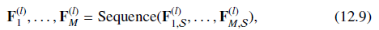

其输出作为下一层空间滤波操作的输入。注意，初始值$\mathbf{F}_1^{(0)},...,\mathbf{F}_M^{(0)}$即交通状态$\mathbf{X}_1,...,\mathbf{X}_M$。

### 12.3.2 空气质量预测

空气质量预测的建模思路与交通预测的思路基本一致。

## 12.4 网络安全数据挖掘

### 12.4.1 恶意账户检测

在(Liu et al.,2018b)中，作者识别了两种恶意账户：1）同一个攻击者（由于资源限制）在一个或多个普通设备在登录多个账户；2）来自同一个攻击群体在同一时间大规模登录进行成批攻击。基于这两种观测可以构建账户和设备的图，并将恶意账户检测视为一个半监督二分类任务。

#### 1 图构建

该任务中有两类对象：账户和设备，设备可以是IP或手机号。我们记设备类型集合$\mathcal{D}$,记账户和设备构成的图为$\mathcal{G=\{V,E\}}$,则其中包含了$|\mathcal{D}|$个子图$\mathcal{G^{(d)}=\{V,E^{(d)}\}}$,子图对应的邻接矩阵记为$\mathbf{A}^{(d)}$。每个节点都有一个特质向量$\mathbf{x}_i\in\mathbb{R}^{p+|\mathcal{D}|}$,其前$p$个元素表示该节点在$p$个相继的时期内出现的频率，其最后$|\mathcal{D}|$个元素表示设备的类型，如果该节点是设备，则对应一个one-hot向量，若节点是账户，则对应一个全0向量。

#### 2 以GNN进行恶意账户检测

利用GNN进行恶意账户检测可视为一个半监督分类任务，框架如5.5.1节，本节主要介绍学习节点特征的过程。图滤波过程如下：

其中$\mathbf{X}$为所有节点的输入特征，$\mathbf{F}^{(l)}$为第$l$个滤波层后的隐表示，且$\mathbf{F}^{(0)}=\mathbf{0}$,注意其与5.3.2节的滤波操作的区别，此处我们在每个滤波层都使用了输入特征$\mathbf{X}$，其目的为更好地保持账户激活模式。该滤波操作一方面能够捕捉一个设备登录多个恶意账户的现象，也能捕捉多账户同时激活的模式。

### 12.4.2 虚假新闻检测

大量研究表明虚假新闻的传播模式与真实新闻的传播模式在线上社交网络中是不同的（Vosoughi e t al.，2018),在(Monti et al.,2019)中，每个故事都建模为一张图，用于刻画其传播过程和社交关系，然后，虚假新闻检测可视为一个图的二分类任务。

#### 1 图构建

给定故事$u$及其对应的推文集合$\mathcal{T}_u=\{t_u^{(1)},...,t_u^{(N_u)}\}$,则故事$u$可由图$\mathcal{G}_u$描述，其以$\mathcal{T}_u$为节点，而边描述新闻扩散过程或推文作者的社交关系。记$a(t_u^{(i)})$为给定推文$t_u^{(i)}$的作者，第一种边是基于推文的作者定义的，即对于推文$t_u^{(i)},t_u^{(j)}$,其作者间有一方关注了另一方，则两个推文间存在边。第二种边基于$u$的扩散过程定义的，即如果$u$是从一个传播到另一个，则两个推文间存在边。新闻扩散路径由（Vosoughi e t al.，2018)估计，同时考虑了推文的时间戳和作者的社交关系。为方便起见，$t_u^{(i)}$的上标表示时间戳信息，我们估计其传播路径为：

* 如果$a(t_u^{(i)})$关注了前序推文作者$\{a(t_u^{(1)}),...,a(t_u^{(t-1)})\}$的至少一位,则我们估计新闻是从前序最后一个推文传播到$t^{(i)}_u$，且$a(t_u^{(i)})$关注了其作者。
* 如果$a(t_u^{(i)})$没有关注前序推文作者$\{a(t_u^{(1)},...,a(t_u^{(t-1)}\}$的任何一位，则我们估计新闻是从前序推文$\{t_u^{(1)},...,t_u^{(t-1)}\}$中传播到$t^{(i)}_u$，且该推文的作者具有最大量的关注者。

#### 2 作为图分类的虚假新闻检测

基于如上建立的图，我们可以使用5.5.2节的图神经网络框架执行图二分类任务。

# 第十三章 GNN在生物化学和医学中的应用

生物医学中典型的图有：protein-protein interaction,drug-drug interaction。

## 13.2 药物发展和发现

药物发展和发现类的任务有：1，分子表示学习，可帮助下游任务如分子性质预测，从而缩小具有合意性质药物的候选搜寻空间；2，分子图生成，即生成具有特定性质的分子结构；3，药物-目标结合亲和力预测，目标是预测药物-目标交互强度，从而帮助药物的发展和重构；4，蛋白质界面预测，目标是预测蛋白质的交互界面从而允许我们了解分子机制。

### 13.2.1 分子表示学习

将原子表示为节点，原子间的联系表示为边，即将分子结构构造为一个图。传统的分子预测方法通常分为两步：1，特征抽取，即分子特征向量化；2，性质预测， 基于抽取的特征使用深度学习模型进行预测。但这种两步法的表示可能对下游任务而已并非最优的，（Duvenaud et al.,2015)首先使用了端到端的、基于图神经网络的分子预测框架。值得一提的是，作者使用一个全局池化方法，其图滤波操作表示为：

其中$\boldsymbol{\Theta}^{(l-1)}_{|\mathcal{N}(v_i)|}$表示待学习的变形矩阵，最多至5个。对应的全局池化表示为：

即将所有层的输出表示使用softmax后相加。

以上是一种典型的分子表示方法，其他的GNN结构也适用，如使用MPNN-Filter的（Gilmer et al.,2017)。

### 13.2.2 蛋白质界面预测

蛋白质是具有生物功能的氨基酸链，而氨基酸又是一种有机化合物，它由氨基(-NH_2)、羧基(-COOH)功能组和针对每种氨基酸的侧链(R组)构成。为表达它们的功能，蛋白质需要与其他蛋白质交互。预测这些交互发生的界面是药物发现和设计非常重要且具有挑战性的话题。蛋白质交互界面由氨基酸残基交互和近邻氨基酸残基构成，在(Afsar Minhas et al.,2014)中，如果一个氨基酸残基中的任何一个非氢原子都在另一个氨基酸残基中的任何一个非氢原子的$6\stackrel{\circ}{A}$之内，则来自不同蛋白质的两个氨基酸残基被认为是氨基酸残基的一部分。因此，蛋白质界面预测问题可建模为一个二分类问题，其以一对来自不同蛋白质的氨基酸残基为输入。在（Fout et al.,2017)中，蛋白质的氨基酸残基可视为节点，它们之间的关系可视为边。氨基酸和蛋白质的表示如图13.1和图13.2：

#### 1 将蛋白质表示为图

每个氨基酸残基节点都与$k$个最近的氨基酸残基节点相连，由它们原子间的平均距离确定。每个 节点和边都具有一些特征，节点的特征记为$\mathbf{x}_i$,而边的特征记为$\mathbf{e}_{ij}$。

#### 2 蛋白质界面预测

给定一对氨基酸残基，其中一个来自配体蛋白$\mathcal{G_l=\{V_l,E_l\}}$,另一个来自受体蛋白$\mathcal{G_l=\{V_r,E_r\}}$,蛋白质界面预测就是预测这些残基是否在蛋白质界面之中，因此它是一个针对$(v_l,v_r),v_l\in\mathcal{V}_l,v_r\in\mathcal{V}_r$的二分类问题。我们可以使用图滤波器学习$\mathcal{G_l,G_r}$的节点表示，然后组合起来构成氨基酸残基对的统一表示，然后作为全连接层的输入来进行分类。一种图滤波操作选择为：

而为融合边特征，Fout et al.(2017)使用了如下的图滤波操作：

 

### 13.2.3 药物-目标结合亲和力预测

在药物发现中，药物目标交互(drug-target interaction,DTI)在缩小搜寻空间是非常重要的，其也可以用于药物重溯，即识别已有或废弃药物的新目标。药物-目标结合亲和力就是为了推断给定药物-目标对的结合强度，其可以视为一种回归任务。**该任务中主要有四个对象：蛋白质、疾病、基因和副作用**。在本节，我们主要使用蛋白质作为目标进行说明。

药物-蛋白质对可记为$(\mathcal{G}_d,p)$，各代表药物和蛋白质。药物$\mathcal{G}_d$表示为一个分子图，原子为节点、化学联系为边。蛋白质既可以表示为一个序列或图(如13.2),在Nguyen et al.(2019)中，蛋白质表示为一个氨基酸序列。Nguyen et al.(2019)中，药物-目标结合亲和力预测框架如图13.3，在该框架中，药物使用GNN来学习图水平的表示，序列模型来学习蛋白质表示，二者的表示拼接起来作为药物-蛋白质对的统一表示，用于最终的预测。当然我们也可以将蛋白质也表示为图，同时使用GNN学习蛋白质的表示。

## 13.3 药物相似性融合

得益于技术的发展，学者能够搜集多种来源的药物数据进行药物发现和药物安全研究，如通过化学指纹软件提取的药物结构信息，通过药物包提取的药物指标信息等。但它们通常包含的是不同角度的药物信息，从而需要进行融合才能更好地服务下游任务。这些多元数据编码了不同的相似性，因此也与目标结果有不同水平的关联。如在交互剖写(interatction profiles)上，药物的结构相似性比药物指标相似性有更高的影响。在Ma et al.(2018c)中，作者使用了一种基于注意力的GNN来融合药物相似度信息，以指导下游任务。每个药物特征源都视为一个视角，对于特定的视角$t\in\{1,...,T\}$,在这个视角中所有节点的特征可记为$\mathbf{X}_t\in\mathbb{R}^{N\times d_t}$,其中$N$为药物总数，$d_t$为特征的维度数 。该视角的相似度信息被编码为一个相似度矩阵$\mathbf{A}_t\in\mathbb{R}^{N\times N}$,多视角药物相似度融合的目标就是将这些相似度矩阵和特征融合为一个跨视角的整体特征矩阵$\mathbf{Z}\in\mathbb{R}^{N\times d}$和相似度矩阵$\mathbf{A}$。

不同视角相似度矩阵结合的方式如下：

$\mathbf{A}=\sum_{t=1}^Tdiag(\mathbf{g}_t)\mathbf{A}_t$ （13.3）

其中$\mathbf{g}_t\in\mathbb{R}^N$为注意力得分：

其中$\boldsymbol{\Theta},\mathbf{b}$为参数，softmax函数作用于每一行。

基于融合的相似度矩阵$\mathbf{A}$,我们可以使用GNN获得多视角特征如下：

$\mathbf{Z}=\alpha(GNN-Filter(\mathbf{A,X}))$  (13.4)

其中$\mathbf{X=[X_1,...,X_T]}$为所有视角特征的拼接。Ma et al.(2018c)使用的是GCN-Filter，作用于每行的softmax作为激活函数。

然后我们使用一个解码器根据$\mathbf{Z,A}$重建$\mathbf{X}$，原文中使用的也是GNN-Filter作为解码器：

$\mathbf{X'}=\alpha(GNN-Filter(\mathbf{A,Z}))$  (13.5)

根据$\mathbf{X,X'}$，我们得到如下的损失函数（**没有使用$\mathbf{A}$作为损失函数？？？**）:
$\mathcal{L}_{ed}=||\mathbf{X-X'}||^2$
我们可以根据如上的损失函数来学习式(13.3-13.5)的参数，此外，我们还可以根据下游任务来联合更新式(13.3-13.5)的参数

## 13.4 复方药副作用预测

复方药副作用预测并不仅仅是预测一个副作用是否存在，还要预测这个副作用的类型是什么，Zitnik et al.(2018)表明联合给要会比随机药物配对作用的蛋白质更多，这表明药物和目标蛋白质的交互对复方药建模至关重要。Zitnik et al.(2018)将复方药预测问题建模为一个多模图(multi-modal)，其包括药物-药物交互、药物-蛋白质交互、蛋白质-蛋白质交互。因此复方药预测可建模为一个多关系链路预测问题，其目标为预测一对药物间是否存在连接，如果存在，该连接类型是什么。

#### 1 多模图构建

我们可以将复方药作为建模为一个两层的图，其保护两类节点：蛋白质和药物，其建立在三种交互之上，其中药物-药物交互编码了观测的复方药副作用，药物-蛋白质交互药物作用的蛋白质，而蛋白质-蛋白质交互编码了蛋白质的物理结合关系。如图13.4：

该两层的多模图可记为$\mathcal{G=\{V,E,R\}}$,其中$e=(v_i,r,v_j)\in\mathcal{E}$。

#### 2 复方药副作用预测

复方药副作用预测可表示为：给定图$\mathcal{G=\{V,E,R\}}$中的节点$(v_i,v_j)$，预测特定类型$r\in\mathcal{R}$的边$e=(v_i,r,v_j)\in\mathcal{E}$是否存在。在Zitnik et al.(2018)中，作者使用GNN进行节点表示学习，然后基于节点表示进行链路预测。原文使用了基于KG的滤波器(Schlichtkrull et al.,2018):

其中$c_{r}^{(ij)}$和$c^i_r$为标准化常数：

其中初始特征为节点特征$\mathbf{F}^{(0)}_i=\mathbf{x}_i$,最终的节点表示记为：$\mathbf{z}_i=\mathbf{F}^{(L)}_i$,则特定类型$r$关系边存在的概率可建模为：

$p(v_i,r,v_j)=\sigma(\mathbf{z}_i^T\mathbf{D}_r\mathbf{RD}_r\mathbf{z}_j)$

其中$\sigma()$为sigmoid函数，$\mathbf{R}$为可学习的矩阵，为所有关系共享，$\mathbf{D}_r$为针对关系$r$的一个可学习的对角矩阵。使用共享的$\mathbf{R}$的原因在于，药物间的很多关系极少被观测到，针对它们都学习一个矩阵会导致过拟合，且引入共享的$\mathbf{R}$会大大减少模型参数的数量。需要注意的是，在原文中，作者不是仅仅基于药物-药物交互计算式(13.7)进行训练，而是也基于蛋白质-蛋白质交互和药物-蛋白质交互计算式(13.7)来学习参数。

## 13.5 疾病预测

随着技术的发展，学者可以搜集大量的影像、基于和行为数据来了解疾病的机制。疾病预测任务的目标是：给定对应的医学影像、和非影像数据，预测一个主体患病与否。其中影像数据主要是MRI影像，非影像数据则是表型数据如年龄、性别、采集地点等。这两种数据相互补充，影像数据直接提供了主体的疾病特征，而表型数据则提供了主体间的关联。如，其他条件相同，相似年龄的主体倾向于有相似的疾病。而图是一种建模两种信息非常直接的方法，我们将主体视为节点，其医学影像视为节点特征，主体间的关联视为边，完成图构建后，我们就可以将疾病预测任务视为一个半监督节点二分类任务。以下我们以ABIDE数据构建图，例子可参考（Parisot et al.,2018)。

ABIDE数据库包含从不同国际采集点、不同主体的神经影像(功能MRI)和表型数据，根据这些数据我们的目标是预测一个主体是否患有自闭症谱系障碍(autism spectrum disorder,ASD)，每个主体构成一个节点$v_i$，每个从fMRI抽取的特征构成节点特征$\mathbf{x}_i$,并根据影像数据和非影像表型数据测度$\mathcal{M}=\{M_h\}^H_{h=1}$构造边：

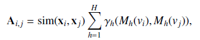

其中$\mathbf{A}$为邻接矩阵，$sim(\mathbf{x_i,x_j})$为节点的相似度，$M_h(v_i)$为第$h$个表型测度，$\gamma_h()$为对应表型测度的相似性。其中$sim()$可建模为一个高斯核，距离较小的节点相似度更高。数据使用了三种表型测度：采集点、性别和年龄。考虑采集点的原因在于：数据集是不同地点采集的，其采集协议非常不同，因此可能会导致不同采集点的影像可比性较差。考虑年龄和性别的原因在于：年龄和性别差异具有经验证据。对于采集点和性别，我们采用Kronecker delta函数作为相似性度量，即仅在两个输入相同时，值为1，否则为0。对于年龄，则：

其中$\theta$为一个预定义的参数。

# 第十四章 GNN的高级主题

## 14.1 引言

GNN有DNN的固有缺陷，如没有解释性，也有自身独特的缺陷，如超过一定层数后再增加层数会降低模型表现。此外，DNN的前沿方法也开始逐渐应用到GNN，如半监督GNN和将GNN从欧式空间拓展到高维空间。

## 14.2 更深的GNN

GNN存在显著的oversmoothing问题，即超过一定层数后再增加层数会降低模型表现。我们以GCN-Filter进行说明，从空间角度，GCN-Filter通过“平均”邻居节点表示更新本节点的表示，这种机制天然会使邻居节点间的表示相似，随着层数的增加，滤波操作倾向于使所有节点都相似。

Li et al.(2018b)对oversmoothing的渐进性进行了分析，需要指出的是该研究没有包含非线性激活函数，其中对$\mathbf{F}$使用$L$层滤波操作后的输出可表示为：

其中$\boldsymbol{\Theta}$表示$\boldsymbol{\Theta}^{(i)},i=0,...,L-1$的乘积，$\tilde{\mathbf{A}}=\mathbf{A+I}$，$\tilde{\mathbf{D}}$为对应的度矩阵。式(14.1)的滤波过程可视为对$\boldsymbol{F\Theta}$的每一列使用$(\tilde{\mathbf{D}}^{-\frac{1}{2}}\tilde{\mathbf{A}}\tilde{\mathbf{D}}^{-\frac{1}{2}})$。

`定理14.1`:令$\mathcal{G}$表示连通的非二部图，$\mathbf{A}$为邻接矩阵，特征为$\mathbf{f}\in\mathbb{R}^N$,则：

$\lim _{L \rightarrow \infty}\left(\widetilde{\mathbf{D}}^{-\frac{1}{2}} \widetilde{\mathbf{A}} \widetilde{\mathbf{D}}^{-\frac{1}{2}}\right)^{L} \mathbf{f}=\theta_{1} \cdot \mathbf{u}_{1}$  （14.2)

其中，$\widetilde{\mathbf{A}}=\mathbf{A+I}$,为包括自环版的邻接矩阵。其中$\mathbf{u}_1$表示$\widetilde{\mathbf{D}}^{-\frac{1}{2}} \widetilde{\mathbf{A}} \widetilde{\mathbf{D}}^{-\frac{1}{2}}$的最大特征值对应的特征向量，且$\theta_1=\mathbf{u}^T_1\mathbf{f}$,$\mathbf{u}_1=\widetilde{\mathbf{D}}^{-\frac{1}{2}}\mathbf{1}$,只包含了节点的度信息。

`证明`:令$\widetilde{\mathbf{L}}_{nor}=\mathbf{I}-\widetilde{\mathbf{D}}^{-\frac{1}{2}} \widetilde{\mathbf{A}} \widetilde{\mathbf{D}}^{-\frac{1}{2}}$表示$\widetilde{\mathbf{A}}$的标准化Laplacian矩阵，根据引理1.7，$\widetilde{\mathbf{L}}_{nor}$的特征值为$0=\lambda_1<\lambda_2<...<\lambda_N<2$,其对应特征向量为$\mathbf{u}_1,...,\mathbf{u}_N$,则$\widetilde{\mathbf{L}}_{nor}$的特征分解形式可表示为：$\widetilde{\mathbf{L}}_{nor}=\boldsymbol{U\Lambda U}^T$,则我们有：

则针对$\widetilde{\mathbf{D}}^{-\frac{1}{2}} \widetilde{\mathbf{A}} \widetilde{\mathbf{D}}^{-\frac{1}{2}}$，其对应特征值必然$-1<1-\lambda_i<=1,i=1,...,N$。

从而对于：

其特征值值域为$[0,1)$,(**应为(0,1]吧？？？**)从而：

定理14.1表明，对信号$\mathbf{f}$重复应用GCN-Filter,其结果为$\theta_1\cdot \mathbf{u}_1$,即仅捕捉到了节点度信息。而对于多通道情形，矩阵$\boldsymbol{\Theta F}$的每一行都映射到$\theta_1\cdot \mathbf{u}_1$，只是$\theta_1$不同。即每一列都是不同尺度的相同信息。而对于节点分类问题，度信息可能是无用的，因此可以解释为什么随着滤波层的增加分类器的表现会下降。

Li et al.(2018b)的研究没有包含非线性激活函数，(Oono and Suzuki ,2020)补充了该方面的研究，其研究还表明，ReLU甚至会加速oversmoothing的过程。

以下介绍几种缓解oversmoothing的方法。

### 14.2.1 Jumping knowledge

Xu et al.(2018a)认为，不同的节点需要不同深度的邻域，也因此对不同的节点也应使用不同数量的滤波层。基于此，Xu et al.(2018a)提出了Jumping Knowledge方法，该方法自适应地对每个节点不同层的隐表示进行结合生成最终表示：

$\mathbf{F}_i^o=JK(\mathbf{F}_i^{(0)},...,\mathbf{F}^{(L)})$

其中 JK为针对每个节点的自适应函数，如max-pooling或基于注意力的LSTM。

### 14.2.2 DropEdge

Rong et al.(2019)提出的DropEdge则是在训练的每一轮(epoch)，都随机移除一部分边，并基于保留的边构造的图进行训练。

### 14.2.3 Pairnorm

Zhao and Akoglu(2019)则提出通过引入正则项，从而使不相连的节点表示距离较远，进而防止oversmoothing。

## 14.3 通过自监督学习探索无标签数据

对于节点分类，GNN可以利用简单的信息聚合过程利用无标签数据，但这种利用是不充分的。而对于图分类和回归任务，有标签数据获取成本更高，因此更需要充分使用无标签数据。

### 14.3.1 节点级任务

自监督(SSL)学习通常首先设计一个特定领域的前置任务(pretext task)，然后基于前置任务以利用无标签数据学习数据表示。对于GNN，SSL通常从图结构和/或节点特征生成额外的监督信号，生成的SSL信息可以作为监督的辅助任务，从而提高GNN在节点分类上的表现。目前有两种方法来生成自监督信号(Jin et al.,2020c):1,两阶断训练，自监督用于预训练GNN，预训练的GNN再根据下游任务精调；2，联合训练，将SSL任务和主任务联合优化，目标函数通常具有如下形式：

$\mathcal{L=L_{label}+\eta\cdot L_{self}}$

图上的半监督任务通常分为三种：1,基于图结构信息构造SSL信号；2，基于节点属性构造SSL信号；3，基于图结构信息和节点属性构造SSL信号。

#### 1 图结构信息

该类任务包括：

* 节点性质(Jin et al.,2020c):根据学习的节点表示预测节点性质，如度、中心度、局部聚类系数。
* 中心度排序(Hu et al.,2019):预测给定节点对之间的中心度顺序。
* 边掩码(Jin et al.,2020c;Hu et al.,2020,2019):随机将一些边移除或掩码，并使用基于GNN学习的节点表示预测边的存在性。
* 节点对距离(Peng et al.,2020;Jin et al.,2020c):预测给定节点对之间的距离，距离由最短路径度量。
* Distance2Cluster(Jin et al.,2020c):预测节点到类簇的距离，从而可以帮助学习节点的全局位置信息。该方法首先根据METIS对图进行聚类划分，针对每个类簇，具有最大度的节点作为中心节点，然后预测给定节点与每个中心节点的距离，距离也通过最短路径度量。

#### 2 图属性信息

本类任务包括：

* 属性掩码(Jin et al.,2020c;You et al.,2020;Hu et al.,2020)：随机将一些节点的属性移除或掩码，然后使用基于GNN学习的节点表示预测节点属性。
* PairwiseAttrSim(Jin et al.,2020c):目标为预测节点属性间的相似性，相似性由cosine或欧式距离度量。

#### 3 图属性和结构信息

本类任务包括：

* 伪标签(Sun et al.,2019c;You et al.,2020):首先使用GNN或其他模型生成无标签节点的伪标签，然后和有标签节点一起作为监督信号重新训练模型。在You et al.(2020)中，作者首先基于GNN生成节点表示，然后根据节点表示进行聚类，以类簇成员关系作为伪标签。而在Sun et al.(2019c)中，作者将类簇与真实标签对齐，然后用作伪标签。
* Distance2Labeled(Jin et al.,2020c)：与Distance2Cluster类似，只是预测的是有标签节点和无标签节点的距离。
* ContextLabel(Jin et al.,2020c):预测图中节点背景的标签分布，其中背景定义为k跳内邻居。给定节点的背景的标签分布可作为一个向量，其维度为类别的数量，每个元素为对应标签出现的频率。尽管如此，无标签节点的节点信息仍然是不可知的，因此难以准确度量分布。Jin et al(2020c)中，作者使用了标签传播（LP)和迭代分类算法(ICA)预测其伪标签，然后估计标签分布。
* CorrectedLabel(Jin et al.,2020c):该任务是用于强化ContextLabel，方式是迭代提纯伪标签。该任务分为两步：训练阶段和标签修正阶段。给定伪标签，训练阶段与ContextLabel相同，在标签修正阶段，训练阶段预测的伪标签再通过噪音标签提纯算法进行修正，提纯的伪标签再用来抽取训练阶段的背景标签分布。

### 14.3.2 图级任务

记有标签的图集合为$\mathcal{D_l=\{(G_i,y_i)\}}$,无标签图集合为$\mathcal{D_u=\{G_j\}}$，其中$y_i$为标签。通常无标签样本的数量远大于无标签样本。而自监督学习的目标是从无标签样本集中抽取知识用于辅助训练有标签样本上的模型。图级任务的自监督信号应用也分为两阶段和联合训练，主要有以下任务：

* 背景预测(Hu et al.,2019):在背景预测中，预训练任务的目标是预测给定的$K$跳邻域与背景图对属于同一节点。即，对于$v\in\mathcal{G}$,其$K$跳邻域由$K$跳内节点和边组成，记为$\mathcal{N}_{\mathcal{G}}^K(v)$。而节点$v$的背景图则由两个参数$r_1,r_2$定义，它由在节点$v$的$r_1$到$r_2$跳内节点和边构成的子图，记为$\mathcal{C}_{v,\mathcal{G}}$,其中$r_1<K$,如图14.1所示：

  

  背景以上设定，背景预测任务就可以建模为一个二分类任务，即预测$\mathcal{N}_{\mathcal{G}}^K(v)$和$\mathcal{C}_{v,\mathcal{G}}$是否属于同一节点。而在(Sun et al.,2019b)中，任务描述为给定节点和图，预测该节点是否属于该图。

* 属性掩码(Hu et al.,2019)：即将无标签数据集中的某些节点或边属性随机掩码，训练GNN来预测这些被掩码的属性。
* 图特征预测（Hu et al.,2019):有些情况下虽然$\mathcal{D}_u$没有标签，但却可能有其他图属性，这些图属性可以作为预训练GNN的监督信号。

## 14.4 GNN的表示能力

GNN表示能力即GNN模型从图水平区分图结构的能力。

空域GNN的滤波层可表示为：

而池化层可表示为：

Xu et al.(2019d)证明，无论何种形式的GNN，其表示能力上限为WL图同构测试。

以下介绍WL图同构测试。

### 14.4.1 Weisfeiler-Lehman Test

给定两个图，如果存在一个节点集间的映射，使得两个图的近邻关系相同，则两个图是拓扑相同或者同构的。同构图的示例见14.2，其中颜色和数字表示两个节点集的映射关系：

该问题没有多项式时间算法解，而WL则是其中一种非常高效且精准的近似方法，它只在一些角点情况无效。

为方便起见，我们假设两个图的每个节点都有标签（或属性），如图14.2，数字就是一种标签，在实际中，不同的节点可能有相同的标签。WL测试的一次迭代可描述为：

* 对每个节点$v_i$,我们将其邻居(包括自身的)标签聚合为一个复集合$\mathcal{NL}(v_i)$,即有重复元素的集合。
* 对每个节点，我们对复集合$\mathcal{NL}(v_i)$取哈希运算为一个唯一的新标签，作为$v_i$的新标签，注意，任何具有相同标签复集合的节点都哈希到相同的新标签。

以上迭代多次重复，直到两个图的标签集合不同。如果两个图的标签集合不同，则两个图是非同构的，算法终止，在$N$次（或图中节点数）迭代后，如果两个图的标签集合仍然相同，则认为两个图是同构的（或者WL测试不能识别这两个图）。可以看到，GNN可视为一种广义的WL测试，聚合函数对应于WL的聚合步，更新函数对应于哈希函数。

### 14.4.2 表示能力

`引理14.2（Xu et al.,2019d)`:给定两个非同构的图$\mathcal{G_1,G_2}$,如果GNN将两个图映射到不同的嵌入，则WL测试也可以确定两个图是非同构的。

WL测试识别能力的大部分来源于它的单射聚合操作，即哈希函数将具有不同邻域的节点映射为不同的标签。但大部分流行的聚合函数并不是单射的。

如图14.3所示，假设所有节点的标签(或属性)相同，$v,v'$的局部结构是不同的，因为它们邻居节点的数量是不同的，但mean或max函数并不能区分二者。因此设计具有单射性质的聚合、更新和池化函数对提高GNN的表示能力至关重要。

`定义14.3(Xu et al.,2019d)`:如果一个GNN的聚合、更新和池化函数都是单射的，则该具有足够多滤波层的GNN可以将WL测试识别为非同构的图映射为不同的嵌入。
虽然WL测试是GNN的表示能力上限，但GNN有自己独特的优势，那就是它可以将图映射到低维空间，从而计算图的相似度，从而辅助图分类。

# 第十五章 高级应用

GNN可以用于组合优化问题（如最小顶点覆盖,minimum vertex cover，MVC;旅行商问题,TSP）；图也可以从不同角度表示程序中的源码，如数据和控制流，从而使用GNN进行变量误用检测和软件脆弱性检测等任务。图也可以用于物理中的动态系统未来状态预测。

## 15.2 图上的组合优化

MVC，TSP等都是NP-hard问题，这些问题只能通过近似算法或启发式算法解决，而设计好的近似算法需要较高的领域知识和大量试错，因此自动学习启发式是非常有吸引力的。

* MVC：给定图$\mathcal{G=\{V,E\}}$,顶点覆盖集合$\mathcal{S\subset V}$定义为：一个包含每个边至少一个端点的顶点集合，MVC任务即找到具有最少节点的集合。
* 最大分割(MAXCUT):给定图$\mathcal{G=\{V,E\}}$,MAXCUT定义为：分割$\mathcal{C=\{S,V/S\}}$将$\mathcal{V}$分割为两个不相交的子集$\mathcal{V,V/S}$,其对应的分割集(cut-set)为边的子集$\mathcal{E_c\in E}$,其一个端点在$\mathcal{S}$中，而另一个在$\mathcal{V/S}$,cut-set的权重$\sum_{(u,v)\in\mathcal{E_c}}w(u,v)$最大。
* TSP：给定图$\mathcal{G=\{V,E\}}$,其中节点表示城市，边表示路线，TSP任务的目标是找到能够访问所有节点的最短路线，且该路线的终点为起点。
* 最大独立集(Maximal Independent Set, MIS):给定图$\mathcal{G=\{V,E\}}$,独立集定义为$\mathcal{S\subset V}$,在该集合内任何一对节点间没有相连的边。MIS任务就是找到具有最大数量节点的独立集。

其中的一些问题可建模为点/边注释（分类）问题，其目标为识别一个点/边是否在解决方案里，而这类任务非常适合GNN处理。但直接将这些任务作为节点/边注释任务可能会导致无效的解。例如，在MIS任务中，两个相连的节点可能会在推断中被标注为1。因此，常常将GNN与一些搜寻启发方法结合在一起搜寻有效解。

在(Khalil et al.,2017)这些问题建模为一个序列节点选择任务，并使用RL学习，GNN用于RL框架中的状态表示。通过对不完全解中序列化地增加节点来构造完整解，这些节点是贪婪地序列化选择的，选择方式是根据最大化RL框架的评价函数，该评价函数用于评估解（或不完全解）的质量。完成节点选择后，再通过一个辅助函数来将它们组织为有效的解。

在(Li et al.,2018e)中，作者将问题建模为节点标注任务。在训练阶段，将每个训练样本中的节点标注为0或1，1表示节点在解的集合里。完成训练后，给定新样本，GNN模型输出每个节点在解集合里的概率得分，根据概率得分，使用贪婪搜索算法递归地构造有效解。

在（joshi et al.,2019）中，作者将问题建模为边标注任务，用于解决TSP问题。在训练阶段，将每个训练样本中的边标注为0或1，1表示边在解的集合里。完成训练后，给定新样本，GNN模型输出每条边在解集合里的概率得分，根据概率得分，使用集束搜索递归地构造有效解。

## 15.3 学习程序表示

使用图进行变量误用检测和软件脆弱性检测等任务一种自然的想法就是将程序视为一种特殊语言中的文章，然后就可以使用NLP技术进行处理，但将源码表示为符号序列常常不能捕捉代码中的句法和语法关系，因此，最近的研究尝试将源码构造为图，并使用GNN进行表示学习。

将源码构造为图的方法包括如下几种：

* 摘要句法树(AST):代码解析器使用AST来理解代码结构并发现句法错误，AST中的节点由句法节点（编程语言语法中的非终止符）和句法符号（终止符）构成，使用有向边表示父-子关系。
* 控制流图（CFG)：用于描述程序执行时所有潜在的遍历路径，CFG以声明和条件构成节点，条件声明如$if,switch$等是构造不同路径的关键节点，CFG的边即声明控制的转移。
* 数据流图（DFG):用于描述程序如何使用变量，其以变量为节点，以变量的修改和使用为边。
* 自然编码序列（NCS):为一个源码序列，边根据源码的顺序连接邻域编码符号。

这些图还可以进一步组合为更复杂的图，从而同时编码句法和语法。该方向节点级的应用如变量误用检测见(Allamanis et al., 2017)，图级应用如程序脆弱性检测见(Zhou et al., 2019).

## 15.4 物理中的交互动态系统推理

自然中交互系统无处不在，物理中的动态系统是其中最具代表性的一种。交互系统可很自然地表示为图，对象即节点而交互即边。典型的动态系统包括：

* N-body:N-body域中，存在N个对象，每个对象都对其他对象存在作用力，力的大小取决于它们的质量和相对距离。由于它们见的关系是成对的，因此可以存在$N(N-1)$种关系，构成一个全连接图，如太阳系。
* 弹跳球(bouncing balls):弹跳球系统中有两类对象，球和墙。球持续运动，与其他球或静止的墙相撞，因此也存在$N(N-1)$种成对的关系，从而将系统建模为一个全连接图。
* 带点粒子：在带电粒子中，每个粒子都带正电或负电，每对粒子间都存在交互，因此也可以构造为一个全连接图。

此类任务的目标是：给定动态系统的历史（或初始）状态，推断其未来状态。动态系统中的状态可表示为对象的轨迹$\mathcal{T}=\{\mathbf{x_i,...x_N}\}$,其中$\mathbf{x}_i=\{\mathbf{x}_i^{(0)},...,\mathbf{x}^{(t)}_i\}$,通常对象的状态信息包含其位置和速度。

在(Battaglia et al., 2016)中，作者提出了一种交互网络来学习动态系统的未来状态，该模型是一种特殊的GNN，其中包含了关系中心函数和节点中心函数，关系中心函数用于建模节点间的交互影响，节点中心函数使用关系中心函数的输出更新节点的状态，因此关系中心函数可视为信息函数，而节点中心函数可视为更新函数。通过设计不同的函数，交互网络可以处理不同的对象和关系，原文中还提出了一种更广义的框架，称为**图网络**。

交互系统常常假设对象间的关系是已知的，但在实际中这种情况可能是不现实的。（Kipf et al.,2018)提出了一种能够推断关系类型同时也能预测未来状态的模型，它是一种变分自编码框架，encoder和decoder都使用GNN建模，encoder应用于原始图$\mathcal{G}$，以观测轨迹为输入，预测关系类型，根据encoder输出的关系类型信息编码的图记为$\mathcal{G'}$,其作为decoder的输入，decoder的目标是预测未来的状态。

