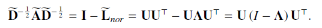
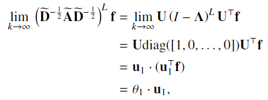
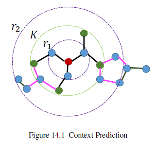
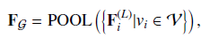
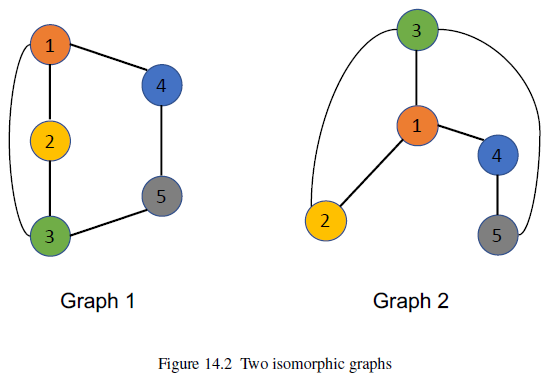

# 第十四章 GNN的高级主题

## 14.1 引言

GNN有DNN的固有缺陷，如没有解释性，也有自身独特的缺陷，如超过一定层数后再增加层数会降低模型表现。此外，DNN的前沿方法也开始逐渐应用到GNN，如半监督GNN和将GNN从欧式空间拓展到高维空间。

## 14.2 更深的GNN

GNN存在显著的oversmoothing问题，即超过一定层数后再增加层数会降低模型表现。我们以GCN-Filter进行说明，从空间角度，GCN-Filter通过“平均”邻居节点表示更新本节点的表示，这种机制天然会使邻居节点间的表示相似，随着层数的增加，滤波操作倾向于使所有节点都相似。

Li et al.(2018b)对oversmoothing的渐进性进行了分析，需要指出的是该研究没有包含非线性激活函数，其中对$\mathbf{F}$使用$L$层滤波操作后的输出可表示为：

其中$\boldsymbol{\Theta}$表示$\boldsymbol{\Theta}^{(i)},i=0,...,L-1$的乘积，$\tilde{\mathbf{A}}=\mathbf{A+I}$，$\tilde{\mathbf{D}}$为对应的度矩阵。式(14.1)的滤波过程可视为对$\boldsymbol{F\Theta}$的每一列使用$(\tilde{\mathbf{D}}^{-\frac{1}{2}}\tilde{\mathbf{A}}\tilde{\mathbf{D}}^{-\frac{1}{2}})$。

`定理14.1`:令$\mathcal{G}$表示连通的非二部图，$\mathbf{A}$为邻接矩阵，特征为$\mathbf{f}\in\mathbb{R}^N$,则：

$\lim _{L \rightarrow \infty}\left(\widetilde{\mathbf{D}}^{-\frac{1}{2}} \widetilde{\mathbf{A}} \widetilde{\mathbf{D}}^{-\frac{1}{2}}\right)^{L} \mathbf{f}=\theta_{1} \cdot \mathbf{u}_{1}$  （14.2)

其中，$\widetilde{\mathbf{A}}=\mathbf{A+I}$,为包括自环版的邻接矩阵。其中$\mathbf{u}_1$表示$\widetilde{\mathbf{D}}^{-\frac{1}{2}} \widetilde{\mathbf{A}} \widetilde{\mathbf{D}}^{-\frac{1}{2}}$的最大特征值对应的特征向量，且$\theta_1=\mathbf{u}^T_1\mathbf{f}$,$\mathbf{u}_1=\widetilde{\mathbf{D}}^{-\frac{1}{2}}\mathbf{1}$,只包含了节点的度信息。

`证明`:令$\widetilde{\mathbf{L}}_{nor}=\mathbf{I}-\widetilde{\mathbf{D}}^{-\frac{1}{2}} \widetilde{\mathbf{A}} \widetilde{\mathbf{D}}^{-\frac{1}{2}}$表示$\widetilde{\mathbf{A}}$的标准化Laplacian矩阵，根据引理1.7，$\widetilde{\mathbf{L}}_{nor}$的特征值为$0=\lambda_1<\lambda_2<...<\lambda_N<2$,其对应特征向量为$\mathbf{u}_1,...,\mathbf{u}_N$,则$\widetilde{\mathbf{L}}_{nor}$的特征分解形式可表示为：$\widetilde{\mathbf{L}}_{nor}=\boldsymbol{U\Lambda U}^T$,则我们有：

则针对$\widetilde{\mathbf{D}}^{-\frac{1}{2}} \widetilde{\mathbf{A}} \widetilde{\mathbf{D}}^{-\frac{1}{2}}$，其对应特征值必然$-1<1-\lambda_i<=1,i=1,...,N$。

从而对于：

其特征值值域为$[0,1)$,(**应为(0,1]吧？？？**)从而：

定理14.1表明，对信号$\mathbf{f}$重复应用GCN-Filter,其结果为$\theta_1\cdot \mathbf{u}_1$,即仅捕捉到了节点度信息。而对于多通道情形，矩阵$\boldsymbol{\Theta F}$的每一行都映射到$\theta_1\cdot \mathbf{u}_1$，只是$\theta_1$不同。即每一列都不同尺度的相同信息。而对于节点分类问题，度信息可能是无用的，因此可以解释为什么随着滤波层的增加分类器的表现会下降。

Li et al.(2018b)的研究没有包含非线性激活函数，(Oono and Suzuki ,2020)补充了该方面的研究，其研究还表明，ReLU甚至会加速oversmoothing的过程。

以下介绍几种缓解oversmoothing的方法。

### 14.2.1 Jumping knowledge

Xu et al.(2018a)认为，不同的节点需要不同深度的邻域，也因此对不同的节点也应使用不同数量的滤波层。基于此，Xu et al.(2018a)提出了Jumping Knowledge方法，该方法自适应地对每个节点不同层的隐表示进行结合生成最终表示：

$\mathbf{F}_i^o=JK(\mathbf{F}_i^{(0)},...,\mathbf{F}^{(L)})$

其中 JK为针对每个节点的自适应函数，如max-pooling或基于注意力的LSTM。

### 14.2.2 DropEdge

Rong et al.(2019)提出的DropEdge则是在训练的每一轮(epoch)，都随机移除一部分边，并基于保留的边构造的图进行训练。

### 14.2.3 Pairnorm

Zhao and Akoglu(2019)则提出通过引入正则项，从而使不相连的节点表示距离较远的方法防止oversmoothing。

## 14.3 通过自监督学习探索无标签数据

对于节点分类，GNN可以利用简单的信息聚合过程利用无标签数据，但这种利用是不充分的。而对于图分类和回归任务，有标签数据获取成本更高，因此更需要充分使用无标签数据。

### 14.3.1 节点级任务

自监督(SSL)学习通常首先设计一个特定领域的前置任务(pretext task)，然后基于前置任务以利用无标签数据学习数据表示。对于GNN，SSL通常从图结构和/或节点特征生成额外的监督信号，生成的SSL信息可以作为监督的辅助任务，从而提高GNN在节点分类上的表现。目前有两种方法来生成自监督信号(Jin et al.,2020c):1,两阶断训练，自监督用于预训练GNN，预训练的GNN再根据下游任务精调；2，联合训练，将SSL任务和主任务联合优化，目标函数通常具有如下形式：

$\mathcal{L=L_{label}+\eta\cdot L_{self}}$

图上的半监督任务通常分为三种：1,基于图结构信息构造SSL信号；2，基于节点属性构造SSL信号；3，基于图结构信息和节点属性构造SSL信号。

#### 1 图结构信息

该类任务包括：

* 节点性质(Jin et al.,2020c):根据学习的节点表示预测节点性质，如度、中心度、局部聚类系数。
* 中心度排序(Hu et al.,2019):预测给定节点对之间的中心度顺序。
* 边掩码(Jin et al.,2020c;Hu et al.,2020,2019):随机将一些边移除或掩码，并使用基于GNN学习的节点表示预测边的存在性。
* 节点对距离(Peng et al.,2020;Jin et al.,2020c):预测给定节点对之间的距离，距离由最短路径度量。
* Distance2Cluster(Jin et al.,2020c):预测节点到类簇的距离，从而可以帮助学习节点的全局位置信息。该方法首先根据METIS对图进行聚类划分，针对每个类簇，具有最大度的节点作为中心节点，然后预测给定节点与每个中心节点的距离，距离也通过最短路径度量。

#### 2 图属性信息

本类任务包括：

* 属性掩码(Jin et al.,2020c;You et al.,2020;Hu et al.,2020)：随机将一些节点的属性移除或掩码，然后使用基于GNN学习的节点表示预测节点属性。
* PairwiseAttrSim(Jin et al.,2020c):目标为预测节点属性间的相似性，相似性由cosine或欧式距离度量。

#### 3 图属性和结构信息

本类任务包括：

* 伪标签(Sun et al.,2019c;You et al.,2020):首先使用GNN或其他模型生成无标签节点的伪标签，然后和有标签节点一起作为监督信号重新训练模型。在You et al.(2020)中，作者首先基于GNN生成节点表示，然后根据节点表示进行聚类，以类簇成员关系作为伪标签。而在Sun et al.(2019c)中，作者将类簇与真实标签对齐，然后用作伪标签。
* Distance2Labeled(Jin et al.,2020c)：与Distance2Cluster类似，只是预测的是有标签节点和无标签节点的距离。
* ContextLabel(Jin et al.,2020c):预测图中节点背景的标签分布，其中背景定义为k跳内邻居。给定节点的背景的标签分布可作为一个向量，其维度为类别的数量，每个元素为对应标签出现的频率。尽管如此，无标签节点的节点信息仍然是不可知的，因此难以准确度量分布。Jin et al(2020c)中，作者使用了标签传播（LP)和迭代分类算法(ICA)预测其伪标签，然后估计标签分布。
* CorrectedLabel(Jin et al.,2020c):该任务是用于强化ContextLabel，方式是迭代提纯伪标签。该任务分为两步：训练阶段和标签修正阶段。给定伪标签，训练阶段与ContextLabel相同，在标签修正阶段，训练阶段预测的伪标签再通过噪音标签提纯算法进行修正，提纯的伪标签再用来抽取训练阶段的背景标签分布。

### 14.3.2 图级任务

记有标签的图集合为$\mathcal{D_l=\{(G_i,y_i)\}}$,无标签图集合为$\mathcal{D_u=\{G_j\}}$，其中$y_i$为标签。通常无标签样本的数量远大于无标签样本。而自监督学习的目标是从无标签样本集中抽取知识用于辅助训练有标签样本上的模型。图级任务的自监督信号应用也分为两阶段和联合训练，主要有以下任务：

* 背景预测(Hu et al.,2019):在背景预测中，预训练任务的目标是预测给定的$K$跳邻域与背景图对属于同一节点。即，对于$v\in\mathcal{G}$,其$K$跳邻域由$K$跳内节点和边组成，记为$\mathcal{N}_{\mathcal{G}}^K(v)$。而节点$v$的背景图则由两个参数$r_1,r_2$定义，它由在节点$v$的$r_1$到$r_2$跳内节点和边构成的子图，记为$\mathcal{C}_{v,\mathcal{G}}$,其中$r_1<K$,如图14.1所示：

  

  背景以上设定，背景预测任务就可以建模为一个二分类任务，即预测$\mathcal{N}_{\mathcal{G}}^K(v)$和$\mathcal{C}_{v,\mathcal{G}}$是否属于同一节点。而在(Sun et al.,2019b)中，任务描述为给定节点和图，预测该节点是否属于该图。

* 属性掩码(Hu et al.,2019)：即将无标签数据集中的某些节点或边属性随机掩码，训练GNN来预测这些被掩码的属性。
* 图特征预测（Hu et al.,2019):有些情况下虽然$\mathcal{D}_u$没有标签，但却可能有其他图属性，这些图属性可以作为预训练GNN的监督信号。

## 14.4 GNN的表示能力

GNN表示能力即GNN模型从图水平区分图结构的能力。

空域GNN的滤波层可表示为：

而池化层可表示为：

Xu et al.(2019d)证明，无论何种形式的GNN，其表示能力上限为WL图同构测试。

以下介绍WL图同构测试。

### 14.4.1 Weisfeiler-Lehman Test

给定两个图，如果存在一个节点集间的映射，使得两个图的近邻关系相同，则两个图是拓扑相同或者同构的。同构图的示例见14.2，其中颜色和数字表示两个节点集的映射关系：

该问题没有多项式时间算法解，而WL则是其中一种非常高效且精准的近似方法，它只在一些角点情况无效。

为方便起见，我们假设两个图的每个节点都有标签（或属性），如图14.2，数字就是一种标签，在实际中，不同的节点可能有相同的标签。WL测试的一次迭代可描述为：

* 对每个节点$v_i$,我们将其邻居(包括自身的)标签聚合为一个复集合$\mathcal{NL}(v_i)$,即有重复元素的集合。
* 对每个节点，我们对复集合$\mathcal{NL}(v_i)$取哈希运算为一个唯一的新标签，作为$v_i$的新标签，注意，任何具有相同标签复集合的节点都哈希到相同的新标签。

以上迭代多次重复，直到两个图的标签集合不同。如果两个图的标签集合不同，则两个图是非同构的，算法终止，在$N$次（或图中节点数）迭代后，如果两个图的标签集合仍然相同，则认为两个图是同构的（或者WL测试不能识别这两个图）。可以看到，GNN可视为一种广义的WL测试，聚合函数对应于WL的聚合步，更新函数对应于哈希函数。

### 14.4.2 表示能力

`引理14.2（Xu et al.,2019d)`:给定两个非同构的图$\mathcal{G_1,G_2}$,如果GNN将两个图映射到不同的嵌入，则WL测试也可以确定两个图是非同构的。

WL测试识别能力的大部分来源于它的单射聚合操作，即哈希函数将具有不同邻域的节点映射为不同的标签。但大部分流行的聚合函数并不是单射的。

如图14.3所示，假设所有节点的标签(或属性)相同，$v,v'$的局部结构是不同的，因为它们邻居节点的数量是不同的，但mean或max函数并不能区分二者。因此设计具有单射性质的聚合、更新和池化函数对提高GNN的表示能力至关重要。

`定义14.3(Xu et al.,2019d)`:如果一个GNN的聚合、更新和池化函数都是单射的，则该具有足够多滤波层的GNN可以将WL测试识别为非同构的图映射为不同的嵌入。
虽然WL测试是GNN的表示能力上限，但GNN有自己独特的优势，那就是它可以将图映射到低维空间，从而计算图的相似度，从而辅助图分类。

