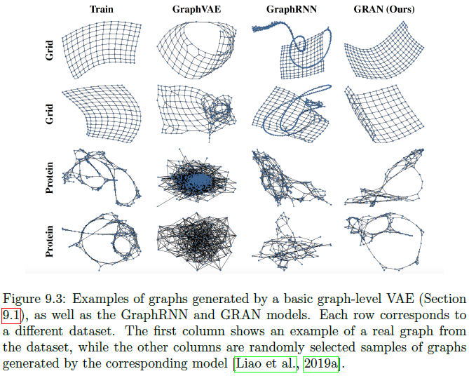

# 第一章 图的基本概念

## 1.1 图的分类

1. 基本的图，有向图vs.无向图，等权图vs.加权图。

2. 多关系图，即有不同类型的边，即图的边表示为$(u,\tau,v)\in \mathcal{\epsilon}$,其中$\tau$为类型。多关系图又分为多重图(multiplex)和异质图(heterogenous)。
   
   - 异质图可以将整个节点分为不相交的节点子集，异质图中的边往往受到节点类型的限制，即特定的边只出现在特定的节点类型中，公式化即：$(u,\tau_i,v)\in\mathcal{\epsilon}\rightarrow u\in\mathcal{V}_i,v\in\mathcal{V}_k$。而多部图(multipartite)又是一种特殊的异质图，它的边只允许出现在不同类型的节点间。
   
   - 多重图，在多重图中我们通常假设图可以被分解为多个层级，每个节点都从属于所有层级，每个层级都代表一种唯一的关系，多重图也允许存在跨层连接，即连接不同层的相同节点。多重图的例子如交通网络，节点表示一个城市，层级表示运输类型（水运、空运、火车等）， 层级间的边代表一个城市可以有多种交通方式，而层内的边则代表不同城市通过同一种交通方式相连。
     
     ## 1.2 特征信息
     
     通常特征信息是节点级的，在一些少数情况下我们也会假设边有实值特征，在更极端的情况下我们甚至会假设整个图都有自己的实值特征。
     
     ## 1.3 图机器学习的类型

3. 节点分类，其主要难点在于节点并不是独立同分布的，几乎所有有效的节点分类方法都使用了**同质性**思想，即节点与其邻居节点有相似属性；最新的研究则聚焦**结构等价性**（Donnat et al,2018），即拥有相似局部结构信息的节点具有相似性，而**异质性**则假设节点会倾向于与自身不同的节点相连。

4. 关系预测，又称链路预测，图补全，关系推断，即基于节点信息和部分边信息，推测特定节点间的边存在性。

5. 聚类和社区检测，图的无监督学习

6. 图的分类、回归和聚类，其难点在于如何基于关系结构定义整个图的特征。
   
   # 第二章 背景与传统方法
   
   ## 2.1 图统计学和核方法
   
   ### 2.1.1 图的统计量

7. 度(degree)，即与该节点相连的边的数量；

8. 中心度(centrality),一种度量方法是**特征向量（eigenvetor）中心度**，即节点的中心度等比于邻居节点的中心度期望
   
   $e_u = \frac{1}{\lambda}\sum_{v\in V}{A_{u,v}e_v},\forall u\in\mathcal{V}$
   
   其中$\lambda$是常数，上述公式可重新公式化为$\lambda \mathbf{e}=\mathbf{Ae}$，即某节点的中心度刚好是特征向量中对应的分量，如果我们需要正的中心度，可以进一步规定该特征向量是邻接矩阵最大特征值对应的特征向量（Perron-Forbenius定理）。度仅仅衡量了邻居节点的数量，中心度还考虑了邻居节点的重要性。另一个理解中心度的角度是，它衡量了一个节点在无限期界随机游走中被访问的概率：
   
   $\mathbf{e}^{(t+1)}=\mathbf{Ae}$
   
   从$(1,1,...,1)$向量开始，依据幂迭代法则，第一次游走得的每个节点的度，无限重复下去，我们就得的每个节点被访问次数的得分，这种理解方式连接了节点重要性、随机游走、谱三种重要概念。其他中心度测度还有**中间（betweenness)中心度和紧密（closeness）中心度**，中间中心度指某个节点处于另两个节点间最短路径上的频率，而紧密中心度则指某个节点与其他所有节点的平均最短距离**（Newman,2018）**。

9. **聚类系数**,即某节点局部邻域内闭合三角的比例，衡量了某节点所有邻居节点的连接程度。公式化的表示为：
   
   $$c_u=\frac{|(v_1,v_2)\in\mathcal{\epsilon}:v_1,v_2\in\mathcal{N}(u)|}{2d_u}$$
   其中$2d_u$为节点邻域内的所有节点对，或者说允许的最大的边的数量。

10. **闭合三角、自我中心图（ego graph)、主题子图（motif）**。闭合三角概念与聚类系数具有等价性，它们都来自于自我中心网络，即以该节点为中心、包括其邻居节点以及所有邻居节点间的边构成的子图。主题子图可视为闭合三角的扩展概念，即一定的连接模式。（多个Motif的序列构成graphlet。）

### 2.1.2 图水平的特征和图核

对于图水平的任务，如图分类，则必须使用图水平的特征，多数提取图特征的方法可归类为**图核方法（graph kernel method）**（Kriege et al,2020;Vishwanathan et al,2010）

1. **Bag of nodes**。即简单地将节点水平的统计量进行聚合（mean,max,sum）。

2. **Weisfieler-Lehman核**。Bag of nodes方法过于简单，一般可以用迭代近邻聚合（iterative neighborhood aggregative）法提高其表现,INA主要思想是抽取比自我中心网络包含更多信息的节点水平信息，然后聚合为图水平信息。其中最著名的INA算法是WL核方法(Weisfeiler and Lehman,1968;Shervashidz et al,2011).WL算法的流程如下：
   
   - 1）对每个节点指定初始标签，大多数情况下，初始标签即节点的度；
   
   - 2）而后通过对节点的邻域当前标签的多集合（multi-set）取hash运算，迭代地为每个节点指定新的标签，即
     
     $$l^{(i)}(v)=f(\{\{l^{(i-1)}(u)\ \ \forall u\in\mathcal{N}(v)\}\})$$
     其中，其中$\{\{\}\}$代表多集合，函数将每个唯一的多集合映射为唯一的标签。
   
   - 3）在K轮迭代后，即得到节点聚合$K-hop$邻域结构的标签，基于这些标签计算统计量作为图的特征，总的来说，WL核测度是两个图导出的标签集合的差异大小，WL算法是用来继续图同构测试（两个具有相同统计量的图是否是同构的）最经典是算法。

3. Graphlets和基于路径（path）的方法
   即若干小的子图结构出现频数构成的向量，但精确计算graphlets涉及子图识别和子图计数两个任务，是NP-Complete任务，只能使用近似方法。
   另一种计算graphlets的方法是基于路径的算法，这种方法不是穷举graphlets,而是检验不同路径出现的频数。如基于随机游走的方法就先进行随机游走，然后计算不同度序列出现的频数，而基于最短路径的核方法则是也是计算度序列的频数，不过不是基于随机游走而是基于节点间的最短路径。基于路径的方法是比较有效的图特征抽取方法，优于基于节点聚合的方法。
   
   ## 2.2 邻域重叠检测
   
   上述节点特征和图特征的缺陷是只能用于节点或图的聚类或分类任务，不能定量分析节点间的关系，即不适用于关系预测任务上。本节将覆盖一些用于关系预测任务的的统计量--邻域重合度，最简单的邻域重合度统计量即对一对节点间的共同邻居节点进行计数，即：
   $$\mathbf{S}[u,v]=|\mathcal{N}(u)\cap \mathcal{N}(v)|$$
   其中，$\mathbf{S}$代表节点$[u,v]$的相似度。
   给定节点的相似度$\mathbf{S}[u,v]$，关系预测最简单的方法就是令边存在的概率等比于相似度：
   $$P(\mathbf{A}[u,v]=1)\propto \mathbf{S}[u,v]$$
   一般而言此方法还是预先设定一个概率阈值，当概率高于此阈值，则$\mathbf{A}[u,v]$存在。
   
   ### 2.2.1 局部重叠测度
   
   局部重叠测度基本上都是建立在上述的相似度基础上，如*Sorensen指数*定义了的节点对邻域重叠矩阵，其元素为：
   $$\mathbf{S}_{Sorensen}[u,v]=\frac{2|\mathcal{N}(u)\cap\mathcal{N}(v)|}{d_u+d_v}$$
   其中$d_u,d_v$为节点的度。**该测度的缺点在于它会倾向于预测度较高的节点间存在边。**
   其他类似的测度方法包括$Salton指数，Jeccard重叠度$:
   $$\mathbf{S}_{Salton}[u,v]=\frac{2|\mathcal{N}(u)\cap \mathcal{N}(v)|}{\sqrt{d_ud_v}}$$
   $$\mathbf{S}_{Jaccard}(u,v)=\frac{|\mathcal{N}(u)\cap\mathcal{N}(v)|}{|\mathcal{N}(u)\cup\mathcal{N}(v)|}$$
   另一些测度方法则不是简单地基于共同邻居节点计数方法，而是进一步考虑了共同邻居节点的重要性，如$资源分配指数(Resource Allocation Index)$而是对共同邻居节点度的逆进行计数：
   $$\mathbf{S}_{RA}[v_1,v_2]=\sum_{u\in\mathcal{N}(v_1)\cap\mathcal{N}(v_2)}{\frac{1}{d_u}}$$
   类似的还有$Adamic-Adar指数$:
   $$\mathbf{S}_{AA}[v_1,v_2]=\sum_{u\in\mathcal{N}(v_1)\cap\mathcal{N}(v_2)}{\frac{1}{log(d_u)}}$$
   这两种测度倾向于认为度较小的节点比度较高的节点提供了更多的信息，因此给与更高的权重。

### 2.2.2 全局重叠测度

局部重叠检测方法在关系预测任务上常常比深度学习方法更有效，但只考虑局部重叠情形，对于没有局部重叠的情况不适用，例如没有共同朋友的两个人可能也会处于同一个社区内，因此我们需要全局重叠测度。

* Katz指数
  Katz指数是最基础的全局重叠指数，它统计的是一对节点之间所有长度的路径数，即：
  $$\mathbf{S}_{Katz}[u,v]=\sum_{i=1}^{\infty}{\beta^i\mathbf{A}^i[u,v]}$$
  其中$\beta$为用户自定义参数，来控制短路径对长路径的相对权重，如$\beta<1$代表降低长路径的权重。

* 矩阵几何级数(Geometric series of matrices)
  Katz指数属于矩阵几何级数的一个特例，针对一个基础的矩阵几何级数其解的形式由如下定理给出：
  `定理1`：令$\mathbf{X}$为实值方阵，令$\lambda_1$为其最大特征值，如果$\lambda_1<1$且$\mathbf{I-X}$非奇异，则$(\mathbf{I-X})^{-1}=\sum_{i=0}^{\infty}{\mathbf{X}^i}$.
  
  证明详见原文。
  
  根据定理1可知，Katz指数的解为：
  $$\mathbf{S}_{Katz}=(\mathbf{I}-\beta\mathbf{A})^{-1}-\mathbf{I}$$.

* Leicht,Holme Newman(LHN)相似度
  Katz指数也同样会偏向于度较大的节点对，因为度较大的节点通常拥有较多的路径。鉴于此，LHN提出了LHN相似性，即真实路径数与(随机模型中的)期望路径数的比值：
  $$\frac{\mathbf{A}^i}{\mathbb{E}[\mathbf{A}^i]}$$
  其中，$\mathbb{E}[\mathbf{A}^i]$为一个随机模型中的路径数，这里我们使用$configuration$模型来生成一个与真实图度分布相同的图，在这个随机图中，我们有：
  $$\mathbb{E}[\mathbf{A}[u,v]]=\frac{d_ud_v}{2m}$$
  其中$m$为图中的节点总数。该式的期望意义为：有$d_u$个边从$u$出发，每个边落在$v$的概率为$\frac{d_v}{2m}$.
  对于$\mathbb{E}[\mathbf{A}^2(u,v)]$,同理可得：
  $$\mathbb{E}[\mathbf{A}^2[u,v]]=\frac{d_{v_1}d_{v_2}}{(2m)^2}\sum_{u\in\mathcal{V}}{(d_u-1)}d_u$$
  上式的意义为：每个长度为2的路径可能穿过任意中间节点$u$，从$v_1$进入$u$的概率为$\frac{d_{v_1}d_u}{2m}$,从$u$到$v_2$的概率为$\frac{d_{v2}(d_u-1)}{2m}$。
  但上述方法对于$i\ge 3$的情况则没有解析式。
  为解决这个问题，**Leicht et al.2006**提出可以用邻接矩阵的最大特征值来近似估计路径数的增长。令$\mathbf{p}_i\in\mathbb{R}^{|\mathcal{V}}$代表u与所有其他节点长度为i的路径数量构成的向量，则对于较大的i：
  $$\mathbf{Ap}_i=\lambda_1\mathbf{p}_{i-1}$$
  亦即$\mathbf{p}_i$将最终收敛于图的主特征向量(dominant eigenvector)。也意味着每一轮两个节点间的路径数以$\lambda_1$的速度增长，即：
  $$\mathbb{E}[\mathbf{A}^i[u,v]]=\frac{d_ud_v\lambda^{i-1}}{2m}$$
  从而最终的LHN指数的公式为：
  $$\mathbf{S}_{\mathrm{LNH}}[u, v]=\mathbf{I}[u, v]+\frac{2 m}{d_{u} d_{v}} \sum_{i=0}^{\infty} \beta \lambda_{1}^{1-i} \mathbf{A}^{i}[u, v]$$
  从而基于定理1的矩阵级数的解为：
  $$\mathbf{S}_{\mathrm{LNH}}=2 \alpha m \lambda_{1} \mathrm{D}^{-1}\left(\mathbf{I}-\frac{\beta}{\lambda_{1}} \mathbf{A}\right)^{-1} \mathbf{D}^{-1}$$

* 随机游走方法
  另一类全局相似性度量方法就是随机游走方法，如$Personalized \  PageRank$算法：定义随机矩阵$\mathbf{P=AD^{-1}}$,相似性向量为：
  $$\mathbf{q}_u=c\mathbf{Pq}_u+(1-c)\mathbf{e}_u$$
  其中$\mathbf{e}_u$节点$u$的one-hot向量编码，分量$\mathbf{q}_u(v)$为始于$u$的随机游走经过$v$的稳定概率，$c$为回到$u$的概率，如果没有$c$（c=1?)则算法退化为标准化的特征向量中心度，而在存在$c$时，该算法同样给出了$u$重要性的一种度量方法。$Personalized \  PageRank$算法的解为：
  $$\mathbf{q}_u=(1-c)(\mathbf{I}-c\mathbf{P})^{-1}\mathbf{e}_u$$.
  从而节点对之间的相似性可定义为：
  $$\mathbf{S}_{RW}[u,v]=\mathbf{q}_u(v)+\mathbf{q}_v[u]$$
  
  ## 2.3 图Laplacian矩阵和谱方法
  
  ### 2.3.1 图Laplacian矩阵

* 非标准化Laplacian矩阵
  非标准化Laplacian矩阵定义为：
  $$\mathbf{L=D-A}$$
  其中，$\mathbf{D,A}$各代表邻接矩阵和度矩阵。
  Laplacian矩阵具有如下性质:
  
  - 对称且半正定(semi-definite)
  - 满足等式$\begin{aligned} \mathrm{x}^{\top} \mathrm{L} \mathrm{x} &=\frac{1}{2} \sum_{u \in \mathcal{V}} \sum_{v \in \mathcal{V}} \mathrm{A}[u, v](\mathrm{x}[u]-\mathrm{x}[v])^{2} \\ &=\sum_{(u, v) \in \mathcal{E}}(\mathrm{x}[u]-\mathrm{x}[v])^{2} \end{aligned}$
  - 其拥有$|V|$个特征值，且最小特征值为0。
    `定理2`:Laplacian矩阵中0特征值的几何重数代表了图中的连通成分的数量。

* 标准化的Laplacian矩阵
  标准化的Laplacian矩阵定义为：
  $$\mathbf{L}_{sym}=\mathbf{D^{-\frac{1}{2}}LD^{-\frac{1}{2}}}$$
  而随机游走Laplacian矩阵定义为：
  $$\mathbf{L}_{RW}=\mathbf{D^{-1}L}$$
  
  ### 2.3.2 图分割与聚类
  
  对于非连通的图，我们可以依据定理2直接进行分割，但对于连通的图，则必须依据Laplacian图的一些性质。

* 图分割任务
  对于一种分割方案$\{\mathcal{A}_k\},i=1,...,K$,分割的优度定义为：
  $$\operatorname{cut}\left(\mathcal{A}_{1}, \ldots, \mathcal{A}_{K}\right)=\frac{1}{2} \sum_{k=1}^{K}\left|(u, v) \in \mathcal{E}: u \in \mathcal{A}_{k}, v \in \overline{\mathcal{A}}_{k}\right|$$
  其中$\bar{\mathcal{A}_k}$定义为$\mathcal{A}_k$的补集。
  上述划分标准倾向于划分单点，因此有如下两个改进方案$Ratio\ cut,Normalized\ cut$：
  $$\operatorname{RatioCut}\left(\mathcal{A}_{1}, \ldots, \mathcal{A}_{K}\right)=\frac{1}{2} \frac{\sum_{k=1}^{K}\left|(u, v) \in \mathcal{E}: u \in \mathcal{A}_{k}, v \in \overline{\mathcal{A}}_{k}\right|}{\left|\mathcal{A}_{k}\right|}$$
  
  $$\operatorname{NCut}\left(\mathcal{A}_{1}, \ldots, \mathcal{A}_{K}\right)=\frac{1}{2} \frac{\sum_{k=1}^{K}\left|(u, v) \in \mathcal{E}: u \in \mathcal{A}_{k}, v \in \overline{\mathcal{A}}_{k}\right|}{\operatorname{vol}\left(\mathcal{A}_{k}\right)}$$
  其中$vol(\mathcal{A})=\sum_{u\in \mathcal{A}}{d_u}$,该方案倾向于边数量均衡的划分。

* 基于Laplacian谱方法的RatioCut近似算法
  以K=2为例，定义向量$\mathbf{a}$如下：
  $$\mathbf{a}[u]=\left\{\begin{array}{ll}\sqrt{\frac{|\bar{A}|}{|\mathcal{A}|}} & \text { if } u \in \mathcal{A} \\ -\sqrt{\frac{|\mathcal{A}|}{|\mathcal{A}|}} & \text { if } u \in \overline{\mathcal{A}}\end{array}\right.$$
  结合图Laplacian矩阵的性质我们得到
  
  即$\mathbf{a}$的表示形式允许我们把$RatioCut$表示为Laplacian矩阵的形式，且其还满足如下两条性质：
  $$\sum_{u\in\mathcal{v}}\mathbf{a}[u]=0\Leftrightarrow\mathbf{a}\bot\mathbb{1}$$
  $$||\mathbf{a}^2||=|\mathcal{V}|$$
  将以上结论结合,$RatioCut$问题即可重写为：
  $\min _{\mathcal{A} \in \mathcal{V}} \mathbf{a}^{\top} \mathbf{L} \mathbf{a}$
  s.t.
  $\mathbf{a} \perp \mathbb{1}$
  $\|\mathbf{a}\|^{2}=|\mathcal{V}|$

但上述问题是一个NP-hard问题，因为$\mathbf{a}$定义表明我们必须在一个离散集合上优化。一个简化方式即忽略离散性，直接对整个实值向量优化：
$\min _{\mathbf{a}\in\mathbb{R}^{|\mathcal{V}|}} \mathbf{a}^{\top} \mathbf{L} \mathbf{a}$
s.t.
$\mathbf{a} \perp \mathbb{1}$
$\|\mathbf{a}\|^{2}=|\mathcal{V}|$
根据$Rayleigh-Ritz定理$,该优化问题的解由$\mathbf{L}$第二小特征值对应特征向量给出（第一小特征值为0），并根据$\mathbf{a}[u]$的正负号进行聚类。
针对$NCut$问题， 其解由$\mathbf{L}_{RW}$第二小特征值对应特征向量给出。

### 2.3.3 广义谱聚类

针对$K>2$的划分，可使用前K个最小特征值，求解思路如下：

1. 计算$\mathbf{L}$的前K个最小特征值对应特征向量。

2. 根据前K个最小特征值对应特征向量构造矩阵$\mathbf{U}$

3. 以$\mathbf{U}$的每个行向量代表每个节点：$\mathbf{z}_u=\mathbf{U}[u]$

4. 使用K均值距离对$\mathbf{z}_u$进行聚类。
   
   ## 2.4 通向学习的表示方法
   
   本章所提及的方法都需要基于手工的特征和统计量，因此不够灵活且耗时，因此需要基于学习的图表示方法。

# 第三章 邻域重建方法

将节点嵌入到低维空间，表示为一个向量，并通过解码器重建节点信息，即邻域重建问题。本章只覆盖简单图和加权图。

## 3.1 Encoder-Decoder视角

### 3.1.1 Encoder

encoder的主要作用是以节点的ID为输入，将节点表示为一个低维向量。多数嵌入方法都属于$shallow \ embedding$方法，这类方法的encoder基本上可视为一个查询表(lookup)，encoder公式化的表示为：

$$ENC(v)=\mathbf{Z}[v]$$

其中，$\mathbf{Z}=\mathbb{R}^{|\mathcal{V}\times d}$,为所有节点的嵌入向量矩阵。

### 3.1.2 Decoder

decoder用于重建节点信息，decoder的类型有很多种，实践中最常用的是$pairwise\ decoder$，即接收成对的两个节点为输入，这种方法对重建节点关系非常友好。decoder公式化的表示为：

$$DEC(ENC(u),ENC(v))=DEC(\mathbf{z}_u,\mathbf{z}_v)\simeq \mathbf{S}[u,v]$$

其中$\mathbf{S}[u,v]$为基于图的相似性度量。

### 3.1.3 优化Encoder-Decoder模型

基于encoder-decoder模型，重建损失可表示为：

$$\mathcal{L}=\sum_{(u,v)\in\mathcal{D}}{\mathcal{l}(DEC(\mathbf{z}_u,\mathbf{z}_v),\mathbf{S}[u,v])}$$

其中$\mathit{l}$为损失测度函数，$\mathcal{D}$为训练集。因此，重建损失选择包括：解码函数、相似度函数、损失函数。

### 3.1.4 encoder-decoder方法概述

目前的浅层编码器大致可分为两种一种是基于矩阵分解的，如LLE,Graph Fact.,GraRep,HOPE;另一种基于随机游走，如DeepWalk,node2vec,各方法的解码函数、相似性函数、损失函数对比如下：

## 3.2 基于矩阵分解的方法

* Laplacian eigenmaps

LLE是最早也是最有影响力的矩阵分解嵌入方法，其理论基础是谱聚类思想，以**L2距离** 作为解码器，同时以解码器作为距离度量的权重，即：

$$\mathcal{L}=\sum_{(u,v)\in\mathcal{D}}{DEC(\mathbf{z}_u,\mathbf{z}_v)\cdot \mathbf{S}[u,v]}$$

其中$DEC(\mathbf{z}_u,\mathbf{z}_v)=||\mathbf{z}_u-\mathbf{z}_v||_2$

如果$\mathbf{S}$满足$Laplacian$矩阵的性质，则LLE与 谱聚类的解完全相同；如果我们假设嵌入维度为$d$，则上式的解可以由$Laplacian$矩阵的前$d$个最小特征值对应特征矩阵给出。

* 内积方法

最近的浅层嵌入方法则把$L2$距离的解码器修改为内积，而把损失函数修改为均方误，如GF、GraRep、HOPE即：

$$\mathcal{L}=\sum_{(u,v)\in\mathcal{D}}{||DEC(\mathbf{z}_u,\mathbf{z}_v)- \mathbf{S}[u,v]||_2^2}$$

其中，$DEC(\mathbf{z}_u,\mathbf{z}_v)=\mathbf{z}_u\mathbf{z}_v$

GF、GraRep、HOPE三者的区别在$\mathbf{S}$,GF直接使用了邻接矩阵，即$\mathbf{S}\dot=\mathbf{A}$;而GraRep则使用的相似度函数是基于邻接矩阵的幂；HOPE则支持广义的邻域重叠测度函数。

这些方法被称为矩阵分解法的原因在于它们的损失函数可以用矩阵分解方法来优化，如SVD。

## 3.3 随机游走嵌入方法

上述的内积方法使用了确定性的节点相似性测度，借鉴内积方法的经验，近年来一些方法开始将其应用于邻域重叠的随机测度，其核心创新在于将随机游走中共现频率较高的节点定义为相似节点，并映射到邻接的嵌入空间。

* DeepWalk与node2vec

DeepWalk和node2vec使用了相同的解码器和损失函数，它们的核心区别在于相似性和邻域重建的定义。二者的解码函数，大致可写为：

$$\begin{aligned} \operatorname{DEC}\left(\mathbf{z}_{u}, \mathbf{z}_{v}\right) & \triangleq \frac{e^{\mathbf{z}_{u}^{\top} \mathbf{z}_{v}}}{\sum_{v_{k} \in \mathcal{V}} e^{\mathbf{z}_{u}^{\top} \mathbf{z}_{k}}} \\ & \approx p_{\mathcal{G}, T}(v \mid u) \end{aligned}$$

其中，$p_{\mathcal{G}, T}(v \mid u)$代表二者在长度为$T$、出发点为$u$的随机游走中共线的概率,通常$T\in[2,10]$。再次强调一点，上式中的相似性测度是随机且非对称的。

二者标准的损失函数为：

$$\mathcal{L}=\sum_{(u,v)\in \mathcal{D}}{-log(DEC(\mathbf{z}_u,\mathbf{z}_v))}$$

但上述损失函数是不可估计的，为简化计算，DeepWalk采用了分层softmax方法加速计算；而node2vec采用了对比学习的思路，其损失函数为：

$$\mathcal{L}=\sum_{(u, v) \in \mathcal{D}}-\log \left(\sigma\left(\mathbf{z}_{u}^{\top} \mathbf{z}_{v}\right)\right)-\gamma \mathbb{E}_{v_{n} \sim P_{n}(\mathcal{V})}\left[\log \left(-\sigma\left(\mathbf{z}_{u}^{\top} \mathbf{z}_{v_{n}}\right)\right)\right]$$

其中$\sigma$为sigmoid函数，而$P_n(\mathcal{V})$为负样本的分布，$\gamma$为控制负样本权重的超参数。

node2vec与DeepWalk另一个区别在于，node2vec的随机游走采样策略是一种灵活的策略，可以自由调节广度优先和深度优先的相对权重。

* LINE(large-scale information network embeddings)

LINE算法虽然没有直接使用随机游走，但与DeepWalk的出发点是一样的，其主要思想是结合两种encoder-decoder目标，即两阶近邻信息。一阶近邻信息采用邻接矩阵作为相似度测度，并使用sigmoid函数与内积作为解码函数，即：

$$DEC(\mathbf{z}_u,\mathbf{z}_v)=\frac{1}{1+e^{-\mathbf{z}_u^T\mathbf{z}_v}}$$

其中的相似性测度为邻接矩阵。

二阶近邻信息则使用了类似DeepWalk的方法，即：

$$\begin{aligned} \operatorname{DEC}\left(\mathbf{z}_{u}, \mathbf{z}_{v}\right) & \triangleq \frac{e^{\mathbf{z}_{u}^{\top} \mathbf{z}_{v}}}{\sum_{v_{k} \in \mathcal{V}} e^{\mathbf{z}_{u}^{\top} \mathbf{z}_{k}}} \\ & \approx p_{\mathcal{G}, T}(v \mid u) \end{aligned}$$

但使用KL散度来编码two-hop近邻信息,即$\mathbf{A}^2$的信息来进行训练。

* 随机游走方法的其他变体

Perozzi et al,2016考虑了节点之间的跳跃，并使用了类似GraRep的相似性度量。Ribeiro et al,2017考虑了结构关系。

### 3.3.1 随机游走方法和矩阵分解方法的区别与联系

矩阵方法与随机方法是极其紧密相关的，如假设我们定义如下的节点相似性值：

$$\mathrm{S}_{\mathrm{DW}}=\log \left(\frac{\operatorname{vol}(\mathcal{V})}{T}\left(\sum_{t=1}^{T} \mathbf{P}^{t}\right) \mathbf{D}^{-1}\right)-\log (b)$$

其中$b$为常数，而$\mathbf{P=D^{-1}A}$,Qiu et al. 2018证明DeepWalk的嵌入矩阵满足:

$$\mathbf{Z^TZ}\approx \mathbf{S}_{DW}$$

而$\mathbf{S}_{DW}$的内层可以分解为：

$$\left(\sum_{t=1}^{T} \mathbf{P}^{t}\right) \mathbf{D}^{-1}=\mathbf{D}^{-\frac{1}{2}}\left(\mathbf{U}\left(\sum_{t=1}^{T} \Lambda^{t}\right) \mathbf{U}^{\top}\right) \mathbf{D}^{-\frac{1}{2}}$$

其中$\mathbf{U\Lambda U}^T=\mathbf{L}_{sym}$恰好为$Laplacian$矩阵的特征分解。

## 3.4 浅层嵌入的局限

* 没有参数共享机制，导致统计和计算上的低效，统计上的低效只不能共享学习经验，计算低效指计算复杂度随节点数线性增长。
* 没有使用节点特征。
* 是transductive学习，没有外延性。

# 第四章 多关系数据与知识图谱

本章的大多数内容都是为了进行知识图谱补全（有时也可以用于节点分类任务），在知识图谱补全任务中，图多表现为多关系图，即边定义为$e=(u,\tau,v)$,其中$\tau$为关系类型，$u,v$为节点，在知识图谱中通常称为头实体和尾实体。本章只覆盖基于嵌入的几个经典算法，更多的内容可参阅**Nickel et al. 2016**.

## 4.1 重建多关系数据

为应对多种类型的关系，我们需要对解码器进行扩展，使可以接受关系类型，即$ENC:\mathbb{R}^d\times \mathcal{R}\times \mathbb{R}^d\to \mathbb{R}^+$。

最早的多关系嵌入算法是RESCAL，其解码器为：

$$DEC(u,\tau,v)=\mathbf{z}_u^T\mathbf{R}_{\tau}\mathbf{z}_v$$

其损失函数可表示为：

$$\begin{aligned} \mathcal{L} &=\sum_{u \in \mathcal{V}} \sum_{v \in \mathcal{V}} \sum_{\tau \in \mathcal{R}}\|\operatorname{DEC}(u, \tau, v)-\mathcal{A}[u, \tau, v]\|^{2} \\ &=\sum_{u \in \mathcal{V}} \sum_{v \in \mathcal{V}} \sum_{\tau \in \mathcal{R}}\left\|\mathbf{z}_{u}^{\top} \mathbf{R}_{\tau} \mathbf{z}_{v}-\mathcal{A}[u, \tau, v]\right\|^{2} \end{aligned}$$（4.2）

其中$\mathcal{A}$为多关系图中的邻接张量。上式的优化可称为$张量分解$。

* 损失函数，解码器和相似度函数

**多关系嵌入的解码器的相似性度量几乎都是基于邻接张量（邻接矩阵的扩展）**，也就是说我们要重建的是最邻接（immediate）的多关系近邻节点，所以多关系嵌入可选项只有损失函数和解码器。

## 4.2 损失函数

式(4.2)的缺点在于：(1)计算代价高；(2)均方误差损失函数适合回归任务，但关系预测更类似于分类任务。为此需要对损失函数进行改进，较成功的有如下两种：

* 基于负样本的交叉熵损失(cross-entropy)

$$\mathcal{L}=\sum_{(u, \tau, v) \in \mathcal{E}}-\log \left(\sigma\left(\operatorname{DEC}\left(\mathbf{z}_{u}, \tau, \mathbf{z}_{v}\right)\right)\right)-\gamma \mathbb{E}_{v_{n} \sim P_{n, u}(\mathcal{V})}\left[\log \left(\sigma\left(-\operatorname{DEC}\left(\mathbf{z}_{u}, \tau, \mathbf{z}_{v_{n}}\right)\right)\right)\right]$$      (4.4)

其中$\sigma,P,\gamma$依次是sigmoid函数、负样本分布、超参数，其中期望使用MC模拟求得。

* Max-margin损失

最大边际损失是另一种比较流行的损失函数：

$$\mathcal{L}=\sum_{(u, \tau, v) \in \mathcal{E}} \sum_{v_{n} \in \mathcal{P}_{n, u}} \max \left(0,-\operatorname{DEC}\left(\mathbf{z}_{u}, \tau, \mathbf{z}_{v}\right)+\operatorname{DEC}\left(\mathbf{z}_{u}, \tau, \mathbf{z}_{v_{n}}\right)+\Delta\right)$$         (4.8)

其中$\Delta$为最大损失边际，如果两个节点对（正样本对$(u,v)$和负样本对$(u,v_n)$）的解码得分差异大于$\Delta$，则其损失记为0；这种估计方法称为对比估计，该损失函数又称$hinge$损失。

## 4.3 多关系解码器

* ​                                                            表4.1 **各主要多关系图的decoder**
  
  

RESCAL计算复杂度为$O(d^2)$，故应用范围有限,近期的解码器则复杂度为$O(d)$，因此更受欢迎。

* Translational decoders
  
  - TransE:使用基于欧式距离的解码器，如表4.1。
  - TransX：TransE过于简化，之后的工作对其进行了改进，这些改进都有形如上表4.1的形式，此处统称为TransX，其中$g_{i,\tau}$是依赖于关系类型$\tau$的、可训练的变形器(transformation)。如TransH的解码器为：$DEC(\mathbf{z}_u,\tau,\mathbf{z}_v)=-\mid \mid (\mathbf{z}_u-\mathbf{w}_r\mathbf{z}_u\mathbf{w}_r)+\mathbf{r}_{\tau}-(\mathbf{z}_v-\mathbf{w}_r\mathbf{z}_v\mathbf{w}_r)\mid\mid$,其他TransX可参阅**Nguyen et al.2016和Ji et al.2015**

* 多线性点积(multi-linear dot products)
  
  * DistMult:使用点积作为解码器，即表4.1中$<\mathbf{z}_u,\mathbf{r}_{\tau},\mathbf{z}_v>$代表各向量的点积操作

* 复数解码器
  
  * ComplEx:DistMult只能处理对称关系，因此Troullon et al.2016在其基础上使用复数值进行嵌入，即$DEC(\mathbf{z}_u,\mathbf{r}_{\tau},\mathbf{z}_v)=Re(<\mathbf{z}_u,\mathbf{r}_{\tau},\bar{\mathbf{z}_v}>)$,其中解码器的各向量都是复数，$Re$代表点积结果的实部，而$\bar{\mathbf{z}_v}$代表对应向量的共轭复数。
  * RotatE:与ComplEx相似也使用了复数，如表4.1，其中$\circ$代表Hadamard积，同时限定$|\mathbf{r}_{\tau}[i]|=1,\forall i\in[1,d]$,这个限制暗含关系嵌入的每个维度可以表示为：$\mathbf{r}_{\tau}[i]=e^{i\theta_{\tau,i}}$.

### 4.3.1 表示能力

关系的逻辑模式一般有三种：

* **对称与反对称(anti-symmetry)**：对称是指$(u, \tau, v) \in \mathcal{E} \leftrightarrow(v, \tau, u) \in \mathcal{E}$，可类比同学关系，而反对称指$(u, \tau, v) \in \mathcal{E} \leftrightarrow(v, \tau, u) \notin \mathcal{E}$，可类比父子关系.强大的解码器需要同时处理对称性和反对称性,DistMult只能处理反对称性，而TransE只能处理对称性。

* **逆变性(Inversion)**:即$(u, \tau_1, v) \in \mathcal{E} \leftrightarrow(v, \tau_2, u) \in \mathcal{E}$,即头实体和尾实体的位置变换，则关系类型也发生变化，可类比父子关系，DistMult和TransX不能处理逆变性。

* **复合性(Compositionality)**,即$\left(u, \tau_{1}, y\right) \in \mathcal{E} \wedge\left(y, \tau_{2}, v\right) \in \mathcal{E} \rightarrow\left(u, \tau_{3}, v\right) \in \mathcal{E}$，如$(子-父)\wedge(夫-妻)\to (子-母)$

* ​                **表4.2 各算法的表示能力**
  
  
  
  # 第五章 图神经网络
  
  乱序不变性和等价性(permutation invariance and equivariance)

直接使用邻接矩阵作为输入进行学习，会导致学习的结果极其依赖节点的编号，即没有乱序不变性。应用于图数据的学习器必须满足乱序不变性或乱序等价性，公式化的表示即：

$$f(\mathbf{PAP}^T)=f(\mathbf{A})$$(乱序不变性)

$$f(\mathbf{PAP}^T)=\mathbf{P}f(\mathbf{A})$$(乱序等价性)

其中$\mathbf{P}$为乱序矩阵。前面两章提到的浅层嵌入具有乱序等价性。

## 5.1 神经信息传递(neural message passing)

导出GNN的动机有很多种，如适用于非欧式数据的广义卷积网络、可微的信念传播、图同构测试，但除了动机，GNN的定义都使用了神经信息传递的概念，即使用神经网络进行节点间的信息交换和更新。本章将对神经信息传递框架进行介绍。

### 5.1.1 信息传递框架概述

在每次信息传递迭代过程中，GNN都会使用节点的邻居节点信息来更新节点的隐含嵌入（hidden embedding）向量，这个过程可公式化地表示为：

$$\begin{aligned} \mathbf{h}_{u}^{(k+1)} &=\mathrm{UPDATE}^{(k)}\left(\mathbf{h}_{u}^{(k)}, \text { AGGREGATE }^{(k)}\left(\left\{\mathbf{h}_{v}^{(k)}, \forall v \in \mathcal{N}(u)\right\}\right)\right) \\ &=\operatorname{UPDATE}^{(k)}\left(\mathbf{h}_{u}^{(k)}, \mathbf{m}_{N(u)}^{(k)}\right) \end{aligned}$$

其中$UPDATE,AGGREGATE$为任意可微函数，$\mathbf{m}_{\mathcal{N}(u)}$即从邻居节点聚合的信息，初始的隐含嵌入可使用特征信息，即$\mathbf{h}_u^{(0)}=\mathbf{x}_u$,而最终输出的嵌入向量即最后一轮的隐含嵌入。还要注意的是，因为聚合函数以集合作为输入，故GNN具有乱序等价性。此外，如果我们没有节点特征，则可以使用节点统计量或ID特征（节点的one-hot编码，但这种特征是transductive的）。

### 5.1.2 GNN的动机与直觉

GNN信息传递的机制是，每进行一次信息传递的迭代，每个节点都会接收到更远一跳(hop)的节点的信息，如在第$k$轮就会接收$k$跳邻居的信息。此处信息有两种，一种是图的结构信息，如$\mathbf{h}_u^{(k)}$就可能包含了所有$k$跳节点的度信息。另一种则是特征信息，这种机制可类比CNN的卷积核。

### 5.1.3 最基础的GNN

最基础的GNN是Scarselli et al.2009,其形式为：

$$\mathbf{h}_{u}^{(k)}=\sigma\left(\mathbf{W}_{\text {self }}^{(k)} \mathbf{h}_{u}^{(k-1)}+\mathbf{W}_{\text {neigh }}^{(k)} \sum_{v \in \mathcal{N}(u)} \mathbf{h}_{v}^{(k-1)}+\mathbf{b}^{(k)}\right)$$

其中，$\mathbf{W}_{self}^{(k)},\mathbf{W}_{neigh}^{(k)}\in\mathbb{d^{(k)}\times d^{(k-1)}}$,而$\sigma$为元素级的非线性函数。

即：$\mathbf{m}_u=\sum_{v \in \mathcal{N}(u)} \mathbf{h}_{v}^{(k-1)}$  （5.8）

$$UPDATE(\mathbf{h}_u,\mathbf{m}_{\mathcal{N}(u)})=\sigma\left(\mathbf{W}_{\text {self }}^{(k)} \mathbf{h}_{u}^{(k-1)}+\mathbf{W}_{\text {neigh }}^{(k)} \mathbf{m}_{\mathcal{N}(u)}+\mathbf{b}^{(k)}\right)$$   （5.9）

这个版本的GNN类似于一个标准的MLP或Elman RNN,其聚合函数为$sum$,更新函数则是元素级的非线性加可训练的参数。

**注**：本书之后的记号中将可能省略偏置项。

* 节点级和图级的公式

本书多数时候使用的是节点级的公式，但很多GNN算法的公式也可以很简洁地扩展到图级，如最基础的GNN中，图级的公式可写为：

$$\mathbf{H}^{(t)}=\sigma(\mathbf{AH}^{(k-1)}\mathbf{W}_{neigh}^{(k)}+\mathbf{H}^{(k-1)}\mathbf{W}_{self}^{(k)})$$

其中，$\mathbf{H}$即节点相连构成的矩阵，而$\mathbf{A}$为邻接矩阵，此处省略了偏置项。当然，并不是所有GNN都可以如此表示，如基于attention机制算法。

### 5.1.4 包含自循环的信息传递

包含自循环(self-loop)的信息传递可表示为：

$$\mathbf{h}_u^{(k)}=AGGREGATE(\{\mathbf{h}_v^{(k)},\forall v\in\mathcal{N}(u)\cup\{u\}\})$$

即每次迭代中不仅聚合邻接节点的信息还聚合自身的信息，这种处理方式的好处在于不必再显式地定义更新函数，且可以防止过拟合，坏处是因混同邻居节点与自身的信息而限制了GNN的表示能力。

最基本的GNN中，包含了自循环的版本的图级迭代公式可写为：

$$\mathbf{H}^{(t)}=\sigma\left((\mathbf{A+I})\mathbf{H}^{(t-1)}\mathbf{W}^{(t)}\right)$$

## 5.2 广义邻域聚合

### 5.2.1 邻域标准化

基础的GNN使用了$sum$进行节点聚合，但这种方式不稳定、对度值敏感。解决该问题一个简单的思路是使用标准化操作，即：

$$\mathbf{m}_{\mathcal{N}(u)}=\frac{\sum_{v\in \mathcal{N}_{(u)}}{\mathbf{h}_v}}{\mid\mathcal{N}(u)\mid}$$

但有学者发现其他形式的标准化操作效果更好，如Krif and Welling 2016的对称标准化：

$$\mathbf{m}_{\mathcal{N}(u)}=\frac{\sum_{v\in \mathcal{N}_{(u)}}{\mathbf{h}_v}}{\sqrt{\mid\mathcal{N}(u)\mid\mid\mathcal{N}_v\mid}}$$

对称标准化加基础GNN可以作为谱卷积的一阶近似。

* 图卷积网络

最流行的图神经网络的baseline即GCN，它结合了对称标准化聚合函数和自循环更新方法，公式化的表示为：

$$\mathcal{h}_u^{(k)}=\sigma\left(\mathbf{W}^{(k)}\frac{\sum_{v\in \mathcal{N}_{(u)}\cup \{u\}}{\mathbf{h}_v}}{\sqrt{\mid\mathcal{N}(u)\mid\mid\mathcal{N}_v\mid}}\right)$$

值得说明的是，合适的标准化操作可以提高模型的表现，但同样也可能带来信息的损失。在进行标准化后，就很难使用学习后的嵌入来区分具有不同度的节点，或其他图结构特征。通常标准化适用于节点特征信息比结构信息更有效的场景中，或者度的分布范围非常广以至于会导致不稳定场景。

### 5.2.2 集合聚合器

GNN中的聚合函数天然是一个集合函数，它需要讲邻居节点集合的嵌入向量映射为一个嵌入向量，由于集合是无序的，故聚合函数也必须具有乱序不变性。

* 集合池化

主流聚合函数都建立在乱序不变性神经网络理论基础上，如Zaheer et al.2017表明，具有如下形式的聚合函数是一个通用集合函数近似器(universal set function approximator):

$$\mathbf{m}_{\mathcal{N}(u)}=MLP_{\theta}\left(\sum_{v\in\mathcal{N}(u)}{MLP_{\phi}(\mathbf{h}_v)}\right)$$                         (5.17)

上式中的$\sum$操作也可以换为求元素级的$Min,Max$等操作。将上述模型与标准化操作结合的方式也很常见，如$GraphSAGE-pool$.

基于式(5.17)的集合池化操作只能带来很小的表现提升，而且会视MLP的深度可能会带来过拟合风险。因此，如果使用集合池化，常常只会使用单隐层MLP，因为模型的表示能力已经满足理论需求。

* Janossy池化

集合池化是在内层聚合结构的基础上增加了一层MLP，这种思路非常简单，但会增加模型的复杂度。基于此，Murphy et al. 2018提出了Janossy池化，它非常简单但比$sum,mean$强大。邻域聚合函数的要点在于乱序不变性，Janossy池化通过使用乱序敏感函数和对几种可能的乱序结果进行平均来实现。

令$\pi_i\in\Pi$为乱序函数，其作用为将集合$\{\mathbf{h}_v,\forall v\in \mathcal{N}(u)\}$映射为向量序列$(\{\mathbf{h}_i,i\in[1,|\mathcal{N}(u)|]\})_{\pi_i}$,即$\pi_i$以无序的邻居节点嵌入向量集合为输入，并以某个顺序置放这些嵌入向量在一个序列中，Janossy符号化的表示为：

$$\mathbf{m}_{\mathcal{N}(u)}=MLP_{\theta}\left(\frac{1}{|\Pi|}\sum_{\pi\in\Pi}{\rho_{\phi}(\mathbf{h}_{v_1},...,\mathbf{h}_{|\mathcal{N}(u)|})_{\pi_i}}\right)$$            （5.18）

其中$\Pi$为乱序函数的集合，$\rho_{\phi}$为乱序敏感函数，即一个作用与序列的神经网络，如LSTM。

如果乱序集合$\Pi$为所有可能的顺序，则（5.18）也是一个通用函数近似器如（5.17）。但这种操作代价很高，实际操作中常采用如下两种方式：

1. 每次应用聚合器时仅采样一个子集。
2. 使用典型的邻居节点顺序，如将节点按度降序排列。Muphy et al.2018对包括以上两种方法的多种方法进行了比较，证明了Janossy池化的有效性。

### 5.2.3 邻域注意力

另一类比较流行的集合集合函数是注意力机制，注意力机制最基本的思想就是为为个邻居指派权重或重要性，最初的GAT（Velickovic et al.2018)使用了如下基本的注意力机制：

$$\mathbf{m}_{\mathcal{N}(u)}=\sum_{v\in\mathcal{N}(u)}{\alpha_{u,v}\mathbf{h}_v}$$（5.19）

$$\alpha_{u, v}=\frac{\exp \left(\mathbf{a}^{\top}\left[\mathbf{W} \mathbf{h}_{u} \oplus \mathbf{W} \mathbf{h}_{v}\right]\right)}{\sum_{v^{\prime} \in \mathcal{N}(u)} \exp \left(\mathbf{a}^{\top}\left[\mathbf{W} \mathbf{h}_{u} \oplus \mathbf{W} \mathbf{h}_{v^{\prime}}\right]\right)}$$(5.20)

其中$\alpha$即注意力权重,$\mathbf{W}$为可训练的参数矩阵，$\oplus$为拼接(concatenation)操作。

除(5.20)的注意力，比较流行注意力机制还是双线性注意力(bilinear)：

$$\alpha_{u, v}=\frac{\exp \left(\mathbf{h}_{u}  \mathbf{W} \mathbf{h}_{v}\right)}{\sum_{v^{\prime} \in \mathcal{N}(u)} \exp \left(\mathbf{h}_{u}  \mathbf{W} \mathbf{h}_{v}\right)}$$(5.21)

和基于MLP的注意力：

$$\alpha_{u, v}=\frac{\exp \left(MLP(\mathbf{h}_{u} , \mathbf{h}_{v})\right)}{\sum_{v^{\prime} \in \mathcal{N}(u)} \exp \left(MLP(\mathbf{h}_{u} , \mathbf{h}_{v})\right)}$$(5.22)

少数文献使用了多头注意力机制，即计算$K$个独立的注意力权重，基于$K$个注意力权重进行聚合，然后再进行结合（一般直接使用拼接操作),如下：

$$\mathbf{m}_{\mathcal{N}(u)}=[\mathbf{a}_1\oplus...\oplus\mathbf{a}_K]$$

$$\mathbf{a}=\mathbf{W}_i\sum_{v\in\mathcal{N}(u)}\alpha_{u,v,k}\mathbf{h}_v$$

使用其他注意力机制

* 图注意力与transformers

图的多头注意力机制与transformer机制非常相似，transformers的主要思路就是完全基于注意力机制定义神经网络。在transformer的每一层，会对输入的所有位置的生成一个新的隐表示（hidden representation)，计算方式是使用多注意力头计算每一对位置的注意力权重，然后基于注意力权重计算加权和进行聚合。一些学者对二者的结合进行了尝试，如直接使用transformer进行建模，然后基于二项邻接矩阵掩码（mask）来确保模型只聚合真正相连的邻接节点。但该方法缺点是由于需要计算任意一对节点的注意力，因此复杂度为$O(|\mathcal{V}|)^2$，而标准的GNN通常是$O(|\mathcal{V}||\epsilon|)$

在已知某些节点的影响力确实比另一些节点的影响力大时，使用注意力机制可以显著提高模型的表现。

## 5.3 广义更新函数

* 过度平滑与邻域影响力

GNN一个重要的问题是过度平滑问题，即在多轮信息传递之后，图中所有节点的表示变得非常相似，这个问题在基本的GNN模型和使用self-loop的模型中比较严重，过度平滑会使得建立（用于解决长程依赖的）深层网络非常困难。过度平滑问题可以以每个节点的特征对其他节点最终输入的影响来公式化度量（Xu et al.2018)，即：

$$I_K(u,v)=\mathbf{1}^{\top}\left(\frac{\partial \mathbf{h}_{v}^{(K)}}{\partial \mathbf{h}_u^{(0)}}\right)\mathbf{1}$$

* `定理三`:对于使用自循环更新函数和如下形式的聚合函数的GNN模型，

$$AGGREGATE $\left(\left\{\mathbf{h}_{v}, \forall v \in \mathcal{N}(u) \cup\{u\}\right\}\right)=\frac{1}{f_{n}(|\mathcal{N}(u) \cup\{u\}|)} \sum_{v \in \mathcal{N}(u) \cup\{u\}} \mathbf{h}_{v}$$

其中$f$为任意可微标准化函数。

则节点间影响力满足$I_K(u,v)\propto p_{\mathcal{g},K}(u|v)$

其中$p_{\mathcal{g},K}(u|v)$为以$u$为起始点长度为$K$的随机游走访问节点$v$的概率。

这意味着，如果$K\rightarrow \infty$，则节点的结构信息会丢失。而在实际图中，只需要$K=O(log(|\mathcal{V}|))$，节点邻接信息就已经丧失了。

此外，如果$||\mathbf{W}_{self}^{(k)}||<||\mathbf{W}_{neigh}^{(k)}||$，即使不使用自循环更新函数，也会有定理三的结论。

### 5.3.1 拼接与残差连接(skip-connections)

过度平滑会发生是由于在信息传递过程中，邻域信息超过本节点信息开始主宰嵌入表示。因此一个非常直观的方法就是加入残差连接或向量拼接来直接保持前一轮的信息传递。

我们记(5.9)为$UPDATE_{base}$，一种最简单的残差连接更新函数即将节点信息与$UPDATE_{base}$拼接，即：

$UPDATE_{concat}(\mathbf{h}_u,\mathbf{m}_{\mathcal{N}(u)})=[UPDATE_{base}(\mathbf{h}_u,\mathbf{m}_{\mathcal{N}(u)})\oplus\mathbf{h}_u]$

其他的残差连接还有线性插值法：

$UPDATE_{interpolate}(\mathbf{h}_u,\mathbf{m}_{\mathcal{N}(u)})=\mathbf{\alpha}_1\circ UPDATE_{base}(\mathbf{h}_u,\mathbf{m}_{\mathcal{N}(u)}) + (1-\mathbf{\alpha}_1)\circ\mathbf{h}_u$

其中$\circ$ 为元素级相乘,$\alpha\in[0,1]^d$为门向量以控制邻域信息保留的比例，其中$\mathbf{\alpha}$可以通过联合训练等方式训练。

对2-5层的GNN，skip-connection的效果在节点分类和同质性检验上非常优秀。

### 5.3.2 门更新(Gated Updates)

skip-connection是应用在CV领域的更新方法，而门更新则是应用在RNNs的更新方法。这种视角下，GNN的信息传递机制为：聚合函数接收邻接节点的**观测**,然后用以更新每个节点的隐状态。如，一种早期的GNN结构的更新函数为：

$$\mathbf{h}_u^{(k)}=GRU(\mathbf{h}_u^{(k-1)},\mathbf{m}_{\mathcal{N}(u)}^{(k)})$$

其中$\mathbf{m}$可以视为观测向量，而$\mathbf{h}$可以视为隐状态。

理论上，所有应用于RNN的函数都可以应用于GNN，而且RNNs更新函数的参数共享机制也非常适合GNN。门更新适合较深的GNN结构，可以有效防止过拟合。**在需要对全局结构进行推理的任务上表现优秀，如过程分析和组合优化(Li et al.2015,Selsam et al.2019)** 

### 5.3.3 跳跃知识连接（Jumping Knowledge Connection)

通常，我们使用最后一层的输出作为嵌入向量，这是需要门更新或残差连接的原因，而一种提高最终节点表示的策略是结合每层信息传递的表示而不是最后一层，即：

$\mathbf{z}_{u}=f_{JK}(\mathbf{h}_u^{(0)}\oplus...\oplus\mathbf{h}_{u}^{(K)})$

其中$f_{JK}$为任意可微函数，而$\oplus$为拼接操作。种更新函数在各种任务中都取得了稳定的性能提高。**Xu et al.2018)**

## 5.4 边特征和多关系GNN

### 5.4.1 关系型GNN

最早的关系型GNN是Relational Graph Convolutional Network(RGCN, Schlichtkrull et al.2017),在RGCN中，作者扩展了聚合函数，为每种关系类型指定了一种变换矩阵：

$\mathbf{m}_{\mathcal{N}(u)}=\sum_{\tau \in \mathcal{R}} \sum_{v \in \mathcal{N}_{\tau}(u)} \frac{\mathbf{W}_{\tau} \mathbf{h}_{v}}{f_{n}(\mathcal{N}(u), \mathcal{N}(v))}$                （5.33）

其中，$f_n$为标准化函数，它以节点$u$和$u$的每个邻居节点$v$的邻居节点为输入。

* 参数共享

原始RGCN的一个缺陷是没有参数共享机制导致过拟合和低学习速度，克服该方法的一个策略是与基础矩阵进行参数共享，即：

$\mathbf{W}_{\tau}=\sum_{i=1}^b{\alpha_{i,\tau}\mathbf{B}_i}$

在基础矩阵法中，所有的关系矩阵都定义为$b$个基础矩阵$\mathbf{B}_i$的线性组合。只有关系参数$\alpha_{i,\tau}$随着关系变化。

* 其他变体或扩展：如Teru et al.2019

### 5.4.2 注意力和特征拼接

为每个关系指定聚合参数适用于多关系图和具有离散边特征的情况，但不太适用于与多种类型特征的情形，面对这种情况我们可以将这些特征融合注意力机制或者对信息进行拼接以聚合不同类型的边特征，如：

$$\mathbf{m}_{\mathcal{N}(u)}=AGGREGATE_{base}(\{\mathbf{h}_v\oplus \mathbf{e}_{(u,\tau,v)},\forall v\in \mathcal{N}(u)\})$$

其中$\mathbf{e}_{(u,\tau,v)}$为任意值特征（vector-valued feature)向量，这种方法作为基础聚合函数行有较显著的提高。

## 5.5 图池化

对于图水平的任务，我们需要对所有节点的嵌入进行聚合来进行整个图的嵌入。

* 集合池化方法

图池化任务类似于聚合函数，所以所有适用于邻域聚合的函数都适用于图池化，其中有两种最常用，第一种是直接取和或均值，即：

$$\mathbf{z}_{\mathcal{G}}=\frac{\sum_{v\in\mathcal{V}}{\mathbf{z}_c}}{f_n(|\mathcal{V}|)}$$

其中$f_n$为标准化函数，这种方法适用于小型的图。

第二种方法则是基于LSTM和注意力机制，该方法的每一轮更新如下：

其中(5.38)表示注意力的查询向量,(5.39)为注意力得分,(5.40)为注意力得分的标准化操作,(5.41)为观测向量.

最终的嵌入表示为所有观测向量的拼接:

$$\mathbf{z}_{\mathcal{G}}=\mathbf{o}_1\oplus...\oplus\mathbf{o}_T$$

* 图坍缩(corsening)方法

集合池化的缺点在于没有利用图的结构信息,但结构信息在进行图级别的任务时其实是有必要的,一种利用图结构信息的方式是进行图聚类或坍缩方法.假设存在某个聚类函数$f_c$(如谱聚类方法,甚至其他结构GNN网络)能将图的所有节点聚为$c$类,假设该函数的输出为$\mathbf{S}=f_c(\mathcal{G},\mathbf{Z})$,其中$\mathbf{S}[u,i]$表示节点$u$属于类$i$的强度.

除了聚类函数,坍缩方法另一个核心点在于我们需要使用$\mathcal{S}$计算一个新的邻接坍缩矩阵:

$\mathbf{A}^{new}=\mathbf{S}^T\mathbf{AS}$

和新的节点特征集合：

$\mathbf{X}^{new}=\mathbf{S}^T\mathbf{X}$

新的邻接矩阵代表了图中各类的连接强度，新的特征矩阵所有分配至每个类的聚合嵌入。我们可以在这个坍缩的图上使用GNN并多次重复坍缩过程，从而图的大小(size)会持续减小。最后再使用一个集合池化进行最终的表示。

使用坍缩图的直觉是我们可以针对不同粒度的图建立分层的GNN，在实践中，图坍缩方法虽可以提高模型的表现，但同样可能导致不稳定、难训练问题。比如，如果要建立端到端的模型，则聚合函数也必须是可微的，这使得多数现存的聚类方法不可用。**Cangea et al.2018**对不同聚类函数进行了比较。

## 5.6 通用信息传递框架

当前多数方法的信息传递都是节点级的，但是边与图级别的信息也可以应用进GNN，Battaglia et al.2018定义了每轮迭代中不同类型信息传递公式如下：

最近的研究显示，这样的信息传递方法可以显著提高模型的表现，并且不必额外定义（分类任务中）图和边的损失函数(Barcelo et al.2020)。在这种框架下，我们首先基于相关的节点生成边的嵌入，然后根据边的嵌入更新节点的嵌入，然后基于边和节点的嵌入更新图的嵌入。

# 第六章 GNN实战

本章主要讨论GNN的优化、损失函数、正则方法和无监督训练预训练问题。

## 6.1 应用与损失函数

本章以下使用$\mathbf{z}_u,\mathbf{z}_{\mathcal{G}}$分别代表GNN最后一层的节点和图的嵌入表示。

### 6.1.1 应用于节点分类的GNNs

以引文网络为例，引文网络中的节点分类主要是对文章的主题进行分类，训练此类网络主要基于完全有监督的方式，最主流的是使用softmax函数和负对数似然损失：

$$\mathcal{L}=\sum_{u\in\mathcal{V}_{train}}{-log(softmax(\mathbf{z}_u,\mathbf{y}_u))}$$  （6.1）

其中，$\mathbf{y}_u$为节点分类的one-hot向量。上式中，$softmax(\mathbf{z}_u,\mathbf{y}_u)$表示节点$u$属于类$\mathbf{y}_u$的概率，计算方式为：

$$softmax(\mathbf{z}_u,\mathbf{y}_u)=\sum_{i=1}^c{\mathbf{y}_u[i]\frac{e^{\mathbf{z}_u^T\mathbf{w}_i}}{\sum_{j=1}^c{e^{\mathbf{z}_u^T\mathbf{w}_j}}}}$$

其中$\mathbf{w}$为待训练的权重参数。

* 监督、半监督、transductive、inductive

我们即使用监督方式训练的集合为$\mathcal{V}_{train}$,即使用半监督但transductive式嵌入的节点集为$\mathcal{V}_{trans}$,记进行inductive学习的测试集为$\mathcal{V}_{ind}$。

### 6.1.2 应用于图分类的GNNs

对于图分类任务，我们也使用式(6.1)的损失函数，但是基于图嵌入向量。而对于图回归任务，则常使用平方损失如下：

$$\mathcal{L}=\sum_{\mathcal{G}_i\in\mathcal{\tau}}{||MLP(\mathbf{Z}_{\mathcal{G}})-y_{\mathcal{G}_i}||^2_2}$$

其中$MLP$是一个单值输出的MLP。

### 6.1.3 应用于关系预测的GNNs

对于关系预测任务，学界常使用成对节点嵌入损失函数（对比损失），如第三四章的浅层嵌入方法使用的损失函数。

### 6.1.4 预训练GNNs

在GNN预训练中，我们会使用第三章提及的重建损失来训练GNN，然后基于预训练的表示进行下游任务的精调。但再GNN中，预训练的效果并不好，甚至仅相当于随机初始化的GNN，这个现象的一种假设是：GNN中，信息传递对于编码邻域信息已经非常有效，因此再执行邻域重建损失是多余的。

虽然基于邻域重建损失的结果较差，但其他预训练措施仍取得了一些成果，如Velickovic et al.2019提出的**Deep Graph Infomax**，其最基本的思想是最大化节点表示与图表示的互信息，即：

$$\mathcal{L}=\sum_{v\in\mathcal{V}_{train}}{\mathbb{E}_{\mathcal{G}}log(D(\mathbf{z}_u,\mathbf{z}_{\mathcal{G}})+\gamma\mathbb{E}_{\tilde{\mathcal{G}}}log(1-D(\tilde{\mathbf{z}}_u,\mathbf{z}_{\mathcal{G}})))}$$

其中，$\mathbf{z}_u，\mathbf{z}_{\mathcal{G}}$分别为节点和图的嵌入表示，而$\tilde{\mathbf{z}}_u$为基于冲突图（corrupted)的节点表示，$D$表示判别器，以判别节点表示是来自真实图和冲突图。冲突图生成的方式，主要有修改节点特征、邻接矩阵或者进行随机修改。

多数预训练模型都涉及最大化真实图和冲突图不同水平表示的互信息，与NLP的“content masking”有很多相似之处。

## 6.2 GNN的效率问题和节点采样

在第五章涉及的算法上直接执行GNN训练常常是低效的，比如，如果把节点的邻居节点翻倍，继续执行一致的信息传递可能会导致很多多余的计算，因此需要一些技巧。

### 6.2.1 图级别的执行（implementation)

在最小化计算步骤数方面，最有效的策略是使用图级别的执行(implementation，即所有操作都在图级别，相当于矩阵化操作).如在5.1.3小节中，图级别的公式为：

$$\mathbf{H}^{(k)}=\sigma(\mathbf{AH}^{(k-1)}\mathbf{W}^{(k)}+\mathbf{H}^{(k-1)}\mathbf{W}_{self}^{(k)})$$

其中$\mathbf{H}^{(k)}$为第$k$层所有节点的嵌入构成的矩阵。这种方式可以有效避免无效计算，但这种方式对计算内存要求很高，且必须执行$full-batch$梯度下降。

### 6.2.2 子采样和小批量(subsampling and mini-batching)

为减少内存占用，我们可以在信息传递中使用节点子集，通过特征工程也可以避免多余的计算，但这种方式会造成信息损失，如每少采样一个节点，我们就损失一条边，即修改了邻接矩阵。**Hamilton el al.2017**采用一种子采样策略来克服这个问题：先选择目标节点一个子集构造一个批次，然后递归地采样这些节点的邻接节点以保障图的连通性。为防止采样过度的可能性，作者对每个节点的邻接节点进行子采样，使用固定的采样大小来提高批张量操作的效率。

## 6.3 参数共享与正则化

很多正则化策略都被证明效果优异，如$L-2$正则，dropout,层归一化，但也存在一些特别的归一化策略。

* 跨层参数共享

即对GNN中所有的$AGGREGATE,UPDATE$函数使用相同的参数，这种方式对超过六层的GNN非常有效，且常常与门更新函数结合。

* 边dropout

即在训练过程中，随机移除一些边，这在直觉上会增加模型的稳健性，这种方式在知识图谱中被证明非常有效，而边dropout也可以视为是子采样的额外效果，因此非常常用。

# 第七章 理论基础

GNN的理论动机有三种:图信号处理、信息传递和WL图同构测试。从图信号处理视角，是将图信号处理从欧式卷积推广到非欧式图领域。从信息传递视角，是将概率推断应用到图模型。

## 7.1 GNNs和图卷积

GNN的出发点是：我们如何将卷积概念扩展到图结构数据。

### 7.1.1 卷积与Fourier变换

定义$f,g$为两个任意函数，$\star$为卷积操作符，则卷积操作可表示如下：

$$(f\star h)(\mathbf{x}) = \int_{\mathbb{R}^d}{f(\mathbf{y})h(\mathbf{x-y})d\mathbf{y}}$$

卷积操作最核心的方面是它可以以两个函数的Fourier变换的点积操作来计算,即：

$$(f\star h)(\mathbf{x})=\mathcal{F}^{-1}(\mathcal{F}(f(\mathbf{x}))\circ \mathcal{F}(h(\mathbf{x})))$$

其中$\mathcal{F}(f(\mathbf{x}))=\hat{f}(\mathbf{s})=\int_{\mathbb{R}^d}{f(\mathbf{x})e^{-2\pi\mathbf{x}^T\mathbf{s}i}}d\mathbf{x}$,而$\mathcal{F}^{-1}(\hat{f}(\mathbf{s}))=\int_{\mathbb{R}^d}{\hat{f}(\mathbf{s})e^{2\pi\mathbf{x}^T\mathbf{s}i}}d\mathbf{x}$

对于单变量离散数据情形（即限定为有限脉冲响应滤波器），卷积操作可表示为：

$$(f\star _Nh)(t)=\sum_{\tau=0}^{N-1}{f(\tau)h((t-\tau)_{mod\  N})}$$

简化起见，使用模操作（modulus operator）和循环(circular)卷积定义边界条件。

对应的，离散傅里叶变换可写为：

$\begin{aligned} s_{k} &=\frac{1}{\sqrt{N}} \sum_{t=0}^{N-1} f\left(x_{t}\right) e^{-\frac{i 2 \pi}{N} k t} \\ &=\frac{1}{\sqrt{N}} \sum_{t=0}^{N-1} f\left(x_{t}\right)\left(\cos \left(\frac{2 \pi}{N} k t\right)-i \sin \left(\frac{2 \pi}{N} k t\right)\right) \end{aligned}$

其中$s_k\in\{s_0,...,s_{N-1}\}$为对应$(f(x_0),...,f(x_{N-1}))$的Fourier系数，$\star_N$为定义在有限域的循环卷积操作。

* Fourier变换的意义

Fourier变换意义在于：它将输入信息表示为复杂正弦波的加权和。假设输入数据和它的傅里叶变换都是实值的，则序列$[s_0,...,s_{N-1}]$可视为傅里叶级数的系数，$s_k$就是复数正弦成分$e^{-\frac{i2\pi k}{N}}$ 的振幅,且频率为$\frac{2\pi k}{N}$,我们一般会讨论两种情况：第一种是高频成分，即k较大从而频率很高，变化很快；另一种是低频成分，即$k<<N$,从而频率低变化慢。

从信号处理的角度，我们可以把离散卷积操作$f\star h$看作由滤波器$h$在级数$(f(x_1),...,f(x_N))$上的滤波操作，广义上，我们把级数视为时间序列信号值，卷积操作应用滤波器来解调时变信号。

卷积的一个重要性质就是平移不变性(shift 或translation equivariant):

$$f(t+a)\star g(t) = f(t)\star g(t+a) = (f\star g)(t+a)$$

这意味着先对信号进行变换再使用滤波器进行卷积等价于先进行卷积再进行变换。作为平移不变性的推论，卷积也具有微分不变性：
$$\Delta f(t)\star g(t)=f(t)\star \Delta g(t)=\Delta f(\star g)(t)$$   （7.9）

其中$\Delta f(t)=f(t+1)-f(t)$.

### 7.1.2 从时间信号到图信号

假设我们有一组时变信号$f(t_0),...,f(t_{N-1})$，将其转换为图信号的方法就是将之视为链式（或环）图，每个时刻都代表一个节点，每个函数的值代表节点的信号值，如此，信号就可以看作一个向量$\mathbf{f}$，其每个维度都对应链式图的一个节点，即$\mathbf{f}_t=f(t)$，图中的边就代表信号传播的过程。

将时变信号视为链式图的一个优势是，我们可以将一些操作（如时间平移）用邻接矩阵或Laplacian矩阵表示。链式图的邻接矩阵可表示为一个循环矩阵$\mathbf{A}_c$:

$\mathbf{A}_c[i,j]=\begin{cases} 1,\ \ \ if \ j=(i+1)_{mod\ N} \\ 0,\ \ otherwise \end{cases}$

该图对应的（非标准化）Laplacian矩阵可以表示为：

$$\mathbf{L}_c=\mathbf{I-A}_c$$

从而邻接矩阵上到时间平移操作可表示为：

$$(\mathbf{A}_c\mathbf{f})[t]=\mathbf{f}[(t+1)_{mod\ N}]$$

而$Laplacian$矩阵的微分操作可表示为：

$$(\mathbf{L}_c\mathbf{f})[t]=\mathbf{f}[(t+1)_{mod \ N}]-\mathbf{f}[t]$$

在滤波器$h$上的卷积操作可表示为：

$$(f\star h)(\mathbf{t})=\sum_{\tau=1}^{N-1}{f(t-\tau)h(\tau)}$$  (7.15)

$$=\mathbf{Q}_h\mathbf{f}$$  (7.16)

其中$\mathbf{Q}_h\in \mathbb{R}^{N\times N}$表示滤波函数$h$上的卷积操作的矩阵表示，$\mathbf{f}=[f(t_0),f(t_2),...,f(t_{N-1})]$为函数$f$的向量表示。

为满足(7.15)、（7.16）间的等式，我们还要求卷积矩阵对邻接矩阵和Laplacian矩阵满足平移不变性，具体来说就是：

$$\mathbf{A}_c\mathbf{Q}_h=\mathbf{Q}_h\mathbf{A}_c$$

$$\mathbf{L}_c\mathbf{Q}_h=\mathbf{Q}_h\mathbf{L}_c$$

要满足如上的平移不变性，则卷积矩阵必须具有如下形式：

$$\mathbf{Q}_h=p_N(\mathbf{A}_c)=\sum_{i=1}^{N-1}{\alpha_i\mathbf{A}_c^i}$$

即卷积矩阵是邻接矩阵的多项式函数，这也就是在数字信号处理中，平移操作的多项式函数可作为广义滤波器的表示的核心思想。

* 扩展到一般图

针对一般的图，记其邻接矩阵为$\mathbf{A}$，则卷积滤波器可记为：

$$\mathbf{Q}=\alpha_0\mathbf{I}+\alpha_1\mathbf{A}+...+\alpha_N\mathbf{A}^N$$

这代表了图卷积滤波器的空间构造，如果考虑特征向量$\mathbf{x}\in\mathbb{R}^{|V|}$，则有：

$$\mathbf{Q}_h\mathbf{x}=\alpha_0\mathbf{Ix}+\alpha_1\mathbf{Ax}+...+\alpha_N\mathbf{A}^N\mathbf{x}$$

这意味着，某个节点的卷积信号$\mathbf{Q}_h\mathbf{x}[u]$是$N-hop$邻居节点信息的混合，其中系数$\alpha_i$代表不同条邻居节点的信息强度。

上式也可以推广到更高维的特征矩阵上（而不再仅限于特征向量）：

$$\mathbf{Q}_h\mathbf{X}=\alpha_0\mathbf{IX}+\alpha_1\mathbf{AX}+...+\alpha_N\mathbf{A}^N\mathbf{X}$$   (7.22)

* 图卷积与信息传递GNNs

(7.22)式揭示了图卷积与信息传递的关系，在最基本的GNN中，信息传递的每层都对应着一个卷积滤波器的应用：

$$\mathbf{Q}_h=\mathbf{I+A}$$

并结合了可学习的权重矩阵和非线性。我们可以将这些信息传递层视为一个广义的、简单的线性滤波器。此外，通过拼接多个信息传递层，GNNs可以隐式地操作高阶邻接矩阵。

* 邻接矩阵、Laplacian矩阵和标准化

定义为邻接矩阵多项式函数的卷积矩阵保证了滤波器可以与邻接矩阵交互(commute)，满足变换等价性。但与邻接矩阵的交互性(即变换等价性）并不意味着与Laplacian矩阵的交互性，在链式图上我们可以与$\mathbf{A,L}$都进行交互，但在一般图上我们必须选择究竟是在$\mathbf{A}$还是在$\mathbf{L}$上定义卷积，但那重定义效果更好仍然是一个开放问题。

在实际中，学者常常基于对称标准化Laplacian矩阵或邻居矩阵定义卷积滤波器，原因在于：其一，这两种矩阵的谱(spectrum)是有界的，因此数学性质稳定。其二，两个矩阵是同时对角线化的（simultaneously diagonalizable),故可以共享特征向量，即它们的特征分解具有如下性质：

$$\mathbf{L}_{sym}=\mathbf{I-A}_{sym}$$

$$\mathbf{L}_{sym}=\mathbf{U\Lambda U}^T$$

$$\mathbf{A}_{sym}=\mathbf{U(I-\Lambda)U}^T$$

其中$\mathbf{U}$为共享特征向量集合，$\mathbf{\Lambda}$包含Laplacian特征值的对角矩阵。

### 7.1.3 谱图卷积

谱图卷积，从傅里叶变换的扩展来构建图卷积。

* 傅里叶变换与拉普拉斯算子

Laplace算子可表示为：

$$\Delta f(\mathbf{x})=\nabla^2f(\mathbf{x})=\sum_{i=1}^n{\frac{\partial^2f}{\partial x^2}}$$

即梯度$\nabla f(\mathbf{x})$的散度$\Delta$。Laplace算子定义了某点的函数值与该点邻域周围的函数值的平均差。

离散时间下的Laplace算子定义简单地对应微分算子，在离散图上为：

$$(\mathbf{Lx})[i]=\sum_{j\in\mathcal{V}}{\mathbf{A}[i,j](\mathbf{x}[i]-\mathbf{x}[j])}$$

即某节点$i$的信号值$\mathbf{x}[i]$与其所有邻居节点信号值的差，即可以将Laplace矩阵视为离散的Laplace算子。

Laplace算子的一个重要性质就是它的特征函数对应于其复指数，即：

$$-\Delta(e^{2\pi i s t})=-\frac{\partial^2(e^{2\pi i s t})^2}{\partial t^2}=(2\pi s)^2e^{2\pi ist}$$

因此$-\Delta(e^{2\pi i s t})$的特征函数与构成傅立叶变换中频域模式的复指数相同（即正弦平面波），其对应特征值代表了频率。事实上，我们可以证明，$\mathbf{L}_c$的特征向量为$\mathbf{u}_j=\frac{1}{\sqrt{n}}[1,\omega_j,...,\omega_j^n]$，其中$\omega_j=e^{\frac{2\pi j}{n}}$.

* 图傅里叶变换

Laplace算子特征函数与Fourier变换直接的联系允许我们将Fourier变换推广到任意图，即我们可以同过考虑图Laplacian矩阵的特征分解来推广傅里叶变换的概念：

$$\mathbf{L=U\Lambda U}^T$$

其中，特征向量$\mathbf{U}$定义为图傅里叶模式（Fourier mode，即傅里叶级数的复指数成分），而$\mathbf{\Lambda}$特征值为对角线值的对角矩阵，特征值即基于图的频率值。换句话说，由于Laplace算子的特征函数对应于傅里叶模式，我们可以通过图的Laplacian特征向量构造图的傅里叶模式。

因此，信号的傅里叶变换$\mathbf{f}\in\mathbb{R}^{|\mathcal{V}|}$可表示为：

$$\mathbf{s}=\mathbf{U}^T\mathbf{f}$$

对应的傅里叶逆变换为：

$$\mathbf{f}=\mathbf{Us}$$

谱域的图卷积由傅里叶空间的点积定义，换句话说，给定信号$\mathbf{f}$的图傅里叶系数$\mathbf{U}^T\mathbf{f}$,和滤波器$\mathbf{h}$的图傅里叶系数$\mathbf{U}^T\mathbf{h}$，我们即可以由点积定义图卷积：

$$\mathbf{f}\star_{\mathcal{G}}\mathbf{h}=\mathbf{U(U}^T\mathbf{f\circ U}^T\mathbf{h})$$

其中$\mathbf{U}$为Laplacian矩阵的特征向量，$\star_{\mathcal{G}}$代表特定$\mathcal{G}$上的卷积操作。

定义函数$h$图傅里叶系数为$\theta_{h}=\mathbf{U}^T\mathbf{h}\in\mathbb{R}^{|\mathcal{V}|}$,则我们可以基于此在谱域定义卷积，如，直接优化傅里叶系数学习一个无参滤波器并定义卷积为：

$$\mathbf{f}\star_{\mathcal{G}}\mathbf{h}=\mathbf{U(U}^T\mathbf{f}\circ\theta_{h})=(\mathbf{U}diag(\theta_h)\mathbf{U}^T)\mathbf{f}$$    （7.34）

当然，这种非参定义滤波器并不实际依赖图的结构且不满足我们需要的性质。

为保证谱滤波器$\theta_h$对应一个有实际意义的卷积，一个很自然的方法是基于Laplacian矩阵的特征值参数化$\theta_h$。具体来说就是，我们定义谱滤波器为$p_N(\mathbf{\Lambda})$$,使之为一个Lapalcian特征值的N度多项式，从而保证卷积会与Laplacian矩阵交互，因为：

$$\mathbf{f}\star_{\mathcal{G}}\mathbf{h}=(\mathbf{U}p_N(\mathbf{\Lambda })\mathbf{U}^T)\mathbf{f}=p_N(\mathbf{L)f}$$   （7.35）

这种定义保证了局部性概念。如果我们使用$k$度多项式，则每个节点的滤波器信号取决于其$k$跳邻居的信息。

总而言之，从谱的角度推导图卷积，我们可以清楚地看到图卷积可以表示为Laplacian的多项式。

* 拉普拉斯向量作为频率的解释性

在标准的傅里叶变换中，我们可以将傅里叶系数视为频率，但在一般图中，这种等价关系不再成立，但我们仍可以类比高频成分和低频成分。根据$Rayleigh-Ritz$定理，Laplacian矩阵的特征向量由如下优化问题给出：

$\min _{\mathbf{u}_{i} \in \mathbb{R}^{|\nu|}: \mathbf{u}_{i} \perp \mathbf{u}_{j} \forall j<i} \frac{\mathbf{u}_{i}^{\top} \mathbf{L} \mathbf{u}_{i}}{\mathbf{u}_{i}^{\top} \mathbf{u}_{j}}$

根据$Laplacian$矩阵的定义，我们还有：

$\mathbf{u}_{i}^{\top} \mathbf{L} \mathbf{u}_{i}=\frac{1}{2} \sum_{u, v \in \mathcal{V}} \mathbf{A}[u, v]\left(\mathbf{u}_{i}[u]-\mathbf{u}_{i}[v]\right)^{2}$

因此，Laplacian矩阵的最小特征向量对应着节点间信号变化的最小量，而第二小特征值对应节点间信号变化的第二小量，依次如上。在这种情况下，我们可以依赖这个性质最小化社区间的边从而实现节点聚类，现在我们可以从信号处理的角度解释这个性质：拉普拉斯特征向量定义了图中以平滑方式变化的信号，而最平滑的信号代表图最粗粒度的社区结构（最小代表整个图，第二小代表存在两个社区）。

### 7.1.4 从卷积出发的(Convolution-Inspired)GNNs

* 纯卷积方法

最早期的GNN基于（7.34）和（7.35）定义谱滤波器，以三次样条方法定义$p_N(\Lambda)$,其后Defferrad et al.2016,以切比雪夫多项式（具有高效的递归形式和其他良好的性质）定义$p_N(\Lambda)$,最近Liao et al.2019基于Lanczos算法学习该多项式。一些方法使用了非实值的多项式，如Levie et al.2018的$Cayley \ polynomials$,和Bianchi et al.2019的$ARMA$滤波器。

* 图卷积域信息传递的联系

Krip and Welling.2016定义的图卷积网络层如下：

$\mathbf{H}^{(k)}=\sigma(\tilde{\mathbf{A}}\mathbf{H}^{(k-1)}\mathbf{W}^{(k)})$

其中$\tilde{\mathbf{A}}=\mathbf{(D+I)^{-\frac{1}{2}}(A+I)(D+I)^{-\frac{1}{2}}}$为标准化自循环(self-loop)的邻接矩阵。

而基于信息传递概念的卷积网络则表示为：

$$\mathbf{H}^{(t)}=\sigma(\mathbf{AH}^{(k-1)}\mathbf{W}_{neigh}^{(k)}+\mathbf{H}^{(k-1)}\mathbf{W}_{self}^{(k)})$$    (7.40)

从而可以看出，基于$\mathbf{I+A}$的简单卷积等价于从邻域聚合信息并于自身信息结合，即将信息传递视为具有额外可训练权重和非线性的图卷积。

* 过平滑与低通卷积滤波器

第五章曾提到过平滑问题，即经过多层信息传递后，所有节点的嵌入开始变得相似而无法区分，基于信息传递与图卷积的联系，我们可以进一步从图信号处理的角度解释这个问题。

堆叠多层信息传递可类比使用一个低通卷积滤波器，从而产生平滑后的输入信号，假设我们使用的是基础的GNN，并忽略非线性，即：

$\mathbf{H}^{(k)}=\mathbf{A}_{sym}\mathbf{H}^{(k-1)}\mathbf{W}^{(k)}$    (7.41)

在$K$轮之后，我们有：

$\mathbf{H}^{(K)}=\mathbf{A}_{sym}^K\mathbf{X}\mathbf{W}$  

其中$\mathbf{X,W}$分别为特征矩阵和线性操作，如此$\mathbf{A}_{sym}^K\mathbf{X}$可以视为基于图Laplacian矩阵的最低频信号构造的卷积滤波器。假设在足够大的$K$轮后，有：

$\mathbf{A}_{sym}\mathbf{H}^{(K)}=\mathbf{H}^{(K)}$

该不动点可以基于标准化邻接矩阵取得，因为$\mathbf{A}_{sym}$主特征值为1，从而在该不动点所有的节点特征都将被A的主导特征向量完全定义，更一般地说，$\mathbf{A}_{sym}$的高阶幂将凸显矩阵的最大特质值。此外$\mathbf{A}_{sym}$的最大特征值对应$\mathbf{L}_{sym}$的最小特征值，所以$\mathbf{A}_{sym}$的高阶幂对应$\mathbf{L}_{sym}$基于最低频的卷积滤波器。

* 包含信息传递的GNNs

受图卷积的启发，近期的一些研究开始集中于移除迭代的信息传递过程，这些方法的嵌入可一般化地表示为：

$$\mathbf{Z}=MLP_{\theta}\left(f(\mathbf{A})MLP_{\phi}(\mathbf{X})\right)$$

其中$f$为邻接矩阵的确定性函数，$\mathbf{X}$为特征矩阵。

因此上述算法因$f$的选择而不同，如Wu et al.2019定义：

$f(\mathbf{A})=\tilde{\mathbf{A}}^k$，

其中$\tilde{\mathbf{A}}=\mathbf{(D+I)^{-\frac{1}{2}}(A+I)(D+I)^{-\frac{1}{2}}}$准化对称自循环邻接矩阵。而**Klicpera et al.2019**，使用类似personalized PageRank算法，即：

$$f(\mathbf{A})=\alpha(\mathbf{I}-(1-\alpha)\tilde{\mathbf{A}})^{-1}$$

$$=\alpha\sum_{k=0}^{\infty}{(\mathbf{I}-\alpha\tilde{\mathbf{A}})^k}$$

我们通常不需要将可训练的神经网络与图卷积层交错，而是可以使用神经网络在模型的开始和结束阶段学习特征变换，并使用确定性的卷积层利用图结构，结构表明该这些算法优于GAT或GraphSAGE.

一些研究还表明，使用对称自循环标准化邻接矩阵可以构造高效的图卷积，尤其是在没有信息传递的GNN中。Wu et al.2019证明，添加自环可通过减小主导特征值的幅度来缩小相应图拉普拉斯算子的频谱。 即添加自环会减小远处节点的影响，并使所过滤的信号更依赖于局部邻域。

## 7.2 GNNs与概率图模型

在概率图的角度，我们将每个节点的嵌入$\mathbf{z}_u,\forall u\in\mathcal{V}$视为需要被推断的隐变量(latent variables)，我们的观测数据为图结构(即邻接矩阵$\mathbf{A}$)和输入节点特征($\mathbf{X}$),我们的任务是推断隐变量来解释观测数据。GNN中的信息传递可以视为一些信息传递算法的神经网络版本，这些算法通常用于变分推断来推断隐变量的分布**（Dai et al,2016）**,概率图模型的资料参见**(Wainwright and Jordan 2008)**

### 7.2.1 分布的希尔伯特空间嵌入

令$p(x)$为随机变量$\mathbf{x}\in\mathbb{R}^m$的概率密度函数，给定任意（可能为有限维）特征映射$\phi \ :\ \mathbb{R}^m\to \mathcal{R}$,则我们可以基于这个特征映射下的期望表示概率密度函数，即：

$$\mu_{\mathbf{x}}=\int_{\mathbb{R}^m}{\phi(\mathbf{x})p(\mathbf{x})d\mathbf{x}}$$ (7.48)

分布的希尔伯特空间嵌入的主要思想是：在合适的特征映射函数下，（7.48）是单射的（原像不同则像不同），从而$\mu_{\mathbf{x}}$就可以作为$p(\mathbf{x})$的充分统计量,则任何在$p(\mathbf{x})$上的操作都可以等价地表示为$\mu_{\mathbf{x}}$的函数，一个特征映射函数$\phi(\mathbf{x})$的例子就是高斯径向基函数。分布的希尔伯特空间嵌入对GNN的主要作用是，我们可以将分布表示为特征空间的嵌入表示$\mu(\mathbf{x})$,以下，我们将使用此概念来推导GNN的信息传递算法，将之作为一个学习嵌入表示的方式，基于这种方式我们得以表示节点潜变量的分布。

`充分统计量`:样本中包含关于总体的信息可分为两部分：其一是关于总体结构的信息，即反映总体分布的结构；其二是关于总体中未知参数的信息，这是由于样本的分布中包含了总体分布中的未知信息。充分统计量就是包含样本中所有未知参数全部信息的统计量，可以由因子分解定理证明，$f(x|\theta)=g(T(X),\theta)h(x)$，其中g为统计量与未知参数的函数，h为样本信息的函数。

### 7.2.2 作为图模型的图

从概率的角度，我们给出的图结构是为了定义不同节点的（概率）依赖关系。即图$\mathcal{G}=(\mathcal{V,E})$定义了一个马尔可夫随机场：

$$p(\{\mathbf{x}_u\},\{\mathbf{z}_v\})\propto \prod_{v\in \mathcal{V}}{\Phi(\mathbf{x}_v,\mathbf{z}_v)}\prod_{(u,v)\in\mathcal{E}}{\Psi(\mathbf{z}_u,\mathbf{z}_v)}$$  （7.49）

其中$\Phi,\Psi$为非负的潜函数(potential function),$\{\mathbf{x}_v\}=\{\mathbf{x}_v,\forall v\in \mathcal{V}\}$.

（7.49）的含义是节点特征和节点嵌入的联合分布$p(\{\mathbf{x}_u,\},\{\mathbf{z}_v\})$可以基于图结构进行因式分解。$\Phi(\mathbf{x}_v,\mathbf{z}_v)$表示**给定节点隐嵌入条件下节点特征向量$\mathbf{x}_v$的似然函数**，而$\Psi$**控制相连节点的相关性**。（7.49）隐含的假设是：**节点特征依赖于于它们的隐嵌入，相连节点的隐嵌入相互依赖**（如，相连节点可能有相似的嵌入）。

在标准的概率图模型中，$\Phi,\Psi$的选择依赖于领域知识，通常会从指数族函数中选择以保证计算简便性(tractability),但在GNNs领域，我们会假设没有它们的领域知识，并依赖希尔伯特空间嵌入思想隐式地学习它们。

### 7.2.3 嵌入平均场（mean-field)推断

给定马尔可夫随机场，我们的目标是推断图中所有节点的隐表示，并可以解释观测节点特征间的依赖关系。其中，最关键的一步是计算后验分布$p(\{\mathbf{z}_v\}|\{\mathbf{x}_v\})$,但通常来说即使给定函数$\Phi,\Psi$，该后验分布的计算仍十分复杂，所以必须使用近似方法。其中一种比较流行的方法是平均场变分推断（mean-field variational inference),该方法以满足如下关系的函数$q_v$作为后验分布函数的近似函数，即：

$p(\{\mathbf{x}_u,\},\{\mathbf{z}_v\})\approx q(\{\mathbf{z}_v\})=\prod_{v\in\mathcal{V}}{q_v(\mathbf{z}_v)}$ （7.50）

其中每个$q_v$都是一个密度函数。

**平均场推断的关键假设是：隐变量的后验分布可以分解为$|\mathcal{V}|$个独立的分布**。

为得到平均场近似中的最优$q_v$函数，我们需要最小化近似后验分布和真实后验分布的KL散度：

$\mathrm{KL}\left(\prod_{v \in \mathcal{V}}q\left(\left\{\mathrm{z}_{v}\right\}\right) \mid p\left(\left\{\mathrm{z}_{v}\right\} \mid\left\{\mathrm{x}_{v}\right\}\right)\right)=\int_{\left(\mathbb{R}^{d}\right)^{\nu}} \prod_{v \in \mathcal{V}} q\left(\left\{\mathrm{z}_{v}\right\}\right) \log \left(\frac{\prod_{v \in \mathcal{V}} q\left(\left\{\mathrm{z}_{v}\right\}\right)}{p\left(\left\{\mathrm{z}_{v}\right\} \mid\left\{\mathrm{x}_{v}\right\}\right)}\right) \prod_{v \in \mathcal{V}} d \mathrm{z}_{v}$  （7.51）

其中，KL散度是一种度量分布距离常用的方法。当然直接优化(7.51)也是不可行的，因为真实分布不可知，但通过变分推断，我们可以知道使KL最小化的$q_v(\mathbf{z}_v)$满足如下不动点公式：

$log(q(\mathbf{z}_v))=c_v+log(\Phi(\mathbf{x}_v,\mathbf{z}_v))+\sum_{u\in\mathcal{N}(v)}{\int_{\mathbb{R}^d}{q_u(\mathbf{z}_u)log(\Psi(\mathbf{z}_u,\mathbf{x}_u))d\mathbf{z}_u}}$ （7.52）

其中$c_v$为常数。我们可以从一些可能的概率分布出发对$q_v$进行猜测$q_v^{(t)}$，然后基于猜测迭代地计算如下公式，来近似计算上述（7.52）的不动点：

$log(q^{(t)}(\mathbf{z}_v))=c_v+log(\Phi(\mathbf{x}_v,\mathbf{z}_v))+\sum_{u\in\mathcal{N}(v)}{\int_{\mathbb{R}^d}{q_u^{(t-1)}(\mathbf{z}_u)log(\Psi(\mathbf{z}_u,\mathbf{x}_u))d\mathbf{z}_u}}$  （7.53）

（7.52）背后的理论基础如下：

1. 我们可以使用平均场假设对后验分布$p(\{\mathbf{z}_v\}|\{\mathbf{x}_v\})$进行近似，其中我们假设后验分布可以分解为$|\mathcal{V}|$个独立的分布，如（7.50）。
2. 平均场下的最优近似由式(7.52)的不动点公式给出，其中每个节点隐嵌入的近似后验分布$q_v(\mathbf{z}_v)$是满足如下两个输入的函数：（1）节点特征；（2）边际分布$q^{(t-1)}_u(\mathbf{z}_u)$，其中，$\forall u\in \mathcal{N}(v)$为$v$邻居节点的嵌入。

根据上述的第二条结论，我们可以看出，（7.53）的信息传递与GNNs中的信息传递十分相似，关键的区别在于平均场的信息传递是在分布上进行操作，而标准的GNNs是在嵌入上进行操作。

GNNs与平均场推断的联系甚至可以由希尔伯特空间嵌入而更加紧密，假设存在某单射函数$\phi$使得所有边际分布表示为：

$\mu_v = \int_{\mathbb{R}^d}{q_v(\mathbf{z}_v)\phi(\mathbf{z}_v)}\in\mathbb{R}^d$ （7.54）

根据式（7.54）我们可以重写不动点迭代更新公式如下：

$\mu_v^{(t)}=\mathbf{c}+f(\mu_v^{(t-1)},\mathbf{x}_v,\{\mu_u,\forall u\in\mathcal{N}(v)\})$ （7.55）

其中$f$为一个向量函数。由（7.55）可以看出，平均场变分推断完全对应于GNNs的信息传递。

在一般的概率图模型中，我们需要定义潜函数$\Phi,\Psi$和特征映射函数$\phi$,然后对（7.55）进行推断。但我们也可以使用监督信号以端到端的方式学习嵌入$\mu_v$,同时定义$f$为任意神经网络模型。换言之，与其指定一个具体的概率模型，我们可以学习嵌入表示$\mu_v$，以其对应某个概率模型，基于这种思路，**Dai et al.2016**定义了类似于基础GNN的$f$:

$\mu_v^{(t)}=\sigma\left(\mathbf{W}_{self}^{(t)}\mathbf{x}_v+\mathbf{W}^{(t)}_{neigh}\mu_u^{(t-1)}\right)$

### 7.2.4 更一般的GNNs和概率图模型

不同的信息传递版本可以从不同近似推断算法导出，有一些工作讨论了GNNs如何更广义地与概率图模型结合，总之，GNNs与传统统计关系学习的联系是一个丰富且有潜力的领域。

## 7.3 GNNs与图同构

我们将首先证明基础的GNN是Weisfieler-Lehman同构算法的神经网络版本，然后基于次分析GNN的强大。

### 7.3.1 图同构

图同构测试是检验两个统计特征相同的图是否是同构的(即结构完全相同)，数学化的表示即，给定两个图的邻接矩阵和特征矩阵$\mathbf{A_1,A_2,X_1,X_2}$,如果存在乱序矩阵$\mathbf{P}$满足如下条件，则我们任务两个图是同构的：

$\mathbf{PA_1P}^T=\mathbf{A}_2,\mathbf{PX}_1=\mathbf{X}_2$

图同构测试的定义非常简单，但执行起来非常困难。如，一种简单的图同构测试是优化如下问题：

$\min _{\mathbf{P} \in \mathcal{P}}\left\|\mathbf{P} \mathbf{A}_{1} \mathbf{P}^{\top}-\mathbf{A}_{2}\right\|+\left\|\mathbf{P} \mathbf{X}_{1}-\mathbf{X}_{2}\right\| \stackrel{?}{=}0$

但这种算法要求对整个乱序矩阵空间进行搜寻，复杂度为$O(|V|)$,故图同构测试是NP-非确定的(indeterminate)。

### 7.3.2 图同构与表示能力

图同构测试可以作为定量分析图表示算法表示能力的测度，虽然不存在通用的图同构测试方法，但仍有一些近似算法可以用以测度各种表示算法的表示能力。

### 7.3.3 WL算法

最简单的WL算法是$1-WL$，其步骤如下：

1. 给定图$\mathcal{G_1,G_2}$,我们首先为其中的每个节点指定初始标签$l^{(0)}_{\mathcal{G}_i}(v)$,在多数图中，标签即节点的度，$l^{(0)}=d_v,\forall v\in V$,但如果我们有与节点相关的离散特征，我们可以直接使用这些特征作为初始标签。

2. 接下来，我们迭代地为每个节点指定新的标签，方式是对节点邻居中当前标签的多集合（multi-set)以及节点的当前标签进行哈希（hashing)：
   
   $l_{\mathcal{G}_i}^{(i)}(v)=\left(l_{\mathcal{G}_i}^{(i-1)}(v),\{\{l_{\mathcal{G}_i}^{(i-1)}(u),\forall u \in \mathcal{N}(v)\}\}\right)$
   
   $\{\{\}\}$代表多集合，HASH函数(任意将多集合转换为固定长度输出的函数称为哈希函数，没有唯一表示)将每个唯一地多集合映射到唯一地标签。

3. 重复步骤2，直至两个图的所有节点的标签收敛，即满足$l_{\mathcal{G}_j}^{(K)}(v)=l_{\mathcal{G}_i}^{(K-1)}(v),\forall v\in \mathcal{V}_j,j=1,2$

4. 最后，我们构建多集合：
   
   $L_{\mathcal{G}_j}=\{\{l_{\mathcal{G}_j}^{(i)}(v),\forall v\in \mathcal{V}_j,i=0,...,K-1\}\}$
   
   来集合每个图的所有节点标签，当且仅当$L_{\mathcal{G}_1}=L_{\mathcal{G}_2}$时，我们认为图是同构的。

在每一轮迭代中，每个节点搜集它邻居节点中标签的多集合，然后基于多集合更新自己的标签。在足够多的$K$轮之后，每个节点的标签都集合了$K$跳邻居的结构信息，而这些标签可以用来刻画整个图的结构。WL算法能够在至多$|\mathcal{V}|$轮之后收敛，但可能会在某些图上失效。

### 7.3.4 GNNs与WL算法

WL测试和神经信息传递的GNN方法有很多相似之处。在这两种方法中，我们都是迭代地聚合局部邻居节点的信息用于更新自身的表示。二者的关键区别在于：WL算法用哈希函数聚合和更新离散的标签，但GNN用神经网络聚合和更新节点表示。事实上，GNNs的一个出发点就是作为连续可微版的WL算法，二者的关系可由如下定理公式化地表示：

`定理4`:$定义一个信息传递GNN为如下K个信息传递层构成：$

$\mathbf{h}_u^{(k+1)}=UPDATE^{(k)}\left(\mathbf{h}_u^{(k)},AGGREGATE^{(k)}(\{\mathbf{h}^{(k)},\forall v\in \mathcal{N}(v)\})\right)$

$其中AGGREGATE为一个可微且具有乱序不变性的函数，UPDATE为一个可微函数。$

$假设我们只有离散输入特征，即\mathbf{h}_u^{(0)}=\mathbf{x}_u\in\mathbb{Z}^d,则当且仅当u和v在K轮迭代后的WL算法中标签不同时，\mathbf{h}_u^{(K)}\neq \mathbf{h}_v^{(K)}$

定理4表明：**在仅有节点的离散特征时，GNNs的表示能力并不优于WL算法。**如果WL为两个节点指定相同的标签，则信息传递GNN也会为两个节点指派相同的嵌入。

`定理5`$当且仅当在K轮之后u和v标签相同，则存在一个MP-GNN能够对u，v指定相同的嵌入\mathbf{h}_u^{(K)}=\mathbf{h}_v^{(K)}。$

即存在某个MP-GNN与WL测试的表示能力相同。

最基础的GNNs能够满足定理5，而达到WL测试的理论上限。但第五章则没有达到WL测试的表示能力，Xu et al.2019证明：为满足WL测试的表示能力，AGGREGATE、UPDATE必须是单射的。但很多函数并不满足，如使用邻域平均嵌入的AGGREGATE函数就不是单射的，**Xu et al.2019**对多种GNN结构进行了讨论，他们定义了“最小”GNN模型：GIN(Graph Isomorphism Network)，参数更少但与WL算法一样强大，其结构如下：

$\mathbf{h}_u^{(k)}=MLP^{(k)}\left( (1+\epsilon^{(k)})\mathbf{h}_u^{(k-1)} +\sum_{v\in\mathcal{N}(u)}{\mathbf{h}_v^{(k-1)}}   \right)$

其中$\epsilon^{(k)}$是一个可训练的参数。

### 7.3.5 WL算法延申

本节讨论如何提高GNN的表示能力使之优于WL算法。

* 关系池化

一种提高GNN的思路是：处理WL不能够处理的案例，如WL算法不能区分图7.3的例子，MP-GNN不能处理这种状况的例子的原因在于AGGREGATE、UPDATE操作不能检测两个节点有一个共同邻居节点的情况，如在图7.3中，每个节点都可以从信息传递中知道它们有两个2度邻居，但这些信息不足以推断是否一个节点的邻居与另一个相连，这样的缺陷不是一个单纯的角点案例(corner case)，而一个致命缺陷。为解决这个缺陷，**Murphy et al.2019**考虑通过增加$唯一节点ID特征$来扩展MP-GNN,即将传统的$MP-GNN(\mathbf{X,A})$变为：

$MP-GNN(\mathbf{A,X}\oplus \mathbf{I})$

其中$\mathbf{I},\oplus$分别代表$d\times d$维的ID矩阵和节点级拼接操作，如此MP-GNN可以识别当两个节点有共同邻居节点时，两个节点是否是相同的。

但增加ID特征会破坏MP-GNN的乱序等价性。为解决这个问题，**Murphy et al.2019**使用了$关系池化$方法，即对所有可能的节点乱序进行边缘化操作(marginalizing)，即：

$RP-GNN(\mathbf{A,X})=\sum_{\mathbf{P}\in\mathcal{P}}{MP-GNN(\mathbf{PAP}^T,(\mathbf{PX\oplus I}))}$ （7.67）

即通过对所有可能的乱序矩阵求和来恢复乱序不变性，同时保持增加节点ID特征获得的表示能力。

RP-GNN的问题在于其复杂度过高，为$O(|\mathcal{V}|!)$。

* k-WL测试和k-GNNs

MP-GNN的问题在于：1，计算复杂度较高；2，表示能力增强的幅度不可知。为克服这些问题，一些学者试图通过应用广义WL（k-WL)测试提高GNN。

k-WL的核心思想是对容量为$k$（个节点）的子图进行标注，其步骤如下：

1. 令$s=(u_1,u_2,...,u_k)\in \mathcal{V}^k$为容量为$k$的子图，通过该子图的同构类（即当且仅当两个子图同构时两者标签相同）对每个子图定义初始化标签$l_{\mathcal{G}}^{(0)}(\mathbf{s})$

2. 通过该子图邻居内的当前标签的多集合进行哈希操作，为每个子图迭代地指定新的标签，即：
   
   $l_{\mathcal{G}}^{(i)}(\mathbf{s})=(\{\{l_{\mathcal{G}}^{(i-1)}(\mathbf{s'}),\forall s'\in\mathcal{N}_j(\mathbf{s}),j=1,2,...,k\}\},l_{\mathcal{G}}^{(i-1)}(\mathbf{s}))$
   
   其中第$j$个子图邻域定义为：
   
   $\mathcal{N}_j(\mathbf{s})=\{\{u_1,...,u_{j-1},v,u_{j+1},...,u_k,\forall v \in\mathcal{V}\}\}$ （7.68）

3. 重复步骤2直到所有子图的标签收敛，即在$K$轮之后，$l_{\mathcal{G}}^{(K)}(\mathbf{s})=l_{\mathcal{G}}^{(K-1)}(\mathbf{s})$

4. 最终我们建立多集合：$L_{\mathcal{G}}=\{\{l_{\mathcal{G}}^{(i)}(\mathbf{s}),\forall \mathbf{s}\in\mathcal{V}^k,i=0,...,K-1\}\}$,总结所有子图的标签。

Morris et. al.2019基于$k-WL$测试构造图核方法，类似于第一章的WL-核。

k-WL算法一个重要的性质是它具有分层的表示能力，即对于$k\ge 2$,$(k+1)-WL$测试的能力严格高于$k-WL$测试的能力。所以一个很自然的想法就是建立类似k-WL的GNN方法，**Morris et al.2019**建立了$k-GNN$算法，可以视为连续可微的$k-WL$算法。$k-GNN$在子图层面（而非节点）上学习嵌入表示，信息传递也发生在子图邻域，k-GNN和k-WL都存在相同的问题，那就是计算复杂度过高。

* 不变和等价k阶GNN

另一条建立与$k-WL$表示能力等价的GNN的思路是不变和等价的k阶GNN，GNN的乱序等价性可表示为：

$\mathbf{P}(MP-GNN(\mathbf{A,X}))=MP-GNN(\mathbf{PAP}^T,\mathbf{PX})$

其中$\mathbf{P}\in\mathcal{P}$为乱序矩阵。

包含池化函数$POOL:\mathbb{R}^{|\mathcal{V}|\times d}\to \mathbb{R}$的乱序不变性可表示为：

$POOL(\mathbf{P}(MP-GNN(\mathbf{A,X})))=MP-GNN(\mathbf{A,X})$

受不变性和等价性的启发，**Maron et al.2019**提出了一种基于乱序等价和不变张量操作的、GNN类似的模型，假设我们有$k$阶张量$\mathcal{X}\in\mathbb{R}^{|\mathcal{V}|\times d}$,我们假设前张量$k$个通道和模型（chanels/modes)由图中的节点为索引，定义$\mathbf{P}\star \mathcal{X}$为根据节点乱序矩阵$\mathbf{P}$对张量前$k$个通道进行乱序操作，然后我们可以定义一个线性等价层来执行线性算子$\mathcal{L}:\mathbb{R}^{|\mathcal{V}|^{k_1}\times d_1}\to \mathbb{R}^{|\mathcal{V}|^{k_2}\times d_2}$：

$\mathcal{L}\times (\mathbf{P\star \mathcal{X}})=\mathbf{P}\star (\mathcal{L\times \mathcal{X}}),\forall \mathbf{P}\in\mathcal{P}$ (7.71)

其中$\times$为广义向量积函数，不变性线性算子可以可简单地定义为一个满足如下等式的张量：

$\mathcal{L}\times (\mathbf{P\star \mathcal{X}})=\mathcal{L\times \mathcal{X}},\forall \mathbf{P}\in\mathcal{P}$ (7.72)

注意到等价和不变线性算子都可以表示为一个张量，但它们的结构不同。等价算子$\mathcal{L}:\mathbb{R}^{|\mathcal{V}|^{k}\times d_1}\to \mathbb{R}^{|\mathcal{V}|^{k}\times d_2}$：对应张量$\mathcal{L}\in\mathbb{R}^{|\mathcal{V}|^{2k}\times d_1\times d_2}$,即有以节点索引的2k个通道。而不变算子$\mathcal{L}:\mathbb{R}^{|\mathcal{V}|^{k}\times d_1}\to \mathbb{R}^{ d_2}$，对应张量$\mathcal{L}\in\mathbb{R}^{|\mathcal{V}|^{k}\times d_1\times d_2}$,有以节点索引的k个通道。从张量的角度来看待线性算子，等价和不变性质可以组合为一个单一的要求，即$\mathcal{L}$张量是节点乱序下的固定点：

$\mathbf{P}\star\mathcal{L}=\mathcal{L},\forall \mathbf{P}\in\mathcal{P}$ (7.73)

换句话说，给定输入$\mathcal{X}\in\mathbb{R}^{|\mathcal{V}|^k\times d}$,在输入上的等价和不变线性算子都对应满足（7.73）式的张量，但通道的数量则具体取决于究竟是不变性还是等价性算子。

**Maron et al.2019**证明，满足上述不动点的张量可以用来构造一个固定基元素的集合的线性组合，即任意满足不动点公式的$l$阶张量$\mathcal{L}$可以被重写为：

$\mathcal{L}=\beta_1\mathcal{B}_1+...+\beta_{b{(l)}}\mathcal{B}_{b(l)}$

其中$\mathcal{B}_i$为固定的基张量集合，$\beta_i\in\mathbb{R}$为实数权重，$b{(l)}$为第$l$个$Bell$数，基张量的构造和推导是建立在组合数学中的$Bell$数概念上。这种方法一个主要的问题是:所需的基张量数会随着$Bell$数的增张而呈指数级增长。

使用线性等价和不变层，基于如下的复合函数构造了具有不变性的$k$阶GNN模型：

$MLP\circ\mathcal{L}_0\circ\sigma\circ\mathcal{L}_1...\circ\sigma\circ \mathcal{L}_m\times\mathcal{X}$ （7.75）

在该复合函数中，我们使用$m$个等价线性层$\mathcal{L}_1,...,\mathcal{L}_m$，其中$\mathcal{L}_i:\mathcal{L}:\mathbb{R}^{|\mathcal{V}|^{k_i}\times d_1}\to \mathbb{R}^{|\mathcal{V}|^{k_{i+1}}\times d_2}$,其中$max_i k_i=k,k_1=2$,$\sigma$为元素级非线性操作。上述复合函数的倒数第二项$\mathcal{L}_0$为不变线性层，而后使用MLP作为最后的函数。k阶不变GNN的输入为张量$\mathcal{X}\in\mathbb{R}^{|\mathcal{V}|^2\times d}$,其前两个通道对应于邻接矩阵，而其他通道用于对初始节点特征或标签进行编码。

该方法称为k阶不变的原因在于等价线性层涉及的张量需要k个通道。**Moran et al**证明该k-GNN具有k-WL等价的表示能力。当然k-GNN也存在计算复杂度过高的问题。

# 第八章 传统图生成方法

图生成方法的主要挑战是：生成的图必须具有某些合意性质。

## 8.1 传统方法概述

传统生成方法都涉及指定生成过程，即边生成的方式，多数方法的生成过程都基于指定节点间的边存在的概率，生成过程必须满足两个条件：1，可溯源；2，生成的图须满足一定的性质,传统方法相关的研究可参考**Newman 2018**.

### 8.2 Erdos-Renyi Model

ER模型是最简单的图生成模型，模型如下：

$P(\mathbf{A}[u,v]=1)=r,\forall u,v\in\mathcal{V},u\neq v$

其中$r$即节点$u,v$间存在边的概率，可以控制图的密度。

ER模型非常简单，要生成一个ER图，我们只需要首先选择图中的节点数，然后依据概率$r$为每对节点间指定是否存在一条边，时间复杂度为$O(|\mathcal{V}|^2)$.

ER模型的缺点在于它能控制的图特征很少，只有图密度，而其他性质如度分布、社区结构、聚类系数、motif等完全无法控制。

### 8.3 随机区块模型（Stochastic Block Models）

随机块模型在ER模型的基础上，支持社区结构的生成。其模型如下：首先指定$\gamma$个不同的区块:$\mathcal{C}_1,...,\mathcal{C}_{\gamma}$,然后指定每个节点$u\in\mathcal{V}$属于每个区块的概率$p_i=P(u\in\mathcal{C}_i),\forall u\in\mathcal{V},i=1,...,\gamma,\sum_{i=1}^{\gamma}=1$,其后指定边概率矩阵$\mathbf{P}\in[0,1]^{\gamma\times \gamma}$,其中的每个元素都代表区块$i,j$间存在边的概率$C[i,j]$。

SBM图生成流程如下：

1. 对每个节点$u\in\mathcal{V}$,根据分类分布$(p_1,...,p_{\gamma})$采样其所属的区块；

2. 针对每对节点$u\in C_i,v\in C_j$根据概率矩阵$\mathbf{P}$采样边：
   
   $P(\mathbf{A}[u,v]=1)=\mathbf{C}[i,j]$

SBM的核心功能就是它支持对区块内和区块间的边概率进行控制，从而允许我们生成有社区结构的图。比如，我们设定边概率矩阵对角线的值为$\alpha$即控制了区块内的边概率为$\alpha$，设定其他元素值为$\beta$即控制了区块间边概率为$\beta$。

以上是最基本的SBM，而SBM已经被扩展到二部图、特征图等领域，详见**Newman 2018**

### 8.4 优先连接模型(Preferential Attachment)

SBM的问题在于它不能控制单个节点的结构特征，如每个社区内的节点都具有相同的度分布，即社区内的节点是同质的。但现实中，社区内的节点可能是异质的且度分布差异很大，基于此学者提出了PA模型，其出发点为：图的幂律度分布假设，即每个节点$u$度$d_u=k$的概率为：

$P(d_u=k)\propto k^{-\alpha}$

其中$\alpha>1$。

幂律分布下，图同时还具有另一条性质--厚尾性，即对极端值指派高于平均水平（标准指数分布下）的概率值，在图中表现就是：少数但并非绝对少数的节点具有非常高的度。

PA模型生成图的流程如下：

1. 首先，初始化一个具有$m_0$个节点的全连接图；

2. 然后，迭代地增加$n-m_0$个节点。对于在$t$轮增加的每个节点$u$，我们将其与已有的$m<m_0$个节点相连，这$m$个邻居节点依据如下的概率分布通过不放回的抽样选择：
   
   $P(\mathbf{A}[u,v])=\frac{d_v^{(t)}}{\sum_{v'\in\mathcal{V}^{(t)}}{d_{v'}^{(t)}}}$
   
   其中$d_{v}^{(t)}$为节点$v$在$t$轮迭代的度，$\mathcal{V}$在前$t$轮为止所有加入图的节点集合。

PA模型的核心思想是：将新节点与已有节点相连的概率等比于已有节点的度，这意味着度较高的节点倾向于积累更高的度，即富者愈富现象，在PA模型生成的图中，幂律的指数$\alpha=3$.

PA模型一个重要的方面就是它的生成过程是自回归的，即边的概率依赖于已有节点的度。

### 8.5 传统模型应用场景

* 生成人工数据作为基准和分析任务
  
  即作为算法有效性测试的工具。如，如果你提出了一个社区检测算法，那它至少应该能检测SBM的社区结构。如果你的模型是面向大规模网络，那它应该可以处理PA模型生成的厚尾图。

* 创建基准模型(null model)
  
  即作为图统计量比较的参考点。假设你在分析一个社区网络，并计算了它的各种统计量，一个很自然的问题是这些统计量相对于平均水平是高还是低？传统模型生成的图的特征可以作为一个比较的基准，总而言之，传统图生成模型提供了我们去审视什么水平的图特征其实可以被简单的生成模型所解释。

# 第九章 深度生成模型

传统模型都依赖于固定的、手工调整的生成过程，没有学习生成模型的能力。而本章将介绍一些基于训练数据训练生成模型的方法，包括三种：变分自编码器VAE，生成式对抗网络GAN，和自回归模型。这些模型即可以独立使用，也可以组合使用（如VAE与自回归模型的组合），其中VAE和GAN是一次生成整张图（all-at-once)，而自回归方法则是一个节点一个节点的生成图，类似于PA模型。此外，这三种方法都用于生成图结构即邻接矩阵，而不是生成节点和边。基础性细节请参见Goodfellow et al.2016.

### 9.1 变分自编码方法

VAE可能是最流行的生成模型，其理论基础是统计学中的变分推断，主要思想如下：

我们的目标是训练一个概率解码器模型$p_{\theta}(\mathbf{A|Z})$,我们可以基于此进行真实图的采样$\hat{\mathbf{A}}\sim p_{\theta}{(\mathbf{A|Z})}$,其中$\mathbf{Z}$为隐变量，从概率的角度就是学习一个邻接矩阵上的条件分布。为训练VAE，我们需要把概率解码器与概率编码器$q_{\theta}(\mathbf{Z}|\mathcal{G})$结合起来，其中概率编码器的作用是将输入图$\mathcal{G}$映射为一个隐变量$\mathbf{Z}$的后验分布。其中的思想就是：我们联合训练解码器和编码器，从而解码器在给定从编码器采样的隐变量$\mathbf{Z}\sim q_{\theta}(\mathbf{Z}|\mathcal{G})$的基础上，可以重建被训练的图。完成训练后，我们就可以忽略编码器，生成新的图，方式是：从（无条件）后验分布采样隐变量$\mathbf{Z}\sim p(\mathbf{Z})$输入解码器。

在数学化的表示中，为建立一个VAE，我们必须指定如下关键要素：

1. 概率编码器模型$q_{\phi}$.该编码器以整个图$\mathcal{G}$为输入，并基于图定义隐表示的分布$q_{\phi}(\mathbf{Z}|\mathcal{G})$,通常，我们使用再参数化技巧（reparameterization trick）的高斯随机变量来设计编码器，即$\mathbf{Z}\sim \mathcal{N}(\mu_{\phi}(\mathcal{G}),\sigma_{\phi}(\mathcal{G}))$,其中$\mu_{\phi},\sigma_{\phi}$,分别为产生均值和方差参数的神经网络。
2. 概率解码器模型$p_{\theta}$.解码器以隐变量$\mathbf{Z}$为输入，利用隐变量指定图的条件分布。本章中，我们假设$p_{\theta}$定义在整个邻接矩阵上的条件分布，即$p_{\theta}(\mathbf{A}[u,v]=1|\mathbf{Z})$.
3. 隐空间的先验分布$p(\mathbf{Z})$.本章我们使用标准高斯分布$\mathbf{Z}\sim \mathcal{N}(\mathbf{0,1})$.

给定以上元素和训练数据$\{\mathcal{G_1,...,G_n}\}$,我们通过最小化置信似然下界（evidence likelihood lower bound,ELBO) 来训练VAE：

$\mathcal{L}=\sum_{\mathcal{G}_{i} \in\left\{G_{1}, \ldots, \mathcal{G}_{n}\right\}} \mathbb{E}_{q_{\theta}\left(\mathbf{Z} \mid \mathcal{G}_{i}\right)}\left[p_{\theta}\left(\mathcal{G}_{i} \mid \mathbf{Z}\right)\right]-\operatorname{KL}\left(q_{\theta}\left(\mathbf{Z} \mid \mathcal{G}_{i}\right) \| p(\mathbf{Z})\right)$

即最大化解码器的重建能力，同时最小化后验分布和先验分布的KL散度。

ELBO损失函数的主要目标是建立满足如下条件的隐表示的分布：

1. 采样的隐表示编码了足够多的信息从而允许解码器重建输入；
2. 隐分布与先验分布尽量接近。

第一个条件是保证VAE从编码的隐表示中解码出有意义的图；第二个条件充当了正则化手段，并保证即使我们是从先验分布$p(\mathbf{Z})$中抽样隐表示也能解码出有意义的图。第二个条件对在训练后生成新图有非常重要的意义：我们可以从先验分布里抽取隐表示然后输入解码器从而生成新的图。

以下我们介绍两种不同的VAE模型，它们主要是在编码器、解码器、隐表示上有所不同，但框架是相同的。

### 9.1.1 节点级的隐表示

该方法的主要是思想是编码器为图中的每个节点进行编码以生成隐表示。解码器以成对的嵌入表示作为输入来预测两个节点间是否存在边。**（VGAE, Kipf and Welling 2016)**

* 编码器模型

该框架下的编码器可以是任何第五章提及的GNN结构，具体来说，给定邻接矩阵$\mathbf{A}$和特征矩阵$\mathbf{X}$，我们使用两个GNNs来生成均值和方差参数，即：

$\mu_{\mathbf{Z}}=GNN_{\mu}(\mathbf{A,X}) $ $log\ \sigma_{\mathbf{Z}}=GNN_{\sigma}(\mathbf{A,X})$,   (9.2)

其中$\mu_{\mathbf{Z}}\in \mathbb{R}^{|\mathcal{V}|\times d}$决定了输入图每个节点的嵌入均值，而$log\ \sigma_{\mathbf{Z}}\in\mathbb{R}^{|\mathcal{V}|\times d}$则决定了每个节点隐嵌入的对数方差(更稳定)。

给定编码的均值和对数方差，我们可以抽样一个节点隐嵌入的集合：

$\mathbf{Z}=\epsilon\circ exp(log(\sigma_{\mathbf{Z}}))+\mu_{\mathbf{Z}}$ （9.3）

其中$\epsilon \in \mathbb{R}^{|\mathcal{V}|\times d} \sim\mathcal{N}(\mathbf{0,1})$为多次独立抽样构成的矩阵。

* 解码器模型

给定抽样出的节点嵌入矩阵$\mathbf{Z}\in\mathbb{R}^{|\mathcal{V}|\times d}$,解码器的目标是预测图中所有边的似然，即$p_{\theta}(\mathbf{A|Z})$，解码器的选择可以是第三章所介绍过的边解码器，在原始的VGAE中，Kipf and Welling 2016使用的是简单的点积解码器：

$p_{\theta}(\mathbf{A}[u,v]=1|\mathbf{z}_u,\mathbf{z}_v)=\sigma(\mathbf{z}^T_u\mathbf{z}_v)$ （9.4）

其中$\sigma$为sigmoid函数。

为计算损失函数，我们假设边之间相互独立，则：

$p_{\theta}(\mathcal{G}|\mathbf{Z})=\prod_{(u,v)\in\mathcal{V}^2}{p_{\theta}(\mathbf{A}[u,v]=1|\mathbf{z}_u,\mathbf{z}_v)}$

即使用边概率的二项交叉熵损失。为在训练后生成离散的图，我们可以基于（9.4）后验伯努利分布进行边采样。

* 缺点

VGAE的缺点在于它的生成能力非常有限，尤其是当使用的解码器是点积的时候，因为这种解码器没有参数，所以当没有图作为训练数据输入时，它不能输出非平凡的图结构。事实上，Kipf and Welling 2016提出VGAE时也并非用于图生成，而是用于节点嵌入。Grover et al.2019等学者试图通过使用迭代的GNNs解码器提高VGAE的生成能力，但总的来说，节点水平的VAE方法并不是一种成功的图生成方法，而较适合图重建任务或作为自回归框架。

### 9.1.2 图级的隐嵌入

图级的隐嵌入依然使用ELBO损失，但修改了解码器和编码器使之适应于图级隐表示$\mathbf{z}_{\mathcal{G}}$,相关工作详见**GraphVAE（Simonovsky and Komodakis 2018）**。

* 编码器

GraphVAE的编码器是任意GNNs模型加池化层，但一些嵌入表示输出为图的嵌入向量，具体地说，令$k$层GNN表示为$\mathbb{Z}^{|\mathcal{V}|\times |\mathcal{V}|}\times \mathbb{R}^{|\mathcal{V}|\times m}\to \mathbb{R}^{|\mathcal{V}|\times d}$,池化函数表示为$POOL:\mathbb{R}^{|\mathcal{V}|\times d}\to \mathbb{R}^d$,其作用为将节点嵌入矩阵$\mathbf{Z}\in\mathbb{R}^{|\mathcal{V}|\times d}$映射为图嵌入$\mathbb{z}_{\mathcal{G}}\in\mathbb{R}^d$,同样使用均值和方差参数化的GNNs,GraphVAE的编码器表示为：

$\mu_{\mathbf{z}_{\mathcal{G}}}=POOL_{\mu}(GNN_{\mu}(\mathbf{A,X}))$       $log\ \sigma_{\mathbf{z}_{\mathcal{G}}}=POOL_{\sigma}(GNN_{\sigma}(\mathbf{A,X}))$

* 解码器

原始的GraphVAE使用的解码器是MLP+伯努利分布假设，公式化的表示为：

$\tilde{\mathbf{A}}=\sigma(MLP(\mathbf{z}_{\mathcal{G}}))$

其中$\sigma$为sigmoid函数。

则后验分布可表示为：

$p_{\theta}(\mathcal{G}|\mathbf{z}_{\mathcal{G}})=\prod_{(u,v)\in\mathcal{V}}{\tilde{\mathbf{A}}[u,v]\mathbf{A}[u,v]+(1-\tilde{\mathbf{A}}[u,v])(1-\mathbf{A}[u,v])}$  （9.8）

其中$\mathbf{A}$表示为真实的邻接矩阵，$\tilde{\mathbf{A}}$为预测的边概率矩阵。

（9.8）式的后验分布使用了独立同分布的伯努利假设，从而后验分布就等于每个边的交叉熵。但执行(9.8)式有两个挑战：

1. 第一个挑战是如果使用MLP，则节点的个数必须是固定的。但通常，我们可以假设一个最大节点数$n_{max}$并使用掩码来解决这个问题。具体来说就是，根据假设的最大节点数$n_{max}$,我们将MLP输出的维度限制为$n_{max}\times n_{max}$，为在训练中解码维度为$|\mathcal{V}|$的图，我们对$\tilde{\mathbf{A}}$中行或列的索引大于$|\mathcal{V}|$的元素进行掩码（即直接忽略），为在完成训练后生成节点可变的图，我们可以指定一个图大小的分布$p(n)，n\in\{2,...,n_{max}\}$,并从这个分布中进行抽样，以确定生成图的大小。一种指定$p(n)$的方法是直接使用训练数据的经验分布。

2. 第二个挑战是：在计算重建损失时，我们并不能确切地知道$\tilde{\mathbf{A}}$行和列的顺序，$\tilde{\mathbf{A}}$由MLP生成，当我们想计算训练数据的似然函数时，我们需要隐式地对节点的顺序进行假设，因此，我们必须指定节点顺序$\pi\in\Pi$来对$\tilde{\mathbf{A}}$的行和列进行排序。
   
   如果我们直接忽略节点顺序，则解码器可能对任意节点顺序产生过拟合，目前有两种较流行的方法解决这个问题。第一种是**Simonovsky and Komodakis 2018**原文中提到的，使用图启发式匹配来寻找$\tilde{\mathbf{A}}$的节点顺序，匹配标准是产生最高的似然值，故损失函数改为：
   
   $p_{\theta}(\mathcal{G}|\mathbf{z}_{\mathcal{G}})=\underset{\pi\in\Pi}{max}\prod_{(u,v)\in\mathcal{V}}{\tilde{\mathbf{A}}^{\pi}[u,v]\mathbf{A}[u,v]+(1-\tilde{\mathbf{A}}^{\pi}[u,v])(1-\mathbf{A}[u,v])}$  （9.9）
   
   其中$\tilde{\mathbf{A}}^{\pi}$代表在节点顺序$\pi$下的预测邻接矩阵。但（9.9）式的计算量非常大，即使是使用近似的启发式方法，并且基于图匹配的方法也不具有扩展性。近期，作者开始使用节点启发式节点顺序方法（而不是穷举匹配），例如，从度最高的节点以深度优先或广度优先搜寻方法进行排序，在这种方法中，我们会指定一个顺序函数$\pi$,并基于这个顺序函数计算损失：
   
   $p_{\theta}(\mathcal{G}|\mathbf{z}_{\mathcal{G}})=\prod_{(u,v)\in\mathcal{V}}{\tilde{\mathbf{A}}^{\pi}[u,v]\mathbf{A}[u,v]+(1-\tilde{\mathbf{A}}^{\pi}[u,v])(1-\mathbf{A}[u,v])}$  （9.9）
   
   或者对某个启发式顺序的子集进$\{\pi_1,..,\pi_n\}$行平均：
   
   $p_{\theta}(\mathcal{G}|\mathbf{z}_{\mathcal{G}})=\sum_{\pi_i\in\{\pi_1,...,\pi_n\}}\prod_{(u,v)\in\mathcal{V}}{\tilde{\mathbf{A}}^{\pi}[u,v]\mathbf{A}[u,v]+(1-\tilde{\mathbf{A}}^{\pi}[u,v])(1-\mathbf{A}[u,v])}$  （9.10）
   
   这种启发式算法并没有真正解决匹配问题，但在实践中表现尚可。**Liao et al.2019**对各种启发式顺序方法进行了比较。
* 缺点

图级的VAE方法也存在一些很严重的缺陷，其中最严重的就是上述的节点顺序指定问题。这个缺陷加上MLP的缺陷，使得图级的VAE方法只能应用于节点较少的图上。但图级VAE可以和其他方法（如自回归）组合成更为强大的方法，详见9.5节。

## 9.2 对抗方法

VAE方法以期明晰的概率理论成为很多生成问题中非常流行的框架，但也存在很多问题，比如在图像领域，VAE倾向于生成模糊的图片。近期的生成模型理论开始转向对抗生成网络(Goodfellow et al.2014)

GAN的理论基础如下：首先定义可训练的生成器网络$g_{\theta}:\mathbb{R}^d\to \mathcal{X}$,该生成器以随机种子$\mathbf{z}\in\mathbb{R}^d$为输入，生成真实数据样本$\tilde{\mathbf{x}}\in \mathcal{X}$；同时，我们还需定义判别器网络$d_{\phi}:\mathcal{X}\to[0,1]$,该判别器的作用是区分真实样本$\mathbf{x}$和生成样本$\tilde{\mathbf{x}}$，此处，我们假设判别器输出的是输出样本为假的概率。

GAN中生成器和判别器以对抗博弈的方式进行联合优化：

$\min _{\theta} \max _{\phi} \mathbb{E}_{\mathbf{x} \sim p_{\text {data }}(\mathbf{x})}\left[\log \left(1-d_{\phi}(\mathbf{x})\right)\right]+\mathbb{E}_{\mathbf{z} \sim p_{\text {seed }}(\mathbf{z})}\left[\log \left(d_{\phi}\left(g_{\theta}(\mathbf{z})\right)\right]\right.$  （9.10）

其中$p_{data}$为真实数据的经验分布（如，训练集的均匀分布样本），$p_{seed}$为随机种子分布（如标准多元正态分布）。GAN中生成器试图最小化判别器的判别能力，而判别器则试图最大化自身的判别能力。优化（9.10）式比较困难，但目前已经一些不错的成果（[Brock et al., 2018,Heusel et al., 2017, Mescheder et al., 2018]）

* 一个基础的图生成GAN

最基本的图生成GAN由De Cao and Kipf,2018提出，类似于图级VAE，例如，我们可以使用MLP作为生成器生成给定种子向量下的边概率：

$\tilde{\mathbf{A}}=\sigma(MLP(\mathbf{z}))$

根据上式的边概率矩阵，我们通过针对每个节点进行独立伯努利变量进行抽样生成离散邻接矩阵$\hat{\mathbf{A}}\in\mathbb{Z}^{|\mathcal{V}|\times|\mathcal{V}|}$,即$\hat{\mathbf{A}}[u,v]\sim Bernoulli(\mathbf{A}[u,v])$,对于判别器，我们可以使用基于GNN的图分类模型。

* 基于GAN的方法的优势和劣势

类似于VAE方法，GAN也可以与自回归等方法结合生成更强大的算法,甚至可以将节点特征融入模型（**De Cao and Kipf,2018**)。GAN方法一个重要的优势在于：它无需指定节点顺序，只要判别器是乱序不变的。但它目前仍较少受到关注，这可能是由于GAN的minmax优化没有取得一致的结果，仍然是一个开放问题。

## 9.3 自回归模型

自回归方法可以与VAE和GAN方法结合构成更强大的算法，但它们却可以单独训练，这是自回归模型的优势之一。

### 9.3.1 边相关性建模

VAE和GAN都假设边之间是独立的，即：

$P(\mathcal{G}|\mathbf{z})=\prod_{(u,v)\in\mathcal{V}^2}{P(\mathbf{A}[u,v]|\mathbf{z})}$ (9.12)

独立性假设在计算上非常方便，但现实中的图常常表现出边之间的复杂相关性。例如，现实中的图常常表现出高聚类系数，但边独立模型很难捕获这种特性，为缓解这个问题，同时保持溯源性（tractability)，自回归模型放松了这个假设，并假设边是序贯生成的，一个边的似然值条件依赖于已经生成的边。准确的表示为：令$\mathbf{L}$为邻接矩阵$\mathbf{A}$的下三角，假设我们的图为一个简单图，$\mathbf{A,L}$提供的是相同的信息，则我们可以基于$\mathbf{L}$进行计算。我们记$\mathbf{L}[v_1,:]$为对应$v_1$节点的行，并记$\mathbf{L}$的行索引为$v_1,...,v_{|\mathcal{V}|}$，根据下三角的性质，我们有$\mathbf{L}[v_i,v_j]=0,\forall j>i$，因此我们只需要关心所行$\mathbf{L}[v_i,:]$中的前$i$个元素，给定如上记号，自回归模型可表示为：

$P(\mathcal{G}|\mathbf{z})=\prod_{i=1}^{|\mathcal{V}|}{P(\mathbf{L}[v_1,:],..,\mathbf{L}[v_{i-1},:],\mathbf{z})}$ （9.13）

换言之，我们基于之前生成的所有行$\mathbf{L}[v_j,:],j<i$生成行$\mathbf{L}[v_i,:]$.

### 9.3.2 图生成的循环模型

本章介绍两个具体的算法，一个是GraphRNN(You et al.2018)；第二种是GRAN(Graph Recurrent Attention Network, Liao et al.2019).

* GraphRNN

GraphRNN是第一种基于自回归进行图生成的深度学习算法，其主要思想就是根据分层RNN对边依赖关系进行建模。

分层模型的第一个RNN，我们称之为图级RNN($RNN_{graph}$)，是用来对已经生成的图的状态进行建模的。即，图级RNN维护一个隐状态$\mathbf{h}_i$,在每次生成邻接矩阵行$\mathbf{L}[v_i,:]$后会进行更新：

$\mathbf{h}_{i+1}=RNN_{graph}(\mathbf{h}_i,\mathbf{L}[v_i,:])$ （9.14）

在You et al.2018的原文中，使用$\mathbf{h}_0=\mathbf{0}$初始化隐状态，但初始隐状态可以同过图编码器模型学习或者从VAE方法中抽样。

分层模型的第二个RNN，我们称为节点级RNN($RNN_{node}$)，用来以自回归的方式生成$\mathbf{L}[v_i,:]$,其以图级隐状态$\mathbf{h}_i$作为初始输入并序贯地生成$\mathbf{L}[v_i,:]$,其中假设每个元素服从伯努利分布。整体GraphRNN称为分层就是因为：每一步节点级RNN都是以图级RNN输出的隐状态为初始化输入。

图级RNN和节点级RNN都以训练数据的极大似然为优化方法，训练方法为teaching forcing策略，即在训练中真实数据总是用来更新RNNs的。为控制生成图的大小，RNNs同样会训练输出序列结束标志。需要注意到，如同图级VAE方法一样，计算（9.13）的似然也需要我一个节点顺序。

完成训练数据（9.13）的极大似然计算后，GraphRNN模型就可以从固定的初始隐状态$\mathbf{h}_0$开始，在测试时生成图。边级RNN涉及随机抽样过程来生成离散边，故GraphRNN模型可以生成多元化的图，即使它是从固定的初始嵌入开始的。但GraphRNN通常是用于VAE或GAN框架下的解码器或生成器。

* 图循环注意力网络GRAN

依赖于自回归的边生成方式，GraphRNN可以很容易地生成复杂的motif和常见的图结构（如girds)，但它也有很多局限，如在训练数据为grids时它会生成不实际的图（如长链），此外GraphRNN难以训练且不可以扩展到大规模的图，原因在于它BPTT的训练方式。

为解决这些缺陷，**Liao et al2019**提出了GRAN模型，它沿用了生成过程的自回归分解，但使用GNNs对自回归生成过程建模。GRAN的主要思想就是：通过已生成的图，我们可以对邻接矩阵每行的条件分布建模：

$P(\mathbf{L}[v_i,:]|\mathbf{L}[v_1,:],...,\mathbf{L}[v_{i-1},:],\mathbf{z})\approx GNN(\mathbf{L}[v_1:v_{i-},:],\tilde{\mathbf{X}}) $ (9.15)

$\mathbf{L}[v_1:v_{i-},:]$为直到$i$步生成的邻接矩阵的下三角。(9.15)式的GNN可以有多种选择（Liao et al2019在文中使用了GAT模型的一个变体），其最关键的要求是要能够生成边概率向量$\mathbf{L}[v_i,:]$，从中我们可以抽样具体的、离散的边。由于生成的节点没有节点属性，GNN的输入特征矩阵$\tilde{\mathbf{X}}$,可以包含随机采样的向量用来区分节点。

GRAN的训练可以使用类似（9.13)的极大似然法和强制教学(teaching forcing),此外，GRAN也需要指定计算似然过程中的节点顺序。最后，我们可以独立使用GRAN通过随机生成过程来生成图，也可以与VAE或GAN框架结合。

与GraphRNN相比，GRAN一个最明细的优势是它不需要维护一个长且复杂的、历史的图级RNN，它显式地依赖于每个生成步骤中GNN已经生成的图。Liao et al.2019讨论了如何讲GRAN扩展到大型图，一个显著提高模型表现的方法就是多个节点可以同时放入同一个区块，而不是每次只增加一个节点。

## 9.4 评估生成图

评估生成图方法的难点在于没有显式的标准（如准确率，误差），目前最常用的方法是分析生成图的不同统计量，并与测试数据进行比较。

公式化地表示就是：定义$\mathcal{S}=(s_1,s_2,..,s_n)$为图统计量集合，其中每个统计量$s_{i,\mathcal{G}}:\mathbb{R}\to [0,1]$都定义一个单变量分布，如给定图$\mathcal{G}$,我们可以计算图的度分布，聚类系数的分布，不同motif和graphlet的分布，谱特征分布。给定某个统计量$s_i$，计算其在测试数据和生成数据上的结果$s_{i,\mathcal{G}_{test}},s_{i,\mathcal{G}_{gen}}$,我们使用某个分布测度计算二者的距离作为标准，如使用总变差距离(total variation distance):

$d(s_{i,\mathcal{G}_{test}},s_{i,\mathcal{G}_{gen}})=\underset{x\in\mathbb{R}}{sup}|s_{i,\mathcal{G}_{test}}(x)-s_{i,\mathcal{G}_{gen}}(x)|$

为评估两个模型的表现，每个统计量指标的平均值作为最终的测度。

现存的一些工作，使用了Wasserstein距离和总变差得分等测度。

## 9.5 分子图生成

目前，多数图生成领域的工作都集中在分子图(molecule generation)生成上。分子图生成任务的目标是生成即真实(valid)又具有某些性质的图，不同于通用图生成问题，分子图生成非常依赖领域知识，分子图生成模型设计和评估策略都是。一个较成功的工作见Jian et al.2018,分子图是图生成发展最迅速的子领域。
