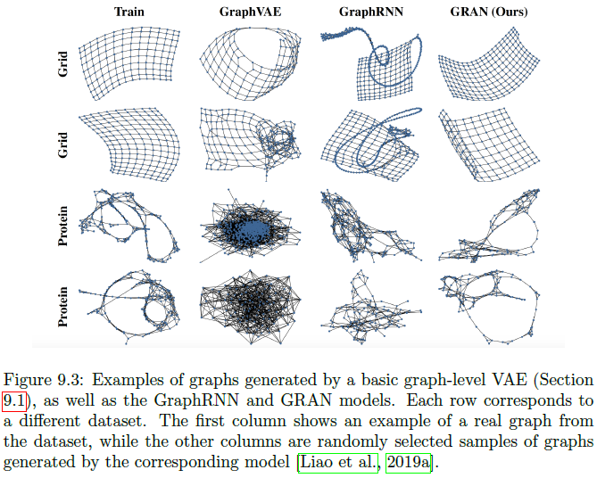

# 第八章 传统图生成方法

图生成方法的主要挑战是：生成的图必须具有某些合意性质。

## 8.1 传统方法概述

传统生成方法都涉及指定生成过程，即边生成的方式，多数方法的生成过程都基于指定节点间的边存在的概率，生成过程必须满足两个条件：1，可溯源；2，生成的图须满足一定的性质,传统方法相关的研究可参考**Newman 2018**.

### 8.2 Erdos-Renyi Model

ER模型是最简单的图生成模型，模型如下：

$P(\mathbf{A}[u,v]=1)=r,\forall u,v\in\mathcal{V},u\neq v$

其中$r$即节点$u,v$间存在边的概率，可以控制图的密度。

ER模型非常简单，要生成一个ER图，我们只需要首先选择图中的节点数，然后依据概率$r$为每对节点间指定是否存在一条边，时间复杂度为$O(|\mathcal{V}|^2)$.

ER模型的缺点在于它能控制的图特征很少，只有图密度，而其他性质如度分布、社区结构、聚类系数、motif等完全无法控制。

### 8.3 随机区块模型（Stochastic Block Models）

随机块模型在ER模型的基础上，支持社区结构的生成。其模型如下：首先指定$\gamma$个不同的区块:$\mathcal{C}_1,...,\mathcal{C}_{\gamma}$,然后指定每个节点$u\in\mathcal{V}$属于每个区块的概率$p_i=P(u\in\mathcal{C}_i),\forall u\in\mathcal{V},i=1,...,\gamma,\sum_{i=1}^{\gamma}=1$,其后指定边概率矩阵$\mathbf{P}\in[0,1]^{\gamma\times \gamma}$,其中的每个元素都代表区块$i,j$间存在边的概率$C[i,j]$。

SBM图生成流程如下：

1. 对每个节点$u\in\mathcal{V}$,根据分类分布$(p_1,...,p_{\gamma})$采样其所属的区块；

2. 针对每对节点$u\in C_i,v\in C_j$根据概率矩阵$\mathbf{P}$采样边：

   $P(\mathbf{A}[u,v]=1)=\mathbf{C}[i,j]$

SBM的核心功能就是它支持对区块内和区块间的边概率进行控制，从而允许我们生成有社区结构的图。比如，我们设定边概率矩阵对角线的值为$\alpha$即控制了区块内的边概率为$\alpha$，设定其他元素值为$\beta$即控制了区块间边概率为$\beta$。

以上是最基本的SBM，而SBM已经被扩展到二部图、特征图等领域，详见**Newman 2018**

### 8.4 优先连接模型(Preferential Attachment)

SBM的问题在于它不能控制单个节点的结构特征，如每个社区内的节点都具有相同的度分布，即社区内的节点是同质的。但现实中，社区内的节点可能是异质的且度分布差异很大，基于此学者提出了PA模型，其出发点为：图的幂律度分布假设，即每个节点$u$度$d_u=k$的概率为：

$P(d_u=k)\propto k^{-\alpha}$

其中$\alpha>1$。

幂律分布下，图同时还具有另一条性质--厚尾性，即对极端值指派高于平均水平（标准指数分布下）的概率值，在图中表现就是：少数但并非绝对少数的节点具有非常高的度。

PA模型生成图的流程如下：

1. 首先，初始化一个具有$m_0$个节点的全连接图；

2. 然后，迭代地增加$n-m_0$个节点。对于在$t$轮增加的每个节点$u$，我们将其与已有的$m<m_0$个节点相连，这$m$个邻居节点依据如下的概率分布通过不放回的抽样选择：

   $P(\mathbf{A}[u,v])=\frac{d_v^{(t)}}{\sum_{v'\in\mathcal{V}^{(t)}}{d_{v'}^{(t)}}}$

   其中$d_{v}^{(t)}$为节点$v$在$t$轮迭代的度，$\mathcal{V}$在前$t$轮为止所有加入图的节点集合。

PA模型的核心思想是：将新节点与已有节点相连的概率等比于已有节点的度，这意味着度较高的节点倾向于积累更高的度，即富者愈富现象，在PA模型生成的图中，幂律的指数$\alpha=3$.

PA模型一个重要的方面就是它的生成过程是自回归的，即边的概率依赖于已有节点的度。

### 8.5 传统模型应用场景

* 生成人工数据作为基准和分析任务

  即作为算法有效性测试的工具。如，如果你提出了一个社区检测算法，那它至少应该能检测SBM的社区结构。如果你的模型是面向大规模网络，那它应该可以处理PA模型生成的厚尾图。

* 创建基准模型(null model)

  即作为图统计量比较的参考点。假设你在分析一个社区网络，并计算了它的各种统计量，一个很自然的问题是这些统计量相对于平均水平是高还是低？传统模型生成的图的特征可以作为一个比较的基准，总而言之，传统图生成模型提供了我们去审视什么水平的图特征其实可以被简单的生成模型所解释。

# 第九章 深度生成模型

传统模型都依赖于固定的、手工调整的生成过程，没有学习生成模型的能力。而本章将介绍一些基于训练数据训练生成模型的方法，包括三种：变分自编码器VAE，生成式对抗网络GAN，和自回归模型。这些模型即可以独立使用，也可以组合使用（如VAE与自回归模型的组合），其中VAE和GAN是一次生成整张图（all-at-once)，而自回归方法则是一个节点一个节点的生成图，类似于PA模型。此外，这三种方法都用于生成图结构即邻接矩阵，而不是生成节点和边。基础性细节请参见Goodfellow et al.2016.

### 9.1 变分自编码方法

VAE可能是最流行的生成模型，其理论基础是统计学中的变分推断，主要思想如下：

我们的目标是训练一个概率解码器模型$p_{\theta}(\mathbf{A|Z})$,我们可以基于此进行真实图的采样$\hat{\mathbf{A}}\sim p_{\theta}{(\mathbf{A|Z})}$,其中$\mathbf{Z}$为隐变量，从概率的角度就是学习一个邻接矩阵上的条件分布。为训练VAE，我们需要把概率解码器与概率编码器$q_{\theta}(\mathbf{Z}|\mathcal{G})$结合起来，其中概率编码器的作用是将输入图$\mathcal{G}$映射为一个隐变量$\mathbf{Z}$的后验分布。其中的思想就是：我们联合训练解码器和编码器，从而解码器在给定从编码器采样的隐变量$\mathbf{Z}\sim q_{\theta}(\mathbf{Z}|\mathcal{G})$的基础上，可以重建被训练的图。完成训练后，我们就可以忽略编码器，生成新的图，方式是：从（无条件）后验分布采样隐变量$\mathbf{Z}\sim p(\mathbf{Z})$输入解码器。

在数学化的表示中，为建立一个VAE，我们必须指定如下关键要素：

1. 概率编码器模型$q_{\phi}$.该编码器以整个图$\mathcal{G}$为输入，并基于图定义隐表示的分布$q_{\phi}(\mathbf{Z}|\mathcal{G})$,通常，我们使用再参数化技巧（reparameterization trick）的高斯随机变量来设计编码器，即$\mathbf{Z}\sim \mathcal{N}(\mu_{\phi}(\mathcal{G}),\sigma_{\phi}(\mathcal{G}))$,其中$\mu_{\phi},\sigma_{\phi}$,分别为产生均值和方差参数的神经网络。
2. 概率解码器模型$p_{\theta}$.解码器以隐变量$\mathbf{Z}$为输入，利用隐变量指定图的条件分布。本章中，我们假设$p_{\theta}$定义在整个邻接矩阵上的条件分布，即$p_{\theta}(\mathbf{A}[u,v]=1|\mathbf{Z})$.
3. 隐空间的先验分布$p(\mathbf{Z})$.本章我们使用标准高斯分布$\mathbf{Z}\sim \mathcal{N}(\mathbf{0,1})$.

给定以上元素和训练数据$\{\mathcal{G_1,...,G_n}\}$,我们通过最小化置信似然下界（evidence likelihood lower bound,ELBO) 来训练VAE：

$\mathcal{L}=\sum_{\mathcal{G}_{i} \in\left\{G_{1}, \ldots, \mathcal{G}_{n}\right\}} \mathbb{E}_{q_{\theta}\left(\mathbf{Z} \mid \mathcal{G}_{i}\right)}\left[p_{\theta}\left(\mathcal{G}_{i} \mid \mathbf{Z}\right)\right]-\operatorname{KL}\left(q_{\theta}\left(\mathbf{Z} \mid \mathcal{G}_{i}\right) \| p(\mathbf{Z})\right)$

即最大化解码器的重建能力，同时最小化后验分布和先验分布的KL散度。

ELBO损失函数的主要目标是建立满足如下条件的隐表示的分布：

1. 采样的隐表示编码了足够多的信息从而允许解码器重建输入；
2. 隐分布与先验分布尽量接近。

第一个条件是保证VAE从编码的隐表示中解码出有意义的图；第二个条件充当了正则化手段，并保证即使我们是从先验分布$p(\mathbf{Z})$中抽样隐表示也能解码出有意义的图。第二个条件对在训练后生成新图有非常重要的意义：我们可以从先验分布里抽取隐表示然后输入解码器从而生成新的图。

以下我们介绍两种不同的VAE模型，它们主要是在编码器、解码器、隐表示上有所不同，但框架是相同的。

### 9.1.1 节点级的隐表示

该方法的主要是思想是编码器为图中的每个节点进行编码以生成隐表示。解码器以成对的嵌入表示作为输入来预测两个节点间是否存在边。**（VGAE, Kipf and Welling 2016)**

* 编码器模型

该框架下的编码器可以是任何第五章提及的GNN结构，具体来说，给定邻接矩阵$\mathbf{A}$和特征矩阵$\mathbf{X}$，我们使用两个GNNs来生成均值和方差参数，即：

$\mu_{\mathbf{Z}}=GNN_{\mu}(\mathbf{A,X}) $ $log\ \sigma_{\mathbf{Z}}=GNN_{\sigma}(\mathbf{A,X})$,   (9.2)

其中$\mu_{\mathbf{Z}}\in \mathbb{R}^{|\mathcal{V}|\times d}$决定了输入图每个节点的嵌入均值，而$log\ \sigma_{\mathbf{Z}}\in\mathbb{R}^{|\mathcal{V}|\times d}$则决定了每个节点隐嵌入的对数方差(更稳定)。

给定编码的均值和对数方差，我们可以抽样一个节点隐嵌入的集合：

$\mathbf{Z}=\epsilon\circ exp(log(\sigma_{\mathbf{Z}}))+\mu_{\mathbf{Z}}$ （9.3）

其中$\epsilon \in \mathbb{R}^{|\mathcal{V}|\times d} \sim\mathcal{N}(\mathbf{0,1})$为多次独立抽样构成的矩阵。

* 解码器模型

给定抽样出的节点嵌入矩阵$\mathbf{Z}\in\mathbb{R}^{|\mathcal{V}|\times d}$,解码器的目标是预测图中所有边的似然，即$p_{\theta}(\mathbf{A|Z})$，解码器的选择可以是第三章所介绍过的边解码器，在原始的VGAE中，Kipf and Welling 2016使用的是简单的点积解码器：

$p_{\theta}(\mathbf{A}[u,v]=1|\mathbf{z}_u,\mathbf{z}_v)=\sigma(\mathbf{z}^T_u\mathbf{z}_v)$ （9.4）

其中$\sigma$为sigmoid函数。

为计算损失函数，我们假设边之间相互独立，则：

$p_{\theta}(\mathcal{G}|\mathbf{Z})=\prod_{(u,v)\in\mathcal{V}^2}{p_{\theta}(\mathbf{A}[u,v]=1|\mathbf{z}_u,\mathbf{z}_v)}$

即使用边概率的二项交叉熵损失。为在训练后生成离散的图，我们可以基于（9.4）后验伯努利分布进行边采样。

* 缺点

VGAE的缺点在于它的生成能力非常有限，尤其是当使用的解码器是点积的时候，因为这种解码器没有参数，所以当没有图作为训练数据输入时，它不能输出非平凡的图结构。事实上，Kipf and Welling 2016提出VGAE时也并非用于图生成，而是用于节点嵌入。Grover et al.2019等学者试图通过使用迭代的GNNs解码器提高VGAE的生成能力，但总的来说，节点水平的VAE方法并不是一种成功的图生成方法，而较适合图重建任务或作为自回归框架。

### 9.1.2 图级的隐嵌入

图级的隐嵌入依然使用ELBO损失，但修改了解码器和编码器使之适应于图级隐表示$\mathbf{z}_{\mathcal{G}}$,相关工作详见**GraphVAE（Simonovsky and Komodakis 2018）**。

* 编码器

GraphVAE的编码器是任意GNNs模型加池化层，但一些嵌入表示输出为图的嵌入向量，具体地说，令$k$层GNN表示为$\mathbb{Z}^{|\mathcal{V}|\times |\mathcal{V}|}\times \mathbb{R}^{|\mathcal{V}|\times m}\to \mathbb{R}^{|\mathcal{V}|\times d}$,池化函数表示为$POOL:\mathbb{R}^{|\mathcal{V}|\times d}\to \mathbb{R}^d$,其作用为将节点嵌入矩阵$\mathbf{Z}\in\mathbb{R}^{|\mathcal{V}|\times d}$映射为图嵌入$\mathbb{z}_{\mathcal{G}}\in\mathbb{R}^d$,同样使用均值和方差参数化的GNNs,GraphVAE的编码器表示为：

$\mu_{\mathbf{z}_{\mathcal{G}}}=POOL_{\mu}(GNN_{\mu}(\mathbf{A,X}))$       $log\ \sigma_{\mathbf{z}_{\mathcal{G}}}=POOL_{\sigma}(GNN_{\sigma}(\mathbf{A,X}))$

* 解码器

原始的GraphVAE使用的解码器是MLP+伯努利分布假设，公式化的表示为：

$\tilde{\mathbf{A}}=\sigma(MLP(\mathbf{z}_{\mathcal{G}}))$

其中$\sigma$为sigmoid函数。

则后验分布可表示为：

$p_{\theta}(\mathcal{G}|\mathbf{z}_{\mathcal{G}})=\prod_{(u,v)\in\mathcal{V}}{\tilde{\mathbf{A}}[u,v]\mathbf{A}[u,v]+(1-\tilde{\mathbf{A}}[u,v])(1-\mathbf{A}[u,v])}$  （9.8）

其中$\mathbf{A}$表示为真实的邻接矩阵，$\tilde{\mathbf{A}}$为预测的边概率矩阵。

（9.8）式的后验分布使用了独立同分布的伯努利假设，从而后验分布就等于每个边的交叉熵。但执行(9.8)式有两个挑战：

1. 第一个挑战是如果使用MLP，则节点的个数必须是固定的。但通常，我们可以假设一个最大节点数$n_{max}$并使用掩码来解决这个问题。具体来说就是，根据假设的最大节点数$n_{max}$,我们将MLP输出的维度限制为$n_{max}\times n_{max}$，为在训练中解码维度为$|\mathcal{V}|$的图，我们对$\tilde{\mathbf{A}}$中行或列的索引大于$|\mathcal{V}|$的元素进行掩码（即直接忽略），为在完成训练后生成节点可变的图，我们可以指定一个图大小的分布$p(n)，n\in\{2,...,n_{max}\}$,并从这个分布中进行抽样，以确定生成图的大小。一种指定$p(n)$的方法是直接使用训练数据的经验分布。

2. 第二个挑战是：在计算重建损失时，我们并不能确切地知道$\tilde{\mathbf{A}}$行和列的顺序，$\tilde{\mathbf{A}}$由MLP生成，当我们想计算训练数据的似然函数时，我们需要隐式地对节点的顺序进行假设，因此，我们必须指定节点顺序$\pi\in\Pi$来对$\tilde{\mathbf{A}}$的行和列进行排序。

   如果我们直接忽略节点顺序，则解码器可能对任意节点顺序产生过拟合，目前有两种较流行的方法解决这个问题。第一种是**Simonovsky and Komodakis 2018**原文中提到的，使用图启发式匹配来寻找$\tilde{\mathbf{A}}$的节点顺序，匹配标准是产生最高的似然值，故损失函数改为：

   $p_{\theta}(\mathcal{G}|\mathbf{z}_{\mathcal{G}})=\underset{\pi\in\Pi}{max}\prod_{(u,v)\in\mathcal{V}}{\tilde{\mathbf{A}}^{\pi}[u,v]\mathbf{A}[u,v]+(1-\tilde{\mathbf{A}}^{\pi}[u,v])(1-\mathbf{A}[u,v])}$  （9.9）

   其中$\tilde{\mathbf{A}}^{\pi}$代表在节点顺序$\pi$下的预测邻接矩阵。但（9.9）式的计算量非常大，即使是使用近似的启发式方法，并且基于图匹配的方法也不具有扩展性。近期，作者开始使用节点启发式节点顺序方法（而不是穷举匹配），例如，从度最高的节点以深度优先或广度优先搜寻方法进行排序，在这种方法中，我们会指定一个顺序函数$\pi$,并基于这个顺序函数计算损失：

   $p_{\theta}(\mathcal{G}|\mathbf{z}_{\mathcal{G}})=\prod_{(u,v)\in\mathcal{V}}{\tilde{\mathbf{A}}^{\pi}[u,v]\mathbf{A}[u,v]+(1-\tilde{\mathbf{A}}^{\pi}[u,v])(1-\mathbf{A}[u,v])}$  （9.9）

   或者对某个启发式顺序的子集进$\{\pi_1,..,\pi_n\}$行平均：

   $p_{\theta}(\mathcal{G}|\mathbf{z}_{\mathcal{G}})=\sum_{\pi_i\in\{\pi_1,...,\pi_n\}}\prod_{(u,v)\in\mathcal{V}}{\tilde{\mathbf{A}}^{\pi}[u,v]\mathbf{A}[u,v]+(1-\tilde{\mathbf{A}}^{\pi}[u,v])(1-\mathbf{A}[u,v])}$  （9.10）

   这种启发式算法并没有真正解决匹配问题，但在实践中表现尚可。**Liao et al.2019**对各种启发式顺序方法进行了比较。

* 缺点

图级的VAE方法也存在一些很严重的缺陷，其中最严重的就是上述的节点顺序指定问题。这个缺陷加上MLP的缺陷，使得图级的VAE方法只能应用于节点较少的图上。但图级VAE可以和其他方法（如自回归）组合成更为强大的方法，详见9.5节。

## 9.2 对抗方法

VAE方法以期明晰的概率理论成为很多生成问题中非常流行的框架，但也存在很多问题，比如在图像领域，VAE倾向于生成模糊的图片。近期的生成模型理论开始转向对抗生成网络(Goodfellow et al.2014)

GAN的理论基础如下：首先定义可训练的生成器网络$g_{\theta}:\mathbb{R}^d\to \mathcal{X}$,该生成器以随机种子$\mathbf{z}\in\mathbb{R}^d$为输入，生成真实数据样本$\tilde{\mathbf{x}}\in \mathcal{X}$；同时，我们还需定义判别器网络$d_{\phi}:\mathcal{X}\to[0,1]$,该判别器的作用是区分真实样本$\mathbf{x}$和生成样本$\tilde{\mathbf{x}}$，此处，我们假设判别器输出的是输出样本为假的概率。

GAN中生成器和判别器以对抗博弈的方式进行联合优化：

$\min _{\theta} \max _{\phi} \mathbb{E}_{\mathbf{x} \sim p_{\text {data }}(\mathbf{x})}\left[\log \left(1-d_{\phi}(\mathbf{x})\right)\right]+\mathbb{E}_{\mathbf{z} \sim p_{\text {seed }}(\mathbf{z})}\left[\log \left(d_{\phi}\left(g_{\theta}(\mathbf{z})\right)\right]\right.$  （9.10）

其中$p_{data}$为真实数据的经验分布（如，训练集的均匀分布样本），$p_{seed}$为随机种子分布（如标准多元正态分布）。GAN中生成器试图最小化判别器的判别能力，而判别器则试图最大化自身的判别能力。优化（9.10）式比较困难，但目前已经一些不错的成果（[Brock et al., 2018,Heusel et al., 2017, Mescheder et al., 2018]）

* 一个基础的图生成GAN

最基本的图生成GAN由De Cao and Kipf,2018提出，类似于图级VAE，例如，我们可以使用MLP作为生成器生成给定种子向量下的边概率：

$\tilde{\mathbf{A}}=\sigma(MLP(\mathbf{z}))$

根据上式的边概率矩阵，我们通过针对每个节点进行独立伯努利变量进行抽样生成离散邻接矩阵$\hat{\mathbf{A}}\in\mathbb{Z}^{|\mathcal{V}|\times|\mathcal{V}|}$,即$\hat{\mathbf{A}}[u,v]\sim Bernoulli(\mathbf{A}[u,v])$,对于判别器，我们可以使用基于GNN的图分类模型。

* 基于GAN的方法的优势和劣势

类似于VAE方法，GAN也可以与自回归等方法结合生成更强大的算法,甚至可以将节点特征融入模型（**De Cao and Kipf,2018**)。GAN方法一个重要的优势在于：它无需指定节点顺序，只要判别器是乱序不变的。但它目前仍较少受到关注，这可能是由于GAN的minmax优化没有取得一致的结果，仍然是一个开放问题。

## 9.3 自回归模型

自回归方法可以与VAE和GAN方法结合构成更强大的算法，但它们却可以单独训练，这是自回归模型的优势之一。

### 9.3.1 边相关性建模

VAE和GAN都假设边之间是独立的，即：

$P(\mathcal{G}|\mathbf{z})=\prod_{(u,v)\in\mathcal{V}^2}{P(\mathbf{A}[u,v]|\mathbf{z})}$ (9.12)

独立性假设在计算上非常方便，但现实中的图常常表现出边之间的复杂相关性。例如，现实中的图常常表现出高聚类系数，但边独立模型很难捕获这种特性，为缓解这个问题，同时保持溯源性（tractability)，自回归模型放松了这个假设，并假设边是序贯生成的，一个边的似然值条件依赖于已经生成的边。准确的表示为：令$\mathbf{L}$为邻接矩阵$\mathbf{A}$的下三角，假设我们的图为一个简单图，$\mathbf{A,L}$提供的是相同的信息，则我们可以基于$\mathbf{L}$进行计算。我们记$\mathbf{L}[v_1,:]$为对应$v_1$节点的行，并记$\mathbf{L}$的行索引为$v_1,...,v_{|\mathcal{V}|}$，根据下三角的性质，我们有$\mathbf{L}[v_i,v_j]=0,\forall j>i$，因此我们只需要关心所行$\mathbf{L}[v_i,:]$中的前$i$个元素，给定如上记号，自回归模型可表示为：

$P(\mathcal{G}|\mathbf{z})=\prod_{i=1}^{|\mathcal{V}|}{P(\mathbf{L}[v_1,:],..,\mathbf{L}[v_{i-1},:],\mathbf{z})}$ （9.13）

换言之，我们基于之前生成的所有行$\mathbf{L}[v_j,:],j<i$生成行$\mathbf{L}[v_i,:]$.

### 9.3.2 图生成的循环模型

本章介绍两个具体的算法，一个是GraphRNN(You et al.2018)；第二种是GRAN(Graph Recurrent Attention Network, Liao et al.2019).

* GraphRNN

GraphRNN是第一种基于自回归进行图生成的深度学习算法，其主要思想就是根据分层RNN对边依赖关系进行建模。

分层模型的第一个RNN，我们称之为图级RNN($RNN_{graph}$)，是用来对已经生成的图的状态进行建模的。即，图级RNN维护一个隐状态$\mathbf{h}_i$,在每次生成邻接矩阵行$\mathbf{L}[v_i,:]$后会进行更新：

$\mathbf{h}_{i+1}=RNN_{graph}(\mathbf{h}_i,\mathbf{L}[v_i,:])$ （9.14）

在You et al.2018的原文中，使用$\mathbf{h}_0=\mathbf{0}$初始化隐状态，但初始隐状态可以同过图编码器模型学习或者从VAE方法中抽样。

分层模型的第二个RNN，我们称为节点级RNN($RNN_{node}$)，用来以自回归的方式生成$\mathbf{L}[v_i,:]$,其以图级隐状态$\mathbf{h}_i$作为初始输入并序贯地生成$\mathbf{L}[v_i,:]$,其中假设每个元素服从伯努利分布。整体GraphRNN称为分层就是因为：每一步节点级RNN都是以图级RNN输出的隐状态为初始化输入。

图级RNN和节点级RNN都以训练数据的极大似然为优化方法，训练方法为teaching forcing策略，即在训练中真实数据总是用来更新RNNs的。为控制生成图的大小，RNNs同样会训练输出序列结束标志。需要注意到，如同图级VAE方法一样，计算（9.13）的似然也需要我一个节点顺序。

完成训练数据（9.13）的极大似然计算后，GraphRNN模型就可以从固定的初始隐状态$\mathbf{h}_0$开始，在测试时生成图。边级RNN涉及随机抽样过程来生成离散边，故GraphRNN模型可以生成多元化的图，即使它是从固定的初始嵌入开始的。但GraphRNN通常是用于VAE或GAN框架下的解码器或生成器。

* 图循环注意力网络GRAN

依赖于自回归的边生成方式，GraphRNN可以很容易地生成复杂的motif和常见的图结构（如girds)，但它也有很多局限，如在训练数据为grids时它会生成不实际的图（如长链），此外GraphRNN难以训练且不可以扩展到大规模的图，原因在于它BPTT的训练方式。

为解决这些缺陷，**Liao et al2019**提出了GRAN模型，它沿用了生成过程的自回归分解，但使用GNNs对自回归生成过程建模。GRAN的主要思想就是：通过已生成的图，我们可以对邻接矩阵每行的条件分布建模：

$P(\mathbf{L}[v_i,:]|\mathbf{L}[v_1,:],...,\mathbf{L}[v_{i-1},:],\mathbf{z})\approx GNN(\mathbf{L}[v_1:v_{i-},:],\tilde{\mathbf{X}}) $ (9.15)

$\mathbf{L}[v_1:v_{i-},:]$为直到$i$步生成的邻接矩阵的下三角。(9.15)式的GNN可以有多种选择（Liao et al2019在文中使用了GAT模型的一个变体），其最关键的要求是要能够生成边概率向量$\mathbf{L}[v_i,:]$，从中我们可以抽样具体的、离散的边。由于生成的节点没有节点属性，GNN的输入特征矩阵$\tilde{\mathbf{X}}$,可以包含随机采样的向量用来区分节点。

GRAN的训练可以使用类似（9.13)的极大似然法和强制教学(teaching forcing),此外，GRAN也需要指定计算似然过程中的节点顺序。最后，我们可以独立使用GRAN通过随机生成过程来生成图，也可以与VAE或GAN框架结合。

与GraphRNN相比，GRAN一个最明细的优势是它不需要维护一个长且复杂的、历史的图级RNN，它显式地依赖于每个生成步骤中GNN已经生成的图。Liao et al.2019讨论了如何讲GRAN扩展到大型图，一个显著提高模型表现的方法就是多个节点可以同时放入同一个区块，而不是每次只增加一个节点。

## 9.4 评估生成图

评估生成图方法的难点在于没有显式的标准（如准确率，误差），目前最常用的方法是分析生成图的不同统计量，并与测试数据进行比较。

公式化地表示就是：定义$\mathcal{S}=(s_1,s_2,..,s_n)$为图统计量集合，其中每个统计量$s_{i,\mathcal{G}}:\mathbb{R}\to [0,1]$都定义一个单变量分布，如给定图$\mathcal{G}$,我们可以计算图的度分布，聚类系数的分布，不同motif和graphlet的分布，谱特征分布。给定某个统计量$s_i$，计算其在测试数据和生成数据上的结果$s_{i,\mathcal{G}_{test}},s_{i,\mathcal{G}_{gen}}$,我们使用某个分布测度计算二者的距离作为标准，如使用总变差距离(total variation distance):

$d(s_{i,\mathcal{G}_{test}},s_{i,\mathcal{G}_{gen}})=\underset{x\in\mathbb{R}}{sup}|s_{i,\mathcal{G}_{test}}(x)-s_{i,\mathcal{G}_{gen}}(x)|$

为评估两个模型的表现，每个统计量指标的平均值作为最终的测度。

现存的一些工作，使用了Wasserstein距离和总变差得分等测度。

## 9.5 分子图生成

目前，多数图生成领域的工作都集中在分子图(molecule generation)生成上。分子图生成任务的目标是生成即真实(vaild)又具有某些性质的图，不同于通用图生成问题，分子图生成非常依赖领域知识，分子图生成模型设计和评估策略都是。一个较成功的工作见Jian et al.2018,分子图是图生成发展最迅速的子领域。

