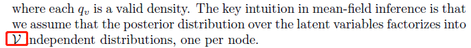

# questions

### 2.2.2 Global overlap meausures

 $\alpha = \frac{1}{d_ud_v}$may be specified.

### 7.1.2 from time signals to graph signals

wolud you please detail the meaning of $mod\ N$? in Eq. (7.11).

### 7.2.3 Embedding mean-eld inference

where $\mathcal{V}$ should be $|\mathcal{V}|$?

where $\mathbf{z}_x$ should be $\mathbf{x}_v$,   $q_u(\mathbf{z})_u$ should be $q_u(\mathbf{z}_u)$or more precisely $q^{(t-1)}_u(\mathbf{z}_u)$?

where $q(\{\mathbf{z}_v\})$should be $\prod_{v\in\mathcal{V}}q(\{\mathbf{z}_v\})$ in $KL$.

### 7.3.4 GNNs and the WL Algorithm

### 7.3.5 beyond the WL Algorithm

### 8.3 SBM

### 9.1.1 node-level latents

### 9.3.2 Recurrent Models for Graph Genreation

## Fourier变换与Laplacian对应关系推导

$$(f\star h)(\mathbf{x})=\mathcal{F}^{-1}(\mathcal{F}(f(\mathbf{x}))\circ \mathcal{F}(h(\mathbf{x})))$$

其中$\mathcal{F}(f(\mathbf{x}))=\hat{f}(\mathbf{s})=\int_{\mathbb{R}^d}{f(\mathbf{x})e^{-2\pi\mathbf{x}^T\mathbf{s}i}}d\mathbf{x}$,而$\mathcal{F}^{-1}(\hat{f}(\mathbf{s}))=\int_{\mathbb{R}^d}{\hat{f}(\mathbf{s})e^{2\pi\mathbf{x}^T\mathbf{s}i}}d\mathbf{x}$

$$-\Delta(e^{2\pi i s t})=-\frac{\partial^2(e^{2\pi i s t})^2}{\partial t^2}=(2\pi s)^2e^{2\pi ist}$$

$\mathbf{L}_c$的特征向量为$\mathbf{u}_j=\frac{1}{\sqrt{n}}[1,\omega_j,...,\omega_j^n]$，其中$\omega_j=e^{\frac{2\pi j}{n}}$.

$$\mathbf{L=U\Lambda U}^T$$

因此，信号$\mathbf{f}\in\mathbb{R}^{|\mathcal{V}|}$的傅里叶变换可表示为：

$$\mathbf{s}=\mathbf{U}^T\mathbf{f}$$

对应的傅里叶逆变换为：

$$\mathbf{f}=\mathbf{Us}$$

$$\mathbf{f}\star_{\mathcal{G}}\mathbf{h}=\mathbf{U(U}^T\mathbf{f\circ U}^T\mathbf{h})$$

$$\mathbf{f}\star_{\mathcal{G}}\mathbf{h}=\mathbf{U(U}^T\mathbf{f}\circ\theta_{h})=(\mathbf{U}diag(\theta_h)\mathbf{U}^T)\mathbf{f}$$    

$$\mathbf{f}\star_{\mathcal{G}}\mathbf{h}=(\mathbf{U}p_N(\mathbf{\Lambda })\mathbf{U}^T)\mathbf{f}=p_N(\mathbf{L)f}$$   