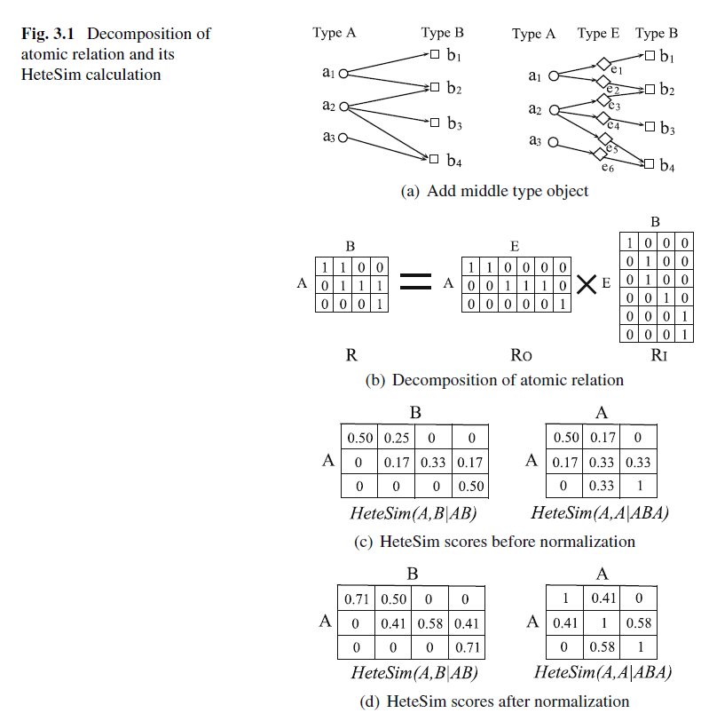
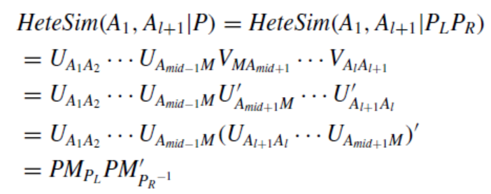
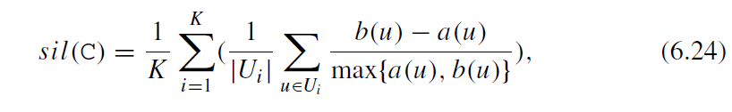

# 第一章 引言

本章主要介绍异质信息网络网络的定义，相关概念和具体应用

## 1.1 基本概念和定义

在现实中，多数网络都是由多种相互影响的行为(interacting)和多种类型的成分（component)构成，相互影响的成分构成互联(interconnected)网络，我们称之为信息网络。信息网络分析的基础任务是通过分析连接信息挖掘隐含模式，涉及连接挖掘和分析，社交网络分析，超文本和网页挖掘，网络科学和图挖掘等任务。

* `定义 1.1：信息网络`

 定义有向图$G=(V,E)$及实体类型映射函数：$\varphi:V\to A$和关系类型映射函数:$\psi:E\to R$,每个实体$v\in V$属于一个实体类型，而实体类型是实体类型集合的一个元素：$\varphi(v)\in A$,同理，每个边从属于一个连接类型，连接类型是连接类型集合的一个元素:$\psi(e)\in R$,如果两个从属于同一种关系类型，则两个连接拥有共同的开始实体类型和结束类型。

* `定义1.2：同质和异质信息网络(HIN)`

当且仅当实体类型和关系类型满足$|A|>1或|R|>1$我们称网络为异质信息网络**(HIN)**,否则就是同质信息网络.

典型的HIN就是参考文献(bibliographic)网络DBLP,其涉及三种实体：论文、会议(venue)和作者。

* `定义1.3：网络模式(schema)`

网络模式$T_G=(A,R)$定义了网络的元结构，是信息网络$G=(V,E)$、实体类型映射$\varphi:V\to A$、$\psi:E\to R$的元模板(metatemplate)。

HIN的网络模式指定了实体与关系集合的类型限制，这种限制使得HIN是半结构化的，从而指导网络的语义分析。一个遵循网络模式的信息网络称之为网络模式的网络实例(instance)，对于连接$S\stackrel{R}{\to} T$,我们记$R.S$为关系$R$下的源实体类型，$R.T$为靶(target)实体类型，对逆关系$R^{-1}$有$T\stackrel{R^{-1}}{\to} S$，除非$R$是对称的，否则$R\neq R^{-1}$。

不同于同质信息网络，HIN中的两个实体可以通过不同的路径连接，这些路径具有不同的物理意义，并分为如下的元路径。

* 定义1.4`元路径`

  元路径$P$定义在模式$S=(A,R)$下，形式为$A_1\stackrel{R_1}{\to}A_2\stackrel{R_2}{\to}...\stackrel{R_l}{\to}R_{t+1}$元路径实体$A_1,A_2...,A_{l+1}$上的复合关系$R=R_1\circ R_2\circ ...\circ R_l$,其中$\circ$为复合关系操作。

**如果在同一对实体类型间没有多种关系类型**，我可以将元路径简化为$P=(A_1A_2....A_{l+1})$.如在参考文献网络中，$Author\stackrel{writting}{\to}P\stackrel{written-by}{\to}A$可简化为$APA$。此外，如果对于实体$a_i:\phi(a_i)=A_i$,即实体的类型均不同且，对于关系$e_i=<a_i,a_{i+1}> \in R_i$,即关系类型也不同，则具体路径$p=(a_1a_2...a_{i+1})$称为路径实例。如果关系是对称的，则对应的元路径也是对称的。当且仅当实体$A_{l}=B_1$,我们称元路径$P_1=(A_1A_2...A_l), \ P_2=(B_1B_2....B_k$)为可拼接的（concatenable).如在如下的图1.2中，作者间可以通过元路径$APA,\ APVPA$相连接。表1.1为路径实例和它们的语言。

元路径的语义信息是HIN的一个重要特点，基于不同的元路径，具有不同连接关系的实体拥有不同的路径语义，例如，基于不同的元路径估计的作者间相似度也不同，$APA$（合作者）路径下，合作者间会具有很高的相似度，而非合作者相似度较低；而$APVPA$元路径下，则只有在同一个会议发表文章的作者相似度才会较高。元路径的另一个例子作用是评价实体的重要性，$APA$路径会偏向于参与多作者论文的作者，而$APVPA$则偏向于在高产的会议上发表多篇论文的作者。总之，HIN的元路径在数据挖掘任务上（如相似性度量，聚类，分类）具有广泛应用。

## 1.2 相关概念比较

随着关系型数据分析的发展，学界出现了一些与信息网络相似但又有细微差别的概念，如多类型关系数据(multitype relational data)即是一种HIN，多视图数据(multiview data)也可视作一种HIN。以下我们对异质信息网络的若干相关概念进行比较。

* 异质网络vs.同质网络

  异质网络具有不同的实体类型或边类型，但同质网络仅允许一种类型和边。异质网络可以通过忽略实体类型或一些映射转变为同质网络，但会造成信息损失。一般而言适用于同质信息网络的分析技术无法直接应用于异质网络。

* 异质网络vs.多关系网络

  不同于异质网络，多关系网络仅有一种类型的实体，但具有多种类型的关系，因此可视为一种特殊的HIN。

* 异质网络vs.多维/多模网络

  Tang et al.提出多维/多模网络概念，与多关系网络具有相同的概念。

* 异质网络vs.复合（composite）网络

  Qaing Yang et al.提出了复合网络概念，在复合网络中，用户有不同的关系，在不同的子网络中具有不同的行为，但在同一时间，在不同（子）网络中具有一些相同的潜在（latent）兴趣。故复合网络也是一种多关系网络。

* 异质网络vs.复杂（complex)网络

  复杂网络是一种具有非平凡(non-trivial)拓扑特征，且其元素之间的连接方式既不是纯规则(regular)的也不是纯随机的网络。非平凡的拓扑特征包括：厚尾的度分布，高聚类系数、社区结构和分层结构。研究表明，很多真实网络是复杂网络，如社交网络，信息网络，技术网络和生物网络。目前为止，对复杂网络的研究还局限于结构、功能和网络特征上。

## 1.3 HIN数据实例

所有交互系统数据都可以被如下三种类型的数据构造：

* 结构化数据：结构化数据可以被显式的以实体-关系模型存在数据库表中，不同类型的实体和关系天然地可以构造信息网络，如参考文献网络。
* 半结构数据：半结构数据通常被存储在XML中，XML的属性可以视为实体类型，实体实例可以通过分析属性的的内容来获取，而属性间的联系构成了实体间的关系。
* 非结构化数据：对于非结构化数据，我们可以通过实体和关系抽取来构造HIN，如文本的HIN构造。

虽然HIN广泛存在，但却只有很少的HIN数据可供研究，因为异质信息通常存储在不同的信息源，以下是常用的HIN：

* 单实体类型多关系网络：一个典型的例子就是社交网站，如Facebook,校内，用户间的关系表现为：浏览，聊天，发送好有请求，关注等。
* 二部(bipartite)网络：如用户-商品网络，文章-单词网络。
* 星模式（star-schema)网络：星模式网络是HIN领域最流行的网络。在数据库表中，目标实体和它的属性实体天然构成HIN，其目标实体作为中转节点(hub node)，连接不同的属性实体。参考书目网络即是一种典型的星模式网络,其他还有电影信息网络。
* 多中转(multiple-hub)网络：多中转网络是一种比星模式网络更复杂的网络，生物信息网络即是一种典型的多中转网络。

除了上述网络，图1.4展示一种更复杂的HIN网络，如用户不仅有社交连接，还有位置、时间戳以及网络活动中的文本信息等。甚至有些用户会在两个不通过的社交网络中各有账号，并作为锚节点连接两个网络。一些网络甚至由于过于复杂而不能建模为简单的HIN网络，如知识图谱。我们知道知识图谱是基于资源描述框架的（resource description framework,RDF),并编译为$<Subject,Property,Object>$模型，其中各元素表示头实体、关系、尾实体，但由于知识图谱过于庞大，因此很难将其用简单的网络模式建模。

虽然HIN的建模能力强大，但仍有一些缺陷：首先，现实数据常常非常复杂，因而难以建模为有意义 HIN，如知识图谱；其次，一些网络难以通过HIN进行分析，即使它们可以建模为HIN。因此，解决以上两个问题也是HIN研究的重要方向。

## 1.4 为什么要进行HIN分析

* HIN是数据挖掘的新发展：随着网络用户生成内容的快速发展，大数据分析成为一个快速发展且十分重要的领域，多样性是大数据的一个重要特征，作为一种半结构化表示，HIN可以作为大数据中复杂实体关系建模的有效手段。
* HIN是一种有效融合信息的工具：HIN天然可以融合更多实体和关系，且HIN可以融合不同信息源，如谷歌用户信息网络可以融合谷歌的邮箱、地图等，社交信息网络可以跨多个社交平台，如Facebook,微信，微博等。更重要的是，用户事实上也常常参与不同的社交网络，因为某个社交网络只能获取用户的一部分信息，我们可以构建融合多个HIN的来连接不同社交平台。
* HIN具有丰富的语义：HIN中，不同类型的实体和连接共存，且它们有不同的语义，如参考文献网络。考虑语义信息可以进行更深入的知识发现，如何用语言信息挖掘知识是HIN的独特问题。

# 第二章 当前研究进展综述

本章将对当前HIN研究进行进行分类和综述，涉及100余篇文献和7个领域。

## 2.1 相似性查询

相似性度量是许多其他数据挖掘算法的基础任务，度量手段大致可分为两种：基于特征的方法和基于连接的方法。基于特征的方法以实体特征间的距离为度量手段，如cosine相似性，Jaccard系数，欧式距离等；基于连接的方法以图中的连接结构为度量手段，如Personalized PageRank,SimRank。

近年来，HIN的相似性度量开始受到关注，不同于同质网络的相似性度量，HIN中的相似性度量不仅要考虑两个实体间的结构相似性，而且还要考虑实体间的元路径连接。因为，两个实体可能会通过不同的元路径连接，不同的元路径代表不同的语义信息，因此相似性也不同。

Sun et al[88]提出了基于路径的相似性度量方法**PathSim**来计算对称路径中同类实体的相似性，之后部分学者[23,24]沿着PathSim的思路，融合传递(transitive)相似性,时序动态，支持特征（supportive attribute)等信息进行扩展。

**基于路径的相似性连接方法**(path-based similarity join method)[108]提出可以基于用户指定的连接路径返回$top \ k$相似实体对。Wang et al[101]定义了一种元路径关系相似性度量方法**RelSim**,来测度富模式(schema-rich)HIN中关系实体中的相似性。进一步地，Wang et al.[99]将文档建模为一个HIN，并提出了一种新的相似性度量标准**KnowSim**来度量两个文档的相似性。在信息抽取社区，Lao and Cohen[46,47]提出了路径约束随机游走模型**PCRW**来度量（基于科学文献的）富元数据构造的标签有向图中两个实体的相似性。

为度量不同类型实体间的相似性，Shi et al.[72,74]提出了**HeteSim**测度任意元路径下两个实体间的相似性，**LSH-HeteSim**则是HeteSim的一个变体，用于挖掘异质生物网络中药物-靶的相关关系,Meng et al.[62]则提出了**AvgSim**，其克服HeteSim在计算复杂度和内存需求上的缺点，可以测度沿着给定的元路径和其逆路径两条随机游走过程下的相似性得分，[8，141]结合了元路径方法和用户偏好。

尽管基于路径的方法很强大，但其依然有缺陷。比如，它不能测度在同一会议、同一主题下两个作者的相似性，即APVPA、APTPA路径。为克服这个缺陷，Huang et al[28]提出了基于**元结构**的相似性度量方法，元结构是一个有向无环图，可以视为元路径的组合。相似地，Fang et al.[20]提出元图作为一种新的刻画通用结构的特征，他们提出了一族基于元图的近似方法，并采用监督技术来自动学习其家族中适合所需类别的正确形式的近似方法。

最近的一些工作开始将网络结构与其他信息结合来测度HIN中实体的相似度。结合影响力和相似度信息，Wang et al.[102]同时测度HIN中的社会影响力和实体相似度来产生更有意义的相似度得分。Wang et al.[96]提出了一个通过分析网络攻击HIN上下文的模型来测度相似性。Yu et al.[116]在基于元路径的特征空间中基于用户的查询预测语义含义，并学习一个排名模型来回答相似性查询。Zhang et al.[133]根据属性相似度和中心(centers)之间的联系，提出了一种相似度度量来计算$x-star$网络中中心之间的相似度。

## 2.2 聚类

传统的网络聚合都建立在同质网络上，并使用给定的测度（如normalized cuts,modularity)，如谱聚类，贪婪方法，抽样技术[93,71],一些学者同时考虑的实体的连接结构和属性信息来提高聚类表现[110,140].

近年来，学者开始讨论HIN聚类，HIN中的多类型实体共存问题给聚类任务带来了新的挑战和新的范式，因此HIN中的聚类簇可能会有同一主题的不同类实体[82].

HIN中的聚类需要结合额外信息和其他学习任务，其中一种额外信息就是属性信息。Aggarwal et al.[1]使用**局部简洁度(succinctness)特征**建立跨异质网络的均衡社区。Sun et al.[85]考虑了属性的不完整性和HIN的不同类型连接，提出了一种基于模型的聚类算法以利用**不完全的属性信息和网络结构信息**。Qi et al.[67]提出了一种基于**异质随机场**的聚类算法来建模带异常连接的社交媒体网络中的结构和内容。Cruz et al[14]融合了结构维度和复合维度构造属性图来解决社区发现问题。**TCSC**[7]提出了一种**基于密度**的聚类模型，它考虑了网络的连接和顶点属性。

文本信息是HIN研究的重要方面，Deng et al.[17]引入了一种**有偏传播的主题模型**将HIN和主题建模统一起来，他们还推出了一种**联合概率主题模型**来同时对HIN多类型实体的内容进行建模。**LSA-PTM**[103]用于对多类型实体聚类，其方法为对由LSA在HIN上获取的主题进行传播，LSA获取HIN主题的主要依据是不同实体间的连接。结合文档内容和文本相关异质网络上的连接，Wang et al.[104]提出了一个**统一的主题模型**用于主题挖掘和多实体聚类。**CHINC**[98]使用通用意图知识作为非直接监督手段来提高聚类结果。

用户指导信息也可以用于聚类分析，Sun et al.[87]提出了一种半监督聚类算法，其中使用了根据**用户指导的路径选择**。Luo et al.[58]首次定义了**关系-路径概念**用于测度同类实体间的相似度，并使用标签化的信息对关系-路径进行加权，然后提出**SemiRPClus**用于HIN上的半监督学习。

通常聚类是独立的数据挖掘任务，但也可以和其他任务结合并相互提高彼此的表现。近年来，基于排序的聚类方法开始在HIN上流形，基于聚类和排序的表现可以相互提高的思想，**RankClus**[83]尝试为二分类网络中的特定类实体进行聚类，按照此思路的**NetClus**[82]则用于处理星模式网络，**ComClus**[105]则应用自环（self-loop)的星模式网络来融合异质和同质信息，而**HeProjI**[75]则是一种通用方法，它可以在任意模式的HIN上进行基于排序的聚类，方法是**将整个网络映射为一个子网络序列**。Chen et al.[12]则提出了一种**概率生成模型**用于在任意模式下同时进行排序和聚类，为同时使用文本信息和异质连接实体，Wang et al.[97]提出了一种排序和聚类算法来**自动构建多类主题分层结构**。**OcdRank[68]则将重叠社区检测和社区成员排序**结合在一起，该方法主要面对有向异质社交网络。

异常检测是另一个与聚类高度相关但又有区别的任务，Gupta et al.[21]提出了一种**基于联合非负矩阵分解**的异常检测方法来发现流行的社区分布模式(pattern)，此外他们还提出了在给定联合选择查询情况下，检测异构网络中基于关联（association-based)的社区异常值（的方法）。Zhuang et al.[142]提出了一种异常值检测算法用以**根据不同查询和语义发现子网络异常值**。Kuck et al.[44]也基于查询提出了一种**基于元路径的异常度（outlier)度量**方法。

此外一些其他信息也被融入聚类任务，如**SI-Cluster**[138]就是一种基于社交影响力的聚类框架，它基于用户的连接和它们的社会行为进行HIN上的聚类。Alqadah et al.[4]提出一种**博弈论框架**来定义和挖掘HIN上的类簇。

## 2.3 分类

传统的分类任务常要求数据服从IID，但对于现实中相互连接的网络而言，IID常常不可能满足，需要一定的扩展，传统的扩展经常假设实体和连接各自内部之间是同质的，但HIN常具有不同类型的实体，且标签知识也会沿着不同类型实体之间的不同连接而传播，因此传统方法不适用于异质网络。

一些早期的HIN分类方法扩展了直推(transductive)分类任务，如**GNetMine**[35]用于建模任意网络模式和任意数量的实体/连接类型的信息网络中的连接结构。Wang et al.[94]提出了一种**图正则化的、基于元路径的直推回归模型**，它结合的典型的基于图的直推分类方法，以及用于HIN的直推回归模型。Luo et al.[56]提出的**HetPathMine**则是用HIN中少量标签数据进行聚类，主要方法是一种新的元路径选择模型。Jacob et al.[29]提出了一种用于对不同类型实体进行标注的算法， 该算法主要思想是计算节点的隐表示，使对相连的节点有相似的表示。Bangcharoensap et al.[6]使用了中间中心度(betweenness centrality)对边进行加权标准化并进一步改善了中心度使之适合HIN。一些工作尝试扩展归纳(inductive)分类即对整个数据空间构建决定函数，如 Rossi et al.[70]使用二部HIN表示文本文档集合并提出了IMBHN算法导出一个分类模型为文本指定权重。

多标签分类是现实应用中的前沿方向，在多标签分类中每个样例都同时与一个多标签集合相联系。Angelova et al.[5]提出了一种多标签、基于图的分类模型用于对HIN进行分类，其主要思想是**将节点间的相互影响(mutual influence)建模为一个随机游走过程**.Kong et al.[41]使用从连接结构中挖掘出的多类关系来进行多标签分类。Zhou et al.[139]提出了一种边中心的（edge-centric)多标签分类方法，该 方法同时考虑了结构紧密型(affinity)和标签近邻度(vicinity)。

近来，元路径也开始广泛应用于HIN分类任务，其中元路径常常被用作特征生成，如GNetMine和HetPathMine。[35,56].此外，Kong et al.[40]提出了**实体的元路径相关性**概念来研究集合(collective)分类任务。Wang et al.[100]提出了**基于元路径的核方法**用于异质文本网络中的文本分类。

分类任务也可以与其他任务结合，如基于排序的分类。Ji et al.[36]提出了一种基于排序的分类任务框架，**RankClass**。Chen et al.[13]对RankClass进行了扩展，**F-RankClass**，作为一种统一的框架来进行单模(unimodal)或多模(multimodal)数据的二分类或多分类。一些方法将分类与**信息传播**结合起来，如Jendoubi et al.[34]对社交信息进行分类，思路是基于它在网络的传播和信念函数理论。

## 2.4 排序

排序任务的目的是评价实体的重要性，PageRank、HITS[65,39]是用于评价同质网络的，不适用于HIN。对HIN的排序面临如下几个挑战：一，HIN中有不同的实体和关系；二，不同的实体和关系有不同的语义。

**二部图上的联合排序**是过去研究最广泛的任务，Zhang et al[137]通过组合两个随机过程来对作者和他们的论文进行联合排序，**Co-HITS**[15]将二部图与内容信息和相关性约束结合在一起，Soulier et al.[80]提出了一种**二分类实体排序算法**对参考文献网络中主题查询的文档和作者进行联合排序，方法是结合基于内容的和基于网络的特征。也有一些工作是针对多关系网络的，如**MultiRank**[64]即是同时对多关系数据的实体和关系进行排序算法，**HAR**[49]用于确定多关系数据查询中，目标中心和权力（hub and authority)得分以及关系的相关(relevance)分数。MultiRank,HAR用于同类实体间不同类关系网络的排序，而Huang et al.[26]则结合了tweet网络正式体裁和被引社交网络对tweet进行排序，尽管它**使用了多种实体信息**，但仍然是对单一类型实体进行排序。

近年来学者开始考虑基于路径的排序方法，如Liu et al.[54]提出了一种带**伪相关反馈**的文献排序算法，方法是利用异质参考文献网络中的多个元路径。Li et al.[50]基于张量分析提出了**HRank**来同时评估多类型实体和元路径的重要性。

目前排序问题也扩展到了社交媒体网络上的HIN中，对于社交媒体中的图片搜索，Tsai el a.[91]提出了**SocialRank**算法，该算法使用社交痕迹(hint)进行图片搜索和排序。对于识别Q&A系统中的高质量实体（问题，答案，用户），Zhang et al.[129]设计了**基于非监督异质网络的框架**对多个实体进行联合排序。对于**异质跨领域排序问题**，Wang et al.[95]提出了一个通用正则框架来发现两个领域的隐空间(latent space)，并在隐空间上同时进行加权排序函数最小化。考虑到文献网络的动态性，[106]提出了一种相互强化排序框架，对未来（可能）受欢迎的新论文和青年学者进行同时排序。

## 2.5 链路预测

链路预测是用于预测两个节点是否存在连接，在实质上可视为一个二分类问题，目前学界有两种思路，一种是完全使用图的结构特征，另一种是利用属性信息。HIN上的链路预测存在两个问题，其一：关系是多类型的；其二，多种关系中可能存在相关性，因此HIIN上的链路预测需要联合(collectively)预测多种类型的连接，方法是捕获不同类型连接间多样且复杂的关系，以及使用补充信息。

很多文献使用两部法利用**元路径**进行HIN上的链路预测，第一步是抽取基于元路径的特征向量，第二步是训练一个回归器和分类器计算链路存在的概率[10,11,84,86,115，130]，其中[84,130]仅使用了元路径信息，而[10]设计了一个基于多样且复杂的连接信息的相关度（relatedness)测度以构建特征向量，而[86]使用提取的拓扑特征对关系建立时间的分布进行建模，以预测何时将形成特定关系。

**概率模型**也广泛应用于HIN的链路预测，Yang et al.[112]提出了概率方法**MRIP**来对异质关系间的影响力传播进行建模，从而对多关系异质网络进行链路预测。**TFGM**[113]定义了一个隐主题层来连接多个网络，并设计了一种半监督模型来挖掘异质网络中的竞争关系。Dong et al.[19]提出了一种基于迁移的排序因子图模型以将**多种社交模式和网络结构信息**结合进行链路预测和推荐。矩阵分解是另一种常用的链路预测方法，如Huang et al.[27]提出了联合流形(manifold)分解（**JML**)方法通过聚合异质社交网络结合辅助排序(rating)矩阵进行信任预测。 

近年来学者开始关注**跨多个并列(aligned)异质网络间的链路预测问题**。[42]提出了一种两阶段的链路预测方法。第一阶段是从多个网络中抽取异质特征，第二阶段将链路预测视为一个稳定的匹配问题进行锚链接推断。Zhang et al.[126]提出了**SCAN-PS**，其使用“锚”信息以解决新用户的社交链路预测问题，他们还进一步提出**TRAIL**以同时进行社交连接和局部连接的预测。Liu et al.[52]致力于解决新用户的**冷启动**问题，他们提出了并列因子图模型解决用户-用户链路预测问题，方法是借鉴他相似社交网络的信息。为识别多异质社交网络的用户并融合不同网络，[134]提出了一种基于能量的模型COSNET，它同时考虑了多个网络间的局部和全局的一致性(consistency).

一些学者逐渐开始关注**动态链路预测问题**，Zhang et al.[135]考虑了Web数据的动态性和异质性，提出了一种通用框架来刻画和预测社区成员。Aggarwal et al.[2,3]考虑了时序和异质信息网络中的动态链路推断问题，他们提出了**一种两层模式以解决高效宏-微观决策问题，该模式融合了拓扑和类型信息**。Ma et al.[60]为解决给定节点的邻居节点的标签分布预测问题，提出了一种进化因子模型，该模型使用了两种新的结构，邻居分布向量和邻居标签进化矩阵。

## 2.6 推荐

推荐任务涉及它使用了很多的技术，从信息检索，统计，机器学习到搜索商品和客户偏好之间的相似性。传统的方法通常使用用户-商品排序(rating)反馈信息进行推荐。协同过滤是其中最流行的一种技术，其涉及两种方法：**基于记忆的方法和基于模型的方法**。近年来，**矩阵分解**方法也开始逐渐受到关注，它将**用户-商品矩阵分解为两个低秩的用户矩阵和商品矩阵**，然后基于分解后的矩阵进行进一步预测[81]。随着社交网络的流行，越来越多的学者开始研究社交推荐系统，即**使用用户间的社交关系进行推荐**[59,111]。

以上方法均用于同质网络，而HIN上的综合信息和丰富的语义使得精准推荐成为可能。如，在一个从电影推荐系统抽取出的HIN，它不仅包含多种实体类型，还包括了不同实体间的各种关系，如观看信息，社交关系，和属性信息。

元路径在发掘语义和抽取实体信息上应用广泛，Shi et al.[73]提出了**HeteRecom**使用元路径的语义信息来估计电影间的相似性，他们基于HeteRecom进一步将属性值考虑进去(如连接的打分值)，将推荐系统视为一个加权HIN，提出了基于路径的语义个性化推荐系统**SemRec**。为充分利用关系异质性，Yu et al.[117,118]引入了**基于元路径的隐特征**来表示不同类型路径的用户-商品关联性，并基于贝叶斯排序优化技术定义了全局和个性化的推荐模型。Burke et al.[9]提出一种基于元路径的、将多种关系融入一个**加权混合体(hybird)**的推荐方法。

一些方法开始使用HIN来融合不同信息。Jamali et al.[31]使用不同背景信息提出了一种**背景依赖的矩阵分解模型**，该模型考虑了每个实体的通用隐因子，以及每个背景的背景依赖因子。Yu et al.[117,118]使用**隐含(implict)用户反馈数据**解决全局和个性化实体推荐问题。基于**相关兴趣小组**,Ren et al.[69]提出了一种**基于聚类**的引文推荐框架，来预测参考文献网络每个查询的引文。Wu et al.[107]使用**图摘要和基于内容的聚类**以利用兴趣小组信息进行媒体推荐。Yang et al.[109]基于多异质网络特征，将多特征建模为一个统计的**SVM排序**方法的框架。Luo et al.[57]则基于多类型的关系，提出了社交协同过滤算法。[75,136]使用**用户和商品的相似度作为正则化手段**，以矩阵分解方法进行推荐。

## 2.7 信息融合

信息融合是处理新出现的具有不同概念、内容、出版表示方式的异质源信息的任务。随着可获得的信息源越来越多，聚合这些分散的信息源成为一个重要的研究领域，传统的数据挖掘任务有：数据仓库种的数据模式融合，蛋白质作用网络和基因调节网络匹配，Web语义的本体映射等。随着HIN的兴起，跨多个HIN的信息融合问题逐渐成为一个重要的研究方向，通过融合不同HIN信息，我们可以获得不同HIN上信息实体更综合和一致的知识，如结构、性质和行为。

融合多个HIN的先决条件是通过共有的信息实体将HIN对齐，这些实体可以是社交网络中的用户，参考文献网络中的作者，生物网络中的蛋白分子。但完美的HIN对齐是一个**NP-complete**问题，因为这涉及潜在(underlying)子图同构问题[38]。目前学者基于结构和属性信息提出了多种近似算法，借鉴[92]的同质网络对齐，Koutra et al.[43]提出了一种**对齐两个二部图**的快速算法。Zafaani et al.[138]提出了一种基于节点属性（如用户名，打印模式，语言模式）进行跨社交网络的用户对齐方法，Kong et al.[42]将异质社交网络对齐问题作为一个锚连接预测问题。[42]提出了一种两步监督算法**MNA**来推断跨异质信息网络的潜在锚链接。但真实社交网络往往是部分(partial)对齐的，很多用户并不是锚用户。Zhang et al.[123,131]基于**监督学习和PU学习**提出一种部分对齐方法。除了成对的社交网络对齐问题，也可以同时对多个网络进行对齐。Zhang et al.[124]发现**社交网络对齐中的实体推断跨网络映射遵循传递律(transitivity law)**，且有内在的一对一限制，基于此，他们提出了一种新多社交网络对齐框架，以最小化损失并保持推断映射上的传递律和一对一限制。除了用户，很多其他信息实体也可以为多个社交网站共享，例如基于位置的社交网络中的地理信息和电子商务网站中的产品。为同时对应地映射不同类型的信息实体，Zhang et al.[125]提出了网络部分联合问题。

借助HIN信息融合问题，不同网络中的异质信息可以迁移到其他对齐的网络，并应用于链路预测、朋友推荐[90,123,127]、社区发现[122]、信息扩散[119,120,132]、产品推荐[55]等任务上。

Zhang et al.[123,127]通过推断映射，提出跨对齐网络的迁移异质连接可以提高链路预测和朋友推荐的表现。Tang et al.[90]提出**基于迁移的因子图模型**，该模型通过借用不同源网络的知识预测目标网络中的社交关系类型。对于新网络[128]和新用户[126]，往往社交活动信息很少，迁移的信息可以很好低克服冷启动的问题。此外，跨网络共享的实体信息可以为我们提供关于社区结构更全面的知识，Zhang et al.[114]提出了一种一个新模型，可以利用其他对齐网络中的信息来完善共享实体的**聚类**结果。Jin et al.[37]提出了一种可扩展的框架来研究**多个对齐的大规模网络的协同划分**，该框架考虑了不同网络之间的关系，并试图保持将不同网络的相同节点划分为相同分区的一致性。Zhang et al.[122]研究了使用其他**对齐网络的迁移信息进行新网络的社区检查**的方法，这种方法可用于解决冷启动问题。进一步地，通过融合多个异质社交网络，网络中的用户结合内部联合(用户网络间的朋友关系)和外部连接(推断的跨网络映射)可以显著地相连。从而，信息可以到达更多的用户并在统一的社交网络上取得更广泛的影响力。Zhang et al.在[119]中提出了一个新模型以建模跨多个对齐网络中的**信息扩展**过程，在[120]中引入一个新问题来发现跨对齐网络中的付费用户(tipping users)。

## 2.8 其他应用

其他任务有影响力传播、隐私风险问题。为定理学习异质网络中的影响力，Liu et al.[53]首次使用了生成图模型学习**直接影响力**，然后使用传播方法来挖掘非直接和全局影响力。Zhang et al.[119]基于元路径提出了**M&M**模型以解决多**部分对齐异质在线社交网络的影响力最大化问题**。对于匿名HIN中的隐私风险，Zhang et al. [121]提出了一种去匿名化攻击，利用已识别的漏洞来捕获风险。针对无监督文本嵌入方法的低效率问题，Tang et al. [89]提出了一种用于文本数据的**半监督表示学习**方法，该方法中标记信息和不同级别的单词共现信息被表示为一个大规模异构文本网络。为了提高线下销售的效率，Hu et al. [25]从基于语义的元路径学习构建了一个公司-公司的图，然后在图上采用标签传播来预测有前途的公司

## 参考文献

1. Aggarwal, C., Xie, Y., Yu, P.: Towards community detection in locally heterogeneous networks.
   In: SDM, pp. 391–402 (2011)
2. Aggarwal, C.C., Xie, Y., Yu, P.S.: On dynamic link inference in heterogeneous networks. In:
   SDM, pp. 415–426 (2012)
3. Aggarwal, C.C., Xie, Y., Yu, P.S.: A framework for dynamic link prediction in heterogeneous
   networks. Stat. Anal. Data Min. ASA Data Sci. J. 7(1), 14–33 (2014)
4. Alqadah, F., Bhatnagar, R.: A game theoretic framework for heterogeneous information network
   clustering. In: KDD, pp. 795–802 (2011)
5. Angelova, R., Kasneci, G.,Weikum, G.: Graffiti: graph-based classification in heterogeneous
   networks. In: WWW, pp. 139–170 (2012)
6. Bangcharoensap, P., Murata, T., Kobayashi, H., Shimizu, N.: Transductive classification
   on heterogeneous information networks with edge betweenness-based normalization. In:
   WSDM, pp. 437–446 (2016)
7. Boden, B., Ester,M., Seidl, T.: Density-based subspace clustering in heterogeneous networks.
   In: ECML/PKDD, pp. 149–164 (2014)
8. Bu, S., Hong, X., Peng, Z., Li, Q.: Integrating meta-path selectionwith user-preference for topk
   relevant search in heterogeneous information networks. In: CSCWD, pp. 301–306 (2014)
9. Burke, R., Vahedian, F., Mobasher, B.: Hybrid recommendation in heterogeneous networks.
   In: UMAP, pp. 49–60 (2014)
10. Cao, B., Kong, X., Yu, P.S.: Collective prediction of multiple types of links in heterogeneous
    information networks. In: ICDM, pp. 50–59 (2014)
11. Chen, J., Gao, H.,Wu, Z., Li, D.: Tag co-occurrence relationship prediction in heterogeneous
    information networks. In: ICPADS, pp. 528–533 (2013)
12. Chen, J., Dai, W., Sun, Y., Dy, J.: Clustering and ranking in heterogeneous information networks
    via gamma-poisson model. In: SDM, pp. 425–432 (2015)
13. Chen, S.D., Chen, Y.Y., Han, J., Moulin, P.: A feature-enhanced ranking-based classifier for
    multimodal data and heterogeneous information networks. In: ICDM, pp. 997–1002 (2013)

14. Cruz, J.D., Bothorel, C., Poulet, F.: Integrating heterogeneous information within a social
    network for detecting communities. In: ASONAM, pp. 1453–1454 (2013)
15. Deng, H.,Lyu, M.R.,King, I.:Ageneralized Co-HITS algorithm and its application to bipartite
    graphs. In: KDD, pp. 239–248 (2009)
16. Deng, H., Zhao, B.,Han, J.: Collective topicmodeling for heterogeneous networks. In: SIGIR,
    pp. 1109–1110 (2011)
17. Deng, H., Han, J., Zhao, B., Yu, Y., Lin, C.X.: Probabilistic topic models with biased propagation
    on heterogeneous information networks. In: KDD, pp. 795–802 (2011)
18. Doan, A., Madhavan, J., Domingos, P., Halevy, A.: Ontology matching: a machine learning
    approach. Handbook on Ontologies, pp. 385–403. Springer, Berlin (2004)
19. Dong, Y., Tang, J., Wu, S., Tian, J., Chawla, N.V., Rao, J., Cao, H.: Link prediction and
    recommendation across heterogeneous social networks. In: ICDM, pp. 181–190 (2012)
20. Fang, Y., Lin, W., Zheng, V.W., Wu, M., Chang, C.C., Li, X.L.: Semantic proximity search
    on graphs with metagraph-based learning. In: ICDE, pp. 277–288 (2016)
21. Gupta, M., Gao, J., Han, J.: Community distribution outlier detection in heterogeneous information networks. In: ECML, pp. 557–573 (2013)
22. Gupta, M., Gao, J., Yan, X., Cam, H., Han, J.: On detecting association-based clique outliers
    in heterogeneous information networks. In: ASONAM, pp. 108–115 (2013)
23. He, J., Bailey, J., Zhang, R.: Exploiting transitive similarity and temporal dynamics for similarity
    search in heterogeneous information networks. In: International Conference on Database
    Systems for Advanced Applications, pp. 141–155 (2014)
24. Hou U.L., Yao, K., Mak, H.: PathSimExt: revisiting PathSim in heterogeneous information
    networks. In: WAIM, pp. 38–42 (2014)
25. Hu, Q., Xie, S., Zhang, J., Zhu, Q., Guo, S., Yu, P.S.: HeteroSales: utilizing heterogeneous
    social networks to identify the next enterprise customer. In: WWW, pp. 41–50 (2016)
26. Huang, H., Zubiaga, A., Ji, H.,Deng, H.,Wang, D., Le, H.K.,Abdelzaher, T.F., Han, J., Leung,
    A., Hancock, J.P., Others: Tweet ranking based on heterogeneous networks. In: COLING, pp.
    1239–1256 (2012)
27. Huang, J., Nie, F., Huang, H., Tu, Y.C.: Trust prediction via aggregating heterogeneous social
    networks. In: CIKM, pp. 1774–1778 (2012)
28. Huang, Z., Zheng, Y., Cheng, R., Sun, Y., Mamoulis, N., Li, X.: Meta structure: computing
    relevance in large heterogeneous information networks. In: SIGKDD, pp. 1595–1604 (2016)
29. Jacob, Y., Denoyer, L., Gallinari, P.: Learning latent representations of nodes for classifying
    in heterogeneous social networks. In: WSDM, pp. 373–382 (2014)
30. Jain, A.K.: Data clustering: 50 years beyond K-means. Pattern Recognit. Lett. 31(8), 651–666
    (2010)
31. Jamali, M., Lakshmanan, L.: HeteroMF: recommendation in heterogeneous information networks
    using context dependent factor models. In: WWW, pp. 643–654 (2013)
32. Jeh, G.,Widom, J.: SimRank: ameasure of structural-context similarity. In:KDD,pp. 538–543
    (2002)
33. Jeh, G., Widom, J.: Scaling personalized web search. In: WWW, pp. 271–279 (2003)
34. Jendoubi, S., Martin, A., Lietard, L., Yaghlane, B.B.: Classification of message spreading in
    a heterogeneous social network. In: IPMU, pp. 66–75 (2014)
35. Ji,M., Sun, Y., Danilevsky, M., Han, J., Gao, J.: Graph regularized transductive classification
    on heterogeneous information networks. In: ECML/PKDD, pp. 570–586 (2010)
36. Ji, M., Han, J., Danilevsky, M.: Ranking-based classification of heterogeneous information
    networks. In: KDD, pp. 1298–1306 (2011)
37. Jin, S., Zhang, J., Yu, P.S., Yang, S., Li, A.: Synergistic partitioning in multiple large scale
    social networks. In: IEEE BigData, pp. 281–290 (2014)
38. Klau, G.W.: A new graph-based method for pairwise global network alignment. BMC Bioinform.10(Suppl 1), S59 (2009)
39. Kleinberg, J.M.: Authoritative sources in a hyperlinked environment. In: SODA, pp. 668–677
    (1999)

40. Kong, X., Yu, P.S., Ding, Y., Wild, D.J.: Meta path-based collective classification in heterogeneous information networks. In: CIKM, pp. 1567–1571 (2012)
41. Kong, X.,Cao,B.,Yu, P.S.: Multi-label classification bymining label and instance correlations
    from heterogeneous information networks. In: KDD, pp. 614–622 (2013)
42. Kong, X., Zhang, J., Yu, P.S.: Inferring anchor links across multiple heterogeneous social
    networks. In: CIKM, pp. 179–188 (2013)
43. Koutra, D., Tong, H., Lubensky, D.: Big-align: fast bipartite graph alignment. In: ICDM, pp.
    389–398 (2013)
44. Kuck, J., Zhuang, H., Yan, X., Cam, H., Han, J.: Query-based outlier detection in heterogeneous
    information networks. In: EDBT, pp. 325–336 (2015)
45. Lafferty, J., McCallum, A., Pereira, F.C.N.: Conditional random fields: probabilistic models
    for segmenting and labeling sequence data. In: ICML, pp. 282–289 (2001)
46. Lao, N., Cohen, W.: Fast query execution for retrieval models based on path constrained
    random walks. In: KDD, pp. 881–888 (2010)
47. Lao, N., Cohen, W.W.: Relational retrieval using a combination of path-constrained random
    walks. Mach. Learn. 81(2), 53–67 (2010)
48. Li, C., Sun, J., Xiong, Y., Zheng, G.: An efficient drug-target interaction mining algorithm in
    heterogeneous biological networks. In: PAKDD, pp. 65–76 (2014)
49. Li, X., Ng, M.K., Ye, Y.: HAR: hub, authority and relevance scores in multi-relational data
    for query search. In: SDM, pp. 141–152 (2012)
50. Li, Y., Shi, C., Yu, P.S., Chen, Q.: HRank: a path based ranking method in heterogeneous
    information network. In: WAIM, pp. 553–565 (2014)
51. Liben-Nowell, D., Kleinberg, J.: The link-prediction problem for social networks. J. Am. Soc.
    Inf. Sci. Tech. 58(7), 1019–1031 (2007)
52. Liu, F., Xia, S.: Link prediction in aligned heterogeneous networks. In: PAKDD, pp. 33–44
    (2015)
53. Liu, L., Tang, J., Han, J., Yang, S.: Learning influence from heterogeneous social networks.
    Data Min. Knowl. Discov. 25(3), 511–544 (2012)
54. Liu, X., Yu, Y., Guo, C., Sun, Y.: Meta-path-based ranking with pseudo relevance feedback
    on heterogeneous graph for citation recommendation. In: CIKM, pp. 121–130 (2014)
55. Lu, C.T., Xie, S., Shao, W., He, L., Yu, P.S.: Item recommendation for emerging online
    businesses. In: IJCAI, pp. 3797–3803 (2016)
56. Luo, C., Guan, R., Wang, Z., Lin, C.: HetPathMine: a novel transductive classification algorithm
    on heterogeneous information networks. In: Advances in Information Retrieval, vol.
    8416, pp. 210–221 (2014)
57. Luo, C., Pang, W., Wang, Z.: Hete-CF: social-based collaborative filtering recommendation
    using heterogeneous relations. In: ICDM, pp. 917–922 (2014)
58. Luo, C., Pang, W., Wang, Z.: Semi-supervised clustering on heterogeneous information networks.
    In: Advances in Knowledge Discovery and Data Mining, vol. 8444, pp. 548–559
    (2014)
59. Ma, H., King, I., Lyu, M.R.: Learning to recommend with social trust ensemble. In: SIGIR,
    pp. 203–210 (2009)
60. Ma,Y.,Yang, N., Li, C., Zhang, L.,Yu, P.S.: Predicting neighbor distribution in heterogeneous
    information networks. In: SDM, pp. 784–791 (2015)
61. Melnik, S., Garcia-Molina, H., Rahm, E.: Similarity flooding: a versatile graph matching
    algorithm and its application to schema matching. In: ICDE, pp. 117–128 (2002)
62. Meng, X., Shi, C., Li, Y., Zhang, L.,Wu, B.: Relevance measure in large-scale heterogeneous
    networks. In: APWeb, pp. 636–643 (2014)
63. Newman, M.E.J., Girvan, M., M.E.J., Newman, M.G.: Finding and evaluating community
    structure in networks. Phys. Rev. E 69(026113), 1757–1771 (2004)
64. Ng,M.K., Li,X.,Ye,Y., Ng,M., Li,X.,Ye,Y.: MultiRank: co-ranking for objects and relations
    in multi-relational data. In: KDD, pp. 1217–1225 (2011)
65. Page, L., Brin, S., Motwani, R., Winograd, T.: The pagerank citation ranking: bringing order
    to the web. In: Stanford InfoLab, pp. 1–14 (1998)

66. Popescul, A., Ungar, L.H.: Statistical relational learning for link prediction. In: IJCAIWorkshop
    on Learning Statistical Models from Relational Data, vol. 2003 (2003)
67. Qi, G.J., Aggarwal, C.C., Huang, T.S.: On clustering heterogeneous social media objects with
    outlier links. In: WSDM, pp. 553–562 (2012)
68. Qiu, C., Chen, W., Wang, T., Lei, K.: Overlapping community detection in directed heterogeneous
    social network. In: WAIM, pp. 490–493 (2015)
69. Ren, X., Liu, J., Yu, X., Khandelwal, U., Gu, Q.,Wang, L., Han, J.: ClusCite: effective citation
    recommendation by information network-based clustering. In: KDD, pp. 821–830 (2014)
70. Rossi, R.G., de Paulo Faleiros, T., de Andrade Lopes, A., Rezende, S.O.: Inductive model
    generation for text categorization using a bipartite heterogeneous network. In: ICDM, pp.
    1086–1091 (2012)
71. Sales-Pardo, M., Guimera, R., Moreira, A.A., Amaral, L.A.N.: Extracting the hierarchical
    organization of complex systems. Proc. Natl. Acad. Sci. 104(39), 15224–15229 (2007)
72. Shi, C., Kong, X., Yu, P.S., Xie, S.,Wu, B.: Relevance search in heterogeneous networks. In:
    EDBT, pp. 180–191 (2012)
73. Shi, C., Zhou, C., Kong, X., Yu, P.S., Liu, G., Wang, B.: HeteRecom: a semantic-based
    recommendation system in heterogeneous networks. In: KDD, pp. 1552–1555 (2012)
74. Shi, C., Kong, X., Huang, Y., Philip, S.Y.,Wu, B.: Hetesim: a general framework for relevance
    measure in heterogeneous networks. IEEETrans. Knowl. Data Eng. 26(10), 2479–2492 (2014)
75. Shi, C.,Wang, R., Li,Y.,Yu, P.S.,Wu, B.: Ranking-based clustering on general heterogeneous
    information networks by network projection. In: CIKM, pp. 699–708 (2014)
76. Shi, C., Zhang, Z., Luo, P., Yu, P.S., Yue, Y., Wu, B.: Semantic path based personalized
    recommendation on weighted heterogeneous information networks. In: CIKM, pp. 453–462
    (2015)
77. Shi, C., Li, Y., Philip, S.Y., Wu, B.: Constrained-meta-path-based ranking in heterogeneous
    information network. Knowl. Inf. Syst. 1–29 (2016)
78. Shi, J.,Malik, J.: Normalized cuts and image segmentation. IEEE Trans. Pattern Anal. Mach.
    Intell. 22(8), 888–905 (2000)
79. Shih, Y.K., Parthasarathy, S.: Scalable global alignment for multiple biological networks.
    BMC Bioinf. 13, 1–13 (2012)
80. Soulier, L., Jabeur, L.B., Tamine, L., Bahsoun, W.: On ranking relevant entities in heterogeneous
    networks using a language-based model. J. Am. Soc. Inf. Sci. Technol. 64(3), 500–515
    (2013)
81. Srebro, N., Jaakkola, T.: Weighted low-rank approximations. In: ICML, pp. 720–727 (2003)
82. Sun,Y.,Yu,Y.,Han, J.: Ranking-based clustering of heterogeneous information networkswith
    star network schema. In: Proceedings of the 15th ACM SIGKDD International Conference
    on Knowledge Discovery and Data Mining, pp. 797–806 (2009)
83. Sun, Y., Han, J., Zhao, P., Yin, Z., Cheng, H., Wu, T.: RankClus: integrating clustering with
    ranking for heterogeneous information network analysis. In: EDBT, pp. 565–576 (2009)
84. Sun, Y., Barber, R., Gupta, M., Aggarwal, C.C., Han, J.: Co-author relationship prediction in
    heterogeneous bibliographic networks. In: ASONAM, pp. 121–128 (2011)
85. Sun, Y., Aggarwal, C., Han, J.: Relation strength-aware clustering of heterogeneous information
    networks with incomplete attributes. In: VLDB, pp. 394–405 (2012)
86. Sun, Y., Han, J., Aggarwal, C.C., Chawla, N.V.: When will it happen?: relationship prediction
    in heterogeneous information networks. In: WSDM, pp. 663–672 (2012)
87. Sun, Y., Norick, B., Han, J., Yan, X., Yu, P.S., Yu, X.: Integrating meta-path selection with
    user-guided object clustering in heterogeneous information networks. In: KDD, pp. 1348–
    1356 (2012)
88. Sun, Y.Z., Han, J.W., Yan, X.F., Yu, P.S.,Wu, T.: PathSim: meta path-based Top-K similarity
    search in heterogeneous information networks. In: VLDB, pp. 992–1003 (2011)
89. Tang, J., Qu, M.,Mei, Q.: PTE: predictive text embedding through large-scale heterogeneous
    text networks. In: KDD, pp. 1165–1174 (2015)
90. Tang, J., Lou, T., Kleinberg, J., Wu, S.: Transfer learning to infer social ties across heterogeneous networks. ACM Trans. Inf. Syst. 34(2), 7:1–7:43 (2016)

91. Tsai, M.H., Aggarwal, C., Huang, T.: Ranking in heterogeneous social media. In: WSDM,
    pp. 613–622 (2014)
92. Umeyama, S.: An eigendecomposition approach to weighted graphmatching problems. IEEE
    Trans. Pattern Anal. Mach. Intell. 10(5), 695–703 (1988)
93. Wakita, K., Tsurumi, T.: Finding community structure in mega-scale social networks. In:
    WWW, pp. 1275–1276 (2007)
94. Wan, M., Ouyang, Y., Kaplan, L., Han, J.: Graph regularized meta-path based transductive
    regression in heterogeneous information network. In: SDM, pp. 918–926 (2015)
95. Wang, B., Tang, J., Fan, W., Chen, S., Tan, C., Yang, Z.: Query-dependent cross-domain
    ranking in heterogeneous network. Knowl. Inf. Syst. 34(1), 109–145 (2013)
96. Wang, C., Raina, R., Fong, D., Zhou, D., Han, J., Badros, G.J.: Learning relevance from
    heterogeneous social network and its application in online targeting. In: SIGIR, pp. 655–664
    (2011)
97. Wang, C., Danilevsky, M., Liu, J., Desai, N., Ji, H., Han, J.: Constructing topical hierarchies
    in heterogeneous information networks. In: ICDM, pp. 767–776 (2013)
98. Wang, C., Song, Y., El-Kishky, A., Roth, D., Zhang, M., Han, J.: Incorporating world knowledge
    to document clustering via heterogeneous information networks. In: KDD, pp. 1215–
    1224 (2015)
99. Wang, C., Song, Y., Li, H., Zhang, M., Han, J.: Knowsim: a document similarity measure on
    structured heterogeneous information networks. In: ICDM, pp. 1015–1020 (2015)
100. Wang, C., Song, Y., Li, H., Zhang, M., Han, J.: Text classification with heterogeneous information
     network kernels. In: AAAI, pp. 2130–2136 (2016)
101. Wang, C., Sun,Y., Song,Y.,Han, J., Song,Y.,Wang, L., Zhang, M.: Relsim: relation similarity
     search in schema-rich heterogeneous information networks. In: Siam InternationalConference
     on Data Mining, pp. 621–629 (2016)
102. Wang, G., Hu, Q., Yu, P.S.: Influence and similarity on heterogeneous networks. In: CIKM,
     pp. 1462–1466 (2012)
103. Wang, Q., Peng, Z., Jiang, F., Li, Q.: LSA-PTM: a propagation-based topicmodel using latent
     semantic analysis on heterogeneous information networks. In: WAIM, pp. 13–24 (2013)
104. Wang, Q., Peng, Z., Wang, S., Yu, P.S., Li, Q., Hong, X.: cluTM: content and link integrated
     topic model on heterogeneous information networks. In: WAIM, pp. 207–218 (2015)
105. Wang, R., Shi,C.,Yu, P.S.,Wu,B.: Integrating clustering and ranking on hybrid heterogeneous
     information network. In: PAKDD, pp. 583–594 (2013)
106. Wang, S., Xie, S., Zhang, X., Li, Z., Yu, P.S., Shu, X.: Future influence ranking of scientific
     literature. In: SDM, pp. 749–757 (2014)
107. Wu, J., Chen,L.,Yu,Q., Han, P.,Wu, Z.:Trust-aware media recommendation in heterogeneous
     social networks. WWW 18(1), 139–157 (2015)
108. Xiong, Y., Zhu, Y., Yu, P.S.: Top-k similarity join in heterogeneous information networks.
     IEEE Trans. Knowl. Data Eng. 27(6), 1710–1723 (2015)
109. Yang, C., Sun, J.,Ma, J., Zhang, S.,Wang, G.,Hua, Z.: Scientific collaborator recommendation
     in heterogeneous bibliographic networks. In: HICSS, pp. 552–561 (2015)
110. Yang, T., Jin, R., Chi, Y., Zhu, S.: Combining link and content for community detection: a
     discriminative approach. In: KDD, pp. 927–936 (2009)
111. Yang, X., Steck, H., Liu, Y.: Circle-based recommendation in online social networks. In:
     KDD, pp. 1267–1275 (2012)
112. Yang,Y.,Chawla, N.V., Sun,Y.,Han, J.: Predicting links in multi-relational and heterogeneous
     networks. In: ICDM, pp. 755–764 (2012)
113. Yang, Y., Tang, J., Keomany, J., Zhao, Y., Li, J., Ding, Y., Li, T.,Wang, L.:Mining competitive
     relationships by learning across heterogeneous networks. In: CIKM, pp. 1432–1441 (2012)
114. Yu, P.S., Zhang, J.: MCD: mutual clustering across multiple social networks. In: IEEE International
     Congress on Big Data, pp. 762–771 (2015)
115. Yu,X., Gu,Q., Zhou, M.,Han, J.: Citation prediction in heterogeneous bibliographic networks.
     In: SDM, pp. 1119–1130 (2012)

116. Yu, X., Sun, Y., Norick, B.,Mao, T., Han, J.: User guided entity similarity search using metapath
     selection in heterogeneous information networks. In: CIKM, pp. 2025–2029 (2012)
117. Yu, X., Ren, X., Sun, Y., Sturt, B., Khandelwal, U., Gu, Q., Norick, B., Han, J.: Recommendation
     in heterogeneous information networks with implicit user feedback. In: RecSys, pp.
     347–350 (2013)
118. Yu, X., Ren, X., Sun, Y., Gu, Q., Sturt, B., Khandelwal, U., Norick, B., Han, J.: Personalized
     entity recommendation: a heterogeneous information network approach. In: WSDM, pp. 283–
     292 (2014)
119. Zhan,Q., Zhang, J.,Wang, S.,Yu, P.S., Xie, J.: Influencemaximization across partially aligned
     heterogeneous social networks. In: PAKDD, pp. 58–69 (2015)
120. Zhan, Q., Zhang, J., Philip, S.Y., Emery, S., Xie, J.: Discover tipping users for cross network
     influencing. In: 2016 IEEE 17th International Conference on Information Reuse and
     Integration (IRI), pp. 67–76 (2016)
121. Zhang, A., Xie, X., Chang, K.C.C., Gunter, C.A., Han, J., Wang, X.: Privacy risk in
     anonymized heterogeneous information networks. In: EDBT, pp. 595–606 (2014)
122. Zhang, J., Yu, P.: Community detection for emerging networks. In: SDM, pp. 127–135 (2015)
123. Zhang, J., Yu, P.S.: Integrated anchor and social link predictions across social networks. In:
     IJCAI, pp. 2125–2131 (2015)
124. Zhang, J., Yu, P.S.: Multiple anonymized social networks alignment. In: ICDM, pp. 599–608
     (2015)
125. Zhang, J., Yu, P.S.: PCT: partial co-alignment of social networks. In: WWW, pp. 749–759
     (2016)
126. Zhang, J., Kong, X., Yu, P.S.: Predicting social links for new users across aligned heterogeneous
     social networks. In: ICDM, pp. 1289–1294 (2013)
127. Zhang, J., Yu, P.S., Zhou, Z.H.:Meta-path based multi-network collective link prediction. In:
     KDD, pp. 1286–1295 (2014)
128. Zhang, J., Kong, X., Yu, P.S.: Transferring heterogeneous links across location-based social
     networks. In: WSDM, pp. 303–312 (2014)
129. Zhang, J., Kong, X., Jie, L., Chang, Y., Yu, P.S.: NCR: a scalable network-based approach to
     co-ranking in question-and-answer sites. In: CIKM, pp. 709–718 (2014)
130. Zhang, J., Yu, P.S., Lv, Y.: Organizational chart inference. In: KDD, pp. 1435–1444 (2015)
131. Zhang, J., Shao, W., Wang, S., Kong, X., Yu, P.S.: Partial network alignment with anchor
     meta path and truncated generic stable matching. ArXiv e-prints (2015)
132. Zhang, J., Yu, P.S., Lv, Y., Zhan, Q.: Information diffusion at workplace. In: CIKM, pp.
     1673–1682. ACM (2016)
133. Zhang, M., Hu, H., He, Z., Wang, W.: Top-k similarity search in heterogeneous information
     networks with x-star network schema. Expert Syst. Appl. 42(2), 699–712 (2015)
134. Zhang, Y., Tang, J., Yang, Z., Pei, J., Yu, P.S.: COSNET: connecting heterogeneous social
     networks with local and global consistency. In: KDD, pp. 1485–1494 (2015)
135. Zhao, Q., Bhowmick, S.S., Zheng, X., Yi, K.: Characterizing and predicting community
     members from evolutionary and heterogeneous networks. In: CIKM, pp. 309–318 (2008)
136. Zheng, J., Liu, J., Shi, C., Zhuang, F., Li, J., Wu, B.: Dual similarity regularization for recommendation.
     In: PAKDD, pp. 542–554 (2016)
137. Zhou, D., Orshanskiy, S.A., Zha, H., Giles, C.L.: Co-ranking authors and documents in a
     heterogeneous network. In: ICDM, pp. 739–744 (2007)
138. Zhou, Y., Liu, L.: Social influence based clustering of heterogeneous information networks.
     In: KDD, pp. 338–346 (2013)
139. Zhou, Y., Liu, L.: Activity-edge centric multi-label classification for mining heterogeneous
     information networks. In: KDD, pp. 1276–1285 (2014)

140. Zhou, Y., Cheng, H., Yu, J.X.: Graph clustering based on structural/attribute similarities. In:
     VLDB, pp. 718–729 (2009)
141. Zhu, M., Zhu, T., Peng, Z., Yang, G., Xu, Y.,Wang, S.,Wang, X., Hong, X.: Relevance search
     on signed heterogeneous information network based on meta-path factorization. In: WAIM,
     pp. 181–192 (2015)
142. Zhuang, H., Zhang, J., Brova, G., Tang, J., Cam, H., Yan, X., Han, J.: Mining query-Based
     subnetwork outliers in heterogeneous information networks. In: ICDM, pp. 1127–1132 (2014)
# 第三章 异质实体的相关性(relevance)测度

主要解决的是HIN中不同实体之间的相似性。

## 3.1 HeteSim:一个统一和对称的相关性测度

### 3.1.1 概述

Jaccard系数和cosine相似性通常用于数值和分类数据，Personalized PageRank，SimRank,PathSim用于同质节点的相似性度量，但异质节点间的相似性有时也十分重要，如一些作者与某些特定的会议相关度很高，某些用户与特定商品的相关度很高，而异质网络的存在，使用通过联接结构评估不同类型节点的相关度成为可能，HIN上的相关性搜寻可以由实体的元数据构建。我们认为合理的相关度测度应当满足对称性，基于此我们提出了HeteSim,一种基于路径的相关度测度，可以捕获搜寻路径的隐(subtle)语义。它基于成对的随机游走模型，以一致的方式对待所有搜寻路径，从而保证对称性，此外HeteSim是一种半度量测度（semi-metric measure)，从而满足非负性，不可分同一性（identity of indiscernibles)和对称性。

### 3.1.2 HeteSim测度

相似的实体往往与其他类型的相似的实体相关（SimRank)，如相似的研究人员往往发表相似的文献，相似的用户会购买相似的商品，这种现象在HIN中也存在，但在HIN中应用该思想存在如下挑战：(1)异质实体间的相关度是路径受限的（path-constrained),元路径不仅捕捉语义信息但也限制了游走路径，因此我们需要设计基于路径的相关性测度。（2）对待所有路径，必须有统一和对称的测度，即对于给定的路径，测度对异质实体对间能给出唯一的得分。

#### 3.1.2.1 基于路径的相似性测度

HIN中的路径是有语义的，使得相关实体对间依赖于给定的元路径。

`定义3.1(HeteSim)`

给定元路径$P=R_1\circ R_2\circ ...\circ R_l$,两个实体$s,t(s\in R_1.S,t\in R_l.T)$的HeteSim得分为：

其中$O(s|R_1)$为基于关系$R_1$的s的出邻居，$I(t|R_l)$为基于关系$R_l$的t的入邻居。如果在路径下$s$没有出邻居或者$t$没有入邻居，我们定义二者的相关性得分为0。特别地，我们考虑同类实体间会有**自相关**(记为$I$)，以及每个实体只与自身存在自相关。显然，对于$I$关系，实体只与自身相似，因此其相关性测度可定义如下：

`定义3.2(基于自相关的HeteSim)`

基于自相关关系$I$的同类实体$s,t$间的相似性为：

$HeteSim(s,t|I)=\delta(s,t)$

其中如果$s=t$,则$\delta(s,t)=1$，否则$\delta=0$。

公式(3.1)表明计算$HeteSim(s,t|P)$需要对$(s,t)$沿着路径($s$沿着路径而$t$背着路径)遍历所有$(O_i(s|R_1),I_j(t|R_l))$对(即也是类似SimRank基于成对的随机游走),

[^SimRank]: SimRank度量的是两个随机游走实体(surfers)何时在同一节点相遇;作为对比，HeteSim度量的是$s$沿着路径而$t$背着路径二者何时在同一个节点相遇，因此在某些条件下SimRank可以视为HeteSim的和的极限。

该过程直到$s$和$t$沿着路径相遇为止，因此HeteSim度量的是$s$的出邻居和$t$的入邻居的平均相关度。

#### 3.1.2.2 元路径分解

但可能存在源实体$s$和目标实体$t$在路径$P$下不会相遇的情况，对于同类实体的相似度度量，元路径常常是偶数长度且对称的（even-length,even symmetric)，因此源实体和目标实体会在中间实体相遇。但对于不同实体的相关度度量，元路径通常是奇数长度的，为解决这个问题，HeteSim的策略是将奇数长度的路径变为偶数长度的路径，从而任意路径可以分解为两个等长的路径。

如果长度为$l$的元路径$P=(A_1A_2...A_{l+1})$是偶数长度的，源实体(沿着路径)和目标实体(背离路径)将在中间位置$mid=\frac{l}{2}+1$在中间类型实体$M=A_{\frac{l}{2}+1}$相遇，故元路径$P$可以被分为两个等长的路径$P_L$和$P_R$，即$P=P_LP_R$，其中$P_L=A_1A_2...A_{mid-1}M,P_R=MA_{mid+1}...A_{l+1}$。

如果长度$l$为级数，则源实体和目标实体会在关系$A_{\frac{l+1}{2}}A_{\frac{l+1}{2}}$上，为使源实体和目标实体相遇在同类型实体，我们可以增加中间类型实体$E$在原子(atomic)关系$A_{\frac{l+1}{2}}A_{\frac{l+1}{2}}$，并同时保持$A_{\frac{l+1}{2}},A_{\frac{l+1}{2}+1}$间的关系。从而新的路径变为$P'=(A_1...E...A_{l+1})$,继而也可以分解为两个等长的路径。

`定义3.3（元路径分解)`

任意元路径$P$可以分解为$P_L,_R$如上。

显然对于对称路径$P=P_LP_R$必然有$P_R^{-1}=P_L$。

接下来的问题就是如何将中间类型实体$E$加入$A_{\frac{l+1}{2}},A_{\frac{l+1}{2}}$间的原子关系R中。为包含原始原子关系，我们需要令$R$为两个新关系的复合关系。为此，对于关系$R$的每个实例，我们可以增加一个$E$的实例以连接关系实例中的源实体和目标实体，如图3.1，中间类型实体$E$被研究路径实例加入原子关系$AB$

`定义3.4（原子关系分解）`

对于原子关系$R$，我们可以在$R.S，R.T$间加入实体类型$E$（称为边实体）,从而原子关系$R$可以分解为$R_O,R_I$，分别代表$R.S,R.T$与$E$的关系。对于每个关系实例$r\in R$,边实例$e\in E$连接$r.S,r.T$,其中$r.S,r\to e, e\to r.T$分别为R_O,R_I$的实例。

关系分解有如下性质：

`性质3.1`

原理关系$R$可以分解为$R_O,R_I$，且分解是唯一的。

基于关系分解，具有原子关系$R$的两个实体间的相关性可计算如下：

`定义3.5（基于原子关系的HeteSim)`

基于原子关系$R$的不同类实体$s,t$间的HeteSim得分为：

易知$HeteSim(s,t|I)$为$HeteSim(s,t|R)$的特殊形式，因为对于自相关关系$I$,$I=I_O\circ I_I$,且$|O(s|I_O)|=|I(t|I_I)|=1$,定义3.5表明$HeteSim$可以度量具有一个原子关系$R$的两个不同类型的实体间相关度，方式为直接计算他们之间相互影响力的平均值。

但该方法下，实体与自身的相似度不为1，因此需要进行标准化操作。

#### 3.1.2.3 HeteSim标准化

`定义3.6（转移概率矩阵）`

对于关系$A\stackrel{R}{\to} B$,$W_{AB}$为类型$A,B$之间的连接矩阵，$U_{AB}$为$W_{AB}$为沿着行向量的标准化矩阵，即关系$R$下的$A\to B$的转移概率矩阵，$V_{AB}$为$W_{AB}$沿着列向量的标准化矩阵，即关系$R^{-1}$下$B\to A$的转移概率矩阵。

易证明转移概率矩阵满足如下性质：

`性质3.2`:$U_{AB}=V_{BA}'V_{AB}=U_{BA}'$,其中$'$代表转置操作。

`定义3.7（可达（reachable）概率矩阵`

给定网络$G=(V,E)$，遵循网络模式$S=(A,R)$，路径$P=(A_1A_2...A_{l+1})$的可达概率矩阵$PM$定义为$PM_P=U_{A_1A_2}U_{A_2A_3}...U_{A_lA_{l+1}}$(简记为$PM(i,j)$)，其代表了实体$i\in A_1$在路径$P$下到达实体$j\in A_{l+1}$的概率。

根据以上定义和性质3.2，基于元路径$P=A_1A_2...A_{l+1}$下$A_1,A_{l+1}$类实体的相关度为：

上述公式表明，$A_l,A{l+1}$在路径$P$下的相关度是是两个概率分布的内积，这两个分布为：$A_1$沿着路径到达中间类型实体$M$的的概率分布和$A_{l+1}$背着路径到达M的概率分布，二者基于路径$P$的相关度为：

$HeteSim(a,b|P) = PM_{P_L}(a,:)PM'_{P_R^{-1}}(b,:)$ (3.5)

其中$PM_P(a,:)$意味着$PM_P$的第$a$行。

HeteSim可标准化如下：

`定义3.8（标准化HeteSim）`

事实上，标准化的HeteSim是源实体$a$和目标实体$b$到达中间类型实体$M$的概率分布的$cosine$距离。详见图3.1d。标准化的HeteSim具有不可分同一性，且解释性较好（cosine距离），以下称标准化的HeteSim为HeteSim。

#### 3.1.2.4 HeteSim的性质

`性质3.3（对称性)`:$HeteSim(a,b|P)=HeteSim(b,a|P^{-1})$

不同于$PathSim$，$HeteSim$的对称性还适用于不对称的路径(即$P\neq P^{-1})$.

`性质3.4（自最大化）`：当且仅当$PM_{P_L}(a,:)=PM_{P_R^{-1}}(b,:)$时，$HeteSim(a,b|P)=1$，否则$HeteSim(a,b|P)\in[0,1]$，即不可分同一性。

由于HeteSim满足满足非负性，不可分同一性，和对称性，因此我们称HeteSim为半度量测度(semi-metric measure)；而**由于HeteSim是基于路径的测度，HeteSim不满足三角不等式**。

`性质3.5（与SimRank的联系）`

对于基于模式$S=(\{A,B\},\{R\})$的二部图$G=(V,E)$,假设在$SimRank$中常数$C=1$，则

$SimRank(a_1,a_2)=\underset{n\to \infty}{lim}\sum_{k=1}^n{HeteSim(a_1,a_2|(RR^{-1})^k)}$,

$SimRank(b_1,b_2)=\underset{n\to \infty}{lim}\sum_{k=1}^n{HeteSim(b_1,b_2|(RR^{-1})^k)}$,

其中$a_1,a_2\in A,b_1,b_2\in B,A\stackrel{R}{\to}B$,此处为非标准化的HeteSim。

SimRank度量了两个实体相会的概率和，而HeteSim度量的在特定元路径下两个实体的相会概率，即HeteSim为路径限制下的SimRank。

**主流的三种异质相关性度量HeteSim,Path-Sim,PCRW和三种主流的同质相关性度量P-PageRank,SimRank,RoleSim**(PathSim测度同类实体不同关系？？？)对比如下表3.1：

其中可以看出，HIN的相似性度量都是基于路径的，基于RW的测度不满足对称性，RoleSim由于满足三角不等式，因此是**度量的(metric)**,而HeteSim,PathSim,SimRank是半度量的。

### 3.1.3 实证

#### 3.1.3.1 数据集

ACM数据集、DBLP数据集、电影数据集，详见原文。

#### 3.1.3.2 案例分析

包括三个任务：自动实体简介(profiling)、专家发现(expert finding)、基于路径语义的相关度查询。

**自动实体简介**：即度量某实体和与该实体相关的其他类型实体的关系来描述该实体，如如果我们想了解一位作者，我们可以通过度量她/他与一些会议、机构和其他作者的关系来描述，实例见表3.2:

**专家发现**：假设我们已知某些人是某个领域的专家，专家发现的任务就是根据实体对之间的相关性通过这些专家的相对重要性发现其他领域的专家们，如通过比较作者-会议对(pair)之间的HeteSim得分，我们可以发现与已知重要作者-会议相似的其他作者-会议对，详见表3.3：

由上表我们可以看出，如果测度不具有对称性，如CVPA,则很可能会因为查找路径相反而得出错误结论。（**HeteSim的得分偏低？？？**）

**基于路径语义的相关性搜寻**：基于路径的相关度度量可以捕获路径的语义，因此在相似性度量上更精准，表3.4是不同测度下与作者C.Faloutsos最相似的10位作者，结合图3.3 的各作者的文章的在14个会议上的概率分布，可以看出HeteSim的优势。

#### 3.1.3.3 查询(query)任务的表现

以下表3.5位基于DBLP数据集，在CPA和CPAPA路径下，HeteSim与PCRW会议与100位作者间的相似性查询结果：

#### 3.1.3.4 聚类任务的表现

基于对称性，HeteSim可以用于聚类任务，包括三个子任务基于CPAPC的会议聚类、基于APCPA的作者聚类、基于PAPCPAP的文章聚类，使用NMI(标准化互信息)作为评价标准，细节见原文，结果如表3.6：

### 3.1.4 快速计算测略和实证

HeteSim的时间和空间复杂度都很高，因此不适用于大规模网络。一种较初级的加速策略是（针对常用的元路径）离线计算相关矩阵，然后进行在线查询。但常用的元路径的离线计算仍然非常耗时，因此，以下提供四种快速计算相关矩阵的策略，并进行实证。

#### 3.1.4.1 快速计算策略

计算HeteSim涉及两种计算：矩阵相乘（记为MUL,如计算$PM_{P_L},PM_{P_R^{-1}}$)和相关度计算（记为REL，如计算$PM_{P_L}*PM_{P_R^{-1}}$和标准化操作。通过分析可以发现，影响HeteSim时间复杂度的主要是相关度计算和矩阵的维度和稀疏度，由于不能加速相关度计算，因此我们可以通过**调整矩阵维度和保持矩阵稀疏度**来加速计算。由此有如下四种测略：

**动态规划策略**

矩阵相乘服从联合性(associative property),不同计算序列(sequences)时间复杂度不同，DP策略根据联合性改变了矩阵相乘的序列，主要思想是对低维矩阵指定高的计算优先性。针对路径$P=R_1\circ R_2\circ ...\circ R_l$,HeteSim的期望最小计算复杂度可以由如下的公式（其中i代表计算序列）计算：

则以上DP方法复杂度为$O(l^2)$,而通常$l$相对矩阵维度是非常小的。需要注意的是DP知识加速矩阵相乘，而不涉及相关性结果，是一种无信息损失策略。

**截断（truncation）策略**

截断策略的基本假设是删除不重要节点的概率不会显著影响模型的表现，截断策略的一个优势是它可以保持稀疏性，其主要思想是在随机游走的每一步增加一个截断步骤。在截断步骤，如果节点间的相关度值小于阈值$\epsilon$（通常为静态的）,则设其为0，这种策略有两个问题：第一，如果概率矩阵的每个元素值都很高，则截断步骤不会起任何作用，如果概率矩阵的每个元素值都很低，则可能删除过多数据。因此实际操作中，我们关注$top \ k$实体，阈值$\epsilon$可针对每个研究实体设为$top \ k$值。对$M\times L$的相似度矩阵，$k$可动态调整如下：

$k=\left\{\begin{array}{ll}L & \text { if } L \leq W \\ \left\lfloor(L-W)^{\beta}\right\rfloor+W(\beta \in[0,1]) \text { others }\end{array}\right.$

其中$W$由用户指定。对于超实体类型（即较大的L），$k$会缓慢增加，其中$W,\beta$决定了截断水平，较高的$W,\beta$会导致较大的$k$,即意味着一个紧密的矩阵。对每个实体确定$top \ k$相关度值是非常昂贵的，故我们可以针对整个矩阵使用$top\ kM$作为估计值，而$top\ kM$可以由原始矩阵进行比例为$\gamma$的抽样数据进行估计，$\gamma$越高估计越准确，因此截断策略是一种信息损失策略。

**混合（hybrid）策略**

混合策略即对矩阵相乘阶段使用DP策略，对于相关度计算阶段使用截断策略。

**Monte Carlo策略**

本文MC策略的使用场景为计算矩阵相乘的结果$PM_{P_L},PM_{P_R^{-1}}$,其中$PM_P(a,b)$计算的估计为：对路径$P$下节点从$a$游走到$b$的标准化次数：

$PM_P(a,b)=\frac{在P下从a游走到b的次数}{从a开始的游走路径数}$

从$a$开始的游走的次数越高，估计越准确。

#### 3.1.4.2 实证检验

各策略效果如图3.4，其中$l\in[1,5]$,细节见原文。

## 3.2 HeteSim的扩展

### 3.2.1 概述

由于HeteSim基于内存(memory)计算且计算复杂度较高，故难以扩展到大规模网络，因此以下提出了一种非基于路径分解的方法AvgSim。

### 3.2.2 AvgSim:一种新的相似性测度

`定义3.9（AvgSim)`

给定定义在复合关系$R=R_1\circ R_2\circ...\circ R_l$下的路径$P$，源实体$s$和目标实体$t$的Avg定义在P下的随机游走和其逆路径的均值，即：

其中$RW$为随机游走，$O(s|R_1)$为关系$R_1$下$s$的出邻接节点，如果在$R_1$下$s$没有邻接节点，则其相似度值为0，因为这种情况下$s$无法到达$t$。

以下介绍如何基于矩阵计算AvgSim。给定简单有向元路径$A\stackrel{R}{\to}B$,令$M_{AB}$为$A,B$的邻接矩阵，通过对$M_{AB}$的行向量和列向量标准化得到两个标准化矩阵$R_{AB}$,$C_{AB}$，分别代表$A\stackrel{R}{\to}B$和$B\stackrel{R^{-1}}{\to} A$的转移概率矩阵,根据矩阵的性质，我们有$R_{AB}=C{BA}’，C_{AB}=R{BA}'$。

如果我们将元路径根据复合关系扩展为$P=A_1\stackrel{R_1}{\to}A_2\stackrel{R_2}{\to}...\stackrel{R_l}{\to}A_{l+1}$,则$A_1,A_{l+1}$间关系可表示为一个**可达概率矩阵**，计算方式是将转移概率矩阵沿着路径相乘。路径$P$下的可达概率矩阵定义为$RW_{P}=R_{A_1A_2}R_{A_2,A_3}....R_{A_lA_{l+1}}$,则AvgSim可重写为：

根据$C_{AB}=R_{BA}'$,AvgSim可以进而表示为：

AvgSim由于基于矩阵的链式相乘，因此非常耗时耗内存，因此需要一些并行化手段。

### 3.2.3 Avg并行

Avg并行主要基于如下两种策略：

1. 基于DP改变矩阵相乘的操作；
2. 基于MapReduce规划模型进行Hadoop分布式系统上进行并行运算。

### 3.2.4 实证

#### 3.2.4.1 AvgSim的有效性

通过两个任务：查询任务和聚类任务来检验AvgSim的有效性，查询标准为AUC得分，聚类任务标准为标准化互信息，数据集为ACM和DBLP，结果如表3.7和表3.8：

#### 3.2.4.2 AvgSim的效率

数据集为ACM，结果见图3.5，可以看出AvgSim相对更加稳定。

## 3.3 结论

未来的方向：如更复杂的HIN上的相关度度量，如融合文本信息和异质特征的混合网络，加权元路径等等。

# 第四章 基于路径的排序和聚类

## 4.1 基于元路径的排序

###  4.1.1 概述

PageRank,HITS,SimRank都是适用于同质网络，HIN上排序任务的主要特点是允许对实体和影响因素进行联合排序，HIN上的排序任务，如查找影响力最大的节点，多类型实体联合排序，以及确定影响力的最大决定因素等。本章提出的HRank允许对多类型实体和元路径的重要性进行估计，同时基于受限元路径概念，可以进行指定条件的排序，而对于联合排序任务，HRank的策略是把在不同受限元路径下的实体的关系测度构造为一个张量，并在张量上进行随机游走，根据随机游走的结果进行联合排序。

### 4.1.2 HRank算法

针对不同的排序任务，作者提出了不同的HRank方法：对称元路径方法、不对称元路径方法、实体和关系联合排序方法。

#### 4.1.2.1 受限元路径

元路径有时不能捕捉隐含语言，如APA路径不能解释特定领域的合作关系，如图4.1a：

因此作者提出如下的受限元路径概念：

​	`定义4.1（受限元路径)`：受限元路径定义为：$CP=P|C$，其中$P$为元路径，而$C$代表对元路径实体的(一个或多个)限制。

以图4.1b为例，$APA|P.L="DM" && C="CIKM"代表在会议“CIKM”上数据挖掘领域的合作者关系，当元路径的长度为1，受限元路径退化为受限关系。

`定义4.3（受限转移概率矩阵）`:令$W_{AB}$为关系$A\stackrel{R}{\to} B$的邻接矩阵，假设存在实体$A$上的限制$C$，矩阵表示为$M_C$，则受限概率矩阵表示为$U_{AB}'=M_CU_{AB}$。

其中$M_C$通常为对角矩阵，维度为实体类别$A$的实体数(**维度过高，没有扩展性？？？**)，如实体满足限制条件其值为1，否则为0。

`定义4.5（受限元路径可达概率矩阵）`:受限元路径$CP=(A_1A_2...A_{l+1}|C)$的可达概率矩阵定义为：$PM_{CP}=U_{A_1A_2}'U_{A_2A_3}'...U_{A_lA_{l+1}}'$。

#### 4.1.2.2 基于对称元路径的排序

类似于PageRank,对称元路径HRank（记为HRank-SY)对实体$A_1$的估计为其在随机游走中的稳定访问概率：

$R(A_1|P)=\alpha R(A_1|P)M_P+(1-\alpha)E$

其中$E$为重启概率向量，$M_P$受限元路径可达概率矩阵。

实例见图4.2：

#### 4.1.2.3 基于不对称元路径的排序

对于不对称元路径$P=(A_1A_2...A_l)$,$A_1,A_l$的排序也基于随机游走中的访问概率：

$R(A_1|P)=\alpha R(A_1|P^{-1})M_{P^{-1}}+(1-\alpha)E_{A_1}$ （4.3）

$R(A_l|P^{-1})=\alpha R(A_1|P)M_{P}+(1-\alpha)E_{A_l}$ 

图4.2中的蓝色线给出了非对称路径下对作者和会议的联合排序实例，计算流程如下：

#### 4.1.2.4 实体和关系的联合排序

由于无法识别哪些关系是重要的，所以一个能自动确定路径的重要性是非常有必要的，为此作者提出HRank-CO方法，该方法的主要思想是重要的实体通过多个重要的关系与其他实体相连，而重要的关系则体现为重要的实体间存在连接，因此可以将多个关系网络组织位一个张量，并基于张量设计随机游走，该方法不仅可以通过考虑所有受限元路径综合评估实体的重要性，并且可以对不同受限元路径的贡献进行排序。图4.3给出了一个实例，令$X=(x_{i,j,k})$代表实体$i$与实体$k$通过受限元路径$j$相连构造的张量，如图4.3b。

`定义4.6（定义转移概率张量）`：在一个多关系网络中，记$X$为其张量表示，$F,R,T$分别为沿着列、通道、行向量标准化的张量，则称$F,R,T为转移概率张量，表示为：

其中$f_{i,j,k}$可解释为给定关系$j$中被访问实体$k$下，访问实体为$i$的概率，$r_{i,j,k}$可解释为给定访问实体为$i$被访问实体为$k$时，关系为$j$的概率，而$t_{i,j,k}$可解释为给定关系为$j$访问实体为$i$时，被访问实体为$j$的概率，即：

则我们可以定义实体和关系的稳定分布如下：

从而可以得到：

进一步假设$X_t,Y_t,Z_t$相互独立，则：

从而$x_i,y_j,z_k$可进一步表示为：

上式可简记为：

$x=Fyz,y=Rxz,z=Txy$   (4.12)

基于以上分析，我们提出如下的实体和关系联系排序算法：

### 4.1.3 实证

#### 4.1.3.1 同质实体的排序

基于ACM数据集，元路径为APA,受限元路径为$APA|P.L="H.2",APA|P.L="H.3"$,其中$H.2,H.3$分别代表“数据库管理”和“信息存储/抽取”。不考虑实体类型，结果如表4.1：

结论为：PageRank由于过分关注度且忽略异质性而表现较差，HRank可以捕捉隐含语义。

**定量分析**：定义如下的距离测度：

表4.1的排名与微软研究院的排名距离对比如图4.4：

图4.4 表明基于受限元路径的方法与微软研究院的排名最为接近。

表4.1的排名与ArnetMiner的排名距离对比如图4.5（图b为基于Top K的F1得分，越高越好）：

#### 4.1.3.2 异质实体的排序

元路径为APC,路径限制如4.1.3.1，作者排序见表4.2，会议排序见表4.3：

**定量分析**：基于4.1.3式的标准，HRank与微软研究院、ArnetMiner的对比见图4.6、图4.7：

基于**多限制**的元路径效果见图4.8：

假设：如果HRank根据特定会议的排序与真实排序十分接近，则意味着该会议的重要性较高（**正反都能说？？？**），如SIGIR的排序结果与真实排序结果差异较大， 故该会议可能在DB领域不重要。

结论为:HRank不仅可以有效发现有影响的作者，而且可以间接给出会议的重要性。

#### 4.1.3.3 实体和路径的联合排序

**对称受限元路径的实证检验**

首先基于73个元路径构造张量$X$,元路径表示为$(APA|P.L=L_j,j=1,...,73)$,如果$i,k$作者合作一篇ACM分类为$j$的论文，则我们在$X$中插入两条记录$x_{i.j,k},x_{k,j,i}$此外实证不考虑自合作的情况即$x_{i,j,i}=0$,从而$X$的大小为$17431\times 73\times 17431$,图4.9给出了作者和路径的稳定分布：

对应的结果如表4.4：

基于top 10路下的top 10作者的合作者数量如表4.5：

**非对称受限元路径的实证检验**

使用电影数据集，受限元路径表示为$AMD|M.T$即不同电影类型的演员-导演合作网络，$X$的大小为$5324\times 112\times 551$,结果见表4.6：

## 4.2 基于排序的聚类

### 4.2.1 概述

近年来，研究人员发现聚类和排序任务具有互补性，但往往局限于特定的网络结构上（如二部图和星模式图），因此需要一种适合复杂网络的算法同时进行聚类和排序，作者提出的方案即：HeProjI。该方法**首先设计了一个没有结构信息损失的网络映射方法，可以将HIN映射为一个子网络（可能是二部图或星模式图）序列，此外还有信息迁移机制保持子网络间的一致性，然后对于每个子网络，使用基于路径的随机游走方法导出实体的可达概率以估计类簇成员概率和实体的重要性，通过多次迭代得到稳定和一致的聚类和排序结果**。

### 4.2.2 问题定义

`定义4.7（广义异质信息网络）`

给定模式$A={T,R}$,其中$T$为实体类型集合，$R$为关系类型集合，广义信息网络定义为：$G=(X,E)$，且存在映射函数$\tau:X\to T,\psi:E\to R$,如果$|T|>1$或$|R|>1$则称网络为广义异质信息网络，否则为同质信息网络。

广义信息网络的例子见图4.10d:

其中实体G既有同质关系也有一致关系，且存在多个中转实体(G或C)。

HeProjI映射方法是，首先选择一个核心(pivotal)类型，其须与其他类型（称为支持类型）连接。这些类型与它们之间的关系组成映射的子网络的模式(schema)，映射子网络定义如下：

`定义4.8（映射子网络）`

对于模式$A=(T,R)$下的HIN网络，其映射子网络的模式为：$A'=(T',R')$,其中$ T'\subset T,R'\subset R$,$T'$中包含核心类型（记为P）和其他与$P$相连的支持类型（记为$S=\{s\}$）,$R'$包含P和S间的异质关系和P和P间的同质关系。

映射子网络记为$P-S$,$X^{(P)}$核心类型实体集合，$X^{(S)}$为支持类型实体集合，映射子网络实例见图4.11：

`定义4.9（HIN映射）`:有$t$个类型的HIN可以映射为一个有序集合，该集合有$t$个映射子网络，即序列化地选择一个类型作为核心类型。

`性质4.1`:HIN映射是一种无结构信息损失的网络分解技术。

`性质4.2`:每个HIN映射的映射子网络都是一个二部图或星模式图(with self-loop)。

`性质4.3`:HIN映射并不是唯一的。

假设$J$代表类型集合$\{T\}$中的一个类型，$J$类型实体集合表示为$X=\{X^{(J)}\,J\in \{T\}\}$,而$X^{(J)}=\{X_p^{(J)}\}$（即$\tau(p)=J$)。实体间的关系包括同质和异质两种，因此也表现为两种度量(matrices),同质和异质关系度量，如果类型$J$存在同质关系（self-loop），则同质关系记为$H^{(J)}$,其中$H_{pq}^{(J)}$表示$X^{(J)}_p$与$X^{(J)}_q$之间的关系。对应地，我们也得到同质转移矩阵和异质转移矩阵$M^{(J)},M^{(I,J)}$。显然转移矩阵可以从关系矩阵中导出，即$M^{(I,J)}=D^{(I,J)^{-1}}H^{(I,J)}$,其中$D^{(I,J)^{-1}}H^{(I,J)}$为对角矩阵，对角线上的值为关系矩阵的行和，同理有$M^{(J)}=D^{(J)^{-1}}H^{(J)}$。

不同于传统的同质网络聚类，HIN上的聚类需要包含不同类型的实体，这些实体有相同的语义信息。如在参考文献网络中，数据挖掘领域的一个类簇需要包含这个领域的会议，作者和文献。对每个实体类型$X^{(J)}$,我们定义关系矩阵$B^{(J|C_k)}\in[0,1]^{|X^{(J)}|\times |X^{(J)}}$,其为一个对角矩阵，对角线上的元素值表示$X^{(J)}_p$属于类簇$C_k$的概率。

如此我们可以将广义HIN上的聚类问题形式化为：给定异质网络$G=(X,E)$和语义聚类数$K$，我们的目标是找到聚类集合$\{C_k\}_{k=1}^K$,其中$C_k=\{\{B^{(J|C_k) }\}_{J \in \{T\}\\}\}$,从而得到一个软聚类，即一个实体可以以一定的概率属于多个类簇，此外，一个类簇也可能包含所有类型。

### 4.2.3 HeProjI算法

子网络映射会带来一个问题：如何保持不同子网络间的一致性，为此，我们设计了一个信息迁移机制，该机制会从而其他子网络继承一部分信息到当前网络。为将聚类和排序融入统一的框架下，我们首先构建一个概率模型估计每个子网络中支持实体和核心实体的概率，实体的概率可以有效地推断聚类信息并表示实体的重要性。

#### 4.2.3.1 HeProjI算法框架

我们首先将原始HIN网络映射为一个子网络序列，然后随机分配第一个子网络的核心实体进入$K$个类簇，对每个子网络，使用基于路径的随机游走方法估计每个类簇内支持实体的可达概率，然后使用一个生成模型估计核心实体的概率，最后，使用EM算法估计实体的后验概率（即聚类信息$\{C_k\}_{k=1}^K$）。根据实体概率，我们可以得到每个类簇内的排序。重复以上过程直至收敛。

#### 4.2.3.2 实体的可达概率估计

**基本思想**：概率模型不仅可以进行聚类和排序，并且可以保持子网络的一致性。故该模型应遵循以下规则：(1)PageRank原则，即实体的概率应当能反映实体的排序，即于节点度正相关。(2)一致性原则，即子网络间存在一致性。

根据第一条原则，由于子网络存在不同类型的支持实体与核心实体相连，故路径也需要特别指定，即**支持实体间的随机游走需要穿过核心实体**，从而我们需要分别估计支持实体和核心实体。其中每个支持实体的可达概率都是其他支持实体穿过核心实体到达当前实体的概率之和，核心实体的概率可由它的可达支持实体计算。示例见图4.12：

关于第二条原则，由于我们的子网络是重叠的，如果我们迁移重叠类型的信息，则模型将变得难以控制，因为如果两个子网络重叠类型过多，且一个类型会出现在多个子网络中。如果我们在每个子网络上进行聚类，则在子网络间进行聚类非常困难。由于支持实体必须穿过核心实体，因此我们只需要迁移核心类型的信息，然后信息会通过随机游走传播到其他支持类型。**为保持迭代中的聚类一致性，我们令当前子网络中的核心实体从前序子网络继承一部分聚类信息，该行为由一个参数控制。**示例见图4.11b-d。

**支持实体的可达概率**

令$M^{(S^I,S^J|P,C)}$表示子网络$C$中支持类型$S^I$穿过核心类型$P$到达支持类型$S^{J}$的概率转移矩阵，即：

$M^{(S^I,S^J|P,C)}=M^{(S^I,P|C)}\times M^{(P,S^J|C)}$

其中$M^{(S^I,P|C)}$表示支持类型$S^I$到达$P$的转移矩阵，通常我们称$M^{(S^I,S^J|P,C)}$为全局转移矩阵，其对子网络$C$是固定的。如在图4.12a中，$M^{(T,GO|G,C)}$代表子网络$G-\{T,C,GO\}$上类型$T$穿过$G$到达$GO$的转移矩阵。

在考虑聚类信息时，支持实体间的转移矩阵应按照类簇进行调整，类簇信息可以表示为核心实体的成员关系矩阵。我们称$M^{(S^I,S^J|P,C_k)}$为条件转移矩阵，即：

$M^{(S^I,S^J|P,C_k)}=M^{(S^I,P|C)}\times B^{(P|C_k)}\times M^{(P,S^J)|C}$(4.15)

其中$B^{(P|C_k)}$为类簇$C_k$上核心实体的成员关系，上式代表了只考虑当前子网络的聚类信息，可能会导致不同子网络间的不一致。如在图4.10c中，子网络$P-\{A,V,T\}$上的聚类更关心研究领域，而$A-\{P\}$则更关系合作关系。为保持一致性，我们从前序子网络中继承核心类型的聚类信息，并于当前核心类型的聚类信息结合，该方法之所以有效在于：核心实体作为中转节点可以将聚类信息传播到所有支持实体，则转移矩阵可以重新定义为：

$\begin{equation}
\begin{array}{l}
B^{\prime \prime\left(P \mid C_{k}\right)}=\theta_{S, P} \times B^{\prime\left(P \mid C_{k}\right)}+\left(1-\theta_{S, P}\right) \times B^{\left(P \mid C_{k}\right)} \\
M^{\left(S^{I}, S^{J} \mid P, C_{k}\right)}=M^{\left(S^{I}, P \mid C\right)} \times B^{\prime \prime\left(P \mid C_{k}\right)} \times M^{\left(P, S^{J} \mid C\right)}
\end{array}
\end{equation}$（4.16，4.17）

其中$B'^{(P|C_k)}$为继承的成员关系矩阵，类型$P$作为子网的支持类型，对应核心类型$S$，$\theta_{S,P}$为一个可学习的继承比例参数。这种形式有两个优势：（1）在子网络间迁移聚类信息，（2）加速收敛。

类似于PageRank,支持类型$S^J$关于子网络和类簇的条件概率定义如下：

**核心实体的可达概率**

核心实体的概率由两部分组成：异质关系和同质关系，对于异质关系，其概率可计算如下：

$Pr(X^{(P)}_P|C)=\prod_{S^J\in  S}\prod_{q\in N(p)} Pr(X_q^{(S^J)}|C)$ (4.20)

其中$N(p)$为子网络中实体$p$的邻居节点集合，上式表明$p$是由不同类型的邻接支持导出的。

同理，可得不同类簇下的核心实体条件概率为：

$\begin{equation}
\operatorname{Pr}\left(X_{p}^{(P)} \mid C_{k}\right)=\lambda \prod_{S^{\prime} \in S q \in N(p)} \operatorname{Pr}\left(X_{q}^{\left(S^{\prime}\right)} \mid C_{k}\right)+(1-\lambda) \operatorname{Pr}\left(X_{p}^{(P)} \mid C\right)
\end{equation}$ (4.21)

其中平滑参数$\lambda$为全局概率的比例，它可以：（1）防止核心积累到少数类簇上;(2)核心实体的变化更加平稳。

而基于类簇的核心实体转移概率定义为：

$M^{(P|C_k)}=M^{(P|C)}\times B^{(P|C_k)}$ (4.22)

$M_{.p}^{(P|C_k)}$表示簇$C_k$中其他核心实体达到p的转移概率之和,即$p$的重要性。

从而核心实体由异质和同质关系导出的概率为：

$P(X^{(P)}|C_k)=Pr(X^{(P)}_p|C_k)\times M_{.p}^{(P|C_k)}$ (4.23)

#### 4.2.3.3 实体的后验概率

为确定实体的成员关系，我们需要估计实体的后验概率，由于核心实体是子网络的中转节点且包含完整的语义信息，因此我们需要先估计核心实体的后验概率，然后根据核心实体的后验概率计算支持实体的后验概率。

其中核心实体的似然函数定义为：

$log L=\sum_{p\in X^{(P)}}log\left[\sum_{k=1}^K{P(X_p^{(P)}|C_k)\times P(C_k)}\right]$ (4.24)

其中$P(C_k)$未知，因此我们可以使用EM通过最大化$log L$估计$P(C_k)$,即：

其中式（4.25）称为E步；（4.26）称为M步。

基于支持实体的后验概率来自于它所的核心实体邻居，我们可计算支持实体的后验概率如下：

$P(C_k|X_q^{(S^J)})=\sum_{p\in N(q)}P(C_k|X_p^{(P)})\times\frac{1}{|N(q)|}$ (4.27)

即支持实体的后验概率为它的核心邻居后验概率的平均值。

#### 4.2.3.4 实体排序

由于概率模型遵循PageRank法则，我们可以视实体的条件概率为它们的排序，即：

$Rank(X^{(J)})\approx P(X^{(J)}|C_k)$ (4.28)

由于HeProjI是基于路径的方法，因此它可能会给与较高度的节点以较大的概率，这在某些情况下会造成偏倚，如广告页面有很高的度但是排序很低，如果我们有关于实体重要性的额外信息，则可以将其融入结构信息，得的如下的排序函数：

$Rank(X^{(J)})=AI(X^{(J)})\times P(X^{(J)}|C_k)$ (4.29)

其中$AI(X^{(J)})$为实体的额外信息。

此外我们可以通过转移概率矩阵将额外信息传播到邻接实体，即：

$Rank(X^{(I)}|C_k)=Rank(X^{(J)}|C_k)\times M^{(J,I)}$ (4.30)

### 4.2.4 实证

数据集为DBLP，SLAP，DBLP-S，DBLP-L,网络模式见图4.10c-d。

#### 4.2.4.1 聚类效果研究

聚类效果评价标准为顶点正确识别比(fraction of vertices identified correctly,FVIC),其评价的是每个预测的类簇与最匹配真实类簇的平均匹配度。HetProjI的平滑参数为$\lambda=0.9$,其他学习参数为$0.3$,映射序列为$P-A-C-T$,DBLP的结果见表4.7：

其中$HeteProjI_{\backslash s},HeteProjI_{\backslash I}$分别表示没有信息平滑($\lambda=1$),没有继承信息的HeteProjI。

SLAP上忽略异质性，与NCut进行对比，结果如表4.8：

#### 4.2.4.2 排序效果研究

以微软研究院的排名为基准，对比算法为NetCut, 标准为4.10式的距离测度，DBLP上的表现如图4.13：

#### 4.2.4.3 案例分析

图4.9为DBLP-S上HeProjI和NetClus的top 15会议，可以看出HeProjI可以弹性地、有效地融合异质信息取得更好的效果。

# 4.3 结论

我们对元路径的利用还不充分，可以继续发掘，另一方面，我们也需要提出超越元路径的工具来捕捉隐含语义。

# 第五章 基于异质信息的推荐

本章主要介绍三种HIN的推荐方法，一种是基于语义元路径，其他两个则是HIN上的矩阵分解扩展。

## 5.1 基于语义路径的推荐

### 5.1.1 概述

HIN上的推荐存在两个挑战：

1. 传统的HIN和元路径并不考虑连接的属性值，但推荐任务中属性值（如评分）是非常重要的语义信息，为此我们需要新的相似性度量。
2. 组合不同元路径的信息非常困难。不同的元路径会导出不同的相似用户，为此需要设计一种权重学习方法对不同元路径指定优先级权重，为用户指定个性化权重。这种权重机制不但能提高模型的效果，更重要的是具有解释能力。但个性化权重可能会受制于打分稀疏问题，因为在这种情况下我们需要更多的参数但是打分信息却不充分。

本章，我们首先提出加权HIN和加权元路径概念。而后，设计一种新的相似度计算策略以继续使用现存的基于路径的相似度测度，而后提出基于语义路径的个性化推荐方法SemRec，SemRec包括一种新的权重正则项以得到路径的个性化权重偏好，并通过相似用户的加权偏好的一致性原则缓解打分稀疏问题。

### 5.1.2 异质网络推荐框架

#### 5.1.2.1 基本概念

`定义5.1（加权信息网络）`：给定模式$S=(\mathcal{A,R,W})$,其中$\mathcal{W}=\{W\}$为关系的属性值（离散类型或连续类型），异质信息网络定义为有向图$G=(V,E,W)$,其类型映射函数分别为：$\varphi:V\to\mathcal{A},\psi:E\to\mathcal{R},\theta:W\to\mathcal{W}$。若$|\mathcal{W}$|=0,则称为无权重网络，否则为加权网络，对于HIN，简记为WHIN。

`定义5.2（WHIN上的扩展元路径）`:扩展的元路径基于关系上属性值约束，记为$A_1\stackrel{\delta_1(R_1)}{\to}A_2\stackrel{\delta_2(R_2)}{\to}...\stackrel{\delta_l(R_l)}{\to}A_{l+1}|\mathcal{C}$

如果关系$R$上存在属性值，属性值函数$\delta(R)$是关系$R$的属性值范围内的一个集合，否则$\delta(R)$为空集。属性值函数上的约束$\mathcal{C}$是一个相关(correlation)约束集合。**如果元路径上的所有属性值函数均为空，则该路径称为无权重路径，否则称为加权路径**。

我们还可以在加权元路径中灵活地设置属性值函数对不同关系的相关约束，如电影网络中$U(i)M(j)U|i=j$表示两个用户对一个电影有相同的评分。

#### 5.1.2.2 HIN上的推荐

HIN上推荐的主要方法是：计算用户间基于路径的相似度，根据相似用户推荐商品。不同元路径和推荐模型见表5.1：

#### 5.1.2.3 加权元路径上的相似度测度

基于路径的相似性度量的本质是评估沿元路径的所有可能路径上连接两个对象的路径数量的比例，因此，沿着加权元路径的路径必须满足属性值约束。此外，关系上的属性值可能是可变的，甚至是相关的。为解决这些问题，我们提出的策略是：将加权元路径分解为一组属性约束固定的元路径，称为原子元路径，对于原子元路径，现存的相似性度量可以直接应用。

`定义5.4（原子元路径）`:如果一个加权元路径上的所有属性值函数取值都相同,则称该路径为原子元路径。而加权元路径是一组原子元路径，其包含所有满足约束的原子元路径。（**仅适用于序数属性，完全基于欧式距离？？？**）

以图5.2a为例， $U(i)M(j)|i=j,就是一组包含五个原子路径的加权元路径。

由于加权元路径是一组相应的原子元路径，因此基于加权元路径的相似性度量可以被认为是基于相应原子元路径的相似性度量的和。需要注意的是，相似性度量需要考虑一些基于路径的相似性度量中存在的归一化项的影响，如PathSim,HeteSim，示例见图5.3，先组合后标准化。

### 5.1.3 SemRec方法

SemRec是基于路径的语义个性化推荐方法，它首先基于元路径评估用户相似度，然后基于用户相似度对商品进行打分。为此我们需要对每个元路径指定偏好权重，包括两个方面：（1）优先权重。即权重需要既包含路径的重要性也反映用户的偏好。但不同的路径下相似度得分具有很大的偏差，导致路径偏好很难反映路径重要性（**路径的权重跟相似度必然有关系吗**？？？）。因此不同路径下的相似度估计不能反映两个实体的相似度，我们首先设计了标准化打分强度操作来缓解相似度偏差。（2）个性化权重。即对每个用户学习权重偏好，但打分信息往往是稀疏的，因此我们提出**相似用户的加权一致性原则**，即假设相似的用户在元路径上有一致的加权偏好，即路径对相似用户有相似的影响，基于此我们设计了一种新的正则化项。

以下首先基于单路径设计基础推荐模型，然后提出三种水平的个性化推荐方法：所有用户有统一的权重，每个用户有个性化权重，权重正则化的个性化权重。

#### 5.1.3.1 单路径推荐方法

假设打分函数的范围为$[1,N]$,$P$为元路径，$R\in\mathbb{R}^{|U|\times |I|}$为打分矩阵，$R_{u,i}$为用户$u$对商品$i$的打分，$S\in\mathbb{R}^{|U|\times|U|}$为基于路径的用户相似度矩阵，其元素记为$S_{u,v}^{(l)}$,其中$l$为路径；$Q\in\mathbb{R}^{|U|\times|I|\times N}$为打分强度矩阵，其元素$Q_{u,i,r}^{(l)}$为路径$l$下用户$u$对商品$i$打分为$r$的强度，其决定因素有两个：对商品$i$打分为$r$的用户数以及用户的相似性，即：

从而用户$u$对商品$i$的打分估计为：

#### 5.1.3.2 多路径推荐方法

多路径推荐方法下我们需要对路径指定权重，我们提出如下三种方法：

**所有用户有统一的权重**

记路径的权重向量为$\mathbf{w}\in\mathbb{R}^{1\times|P|}$,则最终的得分为：

$\hat{R}_{u,i}=\sum_{l=1}^{|P|}\mathbf{w}^{(l)}\times \hat{R}^{(l)}_{u,i}$ (5.3)

我们需要上式于真实打分矩阵尽量接近，因此构造一个如下的优化问题：

其中$\odot$为Hadamard积（点积），$||·||_p$为$L^p-范数$.$Y$为真实打分示性函数。

**每个用户有个性化学习权重**

上述优化目标是建立在所有用户的路径偏好相同的假设之上，但这在很多情况下不符合现实，为此我们为每个用户的路径偏好指定一个权重向量，记权重矩阵$W\in\mathbb{R}^{|U|\times |P|}$,其元素$W^{(l)}_u$,为用户$u$对$P_l$的偏好权重，其列向量$W^{(l)}$为所有用户对$P_l$的偏好权重，因此类似式(5.3)、（5.4）,有：

其中$diag(W^{(l)})$为向量$W^{(l)}$的对角矩阵变形。

**带权重正则的个性化权重学习**

针对每个用户指定一个学习权重常受限于打分数据的稀疏性，为此我们根据相似用户权重偏好一致性原则，我们设计如下的正则项，强迫用户的权重与其相似用户的平均权重一致，即：

其中$\bar{S}_{u,v}^{(l)}=\frac{S_{u,v}^{(l)}}{\sum_vS_{u,v}^{(l)}}$为路径$P_l$下标准化的用户相似性,上式可矩阵化记为：

则优化问题变为：

上述优化问题是一个简单而特殊的非负矩阵分解问题，可以使用非负约束优化的投影梯度法求解，即：

优化过程如算法1：

### 5.1.4 实证

首先验证SemRec的有效性，特别是在冷启动问题上，然后探讨学习到的权重的意义以及加权元路径的优势。

#### 5.1.4.1 实证设置

两个数据集：Douban电影数据集（密打分关系、稀疏社交关系），Yelp挑战数据集（密社交关系、稀疏打分关系），其模式见图5.2。

两种评价标准：根均方误RMSE,平均绝对误差MAE：

对比算法为：**PMF,SMP,CMP,HeteMF**[14,13,8,22]

元路径：5种长度不超过4的元路径，因为长元路径没有意义且不能导出好的相似度测度。元路径模式如表5.3：

此外我们使用PathSim计算SemRec用户间的相似性。

#### 5.1.4.2 有效性检验

结果如表5.4：

其中$SemRec$的各下表代表$单路径、多路径、个性化权重、正则个性化权重$,Res.为Result,Imp.为Improvement。

#### 5.1.4.3 冷启动问题

表5.4表明SemRec在小样本上表现更好，意味着其可能较好地缓解冷启动问题。

实验方法：控制用户打分数据的比例，对比效果；数据集为Douban,效果见图5.4：

#### 5.1.4.4 加权偏好研究

为研究SemRec学习到的权重的意义，作者使用$SemRec_{Reg}$,使用60%Douban数据集训练，使用K-mean聚类将用户的权重向量分为5组，统计量信息结果见5.5a，5个元路径的5个聚类中心的加权偏好见图5.5b，

总之，SemRec掌握的路径权重可以反映用户的路径偏好，这些路径偏好可以在很大程度上揭示用户的特征，更重要的是，有意义的权重偏好对于建议解释性非常有用。

#### 5.1.4.5 加权元路径研究

研究加权路径对表现的影响，使用$UMU,UMTMU$为基准，设计两条加权路径(**加权即约束？？？**)，约束分别为$i=j$,$|i-j|\leq 1$,结果见图5.6：

# 5.2 基于矩阵分解的推荐

### 5.2.1 概述

随着社交网络的发展，我们开始使用社交关系进行推荐，但基于社交进行推荐面临着稀疏社交关系问题，此外属性信息未获充分利用也是一个问题**[5,23,24]**。为此，作者提出了基于元路径的相似性度量，用于评估用户和项目之间的相似性，作者在矩阵分解的基础上，提出了一种双重正则化框架SimMF，通过采用用户和物品的相似度信息对用户和物品的潜在因素进行正则化来集成异质信息。

### 5.2.2 SimMF方法

SimMF:即融合相似度(Similarity)信息的矩阵分解(Matrix Factorization)框架。

我们首先介绍与HIN的富相似度生成方式。 然后，回顾基本的低秩矩阵分解框架，并通过分别约束用户和项目的相似性正则化来引入改进的模型。 最后，引入一个统一的、通过对用户和商品同时应用相似性正则化的模型。

#### 5.2.2.1 相似度生成

我们知道，不同路径的相似性是不同的从而无法比较。 所以我们用Sigmoid函数对其进行归一化，如下式：

其中$(l),\bar{S}$分别为路径和$S_{ij}$的均值。

由于用户（或商品）在不同的元路径下具有不同的相似性，所以我们需要为路径指定权重，即：

其中$w$为权重。

#### 5.2.2.2 低秩矩阵分解

其基本思想是将用户-商品评分矩阵R分解为两个矩阵（U和V），分别表示用户和项目在潜在语义上的分布，其目标函数如下：

其中$I_{ij}$为用户打分示性函数，$R$为打分矩阵。

#### 5.2.2.3 用户和商品上的相似度正则化

如上所述，特定于用户的因式分解矩阵描述了用户在潜在语义上的分布。在本节中，我们将介绍两种不同类型的用户相似度正则化（即基于平均值的正则化和基于个体的正则化），以在用户p与用户q非常相似时强制$U_p$和$U_q$之间的距离尽量小。

**基于均值的正则化**

即迫使个体与其相似的整体尽量相似，对应矩阵分解的目标函数如下：

其中$T_u^+(i)$是用户$i$的前$k$个相似性列表中的用户集合，而$S^U_{i f}$是位于用户相似性矩阵$S^U$的第$i$行和第$f$列的元素。上式中，基于平均值的正则化不仅是扩展到用户的前k个相似度列表，而且还将相似度值视为权重，其中$k$控制精度与计算复杂度的平衡，实验中设为向量维度$5\%$。上式通常用梯度下降求解，其对应梯度分别为：

其中，$T^-_u(i)$表示其前$k$个相似性列表包含用户$i$的用户集合。

**基于个体的正则化**

对于相似用户具有不同喜好的用户而言，基于平均的正则化方法可能无效。 为了避免此缺点，我们对用户采用基于个体的正则化，如下所示：

$U_i,V_j$对应的梯度为：

**商品的相似度正则化**

我们记基于均值的正则项和基于个体的用户正则项分别为：

对应的，基于均值的正则项和基于个体的商品正则项分别为：

#### 5.2.2.4 统一的双正则化

我们考虑同时对用户和商品进行正则化如下：

对应算法如算法2：

### 5.2.3 实证检验

**实证检验类似SemRec，此处不再赘述，可参见原文。**

## 5.3 基于异质信息的社交推荐

### 5.3.1 概述

这些社交推荐方法大多数都在低秩矩阵分解框架下采用社交正则化方法限制相似用户，即从社交关系中获得用户的相似性，然后进行社交正则化，限制相似用户的潜在因素。但现有框架存在三个问题：（1）相似度信息只从用户的社交关系中导出，而忽略了也可以从其他信息中得到用户的相似度。（2）社交正则化只限制在用户上，而忽略了商品的相似度，事实上我们也可以对商品的潜在因素施加约束。（3）对不相似用户，社交正则化可能会失效，从而导致不相似用户有相似因素。

为解决这些问题，我们提出了基于双重（Dual)相似度(Similarity)正则化(Regularization)的推荐方法DSR,该方法通过设置合适的元路径充分利用包括用户和商品之间的交互，用户之间的社交关系以及用户和商品品的属性信息在内的多种信息

### 5.3.2 DSR模型

#### 5.3.2.1 社交推荐的局限性

基础的社交推荐方法示例如下：

该方法有两个缺陷：

1. 只利用社交关系，导致相似度信息比较简单。
2. 对不相似用户，社交正则化可能会失效。

作者对上述论点进行了实证检验，使用None(不适用相似度信息)、Low(后20%用户的相似度信息)、High(前20%用户相似度信息)、All(所有用户相似度信息)，使用Douban数据，MAE和RMSE标准，结果如图5.10：

#### 5.3.2.2 富(rich)相似度导出

令$S_U^{(p)}(i,j),S_I^{(q)}(i,j)$分别代表两个商用户/商品间在特定元路径$p/q$下的相似度，令$w_U^{(p)},w^{(q)}_I$为对应元路径的权重，则用户/商品间的相似度矩阵表示为：

#### 5.3.2.3 相似度正则化

作者使用了高斯正则化项，即：

其中γ控制高斯函数的径向强度，系数$\frac{1}{8}$便于推导学习算法(**???**).

**DSR模型**

DSR模型的目标函数为：

#### 5.3.2.4 学习算法

DSR的学习算法可分为两步：(1)在固定的路径权重下优化用户和商品的潜在因子矩阵，即$U,V$;(2)在固定的潜在因子矩阵下$U,V$优化路径权重向量$w_U,w_V$。

$U,V$的优化可通过SGD，二者梯度如下：

$w_U,w_V$的优化是一个二次规划问题，即：

其中$\odot$为点积操作，$f_U$为长度为$|P_U|$的列向量，即：

### 5.3.3 实证

**实证检验类似SemRec，此处不再赘述，可参见原文。**

# 第六章 异质社交网络的聚合(fusion)学习

一个用户可能会参与多个在线社交网络，可作为一个连接不同社交网络的桥梁。我们称拥有共同社交用户的社交网络未对齐(aligned)社交网络，称参与多个网络的用户为锚(anchor)用户。用户在多个对齐的社交网络中的社交活动生成的异构信息为社交网络从业者和研究人员提供了同时研究多个社交平台上单个用户的社交行为的可能。

## 6.1 网络对齐

### 6.1.1 概述

早期的网络对齐方法关注**成对的完全对齐网络、成对的部分对齐网络、多个部分对齐网络的对齐**问题。基于对齐的网络，我们可以进行多个新的学习任务，如**新用户或新网络的链路预测、位置推荐、新网络的社区发现、跨网络的协同聚类、信息扩散、病毒营销、付费用户识别**。为解决跨对齐社交网络的异质信息可得性问题，元路径概念首先扩展到网络间场景，并用于解决部分对齐的异构社交网络上的各种协同知识发现问题，包括网络对齐，链接推荐，社区检测和信息扩散。

多数网络对齐方法都关注的是发现两个图的近似同构，大部分都基于启发式算法。但近年来学者开始进行网络对齐建模，包括**基于分类的监督网络对齐方法，基于分类的PU（正样本和无标签样本）方法，基于矩阵估计的无监督方法。**

本章，作者提出了异质社交网络对齐问题，并介绍$_{UNI}COAT$。对于网络对齐任务，我们旨在根据网络中可用的异构信息（包括网络结构信息和各种类型的属性信息）进行跨社交平台识别普通用户的帐户（即锚链接）。

### 6.1.2 术语定义和社交元路径

#### 6.1.2.1 术语定义

`定义6.2（多对齐社交网络）`:多对齐网络可表示为：$G=(\{G^i\}_i,\{\mathrm{A}^{i,j}\}_{i,j})$,其中$G^{i}=(\mathrm{V^i,E^i})$表示第$i$个异质信息网络，而$\mathcal{A}_{i,j}$表示网络$G^i,G^j$间的无向锚链接。

`定义6.3（锚链接）`:两个网络的锚链接可表示为：$\mathrm{A}^{(i,j)}=\{(u_i^m,v_n^j)|u_m^i\in\mathrm{U}^i,v_n^j\in\mathrm{U}^i,u_m^i与u_v^j为同一用户\}$,其中$U^i\in V^i,U^j\in V^j$为网络$G^i,G^j$中的用户节点集合。

网络内元路径概念同普通元路径,示例如表6.1：

`定义6.5（网络间元路径）`:给定由一个连接类型序列构成的元路径$P$，当且仅当$P$同时涉及网络$G_i$和网络$G_j$的模式中的节点类型和链接类型，我们称$P$为网络间元路径。

示例如表6.2：

#### 6.1.2.2 社交元路径

我们称起点和终点为用户节点类型的元路径为社交元路径，以Foursquare和Twitter为分析样例，二者的结合集合为$\mathrm{V=U\cup P\cup L\cup T\cup W}$,分别代表用户、发布内容、坐标、时间戳、文字。而连接链接集合为$\mathrm{E=E_{u,y}\cup E_{u,p}\cup E_{p,l} \cup E_{p,t}\cup E_{p,w}}$,

### 6.1.3 跨网络对齐

给定若干网络$G^1,...，G^n$，网络对齐问题就是识别出成对网络之间的锚链接集合$A^{(1,2)},A^{(1,3)}...,A^{(n-1,n)}$。不同社交网络中的用户与链接和属性信息相关联，推断出的锚链接$A^{(i,j)}$的质量可以以用户链接和属性信息计算出的此类映射的损失函数来衡量，即有：

$cost(A^{(i,j)})=cost\ in\ links (A^{(i,j)})+cost\ in\ attributes(A^{(i,j)})$ (6.1)

其中$\alpha$为控制属性信息损失权重的参数。

#### 6.1.3.1 基于结构信息的网络对齐

令$\mathbf{P}$代表推断出的锚链接的用户转移矩阵，其中$\mathbf{P}\in\mathbb{R}^{|U^i|\times |U^j|},\mathbf{P}(p,q)=1 \ \ iff\ (u^i_p,u^j_p)\in A^{(i,j)}$，限制锚链接为一对一，每行或每列至多只有一个值为1，即：

由于用户转移矩阵和锚链接集合是完全等价的，因此我们直接对用户转移矩阵进行推断。最优的锚链接是那些可以最小化跨网络间映射社交链接不一致的用户，也是可以最小化包含链接信息的锚链接集合$A^{(i,j)}$所带来的最小损失的用户，即：

$cost \ in \ link (A^{(i,j)})=cost\ in\ link (\mathbf{P})=||\mathbf{P}^T\mathbf{S}^i\mathbf{P}-\mathbf{S}^j||_F^2$ (6.3)

其中$||·||_F$为Frobenius范数，$\mathbf{S}$为用户邻接矩阵。

#### 6.1.3.2 基于属性信息的网络对齐

为了度量跨有向异构信息网络的用户之间的社会亲密性(closeness)，我们提出了一种新的亲密性度量INMP-Sim(基于路径的网络内元路径相似度)：

`定义6.6（INMP-Sim)`:令$\mathrm{P}_i(x\to y),\mathrm{P}_i(x\to ·)$分别代表在网络间元路径$i$下从节点$x$到$y$和从$x$到其他节点的路径实例集合，则$(x,y)$的INMP-Sim定义为：

$\mathrm{INMP-Sim}(x, y)=\sum_{i} \omega_{i}\left(\frac{\left|\mathrm{P}_{i}(x \to y)\right|+\left|\mathrm{P}_{i}(y \to x)\right|}{\left|\mathrm{P}_{i}(x \to \cdot)\right|+\left|\mathrm{P}_{i}(y \to \cdot)\right|}\right)$（6.4）

其中$\omega_i$为网络间元路径$i$的权重，且$\sum_i \omega_i=1$。

我们将不同网络间的相似度矩阵表示为$\Lambda\in\mathbb{R}^|U^i|\times|U^j|$,则锚链接$A^{(i,j)}_u$关于属性信息的损失函数可表示为：

$cost\ in\ attribute(A_{u}^{(i,j)})=cost\ in\ attribute(\mathbf{P})=-||\mathbf{P}\circ\Gamma||_1$ (6.5)

其中$||·||$表示$L_1$正则，$\circ$代表点积。

#### 6.1.3.3 网络对齐的联合目标函数

基于结构和属性信息，求解最优转移矩阵$\mathbf{P}^*$可表示为如下的优化函数：

上述优化问题是一个有约束的0-1规划问题，难以求解，目前只能进行近似求解[47]

### 6.1.4 实证

#### 6.1.4.1 数据集

数据集2012年11月份的Foursquare和Twitter数据，基线模型为如下四类：

**联合对齐方法**：$_{UNI}COTA$

**二部图对齐方法**：$B_{IG}A_{LIGN}$（只用链接信息）,$B_{IG}A_{LIGN}E_{XT}$（基于属性和和链接信息进行坐标和用户对齐）.

**孤立对齐方法**:ISO(只基于社交链接)，$ISOE_{XT}$（使用用户的链接和属性信息）。

**传统无监督链路预测方法**：基于相对度距离（Relative Degree Distance-based）的网络对齐，一种基于启发式无监督网络对齐方法，主要对跨网络转移矩阵进行初始化，两个网络内的用户的相对度距离表示为：

以上方法（除$_{UNI}COTA$的第二步）可以输出潜在推断链接的置信得分但不会输出标签，因此可以使用AUC和Precision进行表现评价，对于$_{UNI}COTA$第二步，我们取预测的标签对应的置信得分为1或0，从而可以使用AUC,Precision,F1等评价标准，结果见表6.4和图6.2：

其中$\theta$为控制非锚用户的数量的参数

#### 6.1.4.2 敏感性分析

两步法$_{UNI}COTA$的对$\theta$的敏感性分析如下：

## 6.2跨对齐网络的链接迁移

为了调查在网络对齐后，用户的社交活动和信息在不同社交平台上的传播，本章将介绍一些应用问题。 其中一个就是链路预测问题，其目的是推断网络中实体之间的潜在连接。 

### 6.2.1 概述

多个社交网络的链路预测，见[5,42,43,44]。根据特定的应用设置，要预测的链接通常会受到不同的基数约束，如一对一，多对一，多对多[12,49,50]，Zhang et al.[41]提出了一个通用框架。

本章作者提出了一个多网络协同PU链路预测框架$M_{LI}$,该框架是一个**半监督框架**（先两种都标，再迭代过滤）。

### 6.2.2 跨网络链路预测

#### 6.2.2.1 PU链路预测特征抽取

为了在提取网络中社交链接的特征时考虑未连链接的影响，我们正式将基于社交元路径的功能定义为：

`定义6.7(基于社交元路径的特征)`:对于链接$(u,v)$，基于元路径$P$的特征抽取定义为**整个网络中u和v之间形成的路径实例的预期数量**，即：

其中$p(n_i,n_{i+1})=1,\ 如果 \ (n_i,n_{i+1})\in E_{u,u}$,否则为0，其代表形成概率(formation probability)。$I(a,A)=1,如果a\in A$,否则为0,即类型示性函数。

基于以上基于社交元路径的特征定义以及提取的网络内和网络间元路径，可以为用户对提取一个特征集合。

#### 6.2.2.2 元路径特征选择

通过基于网络间社交元路径提取的特征从对齐的网络迁移的信息可能有助于改善给定网络中的链接预测性能，但也会产生误导，这被称为网络差异问题。为解决网络差异问题，作者提出基于网络内和网络间抽取的特征向量进行排序并使用前$K$个特征（而不是全部特征）。令变量$X_i\in\mathbf{x}$为基于元路径$i$抽取的特征，$Y$为标签变量。$P(Y=y)$表示训练集中链路标签为$y$的先验概率，$P(X_i=x)$为特征$X_i$值为$x$的频率，使用互信息作者排序标准：

令$\bar{\mathbf{x}}$为根据互信息选择的前$K$个特征构成的特征向量。

#### 6.2.2.3 PU链路预测方法

令$\mathrm{P,U}$为（对齐前）相连(即构造的，formed)和不相连的链路集合，为了区分这些链接，我们定义了一个新概念“连接状态”$z$,对于给定链路$l$，如果其在网络中是相连的，$z(l)=+1$，否则为$-1$，从而$z(\mathrm{P})=+\mathbf{1},z(\mathbf{U})=-1$（**衡量的是网络对齐前，当前已存在的连接状态**）。

除了连接状态，网络中的链路也可能有自身的标签，如果链路是构造的（formed）或要被构造的，则$y(l)=+1$，否则为$-1$，对于$\mathrm{P}$的标签，我们有$y(\mathrm{P})=+\mathbf{1}$,但$y(\mathrm{U})$既可能为$+1$也可能为$-1$（**部分节点间通过网络对齐而最终可能产生连接，但部分节点对齐后也没有连接**）。

使用$\mathrm{P,U}$为正样本和负样本训练集，我们可以建立链路连接预测模型$M_c$,来预测一个链路是否存在于原网络中，即链路的连接状态。

`定义6.8（连接概率）`:链路$l$的连接概率定义为：$p\Big(z(l))=+1|\bar{\mathbf{x}}(l)\Big)$

如果我们还能得到“永不能被重构的”链路集合，即“-1”链路，则该集合与$\mathrm{P}$集合结合可用于建立链路构造预测模型$\mathrm{M}_f$,定义链路的构造概率如下：

`定义6.9（构造概率）`:链路$l$的连接概率定义为：$p\Big(y(l))=+1|\bar{\mathbf{x}}(l)\Big)$

【6】证明链路的连接概率和构造概率有如下关系：

此规则可用于从网络中提取更可能是可靠的“ -1”链路，即使用由$\mathrm{P,U}$训练出的$\mathrm{M}_c$来抽取$\mathrm{U}$上抽取可靠的负链路称为**基于间谍技术的可靠负链路抽取**【50】。

对于抽取的可靠负链路集合$\mathrm{RN}$,我们可以基于分类的链路预测方法解决该PU链路预测问题，其中$\mathrm{P,RN}$分别用作正负样本训练集，则链路集合$\mathrm{L}^i$对应的标签集合$\mathrm{Y}^i$预测问题可表示为：

#### 6.2.2.4 多网络链路预测框架

对于$n$个部分对齐网络，问题可表示为：

直接优化上式非常困难，作者提出可以固定其他变量，然后更信一个变量，即：

链路预测框架的结构可表示为图6.4a，在预测网络$G^i$中的社交链路时，我们可以基于从$G_i$中提取的网络内社交元路径提取特征，以及基于跨$G_1，G_2，···，G_{i-1}，G_{i + 1}，···，G_n$的网络间社交元路径提取的特征用于$P_i，U_i,L_i$中的链路预测。特征向量$\mathbf{x}(\mathrm{P})$,标签向量$\mathbf{y}(\mathrm{P}),\mathbf{y}(\mathrm{U})$会被传入PU链路预测模型$\mathrm{M}^i$和元路径选择模型$MS^i$,$\mathrm{M}^i$预测出的$\mathrm{L}^i$的构造概率可以被用来更新网络，方法是用新预测的构造概率替换$\mathrm{L}^i$中链路的权重。$\mathrm{L}^i$的初始权重设为0，完成$G^i$的更新后，根据相同的流程更新$G^{i+1}$，直至全部收敛。

### 6.2.3 实证

数据集如上节，比较基准有$M_{LI},LI,SCAN,SCAN-s,SCAN-T$,结果见表6.5、6.6，其中$\rho^T，\rho^F$为控制网络新进程度(newness)

#### 6.2.3.2 参数分析

可能影响所有这些方法性能的一个重要参数是跨网络存在的锚链接的比率。 在这一部分中，我们将分析锚链接比率$\rho^A\in[0,1]$的影响，结果见图6.5：

#### 6.2.3.3 收敛性分析

$M_{LI}$的收敛性分析见图6.6：

## 6.3 协同网络社区发现

### 6.3.1 概述

聚类【23，24】是一类宏大的研究领域，包括共识聚类，多视图聚类，多关系聚类，基于联合训练的聚类，基于聚类的社区发现也是一个新的研究领域【9，36，28，48】。跨网络社区检测的目标是从另一个社交网络中提取相关信息，以补充可直接从每个网络中获得的知识，从而改善聚类或社区检测，同时保留每个单独网络的独特特征。本章提出了一个新的社区发现方法MCD，用于解决互聚类问题。通过将社交网络关系映射到异构信息中，MCD使用社交元路径的概念来定义用户之间的亲密度。 基于这种相似性度量，MCD可以保留网络特征并利用其他网络中的信息同时相互完善社区结构。

### 6.3.2 跨网络社区检测

#### 6.3.2.1 网络特征保持(preservation)聚类

独立地对每个网络进行聚类可以有效地保留每个网络的特性，因为没有来自外部网络的信息干扰聚类结果。 将某个网络的用户划分为几个类簇将割裂网络的连接性，并不可避免地导致一些信息损失， 可以通过最小化聚类损失来获得最佳的聚类结果。

令$\mathbf{A}_i$为用户在网络内元路径$\#i$的邻接矩阵，则如果用户$m,n$间存在$k$个元路径实例，则$\mathbf{A}_{i}(m,n)=k$，元路径$\#i$的相似度得分矩阵可表示为：$\mathbf{S}_i=(\mathbf{D}_i+\bar{\mathbf{D}_i})^{-1}(\mathbf{A}_i+\mathbf{A}_i^T)$,其中$\bar{\mathbf{D}_i},\mathbf{D}_i$为对角阵，$\mathbf{D}_i(l,l)=\sum_m{\mathbf{A}_i(l,m)}$,$\bar{\mathbf{D}}_i(l,l)=\sum_m(\mathbf{A}^T_i)(l,m)$,则整个网络的相似度矩阵可表示为：

$\mathbf{S}=\sum_i w_i\mathbf{S}_i=\sum_iw_i(\mathbf{D}_i+\bar{\mathbf{D}_i})^{-1}(\mathbf{A}_i+\mathbf{A}_i^T) $ (6.13)

令$\mathrm{C}=\{U_1,...U_k\}$为网络中的社区结构，令$\bar{U_i}=\mathrm{U}-U_i$为$U_i$的补集，则划分$\mathrm{C}$的损失及标准化损失分别可表示为：

其中$S(U_i,·)=S(U_i,\mathrm{U})=S(U_i,U_i)+S(U_i,\bar{U_i})$。

对于$\mathrm{U}$中的用户，聚类结果可表示为置信矩阵$\mathbf{H}=[\mathbf{h}_1,...,\mathbf{h}_n]^T$,其中$n=|\mathrm{U}|,\mathbf{h}_i=(h_{i,1},h_{i,2},...,h_{i,k})$,其中$h_{i,j}$表示$u_i\in\mathrm{U}$属于类簇$U_j\in\mathrm{C}$的置信概率，则最优的$\mathbf{H}$由如下问题的解给出：

其中$\mathbf{L=D-S}$,$\mathbf{I}$为单位阵。

#### 6.3.2.2 多对齐网络聚类

除了由于共同的网络构建目的和相似的网络特征而带来的共享信息，跨网络的锚用户也拥有独特的信息（即社交结构），这种信息可以为我们提供更全面的关于社区结构的认知。**通过最大化多个对齐网络中关于锚用户聚类结果的共识，我们利用其他对齐网络中的信息来进一步优化锚点用户的聚类结果。**令$\mathrm{C}^i,\mathrm{C}^j$分别表示两个网络的距离结果，令$u_p,u_q$为网络中的两个锚用户，其在网络$G^i,G^j$的账户分别为$u_p^i,u_p^j,u_q^i,u_q^j$，如果$u_p^i,u_p^j$在$G^i$中被划分在同一个类簇，而在$G^j$中划分在不同类簇，则称两个网络的聚类结果就存在分歧（discrepancy）。

`定义6.10（分歧）`:令$\mathbf{h}_p^i,\mathbf{h}_q^i（\mathbf{h}_p^j,\mathbf{h}_q^j）$表示网络$G^i（G^j）$中用户$u_p^i,u_q^i（u_p^j,u_q^j）$被划分为$k^i（k^j）$个类簇的置信得分向量，令$\mathbf{h}_p^i(\mathbf{h}_q^i)^T（\mathbf{h}_p^j(\mathbf{h}_q^j)）$分别表示用户$u_p,u_q$在网络$G^i（G^j）$被划分为同一类簇的置信得分，则关于用户$u_p,u_q$聚类结果的分歧可定义为：

$d_{p,q}(\mathrm{C}^i,\mathrm{C}^j)=\Big(\mathbf{h}_p^i(\mathbf{h}_q^i)^T-\mathbf{h}_p^j(\mathbf{h}_q^j)\Big)^2$

**其中如果$u_p,u_q$均为锚用户；$d_{p,q}(\mathrm{C}^i,\mathrm{C}^j)=0？？？$**

根据以上定义划分$\mathrm{C}^i,\mathrm{C}^j$的分歧定义为：

上式的结果极其依赖锚用户的数量，可能会造成结果的偏倚，因此我们提出如下的标准化分歧定义

`定义6.11(标准化分歧)`：标准化分歧即以两个网络中锚用户的数量进行标准化：

其中$|A^{i,j}|$即两个网络中锚用户的数量。

则最优的共识聚类结果可以表示为：

标准化分歧的目标函数也可以表示为置信矩阵$\mathbf{H}^i,\mathbf{H}^j$的函数,但由于我们考虑的是部分对齐网络，因此置信矩阵中必然包含非锚用户，而非锚用户显然不能用于计算分歧，令$\bar{\mathbf{H}^i},\bar{\mathbf{H}^j}$表示修剪了非锚用户后的置信矩阵，则标准化分歧的置信矩阵表示为：

其中$\mathbf{D}^i,\mathbf{D}^j$为$G^i,G^j$相似度矩阵$\mathbf{S}^i,\mathbf{S}^j$的对角阵。

#### 6.3.2.3 目标函数的联合优化

对齐网络$G^i,G^j$的最优互聚类结果的目标函数表示为：

为简便起见,常令$\alpha,\beta=1$.

将各项由推导出的目标函数替换，（6.21)式又可写为：

其中$\mathbf{L}^i=\mathbf{D}^i-\mathbf{S}^i,\mathbf{L}^j=\mathbf{D}^j-\mathbf{S}^j$.

### 6.3.3 实证

#### 6.3.3.1 模型表现

**比较基准**：

多网络聚类方法：$SI_{CLUS}$，【38，48】提出的方法通过传播多个网络间的异质信息来计算用户间的相似度得分，本文扩展了该方法用于计算亲密度得分矩阵(intimacy)，然后通过亲密度得分矩阵分解进行聚类。

孤立聚类方法：Ncut,K-means.

**评价标准**：

质量矩阵：共四种，包括：标准化dbi,熵，密度，剪影(sihouette)

1. 标准化-dbi:

2. 熵：

   

3. 密度：

   ，

   其中$E,E_i$为网络，$U_i$的边集合。

4. 剪影：

   其中

共识矩阵：共四种，包括：rand,信息多样性，互信息，标准化互信息。

1. rand:

   ,

   其中$N_{ij},i,j=0,1$,其中第$i$个下标为$1$表示在第$i$个网络中两个锚用户被分在同第一个类簇内，$0$为被分为不同类簇；

2. 信息多样性：

   $vi(\mathrm{C}^{(1)},\mathrm{C}^{(2)})=H(\mathrm{C}^{(1)})+H(\mathrm{C}^{(2)})-2mi(\mathrm{C}^{(1)},\mathrm{C}^{(2)})$

3. 互信息：

   ，

   其中，

   

4. 标准化互信息：

   

结果见表6.7、6.8：

#### 6.3.3.2 收敛性分析

收敛性分析见图6.7

#### 6.3.3.3 参数分析

### 6.4 结论

未来的研究方向：

* 多对齐社交网站，如不同网站的信息平衡，多源约束；
* 大规模网络
* 域（domain)差异问题：当前的跨网络研究在处理域差异问题上的处理方式都非常简单，如链路预测中的元路径选择，社区检测和信息扩展中的元路径加权。

# 第七章 多模式异质网络挖掘

多模式(schema-rich)HIN网络广泛存在于实际生活中，如知识图谱中节点和关系的类型往往成千上万，本章主要介绍多模式HIN上的链路预测和实体集合扩张。

## 7.1 多模式异质网络中的链路预测

### 7.1.1 概述

基于元路径的链路预测分为两步：第一步是抽取基于路径的特征向量，第二步是训练一个回归或分类向量计算链路的存在概率【21，23，28，4】。但已有的工作都假设元路径可以被预定义或穷举，但实际中，元路径可能难以穷举，如知识图谱，图7.1给出了DBpedia的资源描述框架(RDF)。

多模式HIN上的链路预测难点在于：（1）元路径不可穷举。（2）元路径难以有效融合。本章针对以上问题提出了LiPaP方法，该方法提出了一种自动元路径生成方法AMPG,而后设计了一种基于似然函数的监督学习方法对元路径加权。

### 7.1.2 LiPaP方法

#### 7.1.2.1 问题定义

给定一个HIN$G$,实体节点对集合$\phi=\{(s_i,t_i|1\leq i\leq k\}$,寻找一个元路径集合$\Upsilon=\{\prod_i|1\leq i\leq e\}$以准确描述实体节点对。基于这些元路径，训练模型$\eta({s,t|\Upsilon})$并对测试集$\psi=\{(u_i,v_i|1\leq i\leq r\}$。

#### 7.1.2.2 自动元路径生成

图7.2给出了一个AMPG进行自动元路径生成的例子

AMPG的目标是，给定实体对训练集，寻找所有可用和相关的元路径来连接实体对训练集，这些将被找出的路径不仅要连接更多的训练对，而且还找出与训练集的隐含特征更紧密的关系，如7.3中的$isCitizenOf$。此外，要找到的元路径在候选路径中仍然最相关。基本上，我们开始从源节点开始逐步搜索以贪婪地找到有用的元路径。在每一步中，我们选择最相关的元路径，并可能到达更多目标节点，然后检查路径是否连接了训练集中的实体对。如果连接了，则选择出该元路径，否则向前走一步直到未检查的元路径足够不相关。它保证了生成的元路径都很好地描述了每个训练对之间的关系，并且所选路径不会增加太多噪声路径。

为评价元路径的优先级，AMPG使用一种基于路径约束随机游走PCRW的相似度得分S作为选择标准。

具体来说，在AMPG中，我们使用数据结构记录每一步的情况，包括通过的元路径，到达的一组实体对及其PCRW值，以及当前结构的相似性得分$S$，此外我们建立候选集合来记录将被处理的结构，如图7.3所示：

$S$得分评价的是结构内所有到达的实体对的相似性。最高的$S$意味着最相关的关系和最有希望的元路径，因此我们在每一步都取具有最高$S$的结构,$S$的定义如下：

其中$s,t$为元路径$\prod$源实体和目标实体节点，$T$为到达实体节点的数量，$\sigma(s,t|\prod)$为PCRW值。$r(s)=1-\alpha\bullet N$为$s$对当前结构的贡献，用于训练集选择平衡，$\alpha$为贡献的递减系数，$N$为$s$通过其他选择的路径到达目标节点的数量。如果$\sum_s$中的一个源节点在之前有很多目标节点，由于较小的$r(s)$，$N$会增大而$S$会减小。所以其他匹配较少的源节点的结构会有较高的优先级被贪婪遍历。（**优先选择没有被充分遍历的？？？**）

为过滤掉不重要或低匹配对的元路径，我们设置一个阈值来判断一个结构是否应当加入候选集：

$l=\varepsilon\bullet |A|$ (7.2)

其中$\varepsilon$为限制系数，而$|A|$为结构中的实体对。AMPG具体过程详见【6】

#### 7.1.2.3 元路径融合（integration)

AMPG找出的元路径可能具有不同的重要性，因此需要对其进行元路径的重要性，然后将其融入链路预测模型。链路预测可以被视为一个分类问题。其中训练实体对为正样本，将训练实体对的目标节点替换为同类型但关系不同的节点作为负样本，作者使用似然函数作为路径权重训练模型：

其中$\overline{\omega}$为路径权重，$t(\overline{\omega},x)=\frac{e^{\overline{w}^Tx}}{e^{\overline{w}^Tx}+1}$,$x$为所有选择路径下的相似度向量，$x^+$为正样本集合，$x^-$为负样本集合，$q^+,q^-$分别为$x^+,x^-$构成的相似度矩阵，$\frac{||\overline{\omega}||}{2}$为正则项。

完成权重学习后，我们使用logistic回归模型融合元路径进行链路预测：

其中，$x$为选择元路径的特征，$\Upsilon$为选择元路径的集合。

### 7.1.3 实证

#### 7.1.3.1 实证设置

数据集：Yago;评价标准：ROC，AUC。

#### 7.1.3.2 有效性检验

设置（7.2）中的$\varepsilon=0.005$,路径长度限制在4.

对比基准PRRW,路径长度为1，2，3，4，分别记为$PCRW-1，2，3，4$,结果见图7.4。

生成路径及权重实例见表7.1：

#### 7.1.3.3 训练集大小的影响

结果见图7.5：

#### 7.1.3.4 权重学习的影响

结果见图7.6：

#### 7.1.3.5 效率检验

结果见图7.7：

## 7.2 知识图谱中基于元路径的实体集合扩张

### 7.2.1 概述

实体集合扩张（ESE）指的是将一个拥有少量种子实体的集合扩张为一个完备的集合，其中的实体属于一个具体的类型。给定国家集合“美国”，“中国”等，将集合扩张倒“日本”，“韩国”等,该任务可用于字典构建，查询优化，查询建议等。

当前多数方法进行ESE任务建模都是基于文本或网页[8,12,16,26,27]。这些方法利用种子的分布信息或文本模式进行实体扩张，**其中一些方法开始利用知识图谱作为辅助手段【15】**。

本章中，作者首先对基于知识图谱的实体扩张进行介绍，并提出了基于元路径的实体扩张方法MP_ESE,MP_ESE来捕捉种子实体的隐含通用特征，然后设计了一种基于种子的元路径生成方法$SMPG$,来探索实体间的潜在关系，此外还包括一种元路径加权方法。

### 7.2.2 MP_ESE方法

#### 7.2.2.1 作为HIN的知识图谱

KG中的实体或关系类型往往组织为概念分层结构，如图7.8：

KG可建模为HIN。

#### 7.2.2.2 候选实体抽取

基于概念分层结构，作者设计了一种策略用于抽取KG中的候选实体，分为四步，具体见图7.9：

步骤1是得到每个种子的实体类，步骤2是根据交集操作生成初始候选类型，步骤3根据概念分层网络过滤初始候选类型，步骤4抽取满足最终候选类型的候选实体。

#### 7.2.2.3 基于种子的元路径生成SMPG

SMPG的基本思想是：首先从所有种子中搜索KG并找到连接一定数量种子对的重要元路径，并且元路径可以揭示种子的隐含的共有特征。
由于SMPG的元路径生成过程是对KG的遍历，因此必然是一种树结构。SMPG通过扩展树结构来实现，图7.10a显示了每个树节点的数据结构，其中存储了具有相似性值的实体对列表和被访问实体的集合。

SMPG开始从根节点开始逐步扩展，以发现重要的元路径。在每个步骤中，我们检查树节点$SC$得分是否大于预定义的阈值$ν$，确保元路径足够重要以揭示种子的特征。如果大于，则选择相应的元路径，否则继续前进，直到无法进一步扩展树为止。前进时，我们选择具有最大数量的不同源节点以及最小数量的元组进行扩展的树节点，这样树节点的路径可以覆盖更多的种子并且具有更好的可分辨性。

具体来说，SMPG中，我们使用树节点中的源集合来记录列表中所有实体对的源节点。为防止出现闭环，我们记录列表$<(s,t),\sigma(s,t|\Pi),(s,...,t)>$中沿着路径$\Pi$下已访问的节点，其中$\sigma(s,t|\Pi)$为相似度，表示$t$是否在源节点$s$的目标节点集合中，如果在则值为$1$否则为$0$。每个源节点的目标节点集合都包含在种子结合对中，每个种子都可以与其他种子结合，如图7.10b。此外，$\sigma(s,t|\Pi)$同样意味着元路径是否连接种子对，而每个元路径连接的种子对也会被记录下来。$LP$为传入连接路径，$SC$为相似度列表的和，衡量了树节点或路径的重要性，详见图7.11。

#### 7.2.2.4 基于元路径的实体扩张

找出元路径后，我们还要为元路径指定权重。直觉上，连接越多种子队的元路径越重要，因此令：

$w_k'=\frac{SP_k}{m * (m-1)}$,

其中，$SP_k$为元路径所连接的种子对数量，$m$为种子的数量。

则标准化化的元路径权重可表示为：

$w_k=\frac{w_k'}{\sum_{k=1}^l{w_k'}}$ (7.5)

基于路径权重，我们得到结合元路径可以得到如下的排序模型：

其中$c_i$为第$i$各候选实体，$n$为候选实体的数量,$S=\{s_1,s_2,...,s_m\}$为种子集合，$l$为元路径的数量，$r\{(c_i,s_j)|p_k\}$表示路径$p_k$是否连接$c_i,s_j$。

我们可以使用排名模型计算每个候选实体和每个种子之间的相关性，然后对候选实体进行排序。

### 7.2.3 实证

#### 7.2.3.1 实证设置

数据集Yago,评价标准：$precision-at-k$,MAP(mean average precison).

#### 7.2.3.2 有效性检验

基准：Link-Based, Nearest-Neighbor,PCRW。

效果见图7.12：

表7.3 给出了基于SMPG的top-3的元路径：

# 第八章 基于异质网络的原型系统

主要是介绍两种用于推荐的原型系统。

## 8.1 语义推荐系统

### 8.1.1 概述

目前的推荐方法大致可分为两类：基于内容的（CB）和协同过滤（CF)。CB分析的是商品与用户偏好的相关性，CF分析的是用户或商品的相似性。这些推荐系统存在如下缺点：

* 传统的推荐系统通常向用户推荐相似的产品，而不是探索不同相似性度量的语义，但在不同语义下，相似的商品可能不同。
* 传统推荐系统只推荐不同的实体，但有时候推荐不同类型的相关实体更有效。

本章关注的是非个性化推荐系统，基于此提出了一个语义推荐系统$HeteRecom$,它兼具语义推荐和相关推荐两种特征。$HeteRecom$的执行中有如下挑战：（1）异质实体的相关度测度。（2）元路径权重学习方法.（3）高效计算策略。$HeteRecom$使用了基于路径的相关性测度，启发式的权重学习方法，以及多种计算策略来处理大数据。

### 8.1.2 系统结构

$HeteRecom$的结构如下，包括如下四步：

* 从不同数据源抽取数据
* 根据给定的数据模式构建HIN。
* 分析HIN并提供推荐服务。首先计算并推荐基于路径的相关性度量的对象对的相关性矩阵，基于相关度矩阵和计算策略，结合权重学习方法，系统根据语义进行推荐。
* 提供清晰和友好的界面进行推荐服务。

### 8.1.3 系统执行

#### 8.1.3.1 基于路径的相关性测度

`定义8.1（HeteSim）`:详见第三章。

#### 8.1.3.2 权重学习方法

基于$HeteSim$，实体$A,B$的相似度计算如下：

$Sim(A,B)=\sum_{i=1}^N w_i*HeteSim(A,B|P_i)$ (8.2)

对于路径权重，监督方法对在线系统有如下缺点：（1）耗时高；（2）劳动密集型。

路径的重要性取决于它的强度$S$和$l$，路径的强度定义如下：

$S(P)=\prod_{i=1}^l S(R_i)$ (8.3)

$S(R_i)=(O(A|R_i)I(B|R_i))^{-\alpha},\ \ \ \alpha\in[0,1]$  (8.4)

其中$A\stackrel{R}{\to}B$为关系，$O(A|R)$为类型$A$的平均出度，$I(B|R)$为类型B的平均入度。

路径的重要性与路径强度正相关与路径强度负相关，即：

$I(P)=f(S,l)=e^{(S-l)}$ (8.5)

对于多条路径$\{P_i,i=1,...,N\}$,路径的权重即为标准化的重要性：

$w_i=\frac{I_i}{\sum_{i=1}^N I_i}$ (8.6)

#### 8.1.3.3 高效计算策略

* 离线计算：对于常用的相关性路径，可以提前计算相关性矩阵。

* 快速矩阵相乘：$HeteSim$最耗时的部分就是矩阵相乘，相关路径中有很多常见的模式。 由于矩阵乘法满足关联律，因此我们可以先迭代计算高频模式的矩阵乘积然后存储。

* 矩阵稀疏化：我们需要沿着矩阵乘法对可到达概率矩阵进行稀疏处理而又不损失太多准确性。 基本思想是截断相关性值小于阈值的那些次要节点，此处需要使用动态的阈值，设置阈值$\epsilon$等于$top-k$相关矩阵的值，即：

  

  其中$L$为向量长度，W是确定非零元素大小的阈值。

### 8.1.4 系统描述

见原文，是以一个界面为例，此处不赘述。

## 8.2 可解释推荐系统

### 8.2.1 概述

为了解决WWW上的信息过载问题，业界学界已经提出了许多推荐技术来构建推荐系统，但现有学者涉及推荐系统的可解释性。目前对推荐的解释通常使用用户或推荐项的特征或属性作为中介实体，但推荐结果可能来自复杂的异构信息和各种因素。 推荐的系统需要更清楚地解释这些因素。

本章提出一个可接受的推荐系统$RecExp$,其具有如下特点：

* 基于语义的推荐，使用了多种元路径，推荐不同元路径下的相似商品。
* 推荐的解释性，RecExp利用元路径的语义和权重来呈现个性化的推荐说明，从而可以揭示用户的喜好并使说明更具说服力。

### 8.2.2 基于HIN的推荐

#### 8.2.2.1 HIN上的推荐

基于HIN框架，我们可以通过适当设置元路径灵活地表示不同的推荐模型。

#### 8.2.2.2 基于单路径的语义推荐

基于用户的基于路径的相似度，我们在给定路径下找到目标用户的相似用户，然后可以根据目标用户在项目上的相似度得分来推断目标用户在某商品上的评分。在给定的元路径$P_l$下用户$u$对商品$i$的评分为：

其中$S$为相似度，$R$为评分。

#### 8.2.2.3 多路径下的混合推荐

在不同的元路径下，会有不同的预测评分分数。 为了计算综合得分，我们采用了具有权重正则化的个性化权重学习方法，许多用户具有相似的兴趣偏好，也就是说，我们假设两个相似的用户在元路径上具有一致的权重偏好。则用户的权重偏好可以由如下优化问题给出：

其中为标准化的用户相似性，$\odot$为点积运算，

### 8.2.3 系统框架

框架见图8.5，同8.1.2。

### 8.2.4 系统说明

系统包含如下部分：搜索框、推荐功能区、推荐列表、推荐解释、浏览记录，如图8.6：

## 8.3 其他原型系统

j见Yu et al.[23],AMETHYST[3],LikeMiner[6],SocialSpamGuard[5],Tao et al.[18],NewsNetExplorer[19]，ArnetMiner[16],PatentMiner[17]。

# 第九章 未来研究方向

## 9.1 更复杂的网络构建

在当前的HIN研究中，有一个基本假设是，要研究的异构信息网络定义明确，并且网络中的对象和链接是干净无歧义的，但这个条件往往不能满足。

如对于结构化数据，可能存在噪音实体和连接，如（1）网络中的对象可能不完全对应于现实世界中的实体，例如参考文献数据中重名现象，这就需要结合实体消解技术，如SHINE【27]，ClusType【26】。（2）实体间的关系并不显示第给出或者关系不完全，如DBLP中的顾问-咨询人关系，由此需要结合链路预测技术，【48，59，45】。

而对于非结构化数据，则需要结合信息提取，自然语言处理和许多其他技术。其中，挖掘高质量短语是从文本数据形成网络实体的关键步骤，如TopMine【6】，SegPhrase【21】。【41，40，43，42】开始基于HIN进行文档表示。关系抽取是另一类比较重要的问题，见【38，39】。

## 9.2 更强大的挖掘方法

### 9.2.1 网络结构

更复杂的模式，更充分利用属性信息。

### 9.2.2 语义挖掘

一些研究人员已经注意到元路径的缺点， 由于元路径无法捕获更多的微语义，一些应用中，学者开始考虑对元路径进行约束，如Liu et al[20] 提出了“受限(restricted)元路径”概念，该概念通过允许对节点集进行限制，从而可以在异构参考文献网络上进行深入的知识挖掘。

另一方面，一些研究人员考虑通过组合多个相关的元路径来捕获更多的宏语义。如Huang et al. [9]提出了基于元结构的相关性度量，该元结构是元路径的组合。Fang et al [7]提出了元图，它是在图模式上定义的子图，可以测量对象之间的语义接近度。元路径作为一种有效的语义捕获工具，已经在语义捕获和特征选择中发挥了作用。 但是，在某些应用程序中它可能很粗糙，因此我们需要扩展传统的元路径以进行更细微的语义捕获。

更重要的是，元路径方法在路径选择及其权重重要性方面面临挑战。 我们如何在实际应用中选择元路径？ 从理论上讲，HIN中有无限的元路径。Sun et al. [36]已经证实长元路径是没有意义的，并且它们不能产生良好的相似性度量。 但是，没有工作来研究长元路径对其他挖掘任务的影响。在这种情况下，自动提取元路径是一项至关重要的任务,[25,14,37,17]对这个问题进行了研究。

当前的HIN工作大致可分为两类：网络结构和语义探索，见图9.1：

## 9.3 更大的网络数据

动态网络可以有针对性地分析HIN网络，在处理大数据中具有独特的优势。

## 9.4 更多的应用场景

在线分析处理（OLAP）已显示出其在结构化关系数据的多维分析中的强大功能，当我们从不同的角度和不同的粒度级别查看异构信息网络时，也可以进行类似的分析【58，15，49】。

信息传播是一个广阔的研究领域，引起了物理学和生物学等许多领域的研究兴趣。传统的信息传播是在同构网络中研究的[8]，在同一个网络中，信息在一个单一的通道中传播。 但是，在许多应用中，信息或疾病会在不同类型的对象之间传播，但只有很少工作关注这个领域，Liu et al. [19]提出了一种生成图形模型，该模型利用异构链接信息和与每个节点相关的文本内容来挖掘主题级别的直接影响。为了捕获代表真实世界模式的更好的传播模型，希望更多地关注异构信息网络中信息传播的研究。