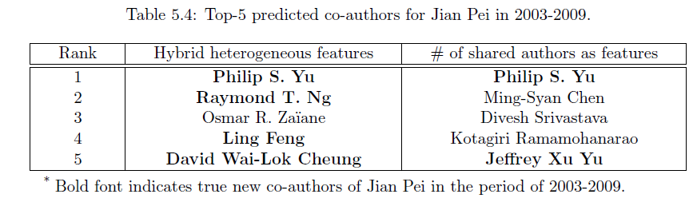
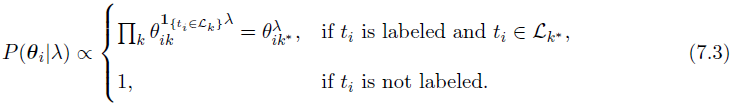

# 第二章 二类信息网络上基于排序的聚类方法

# 基本概念

* `定义 1.1：信息网络`

 定义有向图$G=(V,E)$及对象类型映射函数：$\varphi:V\to A$和关系类型映射函数:$\psi:E\to R$,每个对象$v\in V$属于一个对象类型，而对象类型是对象类型集合的一个元素：$\varphi(v)\in A$,同理，每个边从属于一个连接类型，连接类型是连接类型集合的一个元素:$\psi(e)\in R$,如果两个从属于同一种关系类型，则两个连接拥有共同的开始对象类型和结束类型。

* `定义1.2：同质和异质信息网络(HIN)`

当且仅当对象类型和关系类型满足$|A|>1或|R|>1$我们称网络为异质信息网络**(HIN)**,否则就是同质信息网络.

典型的HIN就是参考文献(bibliographic)网络DBLP,其涉及三种对象：论文、会议(venue)和作者。

* `定义1.3：网络模式(schema)`

网络模式$T_G=(A,R)$定义了网络的元结构，是信息网络$G=(V,E)$、对象类型映射$\varphi:V\to A$、$\psi:E\to R$的元模板(metatemplate)。

HIN的网络模式指定了对象与关系集合的类型限制，这种限制使得HIN是半结构化的，从而指导网络的语义分析。一个遵循网络模式的信息网络称之为网络模式的网络实例(instance)，对于连接$S\stackrel{R}{\to} T$,我们记$R.S$为关系$R$下的源对象类型，$R.T$为靶(target)对象类型，对逆关系$R^{-1}$有$T\stackrel{R^{-1}}{\to} S$，除非$R$是对称的，否则$R\neq R^{-1}$。

## 2.1 概述

同质网络的排序方法比较流行的包括：PageRank,HITS，异质网络上的排序和聚类可相互提高表现，基于这个出发点，作者提出了应用于二类信息网络（即二部图上）的$R_{ANK}C_{LUS}$方法如下。

## 2.2 预备知识

对于二类信息网络上基于排序的聚类问题，我们感兴趣的任务是：使用另一种类型的对象（属性对象）和网络中的链接对一种类型的对象（目标对象）进行聚类。 同时对每个类簇中的对象进行排序。

二类信息网络网络可使用分块邻接矩阵表示如下：

$\begin{pmatrix} W_{XX} & W_{XY} \\ W_{YX} & W_{YY} \end{pmatrix}$

其中$X,Y$分别表示一种对象类型。

`定义2.1 （二类信息网络）`:给定两类对象集合$X,Y$,如果$\mathcal{V}=X\cup Y,\mathcal{E}=\mathcal{V}\times \mathcal{V}$,则称$G=(\mathcal{V,E})$为二类信息网络。

对二类信息网络中的目标对象进行聚类最大的问题是，这些对象的特征并不显式地给出，一个直接的解决方案是先使用基于连接的方法评估目标对象的相似性（如SimRank)，然后再使用聚类方法进行聚类。对成对的对象进行评估是非常耗时的，而$R_{ANK}C_{LUS}$则是对每个类簇探索其排序分布从而导出新的目标对象测度，故而维度是很低的，且新的测度可以提高聚类的表现，并迭代地提高排序的表现，从而排序和聚类相互提高。

## 2.3 排序函数

### 2.3.1 简单函数

对于二类信息网络的简单排序函数如下：

该算法的复杂度为$O(|\mathcal{E}|)$。

### 2.3.2 权威（authority)排序

即对权威的对象给与更高的得分。乍一看，仅凭出版物信息对权威（作者或会议）进行排序似乎是不可能的，因为引用信息可能不可用或不完整，但基于如下两个经验规则：

* 规则一：排名靠前的作者在排名靠前的会议发表多篇论文。
* 规则二：排名靠前的论文能吸引来自排名靠前的作者的多篇论文。

注意到这些经验规则取决于领域，并且通常由对领域和数据集都非常了解的领域专家给出。 根据上述启发式方法，我们分别根据定义了作者和会议的迭代排名得分公式如下：

根据规则一，作者的得分如下：

根据规则二，会议的得分如下：

在每一步迭代的最后我们还需要对二者的得分进行标准化即：，

如【100】所示，**二者的最终得分会收敛于$W_{XY}W_{YX},W_{YX}W_{XY}$的特征向量。**

如果考虑合作关系的话，可以进一步引入第三条经验规则：

* 规则三：如果他/她与许多排名较高的作者合作，则其排名将提高。

则式（2.2）可修改为：

其中$\alpha$为参数。

同样地，我们可以证明$\vec{r_Y},\vec{r_X}$分别收敛于，的特征向量。

权威排序的时间复杂度为$O(t|\mathcal{E}|)$,其中$t$为迭代次数。与简单排序不同，权威排序通过在整个网络上的分数传播，为基于整个网络（而不是其直接邻域）的每个对象提供了重要的度量。

### 2.3.3 其他排序函数

排序函数可不局限于连接信息，还可以加入领域知识，也可以将高声誉对象和垃圾对象区分提高表现，如**PopRank**是一种通用HIN网络排序方法，**TrustRank**可以半自动地区分高声誉对象，**Personalized PageRank**可以使用利用专家排序作为查询并针对此类知识生成排名分布。

## 2.4 从条件排序分布到新聚类测度

假设我们已经有了对目标类型（会议）$X$的初始划分,并且已经针对每个类簇计算了会议和作者的条件排序得分，接下来的问题就是如何根据条件排序得分提高聚类表现。从直觉上讲，对于可能构成研究区域的每个会议类簇，以该类簇（或研究区域）为条件的作者的排序得分应与其他类簇中的作者不同。**这意味着这些排序分数可用作生成对象的新特征，以实现更好的聚类**。此外，我们将这些排序得分视为离散的排序分布，因为它们非负且和为1，这代表了根据在每个类簇中的权威，某个人了解一个作者或某个会议可能性的主观信念。

实例见图2.2，**不同领域的作者的排序得分差异明显**。

### 2.4.1 每个目标对象的类成员关系

假设我们已经得到类型$X$的聚类结果，如$\{X_k,i=1,...,K\}$,根据给定的排序函数，我们可以计算基于每个类簇$X_k$的$X,Y$的条件排序分布$\vec{r_Y}|X_k,\vec{r_X}|X_k,(k=1,...,K)$,在实际中，为避免$X$排序得分为0，我们将$Y$的收敛排序得分$\vec{r_Y}|X_k$向前一步传播给所有目标对象，以计算新的$\vec{r_X}|X_k$,记基于$X_k$的$X,Y$的条件分布$\vec{r_Y}|X_k,\vec{r_X}|X_k$为$p_k(Y),p_k(X)$,记$\pi_{i,k}$为$x_i$在类簇$k$的成员关系，从而$\sum_{k=1}^K \pi_{i,k}=1$。

根据贝叶斯法则，$p(k|x_i)\propto p(x_i|k)p(k)$,由于已知$p(x_i|k)$,故我们的目标是估计类簇的大小$p(k)$,（如某个子领域论文的比例，论文表示为会议和作者的链接**不考虑权重？？？**）

实例见图2.3，类簇成员关系可作为对象的特征，生成更好的聚类效果。

### 2.4.2 使用EM算法进行参数估计

为导出每个目标对象的类簇成员关系，我们需要估计$p(k)$,然后，我们建立一个混合模型以生成目标对象引致的链接，即每对$x_i,y_i$间的链接由概率$p(x_i,y_j)=\sum_k p_k(x_i,y_j)p(k)$,其中$p_k(x_i,y_j)$表示$x_i,y_j$在类簇$k$内存在连接的概率，此外我们假设连接的存在概率是独立的，即$p_k(x_i,y_j)=p_k(x_i)p_k(y_j)$,这种假设表明，一旦作者写了一篇论文，他就更有可能将其提交给排名较高的会议以提高其排名。 而对于会议，他们更有可能接受来自排名较高的作者的论文，以提高其排名(**这不是相关性假设吗???**)，类似于**preferential attachment**算法的思想。

根据以上假设，给定$X,Y$间的连接关系的似然函数为：

为估计$\Theta$，我们使用EM算法，在E-步，基于当前的$\Theta^0$计算条件分布：

在M-步，我们通过最大化计算的条件分布更新$\Theta$:

最后根据贝叶斯法则可计算类簇成员关系概率如下：

## 2.5 聚类中心和距离测度

**根据估计出的成员关系概率，我们可以将每个对象表示为一个$K$维向量$\vec{s_{x_i}}=(\pi_{i,1},...\pi_{i,K})$,则聚类中心可以对所有对象$x_i$计算均值得到，目标于类的距离可以由1-对象与聚类中心的cosine距离计算得到。**

## 2.6 RankClus算法总结

RankClus的算法示意图如下：

* step 0:初始化K个类簇，并为每个对象随机指定标签；
* step 1:对每个类簇进行排序。基于当前聚类，相应地生成K个聚类诱导的网络，并计算类型Y和X的条件秩分布。在这一步中，我们还需要判断是否有任何类簇为空，这可能是由于算法初始化不正确造成的。 当某个类簇为空时，算法需要重新启动生成K个类簇。
* step 2:计算目标对象的类成员关系向量和类簇中心向量。
* step 3:类簇调整。计算每个对象到每个类簇中心的距离，并将其分配给最近的类簇。
* 重复以上步骤直至类簇变化达到预定的阈值。

算法实例见图2.5，聚类和排序可相互提高对方的表现：

# 2.7 实证检验

数据为DBLP，K=15,评价标准为标准化互信息NMI，更多细节参加原文。

效果见图2.6：

效率见图2.7：

# 第三章 星式图上基于排序的聚类

## 3.1 概述

星式图(star network schema)，如以论文为中心的参考文献网络，以标记事件为中心的标记网络，事实上，任何n元关系集（例如关系数据库中的表）都可以映射到星形网络，其中关系中的每个元组都作为中心对象，而所有属性实体都链接到中心对象。

一个典型的星式参考文献网络如图3.1，包括四个元素：论文D、会议V、作者A、标签(Term)，以论文为中心，其可表示为：$G=(\mathcal{V,E},W)$,其中$W$为连接的权重，定义为：

`定义3.1（星网络）`:对于网络$G=(\mathcal{V,E},W)$,其中$\mathcal{V}=\{X_t\}_{t=0}^T$,如果满足：$\forall e=<x_i,y_j>\in\mathcal{E},x_i\in X_0\land x_j\in X_t(t\neq 0)$,反之亦然，其中$X_0$称为中心类型或目标类型，$X_t,\neq 0$称为属性类型。

与传统的聚类定义相反，我们使用NetClus来检测包含多种对象类型的网络类簇(net-cluster)，并遵循原始网络的模式，其中每个对象可以属于多个类簇（软聚类）而非唯一的类簇。

一个网络类簇即一个原网络模式的子图，包含多种类型的对象，且这些对象以一定的概率属于该子图，相应地，我们可以对属性对象计算（在所有网络类簇上的）排序得分，根据排序分布，用户可以很容易地得到目标对象(类簇成员概率)，实例如图3.1：

$NetClus$可以视为一种适用于星式图的基于排序的聚类方法，它可以按原网络的模式生成多个网络类簇,每个网络类簇都是一个子层，是网络社区的概念表示(如计算机类，硬件类等），该社区是类簇目标对象的诱导网络，并附有网络中每个对象的统计信息。

**NetClus并非生成对象的成对（pairwise）相似性,而是将每个目标对象映射为一个$K$(类簇数)维向量，而每个类簇内目标对象的概率生成模型都是基于排序的，从而将网络类簇分解维$T$(属性类型数)个独立的成分。**

## 3.2 排序函数

### 3.2.1 简单排序

每个属性类型对象的排序分布定义为：

其中$T_x$为$x$的属性类型，$N_G(x)$为$x$在$G$中邻居节点的集合。例如，在参考文献网络，一个会议的排序得分正比于该会议上发表的论文。

### 3.2.1 权威排序

与二类信息网络不同，我们需要考虑在通用HIN中路径上的排序得分传播，对于星式图$G$,权威得分经由$Z$从$X$传播到$Y$的定义为：

$W_{YZ},W_{ZX}$为对应两类对象的权重矩阵，在必要时可以进行标准化。通常一个类型对象的权威得分可以是其他不同类型对象得分的综合【$PopRank$】。计算排序分布的迭代方法是计算方阵主特征向量的有效方式，该方阵表示特定类型的对象对之间的强度，可以通过在模型中选择一条游走路径（或多条路径的组合）来实现，如在DBLP网络上，$V,A$排序分布的迭代计算公式为：

其中$D_{DA},D_{DV}$为为一个 对角阵，其对角线上的值等于$W_{DA},W_{DV}$的行元素和，其主要用于标准化。标准化意味着如果一篇论文是由多位作者撰写的，则在计算会议的排序得分时，我们应考虑这些作者的平均排序得分。 由于矩阵通常是稀疏的，因此在实践中，仅需要根据对象的有限邻居数来迭代计算对象的排序得分。

### 3.2.3 结合先验知识的排序函数

在两种排序函数中，我们都可以将先验信息结合进去。例如，用户可以给定少数代表性对象作为先验信息，$X$的先验信息可表示为$P(X|T_X,k),k=1,2,...,K$,该先验可以首先传播以Personalized PageRank在网络上传播给没有先验信息的类型。然后，以某一参数$\lambda_P\in[0,1]$将先验信息与计算出的排序分布线性组合起来。

## 3.3 NetClus算法框架

计算步骤如下：

0. 随机初始化$K$个类簇；

1. 针对每个网络类簇，建立基于排序的概率生成函数$P_{x|C_k^t},k=1,...,K$

2. 针对每个对象计算其后验概率$p(C_k^t|x)$,根据后验概率调整它们所属的类簇；
3. 重复步骤1，2直至每个类簇的变化小于阈值；
4. 计算每个网络类簇内每个属性对象的后验概率$p(C^*_k|x)$。

该算法的复杂度线性于$|\mathcal{E}|$。

## 3.4 网络类簇内目标对象的生成模型

很多研究表明，优先连接和分类混合广泛存在于许多现实世界的网络中，即具有较高度的对象有链接的可能性更高，而具有较高出现率的对象往往会相互链接。如在DBLP中，7.64%的作者发表了74.2%的论文，56.72%的论文发表于8.62%的会议上，即大型会议和高产作者常通过论文共同出现。我们通过使用排序得分代替对象的度来扩展启发式算法，因为排序得分更能表示对象在网络中的总体重要性。例如：链接到许多低排序网页（高度但低排序）的网页不会有太多机会从真正重要的网页获得链接，并且在垃圾会议发表许多论文的作者不会增加他/她在排名靠前的场所发表论文的机会。

我们提出使用目标对象的概率生成模型来简化模型结构，以参考文献网络为例，我们将不同类型的属性对象的影响进行分解，然后对目标对象的生成行为进行建模。网络分解的思想是：不同属性类型实体访问同一类型实体的概率是独立的，此外，在同类实体内，访问两个不同对象的概率也是独立的，即(**算法中没有使用到这个性质？？？**)：

$p(x_i,x_j|T_x,G)=p(x_i|T_x,G)\times p(x_j|T_x,G)$

基于此，**令论文$d_i$由$n_{i}$各属性对象决定，记为$x_{i,1},...,x_{i,n_i}$,则生成论文$d_i$的概率等价于生成这些属性对象的加权（边的权重即出现频数）概率**，即：

$p(d_i|G)=\prod_{x\in N_G(d_i)}p(x|T_x,G)^{W_{d_i,x}}$

其中对象$d_i$在网络$G$内的邻居。

## 3.5 目标对象和属性对象的后验概率

完成每个网络类簇的生成模型建模后，我们需要计算每个目标对象在每个网络类簇内的后验概率，由于某些目标对象可能不属于任何类簇，因此我们需要计算$K+1$个后验概率，前$K$个基于网络类簇，最后一个基于原始网络。因此，$G$上目标对象的生成模型可以视为一个背景模型，而与任何类簇都不相关的目标对象在该基础模型的后验概率会较高。

根据目标对象的生成模型，子网络$G_k$中，目标类型$D$中目标对象$d$的概率按照条件排序分布计算：

为避免概率为$0$的情况，每个条件排序得分需要首先基于全局排序进行平滑：

其中$P(X|T_X,G)$为全局排序。

平滑是信息检索中广泛使用的技术。 语言模型中需要进行平滑处理的原因之一是要处理文档中缺少术语的零概率问题，而基于排序的生成模型也存在这个问题，而事实上，在最初的几轮聚类中，可能会将对象分配给错误的类簇，如果不使用平滑技术，则它们可能没有机会回到正确的类簇。

完成目标对象概率计算后，我们即可以基于贝叶斯法则计算类簇成员关系概率：

$\pi_{i,k}\propto p(d_i|k)\times p(k)$

其中$p(k)$为类簇的相对大小。需要使用EM算法进行计算，对应的目标函数为：

EM算法的E步和M步的迭代更新公式分别表示为：

其中初始的$p(0)(k)=\frac{1}{K+1}$.

完成每个类簇$C_k$目标对象后验概率计算后，每个目标对象就可以表示为一个$K$维向量$\vec{v}(d_i)=(\pi_{i,1},\pi_{i,2},...,\pi_{i,K})$,每个聚类$C_k$的中心可以用新度量下属于该聚类的所有目标对象的均值向量表示。接下来，我们计算每个目标对象和每个聚类中心之间的余弦相似度，并将目标对象分配到具有最近中心的类簇中。每个目标对象都属于唯一的一个类簇，如果$d_i$分配到类簇$k$中，记$p(k|d_i)=1$，否则为0。属于类簇$k$的当前目标对象可以诱导新的子网络$G_k$。 上述调整是一个迭代过程，直到目标对象在当前度量下不会显着改变其簇标签。在度量目标对象时，我们并不使用背景模型的后验概率，原因有二：一，背景模型的后验概率绝对值不应影响目标对象之间的相似性；前K个后验概率的总和反映了对象在确定聚类中心时的重要性。

属性对象$x\in A\cup V\cup T$可计算如下：

其含义为：属于类簇$C_k$的会议的概率等于该会议中发表论文的平均后验概率

## 3.6 实证检验

数据DBLP,

条件排序分布的评价标准为平均KL散度：

在特定排序函数$f$下生成的测度的效果由致密性(compactness)测度：

目标对象的聚类效果由accuracy测度：

效果评价见图3.2：

参数分析见图3.3：

Accuracy比较见表3.4，3.5：

# 第四章 基于元路径的相似度搜寻

## 4.1 概述

其他同质网络或二部图相似度搜寻方法P-PageRank,SimRank；本章主要介绍PathSim,一种基于元路径的、适用于异质网络的相似性测度。

## 4.2 PathSim:一种基于元路径的相似性测度

基于链接的相似度函数中两个对象之间的相似度由对象在网络中的连接方式确定，可以使用路径来描述。但是，在异构信息网络中，由于链接类型的异构性，连接两个对象的方式可能更加多样化，为系统地识别两个对象类型之间的所有可能的连接类型（即关系），作者提出如下两个概念：

### 4.2.1 网络模式和元路径

 `定义4.1：网络模式(schema)`

网络模式$T_G=(\mathcal{A,R})$定义了网络的元结构，是信息网络$G=(\mathcal{V,E})$、实体类型映射$\varphi:\mathcal{V\to A}$、$\psi:\mathcal{E\to R}$的元模板(metatemplate)。

 `定义4.2元路径`

元路径$P$定义在模式$T_G=\mathcal{(A,R)}$下，形式为$A_1\stackrel{R_1}{\to}A_2\stackrel{R_2}{\to}...\stackrel{R_l}{\to}R_{t+1}$,其中$A_1,A_2...,A_{l+1}$为不同实体类型,$R=R_1\circ R_2\circ ...\circ R_l$为复合关系,其中$\circ$为复合关系操作。

### 4.2.2 基于元路径的相似度框架

给定用户定义的元路径$\mathcal{P}=(A_1...A_l)$，实体对$x\in A_1,y\in A_l$的几种相似度度量如下：

\* 路径计数：即元路径$\mathcal{P}$模式下的所有路径实例，$s(x,y)=|\{p:p\in\mathcal{P}\}|$;

\* 随机游走：在元路径$\mathcal{P}$下，始于$x$终于$y$的随机游走路径实例的概率和，$s(x,y)=\sum_{p\in \mathcal{P}}Prob(p)$

\* 成对随机游走：对于可以被分解为两个等长元路径的元路径$\mathcal{P=(P_1P_2)}$,$s(x,y)$为$x,y$在中点实体相遇的成对随机游走概率，$s(x,y)=\sum_{(p_1p_2)\in(\mathcal{P_1P_2})}Prob(p_1)Prob(p_2^{-1})$,其中$Prob(p_1),Prob(p_2^{-1})$分别为两个等长元路径的路径实例的随机游走概率。

总体上，我们可以将基于元路径的相似度框架定义为：$s(x,y)=\sum_{p\in\mathcal{P}}f(p)$,其中$f(p)$为$x,y$间路径实例的测度。P-PageRank和SimRank是两最著名的图相似度函数，是同质网络中，不同长度元路径下，随机游走测度或成对随机游走测度的加权组合。为了在异构信息网络中使用P-PageRank和SimRank，我们需要指定我们感兴趣的元路径并将随机游走限制在给定的元路径上。

### 4.2.3 PathSim：一种新的相似度测度

前述的相似性度量常常会偏向高频或处于中心的对象而不能捕获同类相似度(peer similarity)的语义，如路径计数和随机游走方法偏向于较高度的对象，成对随机游走偏向于中心化的对象（大多数连接指向一小部分对象）。但很多场景中，寻找网络中的相似对象就是寻找相似同类(peer)，如基于领域和声誉寻找相似的作者等。这就是PathSim背后的理论动机：***\*相似同类不仅是强相连的，而且是具有相似的可见性(comparable visibility)\****。由于同类关系是对称的，因此作者也限定PathSim在对称元路径上。

`定义4.3（PathSim)`:两个同类实体$x,y$间的PathSim定义为：

其中$p_{x\to y}$为$x,y$间的路径实例，$p_{x\to x}$为$x,x$间的路径实例，$p_{y\to y}$为$y,y$间的路径实例。

***\*上式表明：PathSim取决于两部分，第一部分是由路径实例数定义的连接性，第二是二者由自关系路径实例数定义的可见性。此外，PathSim还使用路径实例的出现次数作为路径实例的权重，它是路径实例中所有链接权重的乘积。\****

某元路径下两个同类实体的PathSim计算涉及到矩阵相乘，给定网络$G$,网络模式$T_G$,我们称元路径$\mathcal{P}=(A_1...A_l)$的新邻接矩阵为关系矩阵，定义为$M=W_{A_1,A_2}..,W_{A_{l-1},A_l}$，$W_{A_i,A_{i+1}}$为两类型的邻接矩阵，则$M_{i,j}$代表了对象$x_i\in A_1,y_j\in A_l$在元路径$\mathcal{P}$下的路径实例。

为保证PathSim的对称性，我们限定$\mathcal{P=(P_lP^{-1}_l)}$,即路径必须是可返回的。在PathSim下，路径$p$的相似度度量为：

$f(p)=\frac{2w(a_1,a_2)...w(a_{l-1},a_l)}{M_{ii}+M_{jj}}$

其中$a_1= x_i,a_l=x_j$,$w_{a_m,a_n}$为链接$<a_m,a_n>$的权重。

`定理4.1(PathSim的性质)`:

`定理4.2（无线长元路径下PathSim的极限性质)`:

令元路径$\mathcal{P}^{(k)=(P_lP_l^{-1})^k}$,$M_{\mathcal{P}}$为元路径$\mathcal{P}_l$的关系矩阵，$M^{(k)}=(M_{\mathcal{P}}M_{\mathcal{P}}^{T})^k$为$\mathcal{P}^{(k)}$的关系矩阵，则当$k\to\infty$时，$x_i,x_j$的PathSim值为：

其中$\mathbf{r}$为$M$的主特征向量，$\mathbf{r}(i)$为$\mathbf{r}$的第$i$个元素。

主特征向量可以作为对象向量的权威排序，两个对象在无限长路径上的相似度可以视为定义在二者排序的测度，即两个具有相似排序的目标相似度也较高，后续的实证表明，该代表全局排序的相似度，并不十分有用。由于在实际中，长度为10的元路径即可以视为无限长路径，因为本章只关注对于较短的元路径的top-k相似度搜寻。

但即使是对较短的路径，对所有元路径进行穷举也是非常困难的，因此本提出4.3节的方法用以加速计算。

## 4.3 单路径的在线查询处理

相比P-PageRank和SimRank，PathSim非常高效，因为它是局部图度量方法，但其中的矩阵相乘仍然耗时。在top-k相似度搜寻任务中，我们需要计算查询对象和网络中每个***\*同类对象\****的相似度，在这种情况下，即使是小规模的网络上，穷举法也极为耗时。

为此，我们提出部分部分具化(materialize)短元路径然后进行在线拼接，以生成基于长元路径的相似度。首先，文章提出一种基线方法***\*PathSim-baseline\****以计算查询对象$x$和所有同类候选对象$y$，然后，使用基于联合聚类的方法***\*PathSim-pruning\****根据候选对象的相似度上界进行精简，两种算法都返回$k$个结果，此外，本方法也适用于其他基于元路径的相似性测度，如随机游走或成对随机游走，只需改变相似度矩阵的定义。

### 4.3.1 单路径拼接

给定元路径$\mathcal{P=P_lP_l^{-1}}$,其中$\mathcal{P_l}=(A_1...A_l)$,$A_1$中的对象数为$n$,对于查询$x_i\in A_1$,我们如果即时计算同类top-k相似度是非常昂贵的，所以我们需要将提前计算并存储（***\*这也叫加速算法？？？\*****）$M=M_{\mathcal{P}}M_{\mathcal{P}}^T$,如此我们只需要定位$x_i$对应的行，然后根据$(M_{ii}+M_{jj})/2$进行标准化生成新的向量，再根据新向量进行排序输出$top-k$结果。当然具化所有可能的元路径的关系矩阵也是不现实的，其空间复杂度$O(n^2)$,因此我们部分具化$\mathcal{P}_l^{-1}$的关系矩阵$M_{\mathcal{P}}^T$,并通过拼接$\mathcal{P}_l$和$\mathcal{P}_l^{-1}$计算$\mathcal{P}$在线计算top-k结果。

接下来我们讨论如何拼接的问题。由于$M$未预先存储，我们假设$M$对角阵$D=(M_{11},...,M_{nn})$已被预先计算并存储，因为$M_{ii}=M_{\mathcal{P}}(i,:)M_{\mathcal{P}}(i,:)^T$,其时间复杂度为$O(nd)$，空间复杂度$O(n)$,其中$d$为$M_{\mathcal{P}}$每行非零元素的均值。

本文中我们只关注$\mathcal{P=P_lP_l}^T$,如预先存储$APV$，以计算$APVPA,VPAPV$。

### 4.3.2 基线

得到$M_{\mathcal{P}},D$之后，我们需要计算所有$x_j\in A_1$与$x_i$的相似度$s(i,j)$,最直接基线是：（1）首先使用向量-矩阵乘法计算$M(i,:)=M_{\mathcal{P}}(i,:)M_{\mathcal{P}}^T$;(2)对所有$x_j\in A_1$计算$s(i,j)=\frac{2M(i,j)}{M(i,i)+M(j,j)}$;(3)对$s(i,j)$进行排序，返回$top-k$结果。但当$n$非常大时，向量-矩阵乘法将非常耗时，因此，我们首先计算不与$x_i$正交的向量，方式是从$x_i$出发寻找其关系矩阵$M_{\mathcal{P}}$的二步邻居，即$x_j\in CandidateSet(\cup_{y_k\in M_{\mathcal{P}}·Neigh(x_i)}M^T_{\mathcal{P}}·Neigh(y_k))$,

其中$M_{\mathcal{P}}·Neigh(x_i)=\{y_k|M_{\mathcal{P}}(x_i,y_k)\neq 0 \}$，这种方式的效率要远高于成对的比较，我们称该极限拼接模型为$PathSim-baseline$。

但如果候选集合很大时，该方法依然非常耗时，因为即使$M_{\mathcal{P}}$相对稀疏，但拼接之后$M$可能会变得致密，即候选集变得很大，查询对象与候选对象的点积正比于它们非零元素的大小，针对每个候选对象，计算PathSim的平均时间复杂度为$O(d)$，最坏的情况可能会达到$O(m)$,即最坏的情况下，针对所有候选集计算PathSim的复杂度为$O(mn)$其中$n$我$M_{\mathcal{P}}$的行数，$m$为列数，$d$为$M_{\mathcal{P}}$每个对象的非零元素数。基于此，作者提出基于联合聚类的$top-k$拼接算法，通过该算法没有希望的目标对象会动态地被过滤掉。

### 4.3.3 基于联合聚类的精简(pruning)

baseline的时间复杂度主要涉及两个方面：1，候选集的大小；2，点积计算中的向量长度$m$.因此加速的方法就是过滤无效的候选对象，基于此，作者提出了联合聚类路径拼接算法（即同时对矩阵的行和列进行聚类），首先对部分关系矩阵的两类对象进行联合聚类，然后针对对应于联合聚类对的分储其必要的统计量，

然后基于分块统计量进行搜索空间的精简。举例说明，我们称类型$A_1$的类簇为***\*目标类簇\****，因为$A_1$的对象为查询的对象，称$A_l$的类簇为***\*特征类簇\****，因为$A_l$的对象可作为计算查询对象与目标对象相似度的特征。通过将$A_1$划分为不同的目标类簇，如果一个完整目标类簇与查询对象不相似，则该目标类簇中的所有对象都不太可能在最终的$top-k$中，从而可以被精简。通过将$A_l$划分为不同特征类簇，查询向量和候选向量将得以降维，基于降维后的向量可用于计算相似度上界，实例见图4.2,该示例使用了9个目标对象和6个特征对象。

整个算法流程详解如下：

1. ***\*分块级交换矩阵具化（block-wise commuting matrix materialization)\****

  第一个问题是如何针对每个交换矩阵$M_{\mathcal{P}}$生成类簇。因为一个交换矩阵可被用作拼接为两个长元路径，即$M_{\mathcal{P}}M_{\mathcal{P}}^T,M_{\mathcal{P}^T}M_{\mathcal{P}}$,我们希望找到特征类簇和目标类簇的联合类簇，其中的每个值都与其他值相似。我们使用基于贪婪KL-散度的联合聚类方法（见算法4.1），该算法与***\*文献【34】\****的信息论联合聚类相似，但通过仅使用特征聚类信息简化了每个对象的特征空间。例如对于$\mathcal{P}_l=(APC)$,我们使用作者类簇出现于某个会议$c$的条件概率$p(\hat{A}_u|c='VLDB')$,作为会议$c$的特征，使用在某个会议类簇$\hat{C}_v$中的作者类簇条件概率$p(\hat{A}_u|\hat{C}_v="DB"$作为会议类簇$\hat{C}_v$的特征，根据最小$KL-散度$指定会议类簇成员关系。上述过程针对会议类型和作者类型重复执行直至收敛。

  

  算法4.1的时间复杂度$O(t(m+n)(UV))$,其中$t$为迭代次数，$m,n$为特征类型和目标类型数，$U,V$为特征类型和目标类型的类簇数。基于该算法，还可以使用基于抽样的算法【83】进一步提高联合聚类的速度。在实验设置中，作者将选择度较高的对象进行聚类，然后将度较小的对象分配给现有类簇。

  一旦完成每类对象的聚类，交换矩阵就可以分解为不相连的区块。为便于进一步拼接两个元路径，每个分块都存储必要的统计信息。对由行类簇$R_u$和列类簇$C_v$表示的分块$b$，我们存储如下信息：

  \1. 每个分块$T^{\{U\times V\}}$的元素和$t_{uv}=\sum_{i\in R_u}\sum_{j\in C_v}M_{\mathcal{P}}^T(i,j)$;

  \2. 每个分块$T_1^{\{U\times m\}}$的行向量和（每个列向量的L1范数）：$t_{uv,1}(j)=\sum_{i\in R_u}M_{\mathcal{P}}^T(i,j),\ \forall j\in C_v$

  \3. 每个分块$TT_1^{\{U\times m\}}$行向量元素平方和的平方根（列向量的L2范数）：$t^2_{uv,1}(j)=\sqrt{\sum_{i\in R_u}(M_{\mathcal{P}}^T(i,j))^2},\ \forall j \in C_v

  \4. 每个分块$T_2^{\{n\times V\}}$的列向量和（行向量的L1范数）：$t_{uv,2}(i)=\sum_{j\in C_v}M_{\mathcal{P}}^T(i,j),\ \forall i\in R_u$

  \5. 每个分块$TT_2^{\{n\times V\}}$列向量元素平方和的平方根（行向量的L2范数）：$t^2_{uv,2}(i)=\sqrt{\sum_{j\in C_v}M_{\mathcal{P}}(i,j))^2},\ \forall i\in R_u$

  

2. ***\*路径拼接中的精简策略\****

  接下来我们讨论如何在给定具化分块交换矩阵的条件下，针对查询对象计算top-k结果的方法。其直觉为：我们首先计算检查最优希望的目标类簇，然后如果可以精简，对整个目标类簇进行精简，如果不能，我们首先确定我们是否需要计算查询对象和候选对象的相似性，然后针对需要计算相似度的情况，完整计算相似度值。

  `定理4.3 基于分块相似度测度近似方法的界`:给定查询对象$x$，查询向量记为$\mathbf{x}=M_{\mathcal{P}}(x,:)$,令$S$为$M$的对角向量，令$\hat{x}_1$为给定特征类簇$\{R_u\}_{u=1}^U$情况下的压缩查询向量，其中$\hat{\mathbf{x}}_1(u)=max_{j\in R_u}\{\mathbf{x}(j)\}$,令$\hat{\mathbf{x}}_2(u)=\sqrt{\sum_{j\in R_u}\mathbf{x}(j)^2}$为查询向量的L2范数，则$x$与目标类簇$C_u$的相似度，以及$x$与候选对象$y\in C_v$的相似度可以由如下界限估计：

  \1. 上界1：$\forall y\in C_v,s(x,y)\leq s(x,C_v)=\sum_{y\in C_v}s(x,y)\leq \frac{2\hat{\mathbf{x}}_1^TT(:,v)}{D(x)+1}$;

  \2. 上界2：$\forall y\in C_v,s(x,y)\leq \frac{2\hat{\mathbf{x}}_2^TTT_1(:,y)}{D(x)+D(y)}$;

  在定理4.3中，上界$s(x,C_v)$可以用于找出最有希望的目标类簇，如果（某对象）上界小于当前top-k列表最小相似度，我们可以对目标类簇进行精简，该精简只涉及$U$次计算。

  搜索策略是首先根据查询$x$和类簇$C_v$之间相似度的上界对目标类簇进行排序，相似度越高，该类簇包含与x相似的对象的可能性越大。首先使用排序检查最有希望的目标类簇非常关键，通过排序可以在较早阶段检索最需要的对象，然后上界也会对剩余的候选对象具有更强的精简能力。当需要检查新的目标类簇时，如果上界小于当前前k个列表的第k个值，则可以使用上界来修剪整个目标类簇和所有其余目标类簇。接下来，当检查目标类簇中的候选对象时，如果查询对象$x$和候选对象$y$的上界小于当前阈值，则可以使用该上界修剪没有希望的候选对象，该方法称为$PathSim-pruning$如算法4.3,在第五行，$min(S)$为当前top-k结果集合的最小相似度，与$PathSim-baseline$相似，我们在精简之前，仍然需要生成候选集，与基线算法相比，基于精简的算法最多会检查相同数量的候选对象，但通常只需检查少量候选对象，因此效率更高。

  

## 4.4 多元路径组合

给定$r$条从$A$出发返回$A$的路径$\mathcal{P_1,..,P_r}$,其对应关系矩阵和权重分别为：$M_1,...,M_r;w_1,...,w_r$，则对象$x_i,x_j\in A$的组合相似度定义为：$s(x_i,x_j)=\sum_{l=1}^rw_ls_l(x_i,x_j)$,其中$s_{x_i,x_j}=\frac{2M_l(i,j)}{M_l(i,i)+M_l(j,j)}$.

我们需要结合多个元路径的原因在于，每个元路径都提供了一个相似度的视角，而真实的结果可能是多种原因的结果。以下是一些有用的权重指定原则：

更长的元路径使用了更远的关系因此应当指定更小的权重，类似于P-PageRank和SimRank；具有重要关系的元路径应当指定更高的权重。为了自动确定权重，用户可以提供相似对象的训练示例，以使用学习算法来学习不同元路径的权重。

表4.5给出了多元路径组合的聚类效果，以NMI为评价标准：

其中VAV,VTV为VPAPV,VPTPV的缩写，$(AVA)^2$为AVAVA的缩写。

## 4.5 实证

数据：DBLP，Flickr;

### 4.5.1 效果

比较基准：SimRank,P-PageRank,RW,PRW，聚类排序结果见表4.6：

NMI表现见表4.7：

不同元路径语义的结果见表4.8：

路径长度影响分析见表4.9:

### 4.5.2 效率

不同邻居节点数目的效率见图4.3：

不同部分交换矩阵$M_{\mathcal{P}}$效率结果见图4.4：

### 4.5.3 Flickr数据

Flickr数据集上的效果见图4.5，图4.6：

# 第五章 基于元路径的关系预测

## 5.1 概述

在HIN上的关系可以是直接链接也可以是遵循元路径的路径实例，本章提出使用基于元路径的拓扑特征进行HIN上的链路预测，其目标是**使用这些路径的元结构（即元路径）系统地定义在不同路径中编码对象之间的关系**。

## 5.2 基于元路径的关系预测框架

在HIN任务中，我们需要指定被预测关系的类型，称为**目标关系**，其可以被元路径所描述，如合作关系可以使用元路径$APA$元路径描述。我们还需要针对潜在关系构建对象间基于元路径的拓扑特征。因此本章首先构造基于元路径的拓扑特征，然后提出一种基于监督学习的预测框架。

### 5.2.1 基于元路径的拓扑特征

基于拓扑特征的链路预测即根据当前的链接信息预测未来的链接信息。以下我们首先回顾几种常用的同质网络上的拓扑特征，然后提出了一种基于元路径的系统方法来定义异构网络中的拓扑特征。（**同质网络上的拓扑特征多属于邻域重叠度检测，可参加W.Hamilton 《Graph Representation Learning》**）

* **已有的拓扑特征**

  1. 共同邻居(common neighbours)：即两个对象的共同邻居，$|\Gamma(a_i)\cap \Gamma(a_j)|$

  2. Jaccard系数：用于度量两个邻居集合的相似度，即标准化的共同邻居$\frac{|\Gamma(a_i)\cap \Gamma(a_j)|}{|\Gamma(a_i)\cup \Gamma(a_j)|}$
  3. $Katz_{\beta}$:即两个对象间不同长度的路径数的加权和$\sum_{l=1}^{\infty}\beta^l|path_{a_i,a_j}^{<l>}|$,其中$\beta$为权重系数。
  4. PropFlow:是一种基于路径的拓扑特征，该方法对每个(长度为$l$)的路径指定权重，指定权重的依据是边上流量(flow)比例的乘积。[67,66]

  可以看出目前多数同质网络上的拓扑特征都是基于邻居集合或路径，但异质信息网络上的邻居集合有不同的类型，元路径也有不同的语义。

* **基于元路径的拓扑特征**

  要定义基于元路径的拓扑特征我们首先需要使用元路径定义两个对象的拓扑结构，然后在拓扑结构上定义测度。

  * **基于元路径的拓扑结构**

    我们可以通过将同质网络上的拓扑特征（邻居集合或路径）扩展到异质网络上，如遵循不同元路径的路径计数作为共有邻居特征，或者类似于$Katz_{\beta}$,以遵循不同元路径的路径组合作为路径特征，实际中，我们通过遍历图上的网络模式进行拓扑构建，**即可以遍历两个对象间所有满足长度约束的元路径作为其拓扑结构**

  * **元路径的测度函数**

    同质网络常用的拓扑特征如下：**路径数，标准化路径数，随机游走，对称随机游走**

    * **路径数**：即对给定元路径下$R$下的路径实例进行计数，记为$PC_R$,路径数可以通过与元路径中每个关系相关联的邻接矩阵的乘积来计算。
    * **标准化路径数**：即根据两个对象间的总体连通性进行标准化，记为$\frac{PC_R(a_i,a_j+PC_{R^{-1}}(a_j,a_i)}{Z_R(a_i,a_j)}$,其中$R^{-1}$表示$R$的逆路径，在PathSim中，我们取$Z_{R}=PC_R(a_i,a_i)+PC_R(a_j,a_j)$。
    * **随机游走**：$RW_R(a_i,a_j)=\frac{PC_R(a_i,a_j)}{PC_R(a_i,·)}$,其中为所有始于$a_i$、遵循$R$的路径数，即PropFlow的扩展。
    * **对称元路径**：$SRW_R(a_i,a_j)=RW_R(a_i,a_j)+RW_{R^{-1}}(a_j,a_i)$

  以图5.1为例，各测度的值计算如下：

  

  

### 5.2.2 基于监督的关系预测框架

使用$T_0(t_0,t_1)$的拓扑特征和标签取训练，预测$T_1=[t_1,t_2]，|t_1-t_0|=|t_2-t_1|$上的关系标签（**感觉这样的表述很有问题，通常的关系预测应都是静态关系预测；因为在时间序列上，关系可能会发生变化，如果关系变化，不含时间序列信息的关系预测将毫无意义**）。其中标签即可以加建模为二值分布以预测是否合作，也可以建模为Poisson分布以预测合作次数等。

以下以合作关系预测，以及带时间信息的合作关系预测为例说明。

## 5.3 合作关系预测

合作关系即元路径$A-P-A$.

### 5.3.1 合作关系预测模型

令$\mathbf{x}_i$为一个$d+1$维向量，代表$<a_{i1},a_{i2}>$间的拓扑特征，$y_i$为$0-1$标签，以logistic模型建模。

### 5.3.2实证

数据集DBLP，，

模型效果如图5.3，其中H、P、L分别代表Highly,Productive,Less,即目标作者类型：

同质拓扑特征和异质拓扑特征的效果对比如表5.2：

不同特征的平均准确度见图5.4：

显著性见表5.3：

预测示例见表5.4：

## 5.4 含时间的关系预测

即预测关系建立的时点。

### 5.4.1 作者引文关系预测的拓扑特征

目标关系为$A-P-P-A$，通常对于关系$R_T=<A,B>$,任何始于$A$终于$B$但不是目标关系的关系都可以作为拓扑特征，通过推理关系建立动态，我们特别考虑如下将三种关系形式视为拓扑特征：

* $AR_{sim}AR_TB$,其中$R_{sim}$为类型A之间定义的相似关系，$R_T$为目标关系，其背后的直觉是如果$a_i\in A$与许多$a_k\in A$相似，且$a_k\in A$与$b_j\in B$相连，则$a_i\in A$可能在未来与$b_j$也存在关系。
* $AR_TBR_{sim}B$，其中$R_{sim}$为类型$B$之间的相似关系。
* $AR_1CR_2B$.

对于拓扑特征，我们将相似关系$R_{sim}$和其他局部关系$R_1,R_2$限制为可以使用元路径从网络得出的相似关系。 此外，我们仅考虑对称的相似关系。

对于$A-P\to P-A$我们考虑如表5.5的6种作者-作者相似关系，对于每种相似关系，我们可以将目标标签嵌入其左边或右边如拓扑特征1、2，从而得到12种拓扑特征，如果将$P\to P-A$拼接入$A-p\to p$得到$A-P\to P\to P-A$如拓扑特征3，我们可以得到19种拓扑特征。

具体示例见图5.5：

不失一般性，文章使用PC作为默认测度，因此每个元路径都应一个测度矩阵，其中复合关系即单关系邻接矩阵的矩阵乘积。针对不同元路径的度量具有不同的尺度。 例如，由于邻接矩阵相乘，较长的元路径通常具有更多的路径实例，因此 我们使用Z分数对每个元路径进行标准化。

### 5.4.2 关系建立时间预测模型

我们基于广义线性模型将进行关系建立时间建模，对于不同的关系建立时间分布假设，会建立不同的方法。

模型以拓扑特征为变量，以关系第一次建立时间为标签$y_i=t_i-t_1$,以$T_0=[t_0,t_1]$为过去训练集，$T_1=[t_1,t_2]$为未来训练集，如果没有建立关系，则$y_i\ge t_2-t_1$,由此$y_i$的取值范围为$[0,\infty]$.

GLM的建模对象为$E(Y)$,$T$服从指数族分布，常用高斯分布或伯努利分布，对应于最小二乘回归和Logistic回归。

* **关系建立时间分布**

本文使用指数分布、Weibull分布和几何分布作者关系建立时间分布，对于指数分布，我们有：

对于Weibull分布有：

对于几何分布有：

由于指数分布是Weibull分布的一种特殊形式，因此仅就Weibull分布进行讨论。

由于对于Weibull分布，其期望表示为：

因此连接函数表示为：

$E(Y_i)=e^{-\mathbf{x}_i\beta}\Gamma(1+\frac{1}{\lambda})$,

对应对数似然函数表示为：

带入参数，上式即：

同理，几何分布的对数似然函数表示为：

* **模型推断**

  1. **在$t$时间内建立联系的概率分别表示为**：

     对于Weibull分布，有：

     

     对于几何分布有：

     

  2. **建立联系的平均时间分别表示为**：

     

     

  3. **以概率$\alpha$建立连接的时间分位数表示为**：

     

     

### 5.43 实证检验

$T_0=[1996,2000],T_1=[2000,2009]$,以logistic回归为基准，不同时间长度的表现见表5.6，5.6：

关系建立时长的平均预测误差MAE见表5.8：

不同置信区间，真实关系发生的比例见表5.9：

关系建立时间预测示例见表5.10：

# 第六章 属性不完整的关系强度感知聚类

## 6.1 概述

在HIN上聚类存在两个挑战：

第一，对于给定的属性集，某个对象可能只有部分属性有观测值，故完全基于属性的聚类方法可能失效；第二，HIN中的连接关系具有不同的类型或语义，因此完全基于连接（而无任何属性指导）的聚类方法也可能失效，如在政治论坛社交网络上，如果不指定聚类的意图，则我们无法确定使用何种类型的连接（亦即学习连接的重要性）进行聚类。本章将致力于构建一种结合属性和连接的、稳健的概率聚类模型。

## 6.2 关系强度感知聚类问题定义

记HIN表示为$G=(\mathcal{V,E},W)$,记不同类型对象的属性集合为$\mathcal{X}=\{X_1,..,X_T\}$,每个对象的属性观测值集合都是属性集合的一个子集，记为$v[X]=\{x_{v,1},..,x_{v,N_{X,v}}\}$,其中$N_{X,v}$表示对象$v\in \mathcal{V}$的属性$X$（**感觉应是$\mathcal{X}$，或者$X\subset \mathcal{X}$？？？**）的总观测值数，记$\mathcal{V}_X$表示包含属性$X$的所有对象的集合。

### 6.2.1 聚类问题

聚类问题的目的是根据用户指定的网络属性子集，借助来自不同类型的链接，将网络中的每个对象映射到统一的隐空间，即软聚类。

例如，在参考文献网络中，我们只能使用文本属性，但对于作者和会议聚类，只有文章的连接信息可用；而对于文章，则可以使用文本属性和连接类型。

而在天气感应器网络中，有降雨感知和温度感知器两种类型，因此有两种属性，只有结合两种属性才能确定天气，但同以地区只有一种感知器，因此需要结合感知属性和连接才能进行准备判断，如图6.3：

给定类簇数$K$，聚类任务表示为：

1. 针对所有对象学习一个软聚类，即一个成员关系概率矩阵，$\Theta_{|\mathcal{V}|\times K}=(\theta_v)_{v\in\mathcal{V}}$,其元素$\Theta_{v,k}$表示对象$v$属于类簇$k$$的概率，$，$\theta_v$为为一个$K$维的类簇关系概率向量；
2. 针对不同连接类型学习其决定类簇成员关系的强度（即重要性权重），记为$\gamma_{|\mathcal{R}|\times 1}$,其中$\gamma(r)$表示连接类型$r\in\mathcal{R}$的重要性权重。

## 6.3 聚类框架

### 6.3.1 模型概述

聚类配置即$\Theta$可视为对象的隐类簇信息，其需满足两个条件：

1. 给定聚类配置，观测属性的生成概率应尽量高，特别地，我们为每个对象的每个属性建立一个独立的混合模型，其中的每个成分都代表一个类簇。
2. 聚类配置应与网络结构有高度的一致性，即，相连的对象间应当有相似的类簇成员概率，且链接类型的强度较大，则需要这种类型的链接对象之间的相似度更高。

从而我们可以将属性观测值和聚类配置分解为两个部分，给定聚类配置下观测值的生成概率和聚类配置的概率，即：

上式表明聚类配置的概率由网络结构$G$和强度向量$\gamma$决定，而属性观测值由聚类配置和类簇成员参数$\beta$决定。

因此我们的目标变为根据最大似然估计参数$\gamma,\beta$,分为如下两个部分：

### 6.3.2 属性生成建模

给定聚类配置$\Theta$,我们假设每个对象间的观测值都条件独立，然后假设与每个对象v相关的每个属性X服从相同的混合模型族，这些混合模型族共享相同簇成分，其中的成分混合比例即簇成员关系向量$θ_v$,为简化起见，我们首先假设只有一个属性，然后简要讨论多属性扩展问题。

* **单属性**

  对于单属性，我们假设每个对象的属性值$v[X]$有一个混合模型生成，而混合模型的每个成分都代表一个类簇，则属性观测值的生成概率定义为：

  

其中$\beta_k$为类簇$k$的参数。本章只考虑两种属性，一个是服从分类分布的文本属性，一种是服从高斯分布的数值属性。

1. **服从分类分布的文本属性**：网络中的对象包含术语列表形式的文本属性，范围从词汇表的l = 1到m，每个簇$k$在分类分布之后都有不同的术语分布，其参数$\beta_k=(\beta_{k,1},...,\beta_{k,m})$,其中$\beta_{k,l}$术语$l$出现在类簇$k$的概率，即$X|k=discrete(\beta_{k,1},...,\beta_{k,m})$,根据PLSA模型，每个对象的术语都由一个混合分布生成，对象$v$的术语列表中的每个术语都是从混合模型生成的，每个分量都是由$β_k$表示的术语上的分类分布，且分量系数为$θ_v$。故当前属性观测值的概率为：

   

   其中$c_{v,l}$表示对象$v$包含术语$l$的频数。

2. **服从高斯分布的数值属性**：网络中对象属性值为一个实值列表，第$k$个类簇的值服从参数为$\beta_k=(\mu_k,\sigma^k_2)$的高斯分布，即$X|k\sim N(\mu_k,\sigma^2_k)$,类似于文本属性，当前属性值的生成概率定义为：

   

* **多属性**

  记对象$v$的$T$个属性的观测值为$\{v[X_1]\},...,\{v[X_T\}$,根据独立性假设有：

  

### 6.3.3 结构一致性建模

**两个对象在类簇成员关系上越相似，则这两个对象越有可能存在连接**。为定量测度聚类结果的一致性，我们对观测$\Theta$定义了新的概率密度函数。

本文假设（重要的关系类型对应的连接关系）相连的对象间更有可能属于同一类簇（**一阶相似度？？？**），即成员概率向量$\mathbf{\theta_i,\theta_j}$也相似。我们可以通过针对所有连接进行复合分析来评估聚类配置$\Theta$和网络结构$G$的一致性，分析形式以概率密度值的形式进行，密度值越大代表一致性越高。以下文章首先如何根据单链接定义两个概率成员向量的一致性，然后解释如何将这种分析推广到所有连接以构造$\Theta$的概率密度值。

对于连接$e=<v_i,v_j>\in\mathcal{E},r=\phi(e)\in\mathcal{R}$,定义其聚类重要性权重为$\gamma(r)$,注意该重要性是一个要学习的参数且定义在**链接类型上**，不同于连接权重$w(e)$(即网络$G$中的$W$)。定义两个类簇成员关系向量的相似度为特征函数$f(\mathbf{\theta}_i,\mathbf{\theta}_j,e,\gamma)$,该函数值越高意味着聚类结果的一致性较高。一个好的特征函数应满足如下性质：

1. $f$应为$\mathbf{\theta}_i,\mathbf{\theta}_j$相似性的增函数；
2. $f$应为$w(e),\gamma(r)$的**减函数，换句话说，对于特定链接类型,其更强度越大，则要求两个链接节点越相似，才能保证相同的一致性级别。(这逻辑，不太对吧???)**
3. 特征函数关于$\mathbf{\theta}_i,\mathbf{\theta}_j$是不对称的，因为$v_i$对$v_j$的影响可能与$v_j$对$v_i$的影响不同。如互引的论文的影响力可能不同。

基于此，我们提出如下基于互熵的特征函数：

其中为从$\mathbf{\theta}_j$到$\mathbf{\theta}_i$的互熵，衡量的$v_j$从$v_i$的偏离，以使用基于$\mathbf{\theta}_i$分布的编码模式进行编码的平均比特数作为标准。对于固定的$\gamma(r)$,当且仅当$\mathbf{\theta}_j,\mathbf{\theta}_i$相同时，$H$取得最小值。也可以使用KL散度替代互熵，但互熵在两个向量相同时，能够取得最小值，代表二者在一个类簇，性质更优。

我们使用对数线性函数对聚类配置概率进行建模：

其中为标准化因子。

### 6.3.4 统一模型

网络聚类的目标是确定聚类结果$\Theta$,链接强度$\gamma$,类簇成分参数$\beta$以最大化属性观测值和网络一致性的生成概率，此外我们对$\gamma$指定均值为0，协方差矩阵为$\sigma^2I$的先验高斯分布以防止过拟合(**为什么能防止过拟合？？？**)， 其中$\sigma$为超参数，本文设为$0.1$,整体的目标函数如下：

此外，我们限制$\gamma>0$,$\beta$在属性分布类型上是独立的。

## 6.4 聚类算法

以下进行概率聚类模型的介绍。文章首先从所有链接类型等权出发，然后根据该类型链接与当前聚类结果的平均一致性更新每种类型的强度，最终得到良好的聚类效果以及合理的链接类型强度向量，因此本算法是一个迭代过程，包括两个步骤。

第一步，固定连接类型权重，优化聚类结果，即：

第二步，固定聚类结果和参数，优化链接类型强度，即

重复以上两步直至收敛。

### 6.4.1 聚类优化

在本阶段，由于我们假设$\gamma$是固定的，因此关于$\gamma$的部分均可忽略，因此目标函数简化为：

上式可由EM算法求解，在E步，根据当前的$\Theta,\beta$求出每个对象每个属性值的概率$z_{v,x}$,称为观测值的隐聚类标签，在M步，根据新的成员关系更新参数$\Theta,\beta$。以下给出单文本属性和单高斯属性的迭代公式：

1. 单分类文本属性：令$z_{v,l}$为对象$v$第$l$个术语的隐聚类标签，令$\Theta^{t-1},\beta^{t-1}$为第$t-1$次迭代的参数，$\mathbf{1}_{v\in\mathcal{V}_X}$为示性变量，当$v$包含对应属性时值为1，否则为0,则有：

   

2. 单高斯数值属性:符号规定如上，迭代更新公式为：

   

由更新规则，我们可以看出对象的成员概率值独立于其邻局的成员关系、链接类型的强度、链接的权重和其属性值。当一个对象在指定集合中不包含任何属性，或者不包含对指定属性的观察值时，类簇成员关系完全由其链接对象确定，该链接对象是其类簇成员关系的加权平均值，而权重由对象链接的权重和链接类型的权重确定。当对象包含对指定属性的某些观测值时，其类簇成员关系由其邻居以及每个可能属性的观测值确定

### 6.4.2 链接类型强度学习

链接类型强度学习步骤是为每种类型的链接找到最佳强度权重，从而使以最高概率生成当前聚类结果。如此，连接不对象的低质量链接类型将受到惩罚并分配低强度权重。

在本步骤，与$\Theta,\beta$相关的部分为常数，因此目标函数变为：

但$g_2$的直接求解非常困难，主要在于$Z(\gamma)$的解析式非常难以计算，为此我提出如下的近似策略：$logp(\Theta|G)\propto\sum logp(\mathbf{\theta}_i|\mathbf{\theta}_{-i},G)$,其中$\mathbf{\theta}_{-i}$代表除$i$之外所有的聚类配置,但实际上$i$只依赖于其邻居配置。其背后的直觉是，**如果为每个对象在其邻居条件下生成聚类配置的可能性很高，那么生成整个聚类配置的可能性也应该很高（这也不一定吧？？？）**换句话说，如果网络的本地补丁(patch)与聚类结果非常一致，则整个网络的一致性也应该很高.

特别地，我们选择网络的每个本地补丁作为一个对象及其所有出邻居，这种情况下，每个链接都仅考虑一次，从而新的目标函数为：

其中，

由于给定出邻居下，$\Theta$和$\mathbf{\theta}_i$的联合分布都属于指数族，因此$g_2,g_2'$都是$\gamma$的凹函数($concave$)，因此其最大值要么在全局最大值点取得，要么在边界取得，因此可以使用$Newton-Raphson$解决该优化问题，N-R方法涉及对$g_2'$的一二阶导求解，讨论如下。

给定出邻居，每个对象$i$的条件概率如下：

可以看出该分布是一个Dirichlet分布，参数为$\alpha_{ik}=\sum_{e=(v_i,v_j)}\gamma(\phi(e))\theta_{j,k}+1,k=1,...,K$,而每个对象的局部分区(partition)函数$Z_i(\gamma)$,相当于Derichlet分布的常数$B(\boldsymbol{\alpha}_i)$,其中$\boldsymbol{\alpha}_i=(\alpha_{i1},..,\alpha_{iK})$,

由于$Z_i$为Gamma函数的函数，故可以基于此计算一阶导和二阶导$\nabla g_2',Hg_2'$，基于N-R算法，$\gamma$的迭代公式如下：

### 6.4.3 GenClus算法

GenClus算法包含一个交替更新$\Theta，\gamma$的内层循环，和两个内层循环，一个使用EM算法更新$\Theta$，一个使用N-R算法更新$\gamma$，外层循环的初始化使用全一向量，内层循环$\Theta$的初始化有两种策略，一种是随机指派$\Theta'^{'0}$,第二种是以几个随机种子开始，数次运行EM算法，选择具有最大$g_1$值的作为实际初始值，后者 效果更稳定。第一步中EM算法的时间复杂度为$O(t_1(Kd_1|\mathcal{V}|+K|\mathcal{E}|))$,其中$t_1$为迭代次数，$d_1$为每个对象的平均观测值数。最大化$\gamma$的时间复杂度依赖于计算$g'_2(\gamma)$的一阶导和Hessian矩阵，以及N-R算法的时间复杂度，第二步的时间复杂度为$O(K|\mathcal{E}|+t_2|\mathcal{R}|^{2.376})$,其中$t_2$为迭代次数。故GenClus算法的时间复杂度为：

其中$t$为外层循环迭代次数。

## 6.5 实证

数据集DBLP的四领域数据集上的A-V网络，A-V-P网络，以及天气感应器网络。

评价标准为NMI，MAP。

基准为：iTopicModel,NetPLSA、Kmeans、SpectralCombine。

### 6.5.1 效果检验

聚类准确度结果如图6.4，6.5、6.6、6.7：

链接类型强度结果见图6.8：

运行迭代过程如图6.9：

### 6.5.2 效率检验

# 第七章 基于元路径的用户指导聚类

在一些HIN聚类任务上，我们常常难以确定究竟是哪些元路径对聚类具有重要指导意义，而如果用户能给出一些聚类示例则可以很好地指导聚类，这即是用户指导聚类或半监督聚类，根据用户指导，系统可以学习最合适的元路径或它们的加权组合。

因此我们将元路径选择和用户指导聚类结合在一起，我们假设用户指导以每个类簇的种子集合的形式存在，如在图7.2中，如果我们使用$\{1\},\{5\}$作为两个类簇的种子，则暗含选择元路径$A-O-A$,如果使用$\{1\},\{5\},\{2\},\{6\}$作为四个类簇的种子，则暗含选择元路径$A-O-A,A-V-A$,并赋予两条元路径以等权。我们的目标是：（1）针对特定聚类任务，确定每个元路径的权重，该权重须与有限的用户指导的聚类结果一致。（2）根据学习的元路径权重和用户指导生成聚类结果。

基于此我们提出了统一框架下的概率模型，PathSelClus。

## 7.2 用户指导聚类的元路径选择问题

DBLP网络中的节点类型有：Paper,Author,Term（术语）,Venue;

Yelp网络中的节点类型有：Business,User,Term（用词）,Review。

### 7.2.1 元路径选择问题

元路径选择是确定要用于特定类簇任务的元路径或其加权组合。

### 7.2.2 用户指导聚类

用户给出每个类簇的种子样例，这些种子能够提供特定选择最相关元路径 的信息，请注意，实际上，用户可能无法为每个类簇提供种子，而只能为他们最熟悉的某些类簇提供种子，算法也应对此进行处理。

### 7.2.3 问题定义

用户指导聚类的输入为：1，待聚类的目标类型$T$;2,类簇数$K$,每个类簇的种子对象$\mathcal{L_1,...,L_k}$;3,$M$条从$T$开始的元路径$\mathcal{P_1,...,P_M}$,元路径的给出由用户定义或者根据给定长度遍历网络模式给出。针对每个元路径$\mathcal{P}_m$，我们还要计算对应目标类型$T$和特征类型$F_m$的邻接矩阵(即关系矩阵)$W_m$,方式是沿着元路径邻接矩阵相乘，如$A-P-V$的关系矩阵为$W=W_{AP}\times W_{PV}$.

## 7.3 概率模型

好的概率结果应与链接结构、用户指导一致，且与用户指导聚类内含的元路径重要，接下来对上述三个方面进行论述。

### 7.3.1 关系生成建模

对链接结构进行建模即对关系矩阵进行建模，作者提出如下的概率生成模型进行关系生成建模。

作者将每个目标对象$t_i$的关系建模为一个多项分布的混合模型，且给定类簇标签，$t_i$与$f_{j,m}\in F_m$相连的概率条件独立于其他目标对象，即始于目标对象$t_i$终于特征对象$f_{j,m}$的关系概率为：

其中$\theta_{ik}=P(k|i)$为$t_i$属于类簇$k$的概率，$\beta_{kj,m}=P(j|k,m)$为$f_{j,m}$出现在类簇$k$的概率，令$\pi_{i,m}=(\pi_{i1,m},\pi_{i2,m},\pi_{i|F_m|,m})$为目标对象$t_i$的生成概率向量，**每个$\pi_{i,m}$都可以分解为每个类簇中特征对象排序分布的加权总和**，类似于PLSA,PHITS,RankClus，但建立在元路径编码的关系而非直接链接上。

根据目标对象间的条件独立假设，元路径$\mathcal{P}_m$的条件概率为：

其中$\Pi_m=\Theta B_m$为概率矩阵，其元素为$\pi_{ij,m}$,$\Theta$为$\theta_{ik}$的参数矩阵，$B_m$为$\beta_{kj ,m}$的参数矩阵，$w_{ij,m}$为目标对象$t_i$与$f_{j,m}$之间的关系权重，须注意每个元路径都有一个生成概率矩阵$\Pi_m$,这些生成概率矩阵有共同的软聚类概率矩阵$\Theta$,但有不同的排序分布$B_m$。

### 7.3.2用户指导建模

用户指导是聚类结果的先验结果，作者将其建模为Dirichlet分布。

对于每个目标对象$t_i$，其聚类概率向量$\boldsymbol{\theta}_i$服从多项分布，也由Dirichlet分布生成，如果$t_i$为类簇$k^*$的种子，则$\boldsymbol{\theta}_i$假设为参数向量为$\lambda \boldsymbol{e}_{k*}+\boldsymbol{1}$,的Dirichlet分布，其中$\boldsymbol{e}_{k*}$为一个$K$维的基础向量，其第$k^*$个元素为1，其余为0，如果$t_i$不是种子，则假设$\boldsymbol{\theta}_i$服从均匀分布，也可视为Dirichlet分布，其参数向量为$\boldsymbol{1}$,故$\boldsymbol{\theta}_i$的先验为：

其中$\mathcal{L}_{k*}$为带标签的种子。$\lambda$为非负参数，控制用户对每个类簇中的对象种子的信心强度。

当$\lambda=0$,先验分布退化为均匀分布，即无指导信息。

当$\lambda\to \infty$,则$P(\boldsymbol{\theta}_i=\boldsymbol{e}_{k*})\to 1$,即先验分布为概率块，用户指定了硬聚类标签。

### 7.3.3 元路径选择的质量权重建模

不同的元路径可能导致不同的聚类结果，因此，我们希望了解特定聚类任务的每个元路径的质量。我们提出通过评估每个关系路径的关系矩阵与用户指导的聚类结果之间的一致性来学习质量权重。

在决定目标聚类的结果中，以下原因会导致元路径是低质量的：

1. 元路径导出的关系矩阵不包含固有的类簇结构。
2. 元路径导出的关系矩阵包含固有的类簇结构，但与用户指导不一致。

度量元路径质量的方式是确定关系矩阵$W_m$是否与隐聚类结果$\Theta$（亦即生成概率矩阵$\Pi_m=\Theta B_m$)一致，为此，我们记$\alpha_m$为路径$\mathcal{P}_m$下目标对象与特征对象关系的相对权重(relative weight)，即记关系矩阵的观测为$\alpha_m W_m$,较大的$\alpha_m$代表观测关系上更高的质量和更大的置信。

然后，我们假设多元分布$\pi_{i,m}$的先验分布为参数为$\boldsymbol{\phi}_i$Dirichlet分布,特别地，我们使用Dirichlet分布的特殊形式--均匀分布。$\alpha_m$的值由$W_m，\Pi_m$的一致性决定，可以通过给定$W_m,\alpha_m$下计算$\Pi_m$的极大似然来估计，从而目标函数如下：

由于$\pi_{i,m}=\theta_i B_m$服从另一个Dirichlet分布，其迭代更新参数为$\alpha_m\boldsymbol{w}_{i,m}+\boldsymbol{1}$,根据多项-Dirichlet共轭分布：

对应密度函数为：

其中$n_{i,m}=\sum_j w_{ij,m}$为从$t_i$开始遵循$\mathcal{P}_m$的路径实例数，通过以上$\alpha_m$的建模，其含义可清晰地表示如下：

* $\alpha_m w_{ij,m}+1$为新Dirichlet分布参数的第$j$维。
* $\alpha_m$越大，它更有可能生成一个与观察到的关系分布一致的分布$\pi_{i,m}$,即$\pi_{i,m}\to \mathbf{w}_{i,m}/n_{i,m}$,其中$\alpha_m\to\infty$
* $\alpha_m$越小，则它越可能生成一个与关系矩阵$W_m$不相关的$\pi_m$， $\pi_{i,m}$可以是任意$|F_m|$维的多项分布。

在模型中我们不考虑$\alpha_m$，即不考虑聚类过程中的负向关系影响。

### 7.3.4 统一模型

将关系生成模型、用户指导模型、元路径选择质量权重模型统一起来，我们得到：

其中$\Phi_m$为a$\Pi_m$的先验参数矩阵，在本例中为全一矩阵。

同时考虑$\boldsymbol{\theta}_i$的正则项（即$\boldsymbol{\theta}_i$的先验密度函数)，我们得到:

通过替换式(7.6)的后验概率公式和因子化的$\pi_{i,m}$,最终的目标函数为

## 7.4 学习算法

针对公式(7.9),作者提出PathSleClus算法，它是一个两步迭代算法，分别用于优化$\Theta,\boldsymbol{\alpha}$，二者可以互相提高。

### 7.4.1 给定元路径权重优化聚类结果

当$\boldsymbol{\alpha}$固定，与其相关的项都可视为常数，故目标函数简化为：

新的目标函数可以看作是每个元路径下每个关系矩阵的对数似然的加权和，其中正则项即用户指导，$\Theta,B_m$可由EM算法求解：

* E步：令$z_{ij,m}$表示$t_i,f_{j,m}$间的关系的类簇标签，根据7.3.1节生成过程，我们首先以概率$\theta_{ik}$选择类簇$k$,以概率$\beta_{kj,m}$选择特征对象$f_{j,m}$,则隐类簇标签的条件概率为:

  

* M步：根据条件概率，$\Theta^t,B_m^t$更新规则：

  

由式（7.12）可以看出，类成员关系向量$\boldsymbol{\theta}_i$取决于所有关系矩阵中与它相关的特征对象的类簇标签，此外如果$t_i$被标记为类簇$k^*$的种子，则$\boldsymbol{\theta}_i$也受该聚类标签的影响。而这些因子的影响强度则取决于每个元路径的权重$\alpha_m$,类簇标签$\lambda$的强度（由用户决定）。

### 7.4.2 给定聚类结果优化元路径权重

确定$\Theta,B_m$之后我们就可以计算每条元路径$\mathcal{P}$的生成概率矩阵$\Pi_m$,通过将$\Theta,B_m$视为常数，式（7.9）可简化为：

可以证明$J_2$是$\boldsymbol{\alpha}$的凹函数，因此可以根据梯度下降求解，为防止错过最优解，本文设

通过非负矩阵分解（NMF）技术，迭代更新公式表示为：

其中$\psi(x)$为$digamma$函数，即$log\Gamma(x)$的一阶导。我们可以看出$w_{ij,m}$越大，$\alpha_m$越大。

### 7.4.3 PathSelClus算法

PathSelClus是一种$\Theta,\boldsymbol{\alpha}$的交替迭代算法，$\Theta$的优化包含一个EM内层循环，$\boldsymbol{\alpha}$优化包含一个梯度下降的内层循环。

* **关系矩阵的权重设置**：给定图$G$,我们计算每个元路径$\mathcal{P}_m$的关系矩阵$W_m$,$W_m$通过因子$1/c_m$进行缩放可以以$c_m$缩放$\alpha_m$恢复,因此，聚类结果的性能将不受关系矩阵缩放的影响。

* **初始化问题**：我们使用全一向量初始化$\boldsymbol{\alpha}$，即设所有元路径等权，对于$\Theta$的初始化，如果$t_i$没有标签，指定一个随机聚类向量,如果有标签，则指定$\boldsymbol{\theta}_i=\boldsymbol{e}_{k}*$

* **时间复杂度分析**：PathSelClus的效率很高，正比于聚类过程中使用的关系数，因此对于短元路径、稀疏网络，线性于目标对象的数量，具体来说，内层EM算法的时间复杂度为

  其中$|\mathcal{E}|$为关系矩阵$W_m$的非空关系数，$|T|,|F_m|$为元路径$\mathcal{P}$的目标对象和特征对象数，$t_1$为迭代数。对于内层梯度下降算法，时间复杂度为,因此总的时间复杂度为

## 7.5 实证

实证类似于第六章，此处不再赘述。

